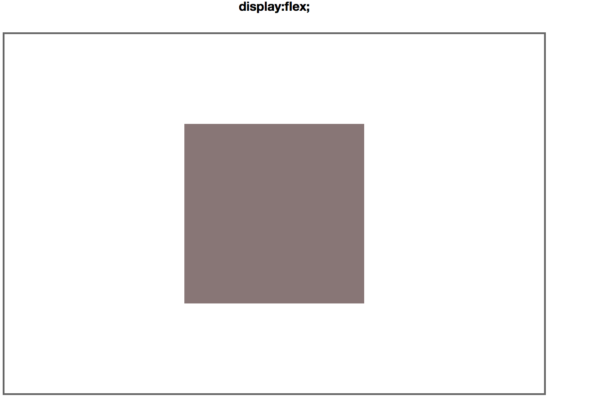
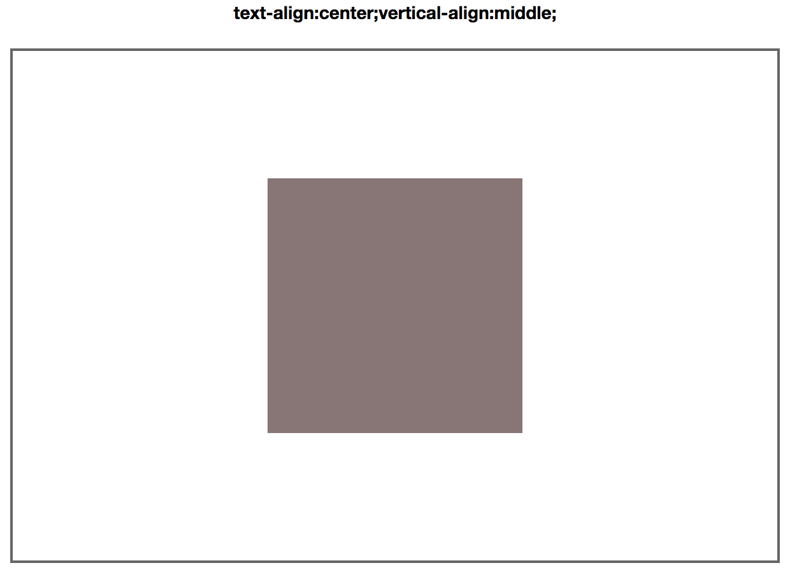

# 水平垂直居中布局

[demo:水平垂直居中的展示页面](https://qiqihaobenben.github.io/layout/pages/middle)

## 子元素定宽高

### 1、absolute + margin负值


```
.container {
    position: relative;
    margin: 0 auto;
    width: 600px;
    height: 400px;
    border: 2px solid #666;
}
.item {
    position: absolute;
    left: 50%;
    top: 50%;
    margin-left: -100px;
    margin-top: -100px;
    width: 200px;
    height: 200px;
    background-color: #8c7676;
}
```

### 2、absolute(left,right,top,bottom) + margin + width + height


```
.container {
    position: relative;
    margin: 0 auto;
    width: 600px;
    height: 400px;
    border: 2px solid #666;
}
.item {
    position: absolute;
    top: 0;
    bottom: 0;
    left: 0;
    right: 0;
    margin: auto;
    width: 200px;
    height: 200px;
    background-color: #8c7676;
}
```
兼容性：主流浏览器均支持。
**注意：子元素必须为固定宽高**

<br />

## 子元素不定宽高

### 1、display:table-cell;


```
.container {
    display: table-cell;
    text-align: center;
    vertical-align: middle;
    margin: 0 auto;/*margin在table-cell下已经不起用了*/
    width: 600px;
    height: 400px;
    border: 2px solid #666;
}
.item {
    display: inline-block;
    padding: 100px; /*用padding来撑开元素，没有设置宽高*/
    background-color: #8c7676;
}
```

兼容性：由于display:table-cell的原因，IE6\7不兼容。

**注意：无论父元素还是子元素都不能浮动，如果父元素浮动，元素就只能水平居中，如果子元素浮动，则子元素按照浮动的方向走。**

### 2、absolute + transform


```
.container {
    position: relative;
    margin: 0 auto;
    width: 600px;
    height: 400px;
    border: 2px solid #666;
}
.item {
    position: absolute;
    top: 50%;
    left: 50%;
    transform: translate(-50%,-50%);
    padding: 100px;/*用padding来撑开元素，没有设置宽高*/
    background-color: #8c7676;
}
```

兼容性：浏览器必须支持transform。

### 3、display: flex;



```
.container {
    display: flex;
    justify-content: center;
    align-items: center;
    margin: 0 auto;
    width: 600px;
    height: 400px;
    border: 2px solid #666;
}
.item {
    display: inline-block;
    padding: 100px;/*用padding来撑开元素，没有设置宽高*/
    background-color: #8c7676;
}
```

兼容性：浏览器必须支持flex。

### 4、text-align:center;vertical-align:middle;



```
.container {
    text-align: center;
    font-size: 0;
    margin: 0 auto;
    width: 600px;
    height: 400px;
    border: 2px solid #666;
}
.container::before {
    display: inline-block;
    content: '';
    width: 0;
    height: 100%;
    vertical-align: middle;
}
.item {
    display: inline-block;
    vertical-align: middle;
    padding: 100px;/*用padding撑开元素，没有设置宽高*/
    font-size: 12px;/*重新设置子元素内的字体大小*/
    background-color: #8c7676;
}
```
兼容性：主流浏览器均支持。
**注意：子元素必须要是inline-block或者inline的元素，并且子元素不能绝对定位和浮动。**

### 5、calc


```
.container {
    position: relative;
    margin: 0 auto;
    width: 600px;
    height: 400px;
    border: 2px solid #666;
}

.item {
    position: absolute;
    left: calc(50% - 200px / 2);
    top: calc(50% - 200px / 2);
    width: 200px;
    height: 200px;
    background-color: #8c7676;
}
```

兼容性：浏览器必须支持calc。

### 6、grid

TODO 待补充……


<br />

### 推荐资源

* [CSS元素水平垂直居中方法总结](http://www.cnblogs.com/Dudy/p/4085292.html)
里面还有关于背景图的居中和兼容低版本浏览器的写法
