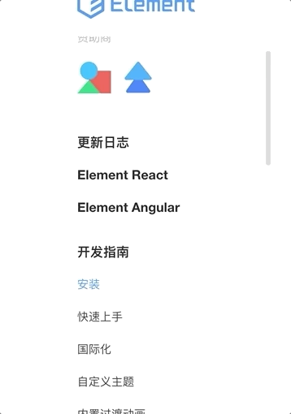

## Vue的自定义滚动，我用el-scrollbar

### 为什么要用el-scrollbar？

最近在写一个内部平台系统，相信大家都知道，其中会有很多自定义的滚动区域，就比如说现在有一个列表需要滚动，第一个念头就是用 `overflow: scroll;` 啊！嗯嗯，又不是不能用！如果我不曾见过太阳，我本可以忍受黑暗。
<br>

大家总会见过不少滚动条比较优雅的实现，不可否认，美是让人愉悦的。所以这些年行走江湖我满怀愧疚，让大家见丑了。
<br>

为什么要用el-scrollbar，大家都知道，模拟一个滚动不难，而且市面上有很多这样的库。我考虑的，首先项目用的框架是Vue，然后用的组件库是Element，Element官网也有很多滚动，而且像是Select组件的下拉框也是有滚动的，所以就不用想选择什么了，简简单单的就用Element自己的scrollbar吧，也不用再引入什么别的包或者文件之类的。
<br>

看Element的官网是不可能发现Scrollbar这个组件的，没有使用文档，但是可以直接使用。

### 为什么要写这一篇文章？

* 第一，有段时间没写东西了，先热热手；
* 第二，真的有同学不知道怎么用，可能主要是没有文档吧~


### 先来看看它的样子。



看了效果，接着来看一下怎么找到这个组件，官方没有提供文档，但确实是直接可用的一个组件。为什么这么说，这个一会再聊。先稍微看一下Element项目一些基本的概念。
<br>

在Element的贡献指南里说了开发环境搭建和打包代码的指令。打包代码用 `npm run dist` ,我们去`package.json`中可以看到这个指令具体的操作。


我们简单看一下`build/webpack.conf.js`这个文件，会发现打包的文件入口是`./src/index.js`,我们再去看一下这个文件。里面内容除了包含给vue安装插件，原型上挂载对象之类的操作外，就是用插件的方式把Element组件给注册完成，当然也暴露出用安装包方式安装后要用的所有方法和属性。其实我们已经看到了`Scrollbar`的身影。再循着去看一下`packages/scrollbar/index.js'`这个文件，简单的把这个组件引入后，添加了一个install方法，提供给Vue的use方法使用，然后就直接export出来了。


去`src/main.js`这个文件，看一下组件接收的props:


**native属性**：如果为`true`就不显示el的bar，也就是el模拟出来的滚动条，如果为`false`就显示模拟的滚动条
<br>

关于tag这个属性，可以看一下el的Select组件中的应用。


画个图表示一下view和wrap这两个区域的区别：


### 尝试用一下

展示的链接：[el-scrollbar试用](https://jsfiddle.net/chenfangxu/jfn5gzcw/)

考虑到有些同学有时会打不开上面的链接，把代码贴出来。

```
HTML

<script src="//unpkg.com/vue/dist/vue.js"></script>
<script src="//unpkg.com/element-ui@2.3.9/lib/index.js"></script>
<div id="app">
  <h2>list:</h2>
  <el-scrollbar wrap-class="list" wrap-style="color: red;" view-style="font-weight: bold;" view-class="view-box" :native="false">
    <div v-for="value in num" :key="vlaue">
      {{value}}
    </div>
  </el-scrollbar>
</div>


CSS

@import url("//unpkg.com/element-ui@2.3.9/lib/theme-chalk/index.css");
#app {
  height: 300px;
  overflow: hidden;
}
/*展示列表的区域，超过200px出现滚动条*/
.list {
  max-height: 200px;
}


JavaScript

new Vue({
  el: "#app",
  data: {
    num: 30
  }
})
```

Element UI官方说不准什么时候就更新文档了，不过，真的可能是因为太简单了。


