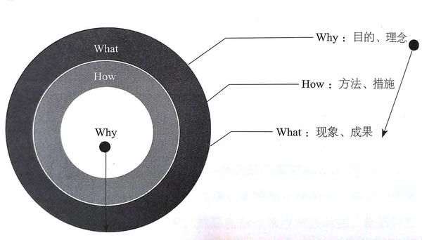
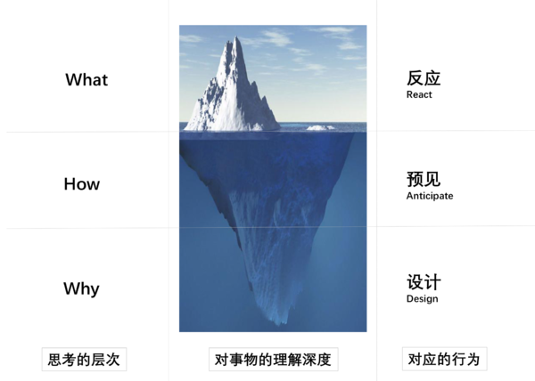

# 临界知识

#### [原文链接](http://liujinkai.com/2017/05/03/3-critical-knowledges/#more)

《好好学习 - 个人知识管理精进指南》成甲著 这本书主要讲了“临界知识”这个概念，所谓“临界知识”，便是我们经过深度思考后发现的具有普遍指导意义的规律或者定律。

但是我觉得这本书更有意义的是第四章的几个临界知识的讲解和应用。那么此次分享我们就着重讲3个重要临界知识：黄金思维圈、系统思考、安全空间。

在开始之前，请大家自己心里想想，你是怎么理解这三个概念的：黄金思维圈、系统思考、安全空间。

带着你的理解，在我讲解的过程中，对比看看，你跟作者想的是否一致。

## 黄金思维圈

黄金思维圈的最基本应用就是：凡事首先要问“为什么”

从why开始思考和表达，听起来理所当然。然后做起来又是另一码事。比如：领导给了一个开发任务，我们大部分人就是确定功能点，就开干了。可是这个功能是解决什么问题？为什么这么做？这么设计的最根本原因是什么？是否有更好的办法可以解决这个需求? 从why思考，你会发现有很多的what其实并不是看起来的样子，根据why做事情，可以把事情做得更准确，效果也最好。

例子：你要开一家水果店，周围已经有很多家了，怎样才能让你的店脱颖而出？
通过询问以为购买水果的典型顾客：下班后的妈妈。

> 问：为什么大家喜欢新鲜的水果？顾客：新鲜的水果味道最好问：为什么味道好，对你如此重要？顾客：因为味道好，我的小孩就喜欢问：为什么孩子喜欢吃苹果对你很重要？顾客：苹果对他的健康好问：为什么健康对你如此重要？顾客：因为我想做一个好妈妈问：为什么照顾家庭对你很重要？
>
> 顾客：这难道不是理所当然的吗？

我们可以发现，购买信息水果这一行为背后是妈妈守护家庭安全、健康，做一个负责好妈妈的底层价值观动机。因此，我们可以将原先what层面描述“新鲜水果，快速送达”的宣传语，更换成类似“我们与您一起守护家人健康”的观点。

### 人与人的差别就在于他在哪个层面在思考这个问题。

在与人聊天的过程中，你可以通过对方是在哪个层面讨论问题，从而判断他对这一问题的深刻程度。于是你可以应用在招聘员工中：一大半的应聘者因为思考问题停留在what层面，就无法进入复试。

## 系统思考

网上的信息铺天盖地，一些诱导性的信息也是屡见不鲜，你是否也曾人云亦云的卷入过被群体利用并被收割的经历。《乌合之众》中提到，群体是无法思考的。我们要尽量避免群体一样的思考，形成自己独立的思考，是分辨真实世界的最有力武器。系统思考是一种有效的方式。

### 1、重要的是关系

**事物本身最重要的是它们的组织，它们组合起来的模式和形式，也就是各个部分之间的关系。**

石墨与钻石由相同的碳元素构成，只是碳元素的组织方式不同，展现出来的性质就截然不同。

### 2、时滞，是系统思考中非常关键的概念。

在一个系统中，当信息的反馈有时滞时，会产生“没什么问题”的假象。我们洗澡时，会不断的调整开关，以便达到合适的水温，要反复几次才能达到理想的温度，为什么？那是因为热水器和出水口有一段距离的“时滞”，需要我们试上多次才能消除“时滞”带来的误差。

### 3、找到关键解

系统关键解 — 指一个系统中的特定位置，对其施加一个小小的变化，就能导致系统行为发生显著的变化。

例子：美国美铝公司曾经一度业绩下滑，人们都期待新上任的CEO能提升产品竞争力、开发新产品等重振辉煌。新上任的CEO保罗.奥尼尔给出的答案是：减少公司生产的安全问题。当大家确信这位CEO要真的这么干的时候，很多人都赶紧卖出了公司的股票。结果，不到一年的时间，美铝就取得了空前的利润。提高盈利能力的答案是减少企业的安全问题？奥尼尔也是在理解了公司背后的运作系统后才做出了惊人的决定：提高生产安全性—》减少停工、次品减少—》成本降低、质量增加、产量激增、浪费减少—》增强竞争力—》更多收入。复杂系统的特征之一是“违反直觉的”。在纷繁复杂的表象背后，那个真正起作用的关键解可能让我们难以想象。

系统思考是一种与我们直觉思考不同的思考方式，这个世界不是简单的因果关系，理解事物最重要的方式是对事物之间的关系进行思考。这样，我们才能在芸芸众生中形成自己的独立见解。从日常的生活中注意观察表象背后的运作关系，对自己每天的行动给予指导，让系统思考这中思维方式切实带来价值。

## 安全空间

99个成功抵不过一个失败。由于幂律分布定律，小概率事件会造成极端严重的后果。

你有没有临到交稿或者演讲，却发现唯一的Word文件或者PPT文件打不开的经历？你有没有看到身边的人生了重病，却没有保险，跪地求救，发起募捐？如果你 或者你家里的赚钱主力突然失业了，没有工资，你的家庭生活会受到多大影响？

先解释下什么是安全空间？为了确保系统的正常运行，或在极端的情况下，为了不造成无法挽回的结果所做的准备。比方说：为了防止爆胎，汽车后备箱里会有一个后备轮胎；为了防止漏电发生大的损失，家家都会装漏电保护器；为了家庭不被重疾和意外碰撞的支离破碎，人们会买保险～

查理.芒格就说过这么一句话：“安全空间”这个概念是由一位很聪明的人在经历人生许多挫折后建立起来的，它非常有创造性。

我自己的安全空间例子，要给家人买一份意外和大病保险，给自己的电脑系统备份，给家里备好灭火和发生火灾的逃生装备等等。

可以从这几个方面来加强安全空间：

1. 设计冗余备份（关键节点的备份）
2. 提高决策质量，减少极端事件发生概率
3. 提升系统的抗击打能力，把一个要承担极端严重后果的系统，变为一个持续承受冲击的小系统。

在一帆风顺的时候进行风险控制，是一件看起来很傻的事情，因为得不到验证。

但是我们要活在未来，构建自己的安全空间。**安全空间一种思维方式，多主动思考这样一些情况，并采取措施，让自己在一个更安全的状态上，一旦出现极端情况，不至于出现“毁灭”的情况。**

