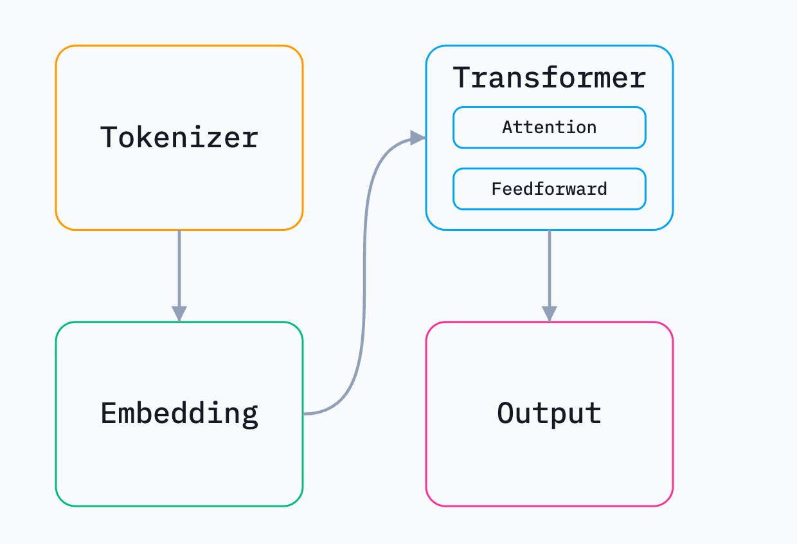

# AI 基础知识

## 术语

- AI：Artificial Intelligence 的缩写，指“人工智能”，人工智能是指模拟人类智能的计算机系统或软件，使其能够执行诸如学习、推理、问题解决、感知、语言理解等复杂任务。
- AIGC：AI Generated Content 的缩写，意指由人工智能生成的内容。在算法和数码内容制作领域，AIGC 涉及使用人工智能技术生成各种形式的内容，比如文字、图像、视频、音乐等。
- AGI：Artificial General Intelligence 的缩写，意指“通用人工智能”，是指具有与人类智能相当或超越人类智能的人工智能系统。
- NLP：Natural Language Processing 的缩写，意指“自然语言处理”，自然语言处理是人工智能的一个子领域，主要研究计算机如何理解、解释和生成人类语言。NLP 技术包括文本分析、语言生成、机器翻译、情感分析、对话系统等。
- Transformer：一种用于自然语言处理（NLP）任务的深度学习模型，最初由 Vaswani 等人在 2017 年的论文中提出。它引入了一种名为“自注意力”（self-attention）的机制，能够有效地处理序列数据，且在许多 NLP 任务，如机器翻译、文本生成和语言建模中取得了巨大的成功。
- LLM：Large Language Model 的缩写，指“大语言模型”，这类模型是基于机器学习和深度学习技术，特别是自然语言处理（NLP）中的一种技术。大语言模型通过大量的文本数据进行训练，以生成、理解和处理自然语言。一些著名的 LLM 示例包括 OpenAI 的 GPT（Generative Pre-trained Transformer）系列模型，如 GPT-3.5 和 GPT-4。
- GPT：Generative Pre-trained Transformer 的缩写，指“生成式预训练 Transformer”，GPT 模型利用大量文本数据进行预训练，然后可以通过微调来执行特定任务，例如语言生成、回答问题、翻译、文本摘要等。
- chatGPT：由 OpenAI 开发的一种基于 GPT 架构的人工智能聊天机器人。它使用自然语言处理技术，能够理解并生成类似人类的文本回复。可以看做是一种 Agent。
- BERT：Bidirectional Encoder Representations from Transformers 的缩写，是一种自然语言处理（NLP）的预训练模型。它由 Google AI 研究团队于 2018 年首次提出。BERT 的主要创新在于它使用了双向（即上下文敏感）的 Transformer 模型来对文本进行编码。
- LLaMA：Large Language Model Meta AI 的缩写，是由 Meta 开发的一系列大型自然语言处理模型。这些模型在处理文本生成和理解任务方面表现出色，类似于其他著名的大型语言模型如 GPT-3。
- PEFT：Parameter-Efficient Fine-Tuning 的缩写，意指“参数高效微调”，这是一种微调机器学习模型的方法，旨在减少需要更新的参数数量，从而降低计算成本和存储需求，同时保持模型性能。PEFT 技术在大型预训练模型（如 BERT、GPT 等）的下游任务适配中尤为重要，因为直接微调这些模型可能会耗费大量计算资源和时间。
- LoRA：Low-Rank Adaptation 的缩写，意味“低秩适应”，一种用于微调大规模语言模型的一种技术。它通过将模型的权重分解成低秩矩阵来显著减少参数数量和计算开销，从而使得模型在资源受限的环境中也能进行高效的适应性调整。
- Prompt：指的是提供给模型的一段初始文本，用于引导模型生成后续的内容。
- Embedding：中文叫嵌入，是一种将高维数据映射到低维空间的技术，但仍尽可能保留原数据的特征和结构。嵌入技术通常用于处理和表示复杂的数据如文本、图像、音乐以及其他高维度的数据类型。
- RAG：Retrieval-Augmented Gneration 的缩写，指“检索增强生成”，这是一个跨越检索和生成任务的框架，通过先从数据库或文档集合中检索到相关信息，然后利用生成模型（如 GPT）来生成最终的输出。

## 模型大小与硬件的关系

### 1. 模型大小与显存换算：不只是下载大小那么简单

**基础核心公式：`模型本身所需显存 ≈ 模型参数量 × 每个参数所占的字节数`**

**第一步：理解模型参数量（Params）**
我们常说的 7B（70 亿）、13B（130 亿）模型，这个“B”就是参数的数量。参数就是模型学到的“知识”，本质上是巨大的矩阵中的一个个数字。

- **举例**：Llama2-7B 模型有 **70 亿** 个参数。

**第二步：理解精度与字节数（Bytes per Parameter）**
模型参数在内存/显存中以不同的“精度”或“数据类型”存储，这决定了每个参数占多少字节。

| 精度（常见名称） | 数据类型   | 每个参数所占字节数 | 说明                                                 |
| :--------------- | :--------- | :----------------- | :--------------------------------------------------- |
| FP32（全精度）   | `float32`  | 4 字节             | 原始训练精度，精度高，占地方大                       |
| FP16（半精度）   | `float16`  | 2 字节             | 是某些模型的原始精度，推理常用，精度损失小，显存减半 |
| BF16             | `bfloat16` | 2 字节             | 谷歌推出，动态范围更接近 FP32                        |
| INT8             | `int8`     | 1 字节             | 量化后，显存再减半，精度有损失                       |
| INT4             | `int4`     | **0.5 字节**       | 量化后，显存仅为 FP16 的 1/4，损失更大               |

**第三步：开始换算！**

大多数开源大模型（如 Llama、Mistral）通常以 ​​FP16（半精度浮点数）​​ 格式发布。每个参数占用 ​​2 个字节 ​​ 的存储空间。

以 **Llama2-7B** 模型为例：

1.  **以 FP16 精度加载**：
    `所需显存 = 7,000,000,000 Params × 2 Bytes/Param ≈ 14,000,000,000 Bytes`
    换算成更常用的单位：`14,000,000,000 / 1024³ ≈ **13.1 GB**`
    所以，你需要**至少 14GB**的显存才能加载这个模型。

2.  **以 INT8 精度加载**：
    `所需显存 = 7B × 1 Byte = 7,000,000,000 Bytes ≈ **6.5 GB**`

3.  **以 INT4 精度加载**（比如 Q4_K_M）：
    `所需显存 = 7B × 0.5 Byte = 3,500,000,000 Bytes ≈ **3.3 GB**`

**重要提醒：这只是模型本身的权重占用的显存！**

- **推理时**：还需要为计算过程中的**中间激活值（Activations）** 和**KV Cache**（对于自回归模型如 LLaMA）分配显存。尤其是在处理长上下文时，这部分开销很大。粗略估计，你需要**在模型权重所需显存的基础上，再增加 20%-50%的显存裕量**才能流畅推理。

运行时内存（KV Cache）​​：这是用于加速生成过程的内存。它的大小取决于：

- 序列长度 ​​：你输入的文本（Prompt）有多长 + 你希望模型生成多长的文本。
- 批处理大小 ​​：同时处理多少条对话。

#### 真正显存占用 = 模型本身所需显存 + 推理时所需显存

例如，用 FP16 跑 7B 模型，13.1GB + 缓冲 ≈ **16GB 显存** 是一个比较安全的选择。

### 2. 模型轻量化（量化）计算：如何“有损压缩”模型

轻量化（主要是**量化**）的核心思想是：**用更少的比特来表示原高精度参数，从而牺牲一点点精度，换取巨大的显存节省和速度提升。**

**可以把这想象成压缩图片：**

- **FP32**：像一张`.PNG`无损图片，体积大，细节完美。
- **INT8/INT4**：像一张高压缩率的`.JPEG`图片，体积小了很多，乍一看没什么区别，但仔细看会发现一些色块和模糊（精度损失）。

**量化是如何计算的？（以 INT8 为例）**

过程就是将一个范围的 FP32 数值映射到 INT8 的[-127, 127]范围内。

1.  **找到范围**：先统计权重矩阵中最大（`max`）和最小值（`min`）。
2.  **计算缩放因子（Scale）**：`scale = (max - min) / (127 - (-127))`
3.  **量化**：将每个 FP32 参数 `x` 转换为 INT8 值 `q`：
    `q = round(x / scale)`

**推理时**，需要反量化回高精度（但信息已丢失）进行计算：
`x' = q * scale` （`x'` 是近似值，不再是原来的 `x`）

**更先进的量化（如 GGUF 中的`Q4_K_M`）** 不仅仅是简单的全局缩放，它们会：

- **分块量化**：将大矩阵分成小块，每块有自己的`scale`，更精细，误差更小。
- **分组量化**：对权重矩阵的某一行或某一维度单独量化。

这些优化使得在极低比特（如 4bit）下，模型性能损失降到最低。

### 3. 解读 `Q4_K_M` 这类符号的含义

这些符号是 **`llama.cpp`** 项目定义的量化格式命名规则，现在广泛用于 GGUF 格式的模型文件（如 `llama-2-7b.Q4_K_M.gguf`）。

它可以拆解为三部分：**`Q`** + **`数字`** + **`_字母组合`**

**1. `Q`**：代表是量化（Quantized）模型。
**2. `数字`**：代表**权重（weights）** 的量化比特数。这是显存占用的大头。
_ `Q2`： 2bit（极致的压缩，巨大的精度损失）
_ `Q3`： 3bit
_ `Q4`： 4bit（**最流行的权衡选择**）
_ `Q5`： 5bit
_ `Q6`： 6bit
_ `Q8`： 8bit（接近 FP16 精度，但显存节省一半）

**3. `_字母组合`**：代表**量化策略的粒度或类型**，这决定了精度和恢复能力。**这是关键！**

- **第一个字母**：通常代表**缩放因子（scale）** 的精度。

  - `_K`： 代表使用更先进的 **“K-quant”** 方法。这是新一代的量化技术，比旧的方法（现在已很少用`_S`， `_M`等）效果好得多。**现在你看到的绝大部分模型都是 `_K` 系列的。**

- **第二个字母（如果有）**：代表在该量化级别下的**子类型**，通常是**粒度**的不同。
  - `_S` -> **Small**： 使用更少的分组，更粗糙，体积最小，精度最低。
  - `_M` -> **Medium**： **最推荐的通用选择**，在体积和精度间取得了最佳平衡。
  - `_L` -> **Large**： 使用更多的分组，更精细，体积稍大，精度最高（在该量化级别下）。
  - （有时还有 `_A`， `_B` 等，但 `S/M/L` 是最常见的）

**举例说明：**

- **`Q4_0`**：旧式量化方法，4bit 权重，缩放因子用 FP16 存储。**不推荐，效果较差。**
- **`Q4_K_S`**：K-quant 方法，4bit 权重。**“Small”** 粒度，是 4bit 里体积最小但精度最低的。
- **`Q4_K_M`**：K-quant 方法，4bit 权重。**“Medium”** 粒度，**强烈推荐**，是默认的性价比之王。
- **`Q5_K_M`**：K-quant 方法，5bit 权重。“Medium”粒度，比 Q4 精度更高，体积也稍大。
- **`Q8_0`**：相当于几乎无损压缩，效果接近 FP16，但显存占用少一半。

**如何选择？**

- 追求极致显存节省，能接受明显性能损失：`Q2_K`
- 最佳性价比，通用之选：`Q4_K_M`
- 想要更好一点的质量：`Q5_K_M`
- 几乎不想有任何质量损失：`Q8_0`

### 总结与实操建议

1.  **算显存**：用 `参数量 × 每参数字节数 + 缓冲(20-50%)` 来估算。
2.  **选模型**：根据你的显存，选择合适参数量的模型。8GB 卡玩 7B 的 4bit 量化，16GB 卡玩 13B 的 4bit 量化，24GB 卡玩 34B 的 4bit 量化或 13B 的 8bit 量化。
3.  **选量化**：**无脑优先选 `Q4_K_M`**。如果发现质量不满意，再尝试 `Q5_K_M` 或 `Q8_0`。如果想快速测试且显存紧张，可以试试 `Q4_K_S`。

## LLM 的基础架构

图示：



伪代码：

```python
prompt = "What is the meaning of life?";

tokens = tokenizer(prompt);
while (true) {
	embeddings = embed(tokens);
	for ([attention, feedforward] of transformers) {
		embeddings = attention(embeddings);
		embeddings = feedforward(embeddings);
	}
	output_token = output(embeddings);
	if (output_token === END_TOKEN) {
		break;
	}
	tokens.push(output_token);
}

print(decode(tokens));
```

### Tokenizer

可以简单理解为分词器，会将文本转化为数字 ID。

分词器会将你的提示语切分成小块，并为每个独特片段分配一个称为"token"的整数 ID。例如，GPT-5 对提示语"Check out ngrok.ai"的分词。

提示语会被拆分为数组 `["Check", " out", " ng", "rok", ".ai"]`，并转换为 token `[4383, 842, 1657, 17690, 75584]`。相同的提示语始终生成相同的 token。token 还区分大小写，因为字母大小写能反映单词的语义特征——例如，大写字母 W 开头的"Will"更可能是人名，而小写字母 w 开头的"will"则不然。

分词器种类繁多！ChatGPT 使用的分词器与 Claude 使用的不同。即便是 OpenAI 开发的不同模型，使用的分词器也各不相同。每种分词器都有自己将文本分割为词元的规则。

可以打开 OpenAI 的分词网站 [https://platform.openai.com/tokenizer](https://platform.openai.com/tokenizer), 看看 OpenAI 的大语言模型是怎么把文本切成 Token 的，会发现两个有意思的现象:

第一，Token 并非简单的字或词，而是一种介于两者之间的“子词”单元.

第二，不同模型对同一句话的切分结果, 往往还不一样.

#### Token 和字节的类比

很多同学把 token 理解为中文语义里的“字节”，对于这种理解，只能说从类比关系上有一定的相似度，因为"字节"是计算机存储和处理数据的基本单元，而 "token" 则是语言模型处理文本信息的基本单元。

但这种理解不够准确的地方在于：​​"Token" 在语言模型中的作用比"字节"在计算机中的作用更加复杂和多元。

在大语言模型中，"token" 不仅代表文本数据中的一个单位，而且每个 "token" 都可能携带了丰富的语义信息。比如，在处理一句话时，"token" 可能表示一个字，一个词，甚至一个短语，这些都可以被认为是语言的基本单元。同时，每个"token"在模型中都有一个对应的向量表示，这个向量包含了该"token"的语义信息、句法信息等。

在训练过程中，每个 token 会关联一个预测，这个预测可以是下一个 token 的预测，也可以是该 token 的属性预测，如词性、情感等。

训练 token 的数量会影响模型的性能和准确性。更多的训练 token 通常意味着更多的训练数据，这可能会提升模型的准确性和泛化能力。然而，处理更多的 token 也会增加计算的复杂性和计算资源的需求。

#### 为什么会有 token？

##### 首先 AI 设计中的一个核心考量：在词汇表规模与语义信息保留之间寻求平衡。

如果按“整词”切分, 会出现两个问题:

- 词汇表越变越大, 语言中存在大量词形变化（如 apple, apples, applepie, ...）, 词汇表规模可轻易达到数十万乃至上百万，给模型训练带来巨大压力
- 遇到新词就 “卡壳”, 一旦碰到训练语料里没见过的词（也就是未登录词, Out-of-Vocabulary），模型就没法识别了

那如果按 “单字 / 字符” 切分呢? 同样有问题:

- 序列太长，计算慢, 基本单元太小，文本序列会变得很长，计算开销急剧增加
- 语义稀疏, 单个字符（如 "a", "p"）携带的语义信息有限，模型难以从中学习到复杂的语言结构

因此, 我们需要一种折中方案——既能将词汇表控制在合理范围内, 又能有效保留语义信息. 这正是 Subword (子词) 切分法的核心价值, 而其中的代表性算法就是我们接下来要讨论的 BPE。

BPE 的原理非常直观，可以概括为：在语料库中, 找出频率最高的相邻符号对, 把它们合并为一个新的符号, 然后重复这个过程.

##### GPT 不仅仅能处理中文，它还能处理几乎世界上所有流行的自然语言。所以这告诉我们 GPT 实际的输入和输出并不是像我们想象的样子。​

因此，我们需要引入 token 的概念。token 是自然语言处理的最细粒度。简单点说就是，GPT 的输入是一个个的 token，输出也是一个个的 token。

GPT 不是适用于某一门语言的大型语言模型，它适用于几乎所有流行的自然语言。所以 GPT 的 token 需要**兼容**几乎人类的所有自然语言，那意味着 GPT 有一个非常全的 token 词汇表，它能表达出所有人类的自然语言。如何实现这个目的呢？

答案是通过 unicode 编码。

​Unicode（统一码、万国码、单一码）是一种在计算机上使用的字符编码。Unicode 是为了解决传统的字符编码方案的局限而产生的，它为每种语言中的每个字符设定了统一并且唯一的二进制编码，以满足跨语言、跨平台进行文本转换、处理的要求。

有意思的是，unicode 不仅有自然语言，实际上也包含 emoji 等自然语言之外的符号。这也是为什么 ChatGPT 能理解和回复 emoji 的原因。

所以，GPT 实际是将我们输入的文字转换成 token，然后通过 GPT 模型预测 token，再将 token 转换成文字，最后再输出给我们。

通过 token 的学习，我们能感觉到 ChatGPT 理解文本的方式和人类并不相同，它在以自己的方式理解这个世界。

##### [Token 到底怎么"变"的? 大模型分词的核心逻辑!](https://mp.weixin.qq.com/s?__biz=Mzk2NDQzNTk3MA==&mid=2247483740&idx=1&sn=4ff589544c7cfd5a22095852e37c7a36&chksm=c472c831f30541279afc808bd3a1dd81d009531e9344ce81c9b911035dff2d773f6778b1814a&scene=178&cur_album_id=4288470086136201218&search_click_id=#rd)

### Embedding

Embedding（词嵌入）是将文本转换为向量（数字）的过程。

在训练模型输出正确文本时，能够识别两句话是否相似会很有帮助。但相似性体现在哪些方面呢？它们可能同样悲伤、同样有趣或同样发人深省。它们的长度、韵律、语调、语言、词汇或结构也可能相似。我们可以用无数维度来描述两句话的相似性，而句子在某些维度上相似，在其他维度上却未必如此。

Tokens 没有维度。它们只是普通的整数。不过，Embeddings 则不同——嵌入具有多维特性。

嵌入是一个长度为 n 的数组，代表在 n 维空间中的位置。 若 n 为 3，则嵌入可能为 `[10, 4, 2]` ，表示三维空间中的位置 x=10, y=4, z=2 。在训练大型语言模型时，每个 token 都会被分配到该空间中的随机初始位置，训练过程会推动所有 token 移动，直至找到能产生最佳输出的排列方式。

嵌入阶段首先查询每个 token 的嵌入向量。用伪代码表示可能如下所示：

```js
// Created during training, never changes during inference.
const EMBEDDINGS = [...];

// Input: array of tokens (integers)
function embed(tokens) {
	// Output: array of n-dimensional embedding arrays
	return tokens.map((token, i) => {
		const embeddings = EMBEDDINGS[token];
    // 将 token 的位置编码到嵌入向量中
		return encodePosition(embeddings, i);
	});
}
```

因此，我们将 tokens （一个整数数组）转换为嵌入向量数组。这本质上是一个数组的数组，即"矩阵"。

tokens `[75, 305, 284, 887]` 被转换为一个三维嵌入矩阵:

```
[
  [4.7,1.0,2.7],
  [1.2,3.4,5.6],
  [7.8,9.0,1.2],
  [3.4,5.6,7.8]
]
```

嵌入维度越高，用于比较句子的维度就越多。我们之前讨论的是三维嵌入，但当前模型已采用数千维的嵌入，其中最大型的模型甚至超过一万维。

嵌入阶段还有最后一项功能：在获取令牌的嵌入向量后，它会将令牌在提示词中的位置编码到嵌入向量中。

简而言之，嵌入向量是 n 维空间中的点，可视作其代表文本的语义含义。在训练过程中，每个标记词都会在这个空间中移动，以靠近其他相似的标记词。维度越高，大型语言模型对每个标记词的表征就越复杂、越细腻。

### Transformer

Transformer 阶段的核心在于将嵌入向量作为输入，并在其 n 维空间中进行变换。它通过两种方式实现这一目标，而我们仅聚焦于第一种：attention（注意力机制）。暂不讨论"Feedforward"（前馈）或"Output"（输出）阶段。

注意力机制的作用是帮助大型语言模型理解提示符中每个标记词之间的关系，通过让标记词在 n 维空间中相互影响彼此的位置来实现。它通过加权方式组合提示符中标记词的嵌入向量来完成这一任务。输入是整个提示符的嵌入向量集合，输出则是所有输入嵌入向量经过加权组合后生成的单一新嵌入向量。

注意力计算中大部分操作都是矩阵乘法。关于矩阵乘法，现在只需了解一点：输出矩阵的形状由输入矩阵的形状决定。输出矩阵的行数始终与第一个输入矩阵相同，列数则与第二个输入矩阵相同。

基于此，以下是简化注意力机制计算每个 token 权重的方式。在下面的代码中，使用 `*` 表示矩阵乘法。

```js
// Similar to EMBEDDINGS from the pseudocode
// earlier, WQ and WK are learned during
// training and do not change during inference.
//
// These are both n*n matrices, where n is the
// number of embedding dimensions. In our example
// above, n = 3.
const WQ = [[...], [...], [...]];
const WK = [[...], [...], [...]];

// The input embeddings look like this:
// [
//   [-0.1, 0.1, -0.3], // Mary
//   [1.0, -0.5, -0.6], // had
//   [0.0, 0.8, 0.6],   // a
//   [0.5, -0.7, 1.0]   // little
// ]
function attentionWeights(embeddings) {
	const Q = embeddings * WQ;
	const K = embeddings * WK;
	const scores = Q * transpose(K);
	const masked = mask(scores);
	return softmax(masked);
}
```

#### [Prompt caching: 10x cheaper LLM tokens, but how?](https://ngrok.com/blog/prompt-caching/) ：介绍了以上三个部分，尤其是最后的 Transformer 部分。

## 相关文章

- [技术人的大模型应用初学指南](https://mp.weixin.qq.com/s/NeR1yPdmK6Z1hZVLRSgxrQ)
  - 介绍了向量数据库：Faiss、Annoy、HNSW、Elasticsearch with k-NN Plugin、Milvus、Pinecone、Weaviate、Vectara，以及向量数据库在演进方向上的发展趋势。
  - Multi-Agent 多智能体框架：AutoGen 框架、MetaGPT 框架
  - RAG
  - Prompt Engineering 提示词工程
  - 模型微调：LoRA、QLoRA（Quantized LoRA）
  - 大模型应用框架：LangChain
