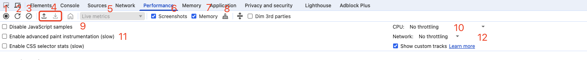
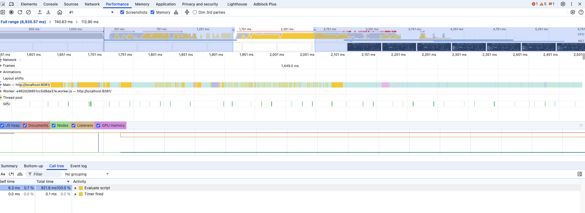
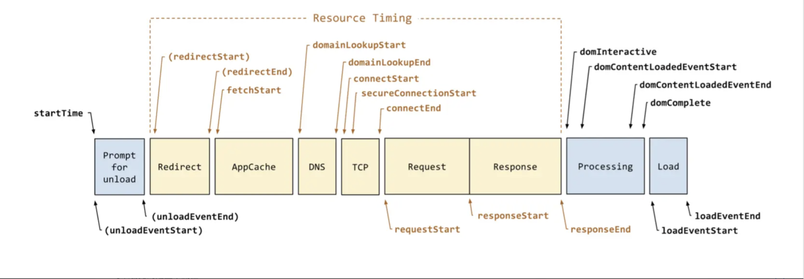

# 浏览器性能分析

## Performance

### 面板说明



1、record 按钮，点击即开始记录页面操作，弹框显示当前进度，stop 按钮停止记录，然后会生成 profile 加载到视图框。

2、刷新按钮 ，点击刷新页面并开始记录，页面加载完成后自动生成 profile

3、clear 清空当前统计的 profile

4、分别为 load/save 载入/保存 profile

5、下拉框为历史记录，下拉可以选择最近加载过的几个 profile，没有记录的时候不可选

6、screenshots radio 框控制是否显示截图功能

7、memory 控制是否显示内存使用量

8、垃圾回收

9、Disable JavaScript samples 禁用和启用 JavaScript 示例。禁用后，记录的主要部分要短得多，因为它忽略了所有 JavaScript 调用堆栈。

10、可以自定义 cpu 性能

11、Enable advanced paint instrumentation (slow) 启用高级绘画工具，详细记录渲染事件的细节

12、network 可以选择网络模式

### 性能图



各颜色含义：

- 蓝色(Loading)：网络通信和 HTML 解析
- 黄色(Scripting)：JavaScript 执行
- 紫色(Rendering)：样式计算和布局，即重排
- 绿色(Painting)：重绘
- 灰色(other)：其它事件花费的时间
- 白色(Idle)：空闲时间

最上面一块从上往下，依次是 FPS、cpu 占用率、network 请求耗时、页面截图、内存占用大小

中间的每条则为详细内容，其中的 main 是重点，也是我们日常中所说的火焰图，不过这个火焰图与一般的火焰图不同，是倒着的。

#### main 火焰图

图中 X 轴每一个横条都代表一个事件，长条的宽度代表所花费的时间，越长花费越久；y 轴表示调用堆栈，事件相互叠加时，较高的时间导致较低的性能。

#### 调用树

在 call tree 当中我们可以清晰地看见调用堆栈以及其所花费的时间。

#### 查看交互

在 interactions 中可以看见用户交互

#### Frames

可以准确的看见特定帧花了多少时间

#### 底部面板

- summary 代表总览
- bottom-up 自下而上的事件
- call-tree 由外而内的 tree
- event-log 根据发生的时间顺序排序，并显示详细信息

## window.performance

Performance 是一个前端性能监控的 API，用来检测页面的性能，是 W3C 性能小组引入进来的一个新的 API。

一般用来检测到白屏时间、首屏时间、用户可操作的时间节点，页面总下载的时间、DNS 查询的时间、TCP 链接的时间等。

它的结构如下:

```
performance = {
    // memory 是非标准属性，只在 Chrome 有
    memory: {
        usedJSHeapSize:  16100000, // JS 对象（包括V8引擎内部对象）占用的内存，一定小于 totalJSHeapSize
        totalJSHeapSize: 35100000, // 可使用的内存
        jsHeapSizeLimit: 793000000 // 内存大小限制
    },

    navigation: {
        redirectCount: 0, // 如果有重定向的话，页面通过几次重定向跳转而来
        type: 0           // 0   即 TYPE_NAVIGATENEXT 正常进入的页面（非刷新、非重定向等）
                          // 1   即 TYPE_RELOAD       通过 window.location.reload() 刷新的页面
                          // 2   即 TYPE_BACK_FORWARD 通过浏览器的前进后退按钮进入的页面（历史记录）
                          // 255 即 TYPE_UNDEFINED    非以上方式进入的页面
    },

    timing: {
        // 在同一个浏览器上下文中，前一个网页（与当前页面不一定同域）unload 的时间戳，如果无前一个网页 unload ，则与 fetchStart 值相等
        navigationStart: 1441112691935,

        // 前一个网页（与当前页面同域）unload 的时间戳，如果无前一个网页 unload 或者前一个网页与当前页面不同域，则值为 0
        unloadEventStart: 0,

        // 和 unloadEventStart 相对应，返回前一个网页 unload 事件绑定的回调函数执行完毕的时间戳
        unloadEventEnd: 0,

        // 第一个 HTTP 重定向发生时的时间。有跳转且是同域名内的重定向才算，否则值为 0
        redirectStart: 0,

        // 最后一个 HTTP 重定向完成时的时间。有跳转且是同域名内部的重定向才算，否则值为 0
        redirectEnd: 0,

        // 浏览器准备好使用 HTTP 请求抓取文档的时间，这发生在检查本地缓存之前
        fetchStart: 1441112692155,

        // DNS 域名查询开始的时间，如果使用了本地缓存（即无 DNS 查询）或持久连接，则与 fetchStart 值相等
        domainLookupStart: 1441112692155,

        // DNS 域名查询完成的时间，如果使用了本地缓存（即无 DNS 查询）或持久连接，则与 fetchStart 值相等
        domainLookupEnd: 1441112692155,

        // HTTP（TCP） 开始建立连接的时间，如果是持久连接，则与 fetchStart 值相等
        // 注意如果在传输层发生了错误且重新建立连接，则这里显示的是新建立的连接开始的时间
        connectStart: 1441112692155,

        // HTTP（TCP） 完成建立连接的时间（完成握手），如果是持久连接，则与 fetchStart 值相等
        // 注意如果在传输层发生了错误且重新建立连接，则这里显示的是新建立的连接完成的时间
        // 注意这里握手结束，包括安全连接建立完成、SOCKS 授权通过
        connectEnd: 1441112692155,

        // HTTPS 连接开始的时间，如果不是安全连接，则值为 0
        secureConnectionStart: 0,

        // HTTP 请求读取真实文档开始的时间（完成建立连接），包括从本地读取缓存
        // 连接错误重连时，这里显示的也是新建立连接的时间
        requestStart: 1441112692158,

        // HTTP 开始接收响应的时间（获取到第一个字节），包括从本地读取缓存
        responseStart: 1441112692686,

        // HTTP 响应全部接收完成的时间（获取到最后一个字节），包括从本地读取缓存
        responseEnd: 1441112692687,

        // 开始解析渲染 DOM 树的时间，此时 Document.readyState 变为 loading，并将抛出 readystatechange 相关事件
        domLoading: 1441112692690,

        // 完成解析 DOM 树的时间，Document.readyState 变为 interactive，并将抛出 readystatechange 相关事件
        // 注意只是 DOM 树解析完成，这时候并没有开始加载网页内的资源
        domInteractive: 1441112693093,

        // DOM 解析完成后，网页内资源加载开始的时间
        // 在 DOMContentLoaded 事件抛出前发生
        domContentLoadedEventStart: 1441112693093,

        // DOM 解析完成后，网页内资源加载完成的时间（如 JS 脚本加载执行完毕）
        domContentLoadedEventEnd: 1441112693101,

        // DOM 树解析完成，且资源也准备就绪的时间，Document.readyState 变为 complete，并将抛出 readystatechange 相关事件
        domComplete: 1441112693214,

        // load 事件发送给文档，也即 load 回调函数开始执行的时间
        // 注意如果没有绑定 load 事件，值为 0
        loadEventStart: 1441112693214,

        // load 事件的回调函数执行完毕的时间
        loadEventEnd: 1441112693215
    }
};

```

### performance 的处理模型



可以看见的是整个流程：

- 上一个文档卸载
- 重定向
- 浏览器准备好使用 http 抓取文档
- 检查本地缓存
- 查询 DNS 域名
- TCP 建立连接
- HTTP 请求、响应
- 渲染 DOM 树并解析
- 网页开始加载资源
- 准备就绪触发 load 事件执行回调函数

### 性能指标

在前端标准中，有很多指标来定义页面性能

#### 页面加载时长

指 DOM load 事件被触发完成。

作为一个原生 api 它具有接受度高、感知明显的优点；但是同样使用它无法准确反映页面加载的性能，容易受到特殊情况的影响。

后来 W3C 引入了首次渲染 / 首次内容渲染，首次渲染是指第⼀个非网页背景像素渲染，⾸次内容渲染是指第一个⽂本、图像、背景图片或非白色 canvas/SVG 渲染。

在目前大多数网站里面这两个指标是没有明显差异的，因为目前网站架构倾向于单页应用，它的 html 结构是非常小的。

#### 确定统计起始点 （ navigationStart vs fetchStart ）

页面性能统计的起始点时间，应该是用户输入网址回车后开始等待的时间。一个是通过 navigationStart 获取，相当于在 URL 输入栏回车或者页面按 F5 刷新的时间点；另外一个是通过 fetchStart，相当于浏览器准备好使用 HTTP 请求获取文档的时间。

从开发者实际分析使用的场景，浏览器重定向、卸载页面的耗时对页面加载分析并无太大作用；通常建议使用 fetchStart 作为统计起始点。

#### 首字节

主文档返回第一个字节的时间，是页面加载性能比较重要的指标。对用户来说一般无感知，对于开发者来说，则代表访问网络后端的整体响应耗时。

#### 白屏时间

用户看到页面展示出现一个元素的时间。很多人认为白屏时间是页面返回的首字节时间，但这样其实并不精确，因为头部资源还没加载完毕，页面也是白屏。

相对来说具备「白屏时间」统计意义的指标，可以取 domLoading - fetchStart，此时页面开始解析 DOM 树，页面渲染的第一个元素也会很快出现。

从 W3C Navigation Timing Level 2 的方案设计，可以直接采用 domInteractive - fetchStart ，此时页面资源加载完成，即将进入渲染环节。

#### 首屏时间

首屏时间是指页面第一屏所有资源完整展示的时间。这是一个对用户来说非常直接的体验指标，但是对于前端却是一个非常难以统计衡量的指标。

具备一定意义上的指标可以使用，domContentLoadedEventEnd - fetchStart，甚至使用 loadEventStart - fetchStart，此时页面 DOM 树已经解析完成并且显示内容。

以下给出统计页面性能指标的方法：

```js
var performance = window.performance

if (!performance) {
  // 当前浏览器不支持
  console.log('你的浏览器不支持 performance 接口')
  return
}

var t = performance.timing
var times = {}

//【重要】页面加载完成的时间
//【原因】这几乎代表了用户等待页面可用的时间
times.loadPage = t.loadEventEnd - t.navigationStart

//【重要】解析 DOM 树结构的时间
//【原因】反省下你的 DOM 树嵌套是不是太多了！
times.domReady = t.domComplete - t.responseEnd

//【重要】重定向的时间
//【原因】拒绝重定向！比如，http://example.com/ 就不该写成 http://example.com
times.redirect = t.redirectEnd - t.redirectStart

//【重要】DNS 查询时间
//【原因】DNS 预加载做了么？页面内是不是使用了太多不同的域名导致域名查询的时间太长？
// 可使用 HTML5 Prefetch 预查询 DNS ，见：[HTML5 prefetch](http://segmentfault.com/a/1190000000633364)
times.lookupDomain = t.domainLookupEnd - t.domainLookupStart

//【重要】读取页面第一个字节的时间
//【原因】这可以理解为用户拿到你的资源占用的时间，加异地机房了么，加CDN 处理了么？加带宽了么？加 CPU 运算速度了么？
// TTFB 即 Time To First Byte 的意思
// 维基百科：https://en.wikipedia.org/wiki/Time_To_First_Byte
times.ttfb = t.responseStart - t.navigationStart

//【重要】内容加载完成的时间
//【原因】页面内容经过 gzip 压缩了么，静态资源 css/js 等压缩了么？
times.request = t.responseEnd - t.requestStart

//【重要】执行 onload 回调函数的时间
//【原因】是否太多不必要的操作都放到 onload 回调函数里执行了，考虑过延迟加载、按需加载的策略么？
times.loadEvent = t.loadEventEnd - t.loadEventStart

// DNS 缓存时间
times.appcache = t.domainLookupStart - t.fetchStart

// 卸载页面的时间
times.unloadEvent = t.unloadEventEnd - t.unloadEventStart

// TCP 建立连接完成握手的时间
times.connect = t.connectEnd - t.connectStart
```

## performance.getEntries()

该方法返回所有静态资源的数组列表；每一项是一个请求的相关参数有 name，type，时间等等。

```json
{
  "name": "http://localhost:8081/#/test",
  "entryType": "navigation",
  "startTime": 0,
  "duration": 3110.699999809265,
  "initiatorType": "navigation",
  "deliveryType": "cache",
  "nextHopProtocol": "",
  "renderBlockingStatus": "non-blocking",
  "workerStart": 0,
  "redirectStart": 0,
  "redirectEnd": 0,
  "fetchStart": 13.300000190734863,
  "domainLookupStart": 13.300000190734863,
  "domainLookupEnd": 13.300000190734863,
  "connectStart": 13.300000190734863,
  "secureConnectionStart": 0,
  "connectEnd": 13.300000190734863,
  "requestStart": 17.600000381469727,
  "responseStart": 35.60000038146973,
  "firstInterimResponseStart": 0,
  "finalResponseHeadersStart": 35.60000038146973,
  "responseEnd": 36,
  "transferSize": 300,
  "encodedBodySize": 668,
  "decodedBodySize": 1992,
  "responseStatus": 200,
  "serverTiming": [],
  "unloadEventStart": 62.39999961853027,
  "unloadEventEnd": 62.5,
  "domInteractive": 3074.699999809265,
  "domContentLoadedEventStart": 3074.699999809265,
  "domContentLoadedEventEnd": 3075.1000003814697,
  "domComplete": 3110.699999809265,
  "loadEventStart": 3110.699999809265,
  "loadEventEnd": 3110.699999809265,
  "type": "reload",
  "redirectCount": 0,
  "activationStart": 0,
  "criticalCHRestart": 0,
  "notRestoredReasons": null
}
```

与 performance.timing 对比：新增了 name、entryType、initiatorType 和 duration 四个属性

- name 表示：资源名称，也是资源的绝对路径，可以通过 performance.getEntriesByName（name 属性的值），来获取这个资源加载的具体属性
- entryType 表示：资源类型 "resource"，还有“navigation”, “mark”, 和 “measure”另外 3 种
- initiatorType 表示：请求来源 "link"，即表示<link>标签，还有 script 即 `<script>`，img 即``标签，css 比如 background 的 url 方式加载资源以及“redirect”即重定向 等。
- duration 表示：加载时间，是一个毫秒数字

## performance.getEntriesByName()

除了上面获取所有资源请求数据外，还可以使用 getEntriesByName()获取特定的资源数据。

```js
window.performance.getEntriesByName(name, type)
```

- name 的取值对应到资源数据中的 name 字段
- type 取值对应到资源数据中的 entryType 字段

```js
performance.getEntriesByName('http://localhost:8081/#/test')
```

```json
[
  {
    "name": "http://localhost:8081/#/test",
    "entryType": "navigation",
    "startTime": 0,
    "duration": 3110.699999809265,
    "initiatorType": "navigation",
    "deliveryType": "cache",
    "nextHopProtocol": "",
    "renderBlockingStatus": "non-blocking",
    "workerStart": 0,
    "redirectStart": 0,
    "redirectEnd": 0,
    "fetchStart": 13.300000190734863,
    "domainLookupStart": 13.300000190734863,
    "domainLookupEnd": 13.300000190734863,
    "connectStart": 13.300000190734863,
    "secureConnectionStart": 0,
    "connectEnd": 13.300000190734863,
    "requestStart": 17.600000381469727,
    "responseStart": 35.60000038146973,
    "firstInterimResponseStart": 0,
    "finalResponseHeadersStart": 35.60000038146973,
    "responseEnd": 36,
    "transferSize": 300,
    "encodedBodySize": 668,
    "decodedBodySize": 1992,
    "responseStatus": 200,
    "serverTiming": [],
    "unloadEventStart": 62.39999961853027,
    "unloadEventEnd": 62.5,
    "domInteractive": 3074.699999809265,
    "domContentLoadedEventStart": 3074.699999809265,
    "domContentLoadedEventEnd": 3075.1000003814697,
    "domComplete": 3110.699999809265,
    "loadEventStart": 3110.699999809265,
    "loadEventEnd": 3110.699999809265,
    "type": "reload",
    "redirectCount": 0,
    "activationStart": 0,
    "criticalCHRestart": 0,
    "notRestoredReasons": null
  }
]
```

## Core Web Vitals (核心 Web 指标)

### 一、Core Web Vitals (核心 Web 指标)

这是 Google 定义的一组最关键的用户体验指标，直接影响搜索排名。目前包括三大指标：

1.  **LCP (Largest Contentful Paint) - 加载速度**：衡量**加载**体验。我们已经讲过，它表示最大内容元素的渲染时间。
2.  **FID (First Input Delay) - 交互性**：衡量**交互**体验。
3.  **CLS (Cumulative Layout Shift) - 视觉稳定性**：衡量**视觉稳定性**体验。

#### 1. FID (First Input Delay) - **首次输入延迟**

- **是什么**：**从用户第一次与页面交互（例如点击链接、点击按钮、使用自定义的 JavaScript 控件）到浏览器实际能够开始处理事件处理程序的时间。**
- **核心问题**：它衡量的是**响应度**。你的页面看起来已经加载好了（LCP 很好），但当用户去操作时，页面有卡顿吗？
- **为什么发生**：主线程正忙于执行其他工作（通常是解析和执行大型 JavaScript 文件），无法立即响应用户输入。这会造成用户的操作与页面的反馈之间存在明显的、可感知的延迟。
- **如何测量**：
  ```javascript
  new PerformanceObserver((entryList) => {
    const entries = entryList.getEntries()
    const firstInput = entries[0] // 获取第一个输入的条目
    if (firstInput) {
      const delay = firstInput.processingStart - firstInput.startTime
      console.log('FID:', delay)
    }
  }).observe({ type: 'first-input', buffered: true })
  ```
- **良好标准**：
  - **良好（Good）**: ≤ 100 毫秒
  - **需要改进（Needs Improvement）**: 100 ~ 300 毫秒
  - **差（Poor）**: > 300 毫秒
- **优化方向**：
  - **分解长任务**：将大型 JavaScript 执行块拆分成更小的、异步的任务。
  - **优化 JavaScript**：减少不必要的 JavaScript 加载和执行（代码拆分、摇树优化）。
  - **使用 Web Worker**：将一些计算密集型任务转移到 Web Worker，避免阻塞主线程。
  - **预连接/预加载**：使用 `rel=preconnect` 和 `rel=preload` 提前获取关键资源。

**注意**：FID 已被 **INP (Interaction to Next Paint)** 取代，成为新的 Core Web Vitals 指标（2024 年 3 月起）。INP 衡量的是页面所有用户交互的延迟，而不仅仅是第一次，更能全面反映交互体验。

#### 2. CLS (Cumulative Layout Shift) - **累积布局偏移**

- **是什么**：**衡量整个页面生命周期内发生的所有意外布局偏移的总分。** 每次一个可见元素从一个渲染帧到下一个帧改变了它的起始位置，就算作一次布局偏移。
- **核心问题**：页面内容会**突然移动**吗？例如，正在阅读时一段文字突然下移，导致你误点了另一个链接。
- **如何计算**：`CLS = 影响分数 (Impact Fraction) * 距离分数 (Distance Fraction)`
  - **影响分数**：不稳定元素对视口的影响面积（占视口面积的百分比）。
  - **距离分数**：不稳定元素在帧中移动的最大距离（视口高度的百分比）。
- **如何测量**：
  ```javascript
  let clsValue = 0
  new PerformanceObserver((entryList) => {
    for (const entry of entryList.getEntries()) {
      if (!entry.hadRecentInput) {
        // 排除用户交互触发的布局变化
        clsValue += entry.value
        console.log('Current CLS value:', clsValue)
      }
    }
  }).observe({ type: 'layout-shift', buffered: true })
  ```
- **良好标准**：
  - **良好（Good）**: ≤ 0.1
  - **需要改进（Needs Improvement）**: 0.1 ~ 0.25
  - **差（Poor）**: > 0.25
- **常见原因与优化**：
  - **无尺寸的图片/视频**：始终在 `` 和 `<video>` 标签上使用 `width` 和 `height` 属性，或者使用 CSS 长宽比容器（`aspect-ratio`）。这是最常见的原因！
  - **动态插入的内容**：例如广告、弹窗、非紧急的横幅。确保提前预留好空间，或者从视口下方推入内容，而不是插入到中间。
  - **动态变化的字体**：使用 `font-display: swap` 可能导致文本样式切换时布局跳动。考虑使用系统字体后备或优化字体加载。
  - **第三方内容**：嵌入的地图、小部件等。

#### 3. DCL (DOMContentLoaded)

- **是什么**：`DOMContentLoaded` (DCL) 事件被触发的时间点。
- **对应事件**：`document.addEventListener('DOMContentLoaded', ...)`
- **含义**：**标志着初始的 HTML 文档已被完全加载和解析完毕，并且所有同步的（阻塞渲染的）JavaScript 脚本都已经执行完成。**
  - 注意：它**不等待**样式表、图像和子框架的完全加载，更不等待浏览器的布局和绘制过程。
- **Performance API 中的属性**：`performance.timing.domContentLoadedEventStart` 和 `domContentLoadedEventEnd`。
- **为什么重要**：它告诉开发者**DOM 已经准备就绪**，此时可以通过 JavaScript 安全地操作和交互 DOM 元素。它反映了**页面初始结构和逻辑的可用性**。
- **优化方向**：优化 DCL 时间的关键在于**优化 JavaScript 的加载和执行**：
  - 减少 JavaScript 文件大小（代码拆分、压缩）。
  - 使用 `async` 或 `defer` 属性异步加载非关键 JS。
  - 避免冗长的同步 JavaScript 执行。

#### 4. FCP (First Contentful Paint) - **首次内容绘制**

- **是什么**：**浏览器首次渲染任何文本、图像（包括背景图）、非白色的 `<canvas>` 或 SVG 内容的时间点。** 即使是正在加载中的内容（如图片）也算。
- **含义**：**“我的页面开始有东西了！”** 这是用户感知到的第一个反馈，表明页面正在加载，而不是一直空白。
- **如何测量**：
  ```javascript
  // 使用 PerformanceObserver 是推荐方式
  new PerformanceObserver((entryList) => {
    const entries = entryList.getEntries()
    const fcpEntry = entries.find((entry) => entry.name === 'first-contentful-paint')
    console.log('FCP:', fcpEntry.startTime) // 单位是毫秒，相对于 navigationStart
  }).observe({ type: 'paint', buffered: true })
  ```
- **为什么重要（Core Web Vitals）**：FCP 是用户体验的**第一个积极信号**。长时间的空白屏幕会让用户感到沮丧，认为网站坏了或很慢。良好的 FCP 对于留住用户至关重要。
- **良好标准**：
  - **良好（Good）**: ≤ 1.0 秒
  - **需要改进（Needs Improvement）**: 1.0 ~ 3.0 秒
  - **差（Poor）**: > 3.0 秒
- **优化方向**：
  - **减少首屏关键资源的加载时间**（优化 TTFB，使用 CDN）。
  - **消除渲染阻塞资源**（压缩 CSS、内联关键 CSS、异步加载非关键 JS）。
  - 服务端渲染（SSR）也能显著改善 FCP。

---

#### 5. LCP (Largest Contentful Paint) - **最大内容绘制**

- **是什么**：**视窗内最大的图像或文本块完成渲染并呈现在用户屏幕上的时间点。**
- **“最大元素”通常是什么**：
  - 大尺寸的 `` 元素。
  - `<image>` 元素内的 `<svg>`。
  - 视频的封面图（`<video>` `poster` image）。
  - 通过 `url()` 函数加载了背景图的元素。
  - 包含文本节点的块级元素（如 `<h1>`、 `<p>`）。
- **含义**：**“页面的主要内容加载完成了吗？”** LCP 旨在衡量用户感知的页面加载速度的体验。当最大的元素渲染出来时，用户通常会认为页面“基本可用”了。
- **如何测量**：
  ```javascript
  new PerformanceObserver((entryList) => {
    const entries = entryList.getEntries()
    // 通常取最后一个 entry，因为随着页面加载，最大的元素可能会变化
    const lcpEntry = entries[entries.length - 1]
    console.log('LCP candidate:', lcpEntry.startTime, lcpEntry.element)
  }).observe({ type: 'largest-contentful-paint', buffered: true })
  ```
- **为什么重要（Core Web Vitals）**：LCP 是**最重要的用户体验指标之一**，直接反映了主要内容对用户的可见时间。Google 将其作为页面加载体验的核心指标，并影响搜索排名。
- **良好标准**：
  - **良好（Good）**: ≤ 2.5 秒
  - **需要改进（Needs Improvement）**: 2.5 ~ 4.0 秒
  - **差（Poor）**: > 4.0 秒
- **优化方向**：
  - **优化 Largest Element 的加载**：如果是图片，则优化图片（压缩、格式转换 WebP、响应式图片 `srcset`）。
  - **优先加载关键资源**：使用 `preload`（`<link rel="preload" as="image" href="hero.jpg">`）来优先获取 LCP 资源。
  - **优化服务器响应时间（TTFB）**。
  - **移除阻塞渲染的 JavaScript 和 CSS**。
  - **使用 CDN** 和浏览器缓存。

#### 6. TTFB (Time to First Byte) - **首字节时间**

- **是什么**：从浏览器请求页面到从服务器接收到响应的**第一个字节**的时间。
- **含义**：这反映了服务器的响应速度，是后续所有加载步骤的基础。如果 TTFB 很慢，那么 FCP、LCP 等指标也绝对快不了。
- **Performance API**：`performance.timing.responseStart - performance.timing.requestStart`
- **良好标准**：通常建议 < 600ms。
- **优化方向**：服务器端优化（缓存、数据库查询优化、使用 CDN、升级主机配置等）。

#### 7. TTI (Time to Interactive) - **可交互时间**

- **是什么**：页面**完全可交互**所需的时间。它表示页面已经呈现出有用内容（FCP），并且主线程有足够长的空闲时间（通常至少 5 秒）来处理用户输入。
- **含义**：它标志着页面不仅看起来加载完了，而且用起来也很流畅了。一个页面可能 LCP 很快，但如果主线程被 JS 长时间占用，TTI 就会很晚。
- **计算方式**：较复杂，通常由 Lighthouse 等工具计算。大致是：`TTI = (最后一個長任務完成的時間) 且 (在之前 5 秒內沒有長任務和正在進行的網路請求)`。
- **优化方向**：与优化 FID 类似，主要是**优化 JavaScript**，减少主线程的繁忙时间。

#### 8. TBT (Total Blocking Time) - **总阻塞时间**

- **是什么**：在 FCP 和 TTI 之间，主线程被**长任务**阻塞的总时间。
- **长任务**：任何执行时间超过 **50 毫秒**的任务。超过 50ms 的部分称为“阻塞时间”。例如，一个 80ms 的任务，其阻塞时间为 `80 - 50 = 30ms`。TBT 就是所有这些阻塞时间的总和。
- **为什么重要**：TBT 是 FID 和 TTI 的一个很好的替代指标，因为它可以在实验室环境中可靠地测量，并能直接反映主线程的繁忙程度，从而预测用户的交互体验。
- **良好标准**：
  - **良好（Good）**: ≤ 300 毫秒
  - **需要改进（Needs Improvement）**: 300 ~ 600 毫秒
  - **差（Poor）**: > 600 毫秒
- **优化方向**：与 FID 完全相同——**分解长任务**。
