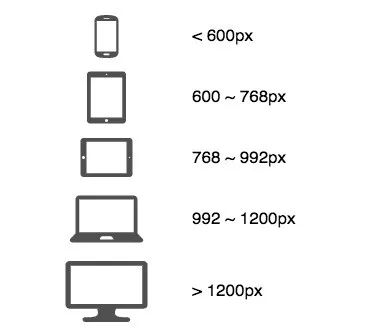

# 移动端适配

## 响应式布局设计

### 理念

响应式布局设计的理念是让页面在不同尺寸的屏幕设备上都能得到友好的渲染，以获得良好的浏览体验。

### 方案

响应式布局设计的方案有五种：

- “流体”设计
- 弹性布局
- 网格布局
- 媒体查询
- 移动端视口设置

## “流体”设计

“流体”设计的概念要求页面元素大小采用相对单位。

### 绝对长度单位-px 相关的概念

#### 像素

px 实际是 pixel（像素）的缩写，它是图像显示的基本单元，既不是一个确定的物理量，也不是一个点或者小方块，而是一个抽象概念。所以在谈论像素时**一定要清楚它的上下文**！

#### 物理像素（设备像素）

物理像素也称为设备像素，一个物理像素是显示器(手机屏幕)上最小的物理显示单元，在操作系统的调度下，每一个设备像素都有自己的颜色值和亮度值。

物理像素很好理解，对应屏幕上的一个个光点，光点的数量，就是设备的物理分辨率。

在同一个设备中，物理像素点的大小是固定的，数量也是固定的。

#### 虚拟像素 PX

PX 是虚拟像素，也被称为 CSS 像素（CSS Pixels）或者 逻辑像素，在 Web 开发中最常用的叫法是 CSS 像素。

CSS 像素可以理解为“直觉”像素，CSS 像素的单位是 `px`,是 CSS 和 JS 使用的抽象单位。

CSS 像素对应的是设备的逻辑分辨率。

虚拟像素在 Android 开发中又被叫做设备独立像素（Device Independent Pixel，简写 dip）

##### 设备独立像素（DIP）

设备独立像素(density-independent pixel 或 device independent pixel)也叫 密度无关像素 或 设备无关像素 或 逻辑像素，可以认为是计算机坐标系统中的一个点，这个点代表一个可以由程序使用的虚拟像素(比如: css 像素)，然后由相关系统转换为物理像素。

#### 屏幕尺寸

屏幕大小的物理尺寸，屏幕对角线长度衡量。

单位：英寸，1 英寸 = 2.54 厘米

#### 像素密度（PPI）

像素密度(Pixels Per Inch)，所表示的是每英寸所拥有的像素数量。因此 PPI 数值越高，即代表显示屏能够以越高的密度显示图像。

#### 设备像素比（DPR）

设备像素比(device pixel ratio)，简称 dpr，定义了物理像素和虚拟像素（设备像素和设备独立像素）的对应关系，它的值可以按如下的公式的得到：

```
设备像素比 = 物理像素 / 虚拟像素 // 在某一方向上，x方向或者y方向
```

比如在 iPhone X 上，物理像素是 1125x2436，而 CSS 像素（逻辑像素）是 375x812，那么一个 CSS 像素对应的是长和宽各 3 个设备物理像素，共 9 个设备物理像素点。这个比值 3 就是设备像素比。

所以， Web 开发中使用的 px，比如 height = 1px，实际指的是设备的 CSS 像素，并不是屏幕上真实的光点数，1px 具体对应屏幕上的多少光点，还取决于设备的 DPR。比如，1px 在 iPhone X 上对应 3x3 个屏幕上的光点，而在 iPhone 6 上就对应了 2x2 个屏幕光点。

在 javascript 中，可以通过 window.devicePixelRatio 获取到当前设备的 dpr。

在 css 中，可以通过-webkit-device-pixel-ratio，-webkit-min-device-pixel-ratio 和 -webkit-max-device-pixel-ratio 进行媒体查询，对不同 dpr 的设备，做一些样式适配(这里只针对 webkit 内核的浏览器和 webview)。

### 相对长度单位 em 和 rem

`em` 和 `rem` 都是 CSS 中的相对长度单位，它们主要用于 Web 开发中的字体大小、布局间距等的设置，以实现更好的响应式设计。不过，它们之间有一些关键的区别：

#### em

- `em` 的值是相对于其父元素的字体大小来计算的。
- 如果父元素没有设置字体大小，则默认相对于浏览器的默认字体大小，通常是 16px。
- `em` 可以被用于字体大小、margin、padding、width、height 等属性。
- `em` 的嵌套使用会造成复合效果，即每层的 `em` 值会基于上一层的计算结果。

#### rem (Root EM)

- `rem` 的值是相对于根元素（即 HTML 元素）的字体大小来计算的。
- 无论在文档的哪个部分使用 `rem`，它总是参考根元素的字体大小。
- `rem` 通常被用于定义字体大小，以及用于 margin、padding、width、height 等属性，其目的是保持元素尺寸的一致性。
- 使用 `rem` 可以避免 `em` 带来的复合效果，使得布局和字体大小更容易控制。

#### 使用场景

- **em**: 更适合用于需要根据父元素大小动态调整的场景，例如按钮内文本的大小。
- **rem**: 由于其稳定性和一致性，特别适合用于整体页面布局的基础设置，如根据不同屏幕大小调整的根字体大小。

响应式布局中 rem 使用的更广泛一些。开发者根据设计师提供的 UE 图进行开发时，测量出来的大小单位一般是像素，如果需要转换为 rem，可以采用 PostCSS 的插件 postcss-px2rem 自动转换为 rem 单位。

### 视口相对单位-vw vh vmin vmax

em 是相对于父元素的 font-size，rem 是相对于 html 根元素的 font-size，一旦设置指定的值，元素在 PC 端或者手机端都会按照指定的大小进行渲染，当浏览器视口尺寸发生变化时元素大小并不会随之改变（媒体查询可以做到）。随着技术的发展，元素根据视口的变化而实时调整大小的解决方案被提出，这就是视口单位。CSS3 把视口单位新增了进来，比如 vw、vh、vmin 和 vmax。

使用视口单位的优势是：一方面，当发生页面加载、缩放或手机横屏等触发视口尺寸变化的事件时，对于使用视口单位的元素，浏览器可以自动重新计算改变后的尺寸，去做相应的渲染。另一方面，使用视口单位会使浏览器根据不同设备的视口大小去渲染元素，从而减少不必要的媒体查询。

#### vw 和 vh

vh 和 vw 都是相对于视口 viewport 进行计算的单位

- vw： viewport width，视口宽度，1vw = 1% 视口宽度
- vh： viewport height，视口高度，1vh = 1% 视口高度

vw 和 vh 的逻辑比较简单，100vw = 100% 视口宽度

#### vmin 和 vmax

- vmin: 取 vw 和 vh 中的较小值
- vmax: 取 vw 和 vh 中的较大值

##### 有了 vh，vw，为什么还需要 vmin，vmax？

在进行移动端开发时，当用户把屏幕横过来，那么谁是 vh，谁是 vw 呢？

横过来之后手机的 “高” 成了 vw，“宽” 成了 vh，这就会造成：如果使用 vw、wh 设置字体大小（比如 5vw），在竖屏和横屏状态下显示的字体大小会像上图中那样差别非常大。而 vmin 和 vmax 是根据 vw 和 vh 大小进行实时取值，就可以避免横屏出现的这种状况，从而使得文字大小在横竖屏下保持一致。

## 媒体查询（media query）

媒体查询常被用于以下目的：

- 有条件的通过 @media 和 @import [at-rules](https://developer.mozilla.org/zh-CN/docs/Web/CSS/At-rule) 用 CSS 装饰样式。
  例如根据屏幕分辨率和浏览器视窗宽度来调整网站布局
- 用 `media=` 属性为`<style>`, `<link>`, `<source>`和其他 HTML 元素指定特定的媒体类型。如：

```
<link rel="stylesheet" src="styles.css" media="screen" />
<link rel="stylesheet" src="styles.css" media="print" />
```

### 语法

@media CSS at 规则可用于基于一个或多个媒体查询的结果来应用样式表的一部分。

每条媒体查询语句都由 **一个可选的媒体类型** 和 **任意数量的媒体特性表达式** 构成。可以使用 **多种逻辑操作符** 合并多条媒体查询语句。媒体查询语句不区分大小写。

@media at 规则可置于你代码的顶层或嵌套至其他任何的 at 条件规则组中。

```
/* 在你的代码的顶层 */
@media screen and (min-width: 900px) {
  article {
    padding: 1rem 3rem;
  }
}

/* 嵌套至其他的 at 条件规则中 */
@supports (display: flex) {
  @media screen and (min-width: 900px) {
    article {
      display: flex;
    }
  }
}

```

### 定位媒体类型

媒体类型（media type）描述设备的一般类别。除非使用 not 或 only 逻辑运算符，否则媒体类型是可选的，并且会（隐式地）应用 all 类型。

- all 适用于所有设备。
- print 适用于在打印预览模式下在屏幕上查看的分页材料和文档。（有关特定于这些格式的格式问题的信息，请参阅分页媒体。）
- screen 主要用于屏幕。

尽管通常在设计网站时会考虑屏幕，但你可能希望创建针对特殊设备（例如打印机或基于音频的屏幕阅读器）的样式。例如，此 CSS 针对打印机：

```
@media print { ... }
```

你还可以定位多个设备。例如，此 `@media` 规则使用两个媒体查询来同时定位屏幕和打印设备

```
@media screen, print {...}
```

### 定位媒体特性

媒体特性描述了给定的 [user agent](https://developer.mozilla.org/zh-CN/docs/Glossary/User_agent) 的输出设备或环境的特定特征。例如：浏览器的视口大小

媒体特性列表概览：https://developer.mozilla.org/zh-CN/docs/Web/CSS/@media#%E5%AA%92%E4%BD%93%E7%89%B9%E6%80%A7

许多媒体特性都是范围特性，这意味着可以在它们前面加上“最小”或“最大”来表示“最小条件”或“最大条件”约束。例如，仅当你的浏览器的 viewport 宽度等于或小于 12450px 时，此 CSS 才会应用样式：

```
@media screen and (max-width: 12450px) { ... }
```

有冒号的这种媒体特性需要用括号括起来。

媒体查询 4 级规范对语法进行了一些改进，以使用具有“范围”类型（例如宽度或高度，减少冗余）的功能进行媒体查询。级别 4 添加了用于编写此类的查询范围上下文。例如，使用最大宽度 max- 功能，我们可以编写以下代码：

```
@media (max-width: 30em) { ... }

媒体查询 4 级规范
@media (width <= 30em) { ... }
```

```
@media (min-width: 30em) and (max-width: 50em) { ... }

媒体查询 4 级规范
@media (30em <= width <= 50em ) { ... }
```

### 逻辑运算符创建复杂的查询

逻辑运算符：not，and，和 only 可以创建多个条件的媒体查询。

-`and` 用于将多个媒体查询规则组合成单条媒体查询，当每个查询规则都为真时则该条媒体查询为 true，它还用于将媒体特性与媒体类型结合在一起。

- `not` 用于否定媒体查询，如果不满足这个条件则返回 true，否则返回 false。如果出现在以逗号分隔的查询列表中，它将仅否定应用了该查询的特定查询。如果使用 not 运算符，则**必须指定媒体类型**。
- `only` 仅在整个查询匹配时才应用样式。这对于防止较老的浏览器应用所选样式很有用。当不使用 only 时，较老的浏览器会将 screen and (max-width: 500px) 简单地解释为 screen，忽略查询的其余部分，并将其样式应用于所有屏幕。如果使用 only 运算符，则**必须指定媒体类型**。
- `,`逗号 逗号用于将多个媒体查询合并为一个规则。逗号分隔列表中的每个查询都与其他查询分开处理。因此，如果列表中的任何查询为 true，则整个媒体查询语句返回 true。换句话说，列表的行为类似于逻辑或（or）运算符。
- `or` 等价于 `,` 运算符。于媒体查询第 4 版中被添加。

#### 结合多种类型和特性

and 关键字将媒体功能与媒体类型或其他媒体功能组合在一起

例如结合了两种媒体功能，以将样式限制为宽度至少为 30 em 的横向的设备：

```
@media (min-width: 30em) and (orientation: landscape) { ... }
```

要将样式限制为带有屏幕的设备，可以将媒体功能链接到 screen 媒体类型：

```
@media screen and (min-width: 30em) and (orientation: landscape) { ... }
```

##### 多重查询

当需要多重查询时，可以使用逗号分隔的列表来应用样式。

例如，如果用户设备的最小高度为 680px 或为纵向模式的屏幕设备，则以下规则将应用其样式：

```
@media (min-height: 680px), screen and (orientation: portrait) { ... }
```

以上面的示例为例，如果用户使用的打印机的页面高度为 800 像素，则 media 语句将返回 true，因为将应用第一个查询。同样，如果用户使用的是纵向模式的智能手机，并且视口高度为 480px，则将应用第二个查询，并且 media 语句仍将返回 true。

#### 反转查询

not 关键字会反转整个媒体查询的含义。它只会否定要应用的特定媒体查询。 （因此，它不会应用于以逗号分隔的媒体查询列表中的每个媒体查询。）not 关键字不能用于否定单个功能查询，只能用于否定整个媒体查询。

```
@media not all and (monochrome) { ... }

等价于
@media not (all and (monochrome)) { ... }
```

```
@media not screen and (color), print and (color) { ... }

等价于
@media (not (screen and (color))), print and (color) { ... }
```

#### 提升老版本的兼容性

only 关键字可防止不支持带有媒体功能的媒体查询的旧版浏览器应用给定的样式。它对现代浏览器没有影响。

only 关键词的主要目的是为了防止旧版浏览器不正确地应用给定的样式。在早期的浏览器中，媒体查询可能不被支持，导致浏览器尝试应用所有的样式，而不考虑媒体查询中指定的条件。使用 only 可以避免这种情况，因为这些旧版浏览器会忽略包含 only 关键词的媒体查询。

```
@media only screen and (color) { ... }
```

### 媒体查询在响应式开发中的应用

主要的媒体特性有一下几种：

- min-width 数值，如 600px， 视口宽度大于 min-width 时判断为真
- max-width 数值，如 800px， 视口宽度小于 max-width 时判断为真
- orientation portrait | landscape 当前设备方向，portrait 垂直，landscape 水平

虽然没有万能的媒体查询代码，但经过实践，也总结了一套比较具有代表性的设备断点。



## 移动端视口设置

viewport（视口）是用户可以看到的 Web 页面视口区域。

为了支持响应式布局，首先需要通过 viewport meta 标签正确设置页面的 viewport。一个针对移动端做过优化的站点中，应该包含以下类似的内容：

```
<meta name="viewport" content="width=device-width, initial-scale=1, user-scalable=no">
```

其中 width 控制视口的宽度，可以设置为设备宽度 device-width，或是具体的像素值。在上面的例子中，viewport 的宽度设置为 device-width。这意味着，如果屏幕宽度是 375px（如 iPhone X），则浏览器也使用 375px 的视口宽度来渲染页面，而不是使用 980px 或其他宽度使页面缩小展示。initial-scale=1 设置了浏览器首次加载页面时的初始缩放级别。我们还可以通过 minimum-scale 和 maximum-scale 等属性控制用户的缩放操作，但这也可能导致页面的可访问性问题。

| 字段名        | 取值                  | 说明                                                                      |
| ------------- | --------------------- | ------------------------------------------------------------------------- |
| width         | 正整数、device-width  | 定义视口的宽度，单位是 CSS 像素，如果等于 device-width，则为理想视口宽度  |
| height        | 正整数、device-height | 定义视口的高度，单位是 CSS 像素，如果等于 device-height，则为理想视口高度 |
| initial-scale | 0 ~ 10                | 初始缩放比例，允许小数点                                                  |
| minimum-scale | 0 ~ 10                | 最小缩放比例，必须小于等于 maximum-scale                                  |
| maximum-scale | 0 ~ 10                | 最大缩放比例，必须大于等于 minimum-scale                                  |
| user-scalable | yes、no               | 是否允许用户缩放页面，默认是 yes                                          |

### 理想视口

一般来讲，这个视口其实不是真实存在的，它对设备来说是一个最理想布局视口尺寸，在用户不进行手动缩放的情况下，可以将页面理想地展示。那么所谓的理想宽度就是浏览器（屏幕）的宽度了。

于是上述的 meta 设置，就是我们的理想设置，他规定了我们的视口宽度为屏幕宽度，初始缩放比例为 1，就是初始时候我们的视觉视口就是理想视口！

其中 user-scalable 设置为 no **可以解决移动端点击事件延迟问题**

## 文章

- [移动端适配](../../mobile/h5/fit.md)
- [移动端高清、多屏适配方案（上）](https://mp.weixin.qq.com/s/gS-odjwmojzeiR6ibEuWmg)
- [移动端高清、多屏适配方案（下）](https://mp.weixin.qq.com/s/8NIc7z4l0ZoAj9NRc3v22Q)
- [再聊移动端页面的适配](https://mp.weixin.qq.com/s?__biz=MjM5NzE0MjQ2Mw==&mid=2652493355&idx=1&sn=223d39483e910f7cfd57b4f366d9c41c&chksm=bd33fcfb8a4475ed79babbf2041f265edfa0d74bb8f76d02765e2fde937654d27e2d6cfc9f4b&mpshare=1&scene=23&srcid=0803fy98hvLzuhjGP7f4IJSK#rd)
- [MDN @media](https://developer.mozilla.org/zh-CN/docs/Web/CSS/@media)
- [响应式布局基础篇 - 你了解这些长度单位吗？](https://mp.weixin.qq.com/s/HdGontkdj6LUxzEShUQD4g)
- [响应式布局提高篇 - 图片正确的打开方式](https://mp.weixin.qq.com/s/-ntx38cG6iFyMVZq38hAmA)
- [响应式布局进阶篇 - viewport](https://mp.weixin.qq.com/s/1oqwLfqCYHHamsDij7OCYQ)
- [响应式布局进阶篇 - 响应式表格](https://mp.weixin.qq.com/s/QoOqfcygaRVwxAnLdYqOzw)
- [响应式布局终结篇 - 5 种常见布局模式](https://mp.weixin.qq.com/s/9aikzoCqi0GEYnIGlaO9gQ)
- [响应式布局新方案](https://mp.weixin.qq.com/s/3S7-CWzTUfblcmuUkG09oQ)
- [你了解过移动端适配吗](https://juejin.cn/post/6844903631993454600)
