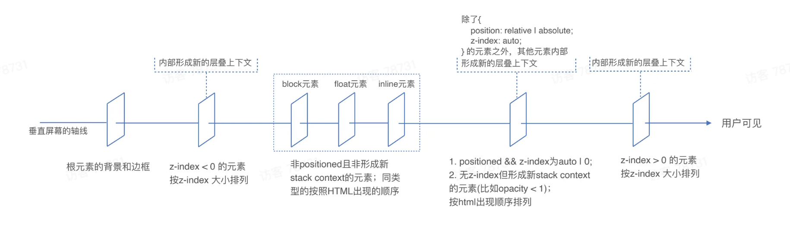

# 层叠上下文

浏览器渲染过程的第六步：[分层，构建图层树](../../browser/browser-render)，提到因为页面中有很多复杂的效果，如一些复杂的 3D 变换，页面滚动，或者使用 z-index 做 Z 轴排序等，为了更加方便的实现这些效果，主线程会遍历布局树来创建图层树（layer tree）。

图层树中的每一个 render layer，都是一个层叠上下文（The stacking context）。

层叠上下文是对 HTML 元素的三维构想，将元素沿着垂直屏幕的虚构的 Z 轴方向排开，并且它决定了元素的层叠顺序。

## 为什么需要层叠上下文？

浏览器需要一种机制来管理元素在三维空间中的层叠关系，特别是当它们的视觉表现或位置受到诸如透明度、过滤器、定位等属性影响时。层叠上下文为浏览器提供了一种方式，将页面分割成可以单独管理和渲染的片段，从而确保视觉上的正确性和渲染效率。

## 形成新的层叠上下文的条件

### CSS3 之前

- 根元素
- position 为 relative、absolute、fixed、sticky，且 z-index 不是 auto

### CSS3 新增

- opacity 的值小于 1
- transform 、 filter 、 perspective 的值不为 none
- clip-path 的值不为 none
- isolation 设置为 isolate

以上的这些属性涉及复杂的渲染效果，可能需要与页面上的其他元素互动，为了正确渲染这些效果，浏览器需要为这些元素创建新的层叠上下文。

### will-change 属性

will-change 属性指定了任何会创建层叠上下文的属性（例如：transform 、 opacity 等）

will-change 用于通知浏览器元素的某个属性将会有显著的变化，这可能需要额外的渲染处理（例如：创建新的层叠上下文）以优化性能

### flex 或 grid 的子元素

flex 或 grid 的子元素，并且 z-index 不是 auto，会创建新的层叠上下文

因为在 flex 或 grid 布局中，子元素的 z-index 会影响它们在容器中的层叠顺序。为了正确管理这些子元素及其内部元素的层叠，浏览器会为它们创建新的层叠上下文。

### 全屏模式

元素处于全屏模式（例如使用 HTML5 的全屏 api），会创建新的层叠上下文。

因为在全屏模式下，元素需要被视为独立的层级进行正确渲染。

## 注意

### 根元素形成的层叠上下文

文档的根元素（`<html></html>`）自然形成一个层叠上下文，它是所有其他层叠上下文的基础

### 层叠顺序

层叠顺序不仅指不同层叠上下文之间的顺序，同一个层叠上下文内，元素之间也有顺序。

**z-index 只在同一个层叠上下文中比较，子元素的 z-index 无法超越父元素的 z-index 显示顺序。**

### 编写 z-index 的建议

- 使用 CSS 变量或 CSS 预处理语言的变量，管理 z-index
- 将预设间隔设置为 10 或者 100，方便后续插入
