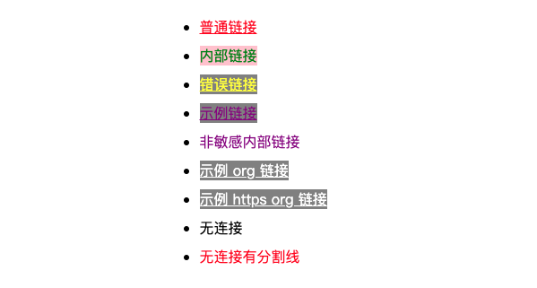

# CSS 选择器

// TODO

### 基础选择器

#### 通配符选择器

```css
* {
  margin: 0;
  padding: 0;
}
```

#### 类型（标签）选择器

```css
p {
  margin: 0;
  padding: 0;
}
```

#### 类选择器

```css
.title {
  margin: 0;
  padding: 0;
}
```

#### ID 选择器

```css
#app {
  margin: 0;
  padding: 0;
}
```

### 属性选择器

```html
<ul>
  <li><a href="normal">普通链接</a></li>
  <li><a href="#internal">内部链接</a></li>
  <li><a href="http ://example.com">错误链接</a></li>
  <li><a href="http://example.com">示例链接</a></li>
  <li><a href="#InSensitive">非敏感内部链接</a></li>
  <li><a href="http://example.org">示例 org 链接</a></li>
  <li><a href="https://example.org">示例 https org 链接</a></li>
  <li><a name="nolink">无连接</a></li>
  <li><a name="no-link">无连接有分割线</a></li>
</ul>
```

#### [attribute]

选中所有带 attribute 属性的元素

```css
/* 例如：把所有带 href 属性的元素设置字体颜色为紫色 */
[href] {
  color: purple;
}
```

#### [attribute=value]

选择带有 attribute 属性，且属性值为 value 的所有元素

```css
/* 例如：把 内部链接 的字体颜色设置为绿色 */
[href='#internal'] {
  color: green;
}
```

#### [attribute~=value]

选择带有 attribute 属性的元素，并且该属性的值是一个以空格为分隔的值列表，其中至少有一个值为 value

```css
/* 例如：把 错误链接 的字体颜色设置为黄色，因为它的属性值中的 http 后面有个空格 */
[href~='http'] {
  color: yellow;
}
```

#### [attribute^=value]

选择带有 attribute 属性，且属性值是以 value 开头的元素

```css
/* 例如：把 错误链接、示例链接、示例 org 链接、示例 https org 链接 设置背景色为灰色*/
[href^='http'] {
  background-color: grey;
}
```

#### [attribute$=value]

选择带有 attribute 属性，且属性值是以 value 结尾的元素

```css
/* 例如：把 示例 org 链接、示例 https org 链接 的字体颜色设置为白色 */
[href$='.org'] {
  color: white;
}
```

#### [attribute*=value]

选择带有 attribute 属性，且属性值包含至少一个 value 子串的元素

```css
/* 例如：把 内部链接 的背景色设置为粉色，因为它的 href 属性值为 #internal */
[href*='#in'] {
  background-color: pink;
}
```

#### [attribute|=value]

选择带有 attribute 属性的元素，属性值为 value （类似 [attribut=value]）或是以“value-”为前缀开头。典型应用场景是用来匹配语言简写代码（如 zh-CN、zh-TW 可以用 zh 作为 value）

```css
/* 例如：把 无连接有分隔线 的字体颜色设置为红色 */
[name|='no'] {
  color: red;
}
```

#### [attribute*=value i]

在任何一种属性选择器的右方括号前(可以使用空格分隔)添加一个字母 `i` (或 `I`)，可以在匹配属性值时忽略大小写

```css
[href*='#in'i] {
  text-decoration: initial;
}
```

#### 示例结果图示



### 组合选择器

#### 后代选择器 aSelector bSelector

选择 aSelector 匹配的元素内部的所有 bSelector 匹配的元素

#### 子选择器 aSelector > bSelector

选择 aSelector 匹配的元素下直接子元素为 bSelector 匹配的元素

#### 相邻兄弟选择器 aSelector + bSelector

选择 aSelector 匹配的元素之后的紧跟的兄弟元素为 bSelector 匹配的元素

#### 一般兄弟选择器 aSelector ~ bSelector

选择 aSelector 匹配的元素之后的兄弟元素为 bSelector 匹配的元素

#### 复合选择器

多个基础选择器可以连起来使用，例如：

- h1.page-header
- div[data-title="abc"]

#### 选择器列表

选择器列表是以逗号分隔（`,`）的多个选择器所组成的列表。

当多个选择器共享相同的声明时，它们可以被编组进一个以逗号分隔的列表。选择器列表也可以作为参数传递给一些函数式 CSS 伪类。逗号之前和/或之后可以有空白（字符）。

以下的三个声明是等效的：

```css
/* 单个选择器 */
span {
  border: red 2px solid;
}
div {
  border: red 2px solid;
}
/* 选择器分组 */
span,
div {
  border: red 2px solid;
}

/* 逻辑选择器 */
:is(span, div) {
  border: red 2px solid;
}
```

##### 无效选择器列表

**使用选择器列表的一个缺点是选择器列表中的单个不受支持的选择器会使整个规则无效化。**

```css
h1 {
  color: red;
}
h2:invalid-pseudo {
  color: red;
}
h3 {
  color: red;
}

/* 上下并不等效 */

h1,
h2:invalid-pseudo,
h3 {
  color: red;
}
```

它们不是等效的。在第一个规则集中，样式将应用于 h1 和 h3 元素，但 h2:invalid-pseudo 规则将不会被解析。在第二个规则集中，由于列表中的一个选择器是无效的，整个规则都将不会被解析。因此，没有样式会被应用到 h1 和 h3 元素：**当一个选择器列表中任意选择器无效时，整个样式块将被忽略。**

##### 可容错选择器列表

解决无效的选择器列表问题的一种方法是使用 :is() 或 :where() 伪类，它们接受一个可容错选择器列表。可容错选择器列表中的每个选择器都被单独解析。因此列表中任何无效的选择器会被忽略，而有效的选择器则会被有效使用。

```css
h1 {
  color: red;
}
h2:invalid-pseudo {
  color: red;
}
h3 {
  color: red;
}

/* 上下等效 */

:is(h1, h2:invalid-pseudo, h3) {
  color: red;
}
```

### 伪类选择器

#### :root

:root 匹配文档树的根元素。对 HTML 来说，:root 表示 <html> 元素，除了优先级更高之外，与 html 选择器相同。

```css
/* 以下两种方式作用相同，只不过 :root 的优先级更高 */
:root {
  background-color: yellow;
}
html {
  background-color: yellow;
}
```

#### :nth-child()

```html
<content>
  <div>11111</div>
  <div>22222</div>
  <p class="special">33333</p>
  <p>44444</p>
  <div>55555</div>
  <div>66666</div>
  <div>77777</div>
  <div>88888</div>
  <div>99999</div>
  <div>10 10 10</div>
  <div>11 11 11</div>
  <div>12 12 12</div>
  <div>13 13 13</div>
  <div>14 14 14</div>
  <div>15 15 15</div>
  <div>16 16 16</div>
  <div>17 17 17</div>
  <div>18 18 18</div>
</content>
```

根据父元素的子元素列中的索引来选择元素，换言之，:nth-child() 选择器根据父元素下的**所有兄弟元素的位置**来选择子元素

**注意：元素的索引从 1 开始，但是 :nth-child(n) 中的 n 是从 0 开始的所有非负整数**

```css
/* 最普通的语法：把 content 元素下第 4 个子元素设置字体颜色为红色 */
content :nth-child(7) {
  color: red;
}
```

括号中的关键字除了能设置 n 之外，还可以设置：

- odd：表示元素在兄弟列表中的位置是奇数：1、3、5……
- even：表示元素在兄弟元素中的位置是偶数：2、4、6……
- An+B：表示元素在兄弟元素中的位置是 An+B，其中 n 为正整数或 0，A 和 B 为整数，且 A 不为 0。
  - A 是整数步长，注意这里说的是整数（正整数和负整数）
  - B 是整数偏移量

```css
/* 把 content 元素下的奇数位置的子元素设置字体颜色为绿色 */
content :nth-child(odd) {
  color: green;
}
/* 或者用 2n+1 选择，n是从0开始的*/
content :nth-child(2n + 1) {
  color: green;
}

/* 把 content 元素下的偶数位置的子元素设置字体颜色为红色 */
content :nth-child(even) {
  color: red;
}
/* 或者用 2n 选择，可能有疑问，2n 第一项应该是 0，但是子元素的索引是从1开始的，所以 0 被忽略了 */
content :nth-child(2n) {
  color: red;
}

/* 把 content 元素下的第七个及之后的子元素设置字体下划线*/
content :nth-child(n + 7) {
  text-decoration: underline;
}

/* 把 content 元素下的前 3 子元素设置红色边框*/
/* 这个额外解释一下： [=-0+3、-1+3、-2+3]，再往后就是0和负数了，就不会选中任何元素了*/
content :nth-child(-n + 3) {
  border: 1px solid red;
}
```

**注意：在 element:nth-child() 语法中，子元素的计数包括任何元素类型的兄弟子元素，并且只有当该索引位置上的元素与选择器的 element 部分匹配时，才被视为匹配**

```css
/* 第三个元素是 <p class="special">33333</p>，前面两个兄弟元素是 div */

/* 选择 content 元素下的第三个元素（也就是 p class="special"）设置背景色为粉色*/
content :nth-child(3) {
  background-color: pink;
}

/* 如果觉得要选中第一个 p 元素而设置 n 是 1 就是错误的，因为子元素的计数包括任何元素类型的兄弟子元素，所以第一个 p 的索引应该还是3 */
/* 错误 */
content p:nth-child(1) {
  background-color: pink;
}
/* 正确 */
content p:nth-child(3) {
  background-color: pink;
}
```

**注意：通过传递一个选择器参数 `of <selector>语法`，我们可以选择与该选择器匹配的第 n 个元素（这样计数就不包含其他元素类型的兄弟子元素了），跟 nth-of-type 一样的作用**

```css
/* 跟 content p:nth-child(3) 作用一样 */
content :nth-child(1 of p.special) {
  background-color: pink;
}
/* 选中子元素列表中的第 2 个 p 元素，它在所有类型的兄弟子元素中索引是 4 */
content :nth-child(2 of p) {
  background-color: grey;
}
```

可以查看另外一些明显示例：[MDN :nth-child()](https://developer.mozilla.org/zh-CN/docs/Web/CSS/:nth-child)

#### :nth-of-type()

跟 :nth-child 的区别是，:nth-of-type 伪类是基于**相同类型（标签名称）**的兄弟元素中的位置来匹配元素

:nth-of-type 跟 :nth-child<of <selector>语法> 的效果类似（但是不完全相同），其他的语法，例如 odd、even、An+B 等，可以参考 :nth-child。

```html
<content>
  <div>这段不参与计数。</div>
  <p>这是第一段。</p>
  <p class="fancy">这是第二段。</p>
  <div>这段不参与计数。</div>
  <p class="fancy">这是第三段。</p>
  <p>这是第四段。</p>
</content>
```

```css
/* 奇数段：第一段和第三段自提颜色设置红色 */
p:nth-of-type(2n + 1) {
  color: red;
}
/* 如果使用 :nth-child 要达到相同的效果，就需要使用 of <selector> 语法 */
:nth-child(2n + 1 of p) {
  color: red;
}

/* 偶数段 */
p:nth-of-type(2n) {
  color: blue;
}

/* 选中第一段 */
p:nth-of-type(1) {
  border: 1px solid black;
}

/*
这将匹配第三段，因为它匹配的元素是 2n + 1，计数的范围是相同类型的元素（标签都是 p），并且具有 fancy
第二个段落具有 fancy 类，因为它不是奇数 :nth-of-type(2n + 1)，所以不匹配
*/
p.fancy:nth-of-type(2n + 1) {
  text-decoration: line-through;
}

/*
之前说 :nth-of-type 跟 :nth-child<of <selector>语法> 的效果类似（但是不完全相同）
不同之处就在这里，下面的选择器将选中第二段，因为 of <selector> 语法的计数范围是所有 selector
*/
:nth-child(2n + 1 of p.fancy) {
  text-decoration: line-through;
}
```


#### :first-child

:first-child 表示一组兄弟元素中的第一个元素，相当于 :nth-child(1)

```css
/* 选择 content 下的第一个子元素 */
content :first-child {
  color: purple;
}
```

element:first-child 相当于 element:nth-child(1)，看到这个应该也就知道了，它的子元素的计数也是包含任何元素类型的兄弟子元素，只有当该索引位置上的元素与 element 部分匹配时，才被视为选中

```html
<div>
  <p>此文本已选中！</p>
  <p>此文本未选中。</p>
</div>

<div>
  <h2>此文本未被选中：它不是一个 `p`。</h2>
  <p>此文本未被选中。</p>
</div>
```

```css
p:first {
  color: red;
}
```


#### :first-of-type

表示一组兄弟元素中相同类型的第一个元素

```html
<content>
  <p>此文本已选中！</p>
  <p>此文本未选中。</p>
  <h2>此文本也被选中：h2。</h2>
  <p>此文本未被选中。</p>
</content>
```

```css
content :first-of-type {
  color: red;
}
/* 跟以下单独设置是一样的 */
p:first-of-type {
  color: red;
}
h2:first-of-type {
  color: red;
}
```

**多层嵌套：但是要注意如果 content 元素下有很多层嵌套， content :first-of-type 会选中每个层级所有符合规则的元素，同理 article :nth-of-type(1) 也是如此。**

#### :last-child

跟 :first-child 相反，:last-child 代表一组兄弟元素中的最后一个元素

#### :last-of-type

跟 :first-of-type 相反，:last-of-type 表示在子元素列表中，最后一个给定类型的元素，当然也包含嵌套的元素

#### :nth-last-child(n)

:nth-last-child(n) 跟 :nth-child(n) 语法基本一致，但是它是从结尾开始计数，而不是从开始计数，当然它的计数范围也包括任何类型的兄弟子元素。

#### nth-last-of-type(n)

:nth-last-of-type(n) 跟 :nth-of-type(n) 语法基本一致，不过是从元素列表的末尾开始计数。

:nth-last-of-type 也是基于元素在相同类型（标签名）的兄弟子元素中相对最后一个元素的位置来匹配元素。

#### :only-child

:only-child 表示没有任何兄弟元素的元素。当一个元素没有任何兄弟元素时，使用 :only-child，与 :first-child :last-child :nth-child(1) :nth-last-child(1) 作用相同，但是前者的优先级更低一些。

#### :only-of-type

表示任意一个元素，这个元素没有其他相同类型（标签名）的兄弟元素

#### :empty()

用于选择不包含任何子元素的元素，子元素可以是元素节点或文本（包括空格），但是注释、处理指令和 CSS 属性 content 不会影响元素是否被认定为空。

#### a:link

表示尚未被访问过的元素，例如具有 href 属性的未访问的 `<a>` 和 `<area>`

#### a:visited

选择所有已被访问的链接，:visited 伪类仅适用于带有 href 属性的 `<a>` 和 `<area>`。

只要在当前页面访问过一次的链接，后续刷新页面或者进入其他包含此链接的页面，:visited 设置的样式会一直生效。

出于隐私原因，浏览器严格限制 :visited 伪类应用的样式，以及使用它们的方式，基本上都是一些颜色相关的 CSS 属性

**link 元素永远不会被 :visited 选中**

#### a:hover

通常情况下，将鼠标悬停在元素上时触发。

#### a:active

在用鼠标操作时，代表用户按下按键和松开按键之间的时间（常用的就是链接正在被点击）

:active 伪类一般被用在 `<a>` 和 `<button>` 元素中，除此之外，包含激活元素的元素（例如包含 a 的 p 元素）。

这个样式可能会被后声明的其他链接相关的伪类覆盖，包括 :link :hover :visited。为保证样式生效，需要把 :active 的样式放在所有连接相关的样式之后。这种链接伪类先后顺序被称为 LVHA 顺序：:link - :visited - :hover - :active

```html
<p>
  This paragraph contains a link:
  <a href="#">This link will turn red while you click on it.</a>
  The paragraph will get a gray background while you click on it or the link.
</p>
```

```css
/* 未访问链接 */
a:link {
  color: blue;
}

/* 已访问链接 */
a:visited {
  color: purple;
}

/* 用户鼠标悬停 */
a:hover {
  background-color: yellow;
}

/* 激活链接 */
a:active {
  color: red;
}

/* 包含被激活链接的段落被激活 */

p:active {
  background-color: #eee;
}
```

#### :focus

表示获得焦点的元素（如表单输入）。当用户点击或轻触一个元素或使用键盘的 tab 键选择它时，它会被触发。

此伪类仅适用于焦点的元素自身。如果要选择包含焦点元素的元素，需要使用 :focus-within

**接受键盘事件或其他用户输入的元素都允许 :focus 选择器**

#### :enabled/:disabled

:enabled 选择每个启用的 input 元素

:disabled 选择每个禁用的 input 元素

#### :checked

表示任何处于选中状态的 radio（`<input type="radio">`），checkbox（`<input type="checkbox">`）或 select 元素中的 option 元素。

有很多 UI 库使用这个伪类实现自定义开关。

### 伪元素选择器

#### ::first-line

::first-line 伪元素在某块级元素的第一行应用样式。第一行的长度取决于很多因素，包括元素宽度，文档宽度和文本的文字大小。

::first-line 伪元素只能够在块容器中，所以，只能在一个 display 为 block、inline-block、table-cell、table-caption 中有用。

**和其他所有的伪元素一样，::first-line 不能匹配任何真实存在的 html 元素**

##### 允许的属性值

在一个使用了 ::first-line 伪元素的选择器中，只有很小的一部分 CSS 属性能被使用（生效）

- 所有和字体有关的属性：font 或 font 开头的
- 所有和背景有关的属性：background 或 background 开头的
- word-spacing letter-spacing text-decoration text-transform line-height text-shadow vertical-align

#### ::first-letter

::first-letter 会选中某块级元素的第一行的第一个字母，并且文字所处的行之间没有其他内容（如图片和内联的表格）

跟::first-line 类似，只能够在块容器中生效，允许的属性值除了 ::first-line 规定的之外，还可以使用：所有外边距属性、所有内边距属性、所有的边框属性、color 属性。

#### ::before

::before 会创建一个伪元素，将其插入到匹配选中的元素的前面，成为第一个子元素。常通过 content 属性来为一个元素添加修饰性内容。

**此元素默认为行内元素**

由于替换元素的内容通常由外部资源确定，所以不能直接在替换元素上应用 ::before 和 ::after 伪元素，因为它们是包含在元素盒模型内部，而不会显示在替换元素的内部

```html
<q>一些引用</q>, 他说，<q>比没有好。</q>.
```

```css
q::before {
  content: '>>';
  color: blue;
}

q::after {
  content: '<<';
  color: red;
}
```

#### ::after

::after 会创建一个伪元素，将其插入到匹配选中的元素的后面，作为最后一个子元素。

其他的特性跟 ::before 是一样的，通过 content 属性来为该元素添加装饰内容，默认是行内元素

##### content 中可以设置图片或者获取属性值，进行展示

```html
<p>
  这是上面代码的实现<br />
  我们有一些
  <span data-descr="collection of words and punctuation">文字</span> 有一些 <span data-descr="small popups which also hide again">提示</span>。<br />
  把鼠标放上去<span data-descr="not to be taken literally">看看</span>。
</p>
```

```css
span[data-descr] {
  position: relative;
  text-decoration: underline;
  color: #00f;
  cursor: help;
}

span[data-descr]:hover::after {
  content: attr(data-descr);
  position: absolute;
  left: 0;
  top: 24px;
  min-width: 200px;
  border: 1px #aaaaaa solid;
  border-radius: 10px;
  background-color: #ffffcc;
  padding: 12px;
  color: #000000;
  font-size: 14px;
  z-index: 1;
}
```

#### ::section

::section 伪元素应用于文档中被用户高亮的部分（比如使用鼠标或其他选择设备选中的部分）

##### 只有一小部分 CSS 属性可以用于 ::section 选择器

- color
- background-color
- cursor
- caret-color 插入光标的颜色
- outline
- text-decoration
- text-shadow

```html
This text has special styles when you highlight it.
<p>Also try selecting text in this paragraph.</p>
```

```css
/* 选中的文本是红色背景，金黄色的字体 */
::selection {
  color: gold;
  background-color: red;
}

/*选中的是蓝色背景，白色的字体的段落*/
p::selection {
  color: white;
  background-color: blue;
}
```

### 逻辑选择器

其实是一些函数式伪类，这些伪类接受可容错选择器列表作为参数

#### :is()

:is() CSS 伪类函数以选择器列表作为参数，并选择该列表中任意一个选择器可以选择的元素。这对于以更紧凑的形式编写大型选择器非常有用。

最初该选择器被命名为 :matches()（以及 :any()），但在 CSSWG issue #3258 中被重命名为 :is()。

**伪元素在 :is() 的选择器列表中无效。**

**规范将 :is() 和 :where() 定义为接受容错选择器列表。**

在 CSS 中，当使用选择器列表时，如果任何一个选择器无效，则整个列表将被视为无效。使用 :is() 或 :where() 时，如果一个选择器无法解析，整个选择器列表不会被视为无效，而是会忽略不正确或不支持的选择器，并使用其他的选择器。

#### :where()

:where() CSS 伪类函数接受选择器列表作为它的参数，将会选择所有能被该选择器列表中任何一条规则选中的元素。

```css
:where(header, main, footer) p:hover {
  color: red;
  cursor: pointer;
}

/* 上下等效 */

header p:hover,
main p:hover,
footer p:hover {
  color: red;
  cursor: pointer;
}
```

:where() 和 :is() 好像都不会紧跟着某个选择器使用。

**:where() 和 :is() 的不同之处在于，:where() 的优先级总是为 0，但是 :is() 的优先级是由它的选择器列表中优先级最高的选择器决定的。**

#### :not()

:not() CSS 伪类用来匹配不符合一组选择器的元素。由于它的作用是防止特定的元素被选中，它也被称为反选伪类（negation pseudo-class）。

:not() 伪类可以将一个或多个以逗号分隔的选择器列表作为其参数。选择器中不得包含另一个否定选择器或伪元素。

##### 使用时需注意

- 可以使用此伪类编写无用的选择器。例如，:not(\*) 匹配任何不是元素的元素，这显然是荒谬的，所以这个附加的规则将永远不被应用。
- 可以利用这个伪类提高规则的优先级。例如，#foo:not(#bar) 和 #foo 都将匹配相同的元素，但是具有两个 id 的选择器具有更高的优先级。
- :not() 伪类的优先级将由其逗号分割的参数中优先级最高的选择器指定；提供与 :not(:is(argument)) 相同的优先级。
- :not(.foo) 将匹配任何非 .foo 的元素，包括 <html> 和 <body>。
- 这个选择器将匹配任意“不是一个 X”的元素。当与后代选择器一起使用，这可能令人惊讶，因为有多种路径可以选择一个目标元素。例如，body :not(table) a 仍将应用 <table> 中的链接，因为 `<tr>`、`<tbody>`、`<th>`、`<td> (en-US)`、`<caption>` 等都可以匹配选择器 :not(table) 部分。
- 你可以同时否定多个选择器。例如：:not(.foo, .bar) 等同于 :not(.foo),:not(.bar)。
- 如果传递给 :not() 伪类的选择器无效或者浏览器不支持，则整个规则都将是无效的。克服这种行为的有效方式是使用：:is 伪类，它接受一个可容错选择器列表。例如 :not(.foo, :invalid-pseudo-class) 将使整个规则无效，但是 :not(:is(.foo, :invalid-pseudo-class)) 将匹配任何（包括 <html> 和 <body>）不是 .foo 的元素。

#### :has()

CSS 函数式伪类 :has() 如果参数传递的任何相对选择器在锚定到该元素时，会选中该元素。

这个伪类通过把可容错相对选择器列表作为参数，**提供了一种选择父元素或者先前的兄弟元素的方法。**

```css
/* 如果 h1 紧邻的兄弟元素是 p，那么给 h1 设置 margin-bottom: 0;*/
h1:has(+ p) {
  margin-bottom: 0;
}
```

其他实际用法：

- [CSS 有了:has 伪类可以做些什么？](https://mp.weixin.qq.com/s/OOUG_XA-YFByqTcWJurJxg)
- [CSS 实用技巧：伪元素&伪类的妙用](https://mp.weixin.qq.com/s/zrTCEwkrZabttQtjt1ocYQ)

#### CSS 选择器练习网站：[https://flukeout.github.io/](https://flukeout.github.io/)

## 什么是 CSS 选择器权重以及它如何工作？

### 三大原则

决定规则声明生效（或者说样式生效）的层叠三大规则：1、样式表来源 > 2、选择器优先级 > 3、源码位置

如果通过样式表来源就能确定哪个规则生效，就不需要再看选择器和源码位置了。

#### 1、样式表来源

用户代理样式表（浏览器内置默认样式）< 用户样式表（很少有这个设置）< 作者样式表（开发者写的样式）< 作者样式表中 !important < 用户样式表中的 !important < 用户代理样式表中的 !important

#### 2、CSS 选择器优先级

!important > 内联 > id > class = attribute = pseudo-class > type = pseudo-element

**通配选择器（`*`）关系选择器（+、>、~、" "、||）对优先级没有影响。**

**需要注意一些新的选择器，:is() :not() :has() 本身不计入优先级，以参数中最高的优先级为准，:where() 优先级是 0**

**为目标元素直接添加样式，永远比继承样式的优先级高，无视优先级的继承规则。**

#### 3、源码位置

谁最后声明的谁生效

- 对于 @import 的样式，按照 @import 的顺序
- 对于 link 引入和 style 标签内的样式，根据在 document 中的顺序决定

### CSS 选择器权重

CSS 选择器的优先级是通过权重计算来得到的，选择器权重分为三大类，从高到低依次是：

- ID 选择器，例如: #container
- Class、属性和伪类选择器，例如：.title, input[type="text"], :hover
- 类型和伪元素选择器，例如：div, ::before

除了选择器之外，行内样式的优先级最高，也就是通过 html 中的 style 属性定义的样式。但是它的权重也可能会被!important 覆盖。

### 权重的计算

在计算权重的时候，可以用一组向量标志来表示：(0, 0, 0, 0)，从左到右：

- 第一位是行内元素，在有行内元素的时候加 1
- 第二位是 ID 选择器的数量
- 第三位是 class、属性和伪类选择器的数量
- 第四位是类型和伪元素选择器的数量

如果计算结果权重相同，那么以定义顺序靠后的选择器优先，或者有!important 标记优先。

## 为什么浏览器从右到左匹配 CSS 选择器？

首先我们要看一下选择器的`解析`是在何时进行的。

浏览器渲染的过程大概如下：

HTML 经过解析生成 DOM Tree；而在 CSS 解析完毕后，需要将解析的结果与 DOM Tree 的内容一起进行分析建立一棵 Render Tree，最终用来进行绘图。Render Tree 中的元素（Webkit 中称为 `renderers`，Firefox 中称为 `frames`）与 DOM 元素相对应，但非一一对应：一个 DOM 元素可能会对应多个 renderer，如文本折行后，不同的**行**会成为 Render Tree 中不同的 renderer。也有的 DOM 元素被 Render Tree 完全无视，比如 display:none;元素。

在建立 Render Tree 时（Webkit 中的 `Attachment` 过程），浏览器就要为每个 DOM Tree 中的元素根据 CSS 的解析结果（Style Rules）来确定生成怎样的 renderer。对于每个 DOM 元素，必须在所有 Style Rules 中找到符合的 selector 并将对应的规则进行合并。选择器`解析`实际是在这里执行的，在遍历 DOM Tree 时，从 Style Rules 中去寻找对应的 selector。

因为所有样式规则可能数量很大，而且绝大多数不会匹配到当前的 DOM 元素（因为数量很大所以一般会建立规则索引树），所以有一个快速的方法来判断**这个 selector 不匹配当前元素**就是及其重要的。

如果正向解析，例如 `div div p em`，我们首先就要检查当前元素到 html 的整条路径，找到最上层的 div，再往下找，如果遇到不匹配就必须回到最上层的那个 div，往下再去匹配选择器中的第一个 div，回溯若干次才能确定匹配与否，效率很低。

逆向匹配则不同，如果当前的 DOM 元素是 div，而不是 selector 最后的 em，那只要一步就能排除。只有在匹配时，才会不断向上找父节点进行验证。

但因为匹配的情况远远低于不匹配的情况，所以逆向匹配带来的优势是巨大的。同时我们也能够看出，在选择器结尾加上 `*` 就大大降低了这种优势，这也就是很多优化原则提到的尽量避免在选择器末尾添加通配符的原因。
