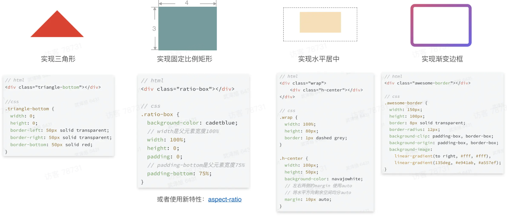
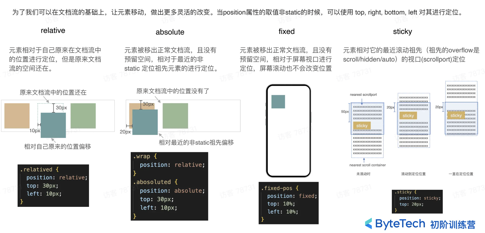

# CSS 排版-盒模型和文档流

我们先从词源来讲一讲排版这件事。

在毕昇发明活字印刷之前，排版这项工作是不存在的，相应的操作叫做“雕版”。人们要想印刷书籍，就需要依靠雕版工人去手工雕刻印版。

活字印刷的出现，将排版这个词引入进来，排版是活字印刷的 15 道工序之一，不论是古代的木质活字印刷，还是近代的铅质活字印刷，排版的过程都是由排版工人一个字一个字从字架上捡出，再排入板框中。实际上，这个过程就是一个流式处理的过程。

从古代活字印刷开始，到现代的出版行业，再到今天的 Web，排版过程其实并没有什么本质的变化。只不过，今天在我们的 CSS 中，排版需要处理的内容，不再是简单的大小相同的木字或者活字，而是有着不同字体和字号的富文本，以及插入在富文本中大小不等的盒。


80 年代印刷厂工人在进行排版工作。

一切 CSS 的排版，都不会逃出 **盒** 与 **文字** 这两样东西，即在 CSS 的排版里我们只排两样东西：一个是盒，另一个就是文字。所以我们的排版就是给每一个文字安排到正确的位置上，然后给每一个盒安排到正确的位置上。

在 CSS 标准中，规定了如何排布每一个文字或者盒的算法，这个算法依赖一个排版的“当前状态”，CSS 把这个状态称为“格式化上下文（Formatting Context）”

我们可以认为排版的过程是这样的：

> 格式化上下文 + 盒/文字 = 位置

> formatting context + boxes/charater = position

## 盒模型

盒模型是我们排版的时候所用的一种基本单位。页面中的所有元素都被看做一个矩形盒子，这个盒子包含元素的内容（content）、内边距（padding）、边框（border）和外边距（margin）。对元素盒子而言，内边距、边框和外边距不是必需的，因此它们的默认值都为 0。不过，用户代理样式表（即浏览器默认样式）通常会给很多元素添加外边距和内边距，例如标题，段落，列表等。

盒模型是 CSS 的核心概念，描述了元素如何显示，以及（在一定程度上）如何相互作用、相互影响。

### 盒子大小

通过修改 box-sizing 属性可以改变计算盒子大小的方式。

1、标准盒模型：box-sizing: content-box;（默认值）

默认情况下，元素盒子的 width 和 height 属性指的是内容盒子，也就是元素可渲染内容区的宽度和高度。这时候添加边框和内边距并不会影响内容盒子的大小，但会导致整个元素盒子变大。

2、IE 盒模型：box-sizing: border-box;

如果 box-sizing 的值为 border-box，那么 width 和 height 属性的值将包含内边距和边框，此时，边框和内边距不会影响整个元素盒子的大小，但是会影响盒子内容的大小，并且外边距仍然会影响盒子在页面中占据的整体空间，即它的宽度不会算到 width 中。在很多情况下，这种计算盒子大小的方式更加直观，之所以说这种计算方式“直观”，是因为现实中的盒子就是这样测量的。可以把 CSS 中的盒子想象成一个包装箱，边框是四壁，内边距是填充层，这是一个有实物可以参照的方案。

事实上，IE6 及更早版本 IE 中的盒模型就是 border-box 的方式计算盒子宽度的，不过后来浏览器开发人员（包括开发新版本 IE 的人）决定默认采用另一种方式来计算 CSS 盒模型的宽度，实际上并不明智。

### 内边距

内边距的值可以是 CSS 规范中规定的任意长度单位（px、em 或百分比）。

1. 左右应用百分比

例如：**padding-left: 5%; 这里的 5%指的是包含块（containing block，一般都是父元素）宽度的 5%。如果父元素宽度是 100px，那么这里的左内边距的宽度就是 5px。**

2. 上下应用百分比

**如果给一个元素的顶部和底部应用内边距，那么使用百分比值仍然是基于包含块的宽度来计算，这是因为元素的高度常常不会被声明，而且会因内容多少而差异很大。所以 CSS 规定，上下方位的内边距仍然基于包含块（containing block）的宽度来计算。** 这里，包含块就是其父元素，但有时候也不一定，例如固定定位等。

### 外边距

1. 百分比尺寸

**外边距的上下左右设置百分比尺寸时，跟内边距一样。**

2. 外边距折叠

**常规块盒子有一种机制叫做外边距折叠，简而言之，垂直方向上的两个外边距相遇时，会折叠成一个外边距。折叠后外边距的高度等于两者中较大的那一个高度。**

**在一个元素嵌套着另一个元素的情况下，假设没有内边距或边框来分隔外边距（要在父元素上设置），他们的外边距也会折叠。**

甚至同一个元素的外边距都能折叠。假设有一个空元素，只有外边距而没有边框或内边距。此时，上外边距与下外边距接触，结果也会折叠。

更进一步，如果折叠后的外边距又碰到了其他元素的外边距，还会继续折叠。这就是再多的空段落也只会占用一小块空间的原因：它们的外边距都折叠成一个小外边距了。

**外边距折叠好像很奇怪，但是确实文档排版的真实需求，例如，一个页面包含几段文本，每一段都设置了上下外边距，页面的开头和结尾是有一个外边距的，但是段落之间就会有两个外边距，间距就是两倍，有了外边距折叠，段边距才会与页边距相等。**

**外边距折叠只发生在文档常规文本流中块级盒子的垂直方向上，左右外边距不会折叠，即行内盒子、浮动盒子或绝对定位盒子的外边距不会折叠。**

举个生动的例子：折叠外边距就像“个人空间”。如果在公交车站站着两个人，他们每个人都认为较为舒适的个人空间应该是 1 米，那么他们就会乐意间隔一米，而不是间隔两米才能让双方都满意。

防止外边距折叠的办法：

- 创建一个新的块级格式化上下文（BFC），可以防止其内部的块级元素的外边距与外部元素的外边距折叠。例如：对容器使用 overflow: auto（或者非 visible 的值），防止内部元素的外边距跟容器外部的外边距折叠。这种方式副作用最小。
- 在两个外边距之间加上边框或者内边距，防止它们折叠（因为这会创建一个非空的区域，从而分隔开相邻的外边距）
- 如果容器为浮动元素、内联块、绝对定位或固定定位时，外边距不会在它外面折叠。因为外边距折叠一般发生在**正常文档流**的**块级元素（或者说同一个块级格式化上下文的块级元素）**的**垂直方向**上，浮动元素、绝对定位、固定定位都脱离了正常文档流，内联块所在的上下文为内联格式化上下文。
- 当使用 Flexbox 布局时，弹性布局内的元素之间不会发生外边距折叠，网格布局同理。
- 当元素显示为 table-cell 时不具备外边距属性，因此它们不会折叠。此外还有 table-row 和大部分其他表格显示类型，但不包括 table、table-inline、table-caption。

以上的方法中有很多会改变元素的布局行为，除非它们能产生想要的布局，否则不要轻易使用。

3. 负外边距

padding、border、margin 中，只有 margin 可以设置负值，margin 的负值最终减少的是外界可感知的宽高

### 最大值和最小值

1. 宽度

在响应式布局中，给一个元素应用 min-width 和 max-width 值让块级盒子可以默认自动填充父元素的宽度，但不会收缩到比 min-width 指定的值更窄，或者扩展到比 max-width 指定的值更宽。

2. 高度

处理元素高度的方式跟处理宽度不一样。border-box 依然适用于高度，但是通常最好避免给元素指定明确的高度。

高度设置有 min-height 和 max-height，不过还是上面提到的，在 CSS 中不建议设置任何高度值，这是因为元素的高度通常应该取决于所包含的内容，不需要我们明确设定。否则，万一内容增多，或者文本字号变大，内容就可能跑到高度固定的盒子之外去。即使出于种种原因，需要明确设定默认高度，也最好使用 min-height，因为这个属性允许盒子随内容扩展。

### 扩展

1. **有一个与边框类似的属性，即轮廓线（outline）。这个属性可以在边框盒子外围画出一条线，但这条线不影响盒子的布局，也就是不会影响盒子宽度和高度。因此，outline 常用于调试复杂布局或者演示布局效果。**

2. 全局设置 border-box

全局修改盒模型为 border-box 可以用一下写法：

```css
*,
::before,
::after {
  box-sizing: border-box;
}
```

这么设置会有个问题，如果使用了带样式的第三方组件，就可能会因此破坏其中一些组件的布局，因为使用通用选择器会选中第三方组件内的每个元素，全局设置 border-box 修改盒模型可能会有问题，所以最终需要写另外的样式将组件内的元素恢复为 content-box。

优化措施就是利用继承改一下修改盒模型的方式。盒模型通常不会被继承，但是使用 inherit 关键字可以强制继承。

```css
:root {
  box-sizing: border-box;
}

*,
::before,
::after {
  box-sizing: inherit;
}
```

这种方法，就可以在第三方组件的顶级容器，将其恢复为 content-box，这样组件的内部元素就会继承该盒模型。

3. 百分比高度

**用百分比指定高度会存在问题。百分比参考的是元素包含块（一般是父元素）的大小，但是父元素的高度通常是由子元素的高度决定的。这样会造成死循环，浏览器处理不了，因此它会忽略这个声明。要想让百分比高度生效，必须给父元素明确定义一个高度。**

**大家使用百分比高度一般是想让一个容器填满屏幕，类似 height: 100%; 不过更好的方式是用视口的相对单位，100vh 等于视口的高度。**

另一个百分比高度的用法是创建等高列，但是等高列可以使用 CSS 表格布局或者 Flexbox 布局实现。

4. 全局设置堆叠元素之间的外边距，可以使用猫头鹰选择器，即 `* + *`

```css
body * + * {
  margin-top: 10px;
}
```

### 由盒模型的特性可以实现的一些展现形式

- 实现三角形
- 实现固定比例矩形
- 实现水平居中
- 实现边框颜色渐变



## 文档流

我们常说的文档流分为：普通文档流、浮动文档流、定位文档流。

### 格式化上下文

**格式化上下文 FC（Formatting Context）:指页面中一个渲染区域，并且拥有一套渲染规则，它决定了其子元素如何定位，以及与其他元素的相互关系和作用。** 最常见的 Formatting Context 有 Block Formatting Context（BFC）和 Inline Formatting Context（IFC）。CSS2.1 中只有 BFC、IFC，CSS3 增加了 GFC 和 FFC。

这里又再一次提到这个很重要的概念：盒（Box）。Box 是 CSS 布局的对象和基本单位，直观点来说，就是一个页面是由很多个 Box 组成的。元素的类型和 display 属性，决定了这个 Box 的类型。任意一个盒子都有外部显示类型和内部显示类型，外部显示类型规定了该盒子如何与同一格式化上下文的其他元素一起显示，内部显示类型规定了盒子内部的布局方式（例如：display: flex; 其外部显示是 block，参与 BFC，但是它内部的盒子都参与弹性盒子布局）

不同类型的 Box，会参与不同的 Formatting Context。常见的盒子有：

- block-level box：display 属性为 block、list-item、table 的元素外部显示类型为 block。参与 Block Formatting Context。
- inline-level box：display 属性为 inline、inline-block、inline-table 的元素外部显示类型为 inline。参与 Inline Formatting Context。

#### BFC

**BFC（Block Formatting Context）块级格式化上下文，是指一个独立的块级渲染区域，该区域有一套渲染规则来约束内部块级盒子的布局，且与区域外部无关。简单来说，BFC 是一个容器，用于管理块级元素。**

1. BFC 布局规则

- 内部的 Box 会在垂直方向，一个接一个的放置（即块级元素独占一行）；
- BFC 的区域不会与 float box 重叠；（可以实现自适应两栏布局）
- 内部的 Box 垂直方向的距离由 margin 决定。属于**同一 BFC** 的两个**相邻 Box** 的 margin 会发生重叠；【按照 BFC 的定义，只有同属一个 BFC 时，两个元素才有可能发生垂直 margin 的重叠，这个包括相邻元素或者嵌套元素，只要它们之间没有阻挡（比如边框、非空内容、padding 等）就会发生 margin 重叠。】
- 计算 BFC 的高度时，浮动元素也参与计算；（可以用来清除浮动，另外提一下 min-height:contain-float;这个新的属性值也能让元素包含浮动）
- BFC 就是页面上的一个隔离的独立容器，容器里面的子元素不会影响到外面的元素。反之也是如此。

2. 如何创建 BFC

- 根元素（`<html>`）
- 浮动元素（元素的 float 不是 none）
- 绝对定位或固定定位元素（元素的 position 为 absolute 或 fixed）
- overflow 不为 visible 的块元素
- 弹性元素（display 为 flex 或 inline-flex 元素的直接子元素）
- 网格元素（display 为 grid 或 inline-grid 元素的直接子元素）
- 行内块元素（元素的 display 为 inline-block）
- 表格单元格（元素的 display 为 table-cell，HTML 表格单元格默认为该值）
- 表格标题（元素的 display 为 table-caption，HTML 表格标题默认为该值）

块级格式化上下文包含创建它的元素内部的所有内容。**特别说明一点，默认的 div 等是块级元素，只是会表现出块级布局的特性，但并不会自动创建 BFC。**

#### IFC

IFC（Inline Formatting Contexts）行内格式化上下文，有水平放置和垂直对齐两个特征。在 IFC 中，盒是从包含块顶部，按相应文本方向，一个挨一个水平放置的，**这些盒之间的水平外边距，边框和内边距都有效，而垂直外边距不起作用**。盒在行内能以不同的方式垂直对齐：以它们的底部或者顶部对齐，或者以它们里面的文本的基线（baseline）对齐。（line-height 与 vertical-align）。

**只包含行级盒子的容器会创建一个 IFC**

1. IFC 的布局规则

- 子元素水平方向横向排列，并且垂直方向起点为元素顶部。
- 能把在一行上的内容都完全包含进去的一个矩形区域，被称为该行的行盒子（line box）。行盒子的宽度是由包含块和其中的浮动来决定。
- IFC 中的 line box 一般左右边贴紧其包含块，但 float 元素会优先排列，并且 float 元素会位于 IFC 与 line box 之间，使得 line box 宽度缩短（简单说就是避开浮动元素）。
- IFC 中的 line box 高度由 CSS 行高计算规则来确定，同个 IFC 下的多个 line box 高度可能会不同。
- IFC 中不可能有块级元素的，**当插入块级元素时会产生两个匿名块与块级元素分隔开，即产生两个 IFC，每个 IFC 对外表现为块级元素，与块级元素垂直排列。**

2. IFC 的应用

- 水平居中

当一个块要在环境中水平居中时，设置其为 inline-block 则会在外层产生 IFC，通过 text-align 则可以使其水平居中。

- 垂直居中

创建一个 IFC，用其中一个元素撑开父元素的高度，然后设置其 vertical-align:middle，其他行内元素则可以在此父元素下垂直居中。

BFC 和 IFC 都是独立的渲染区域，但它们处理的内容和方式不同。BFC 主要关注块级元素的垂直排列和布局隔离，而 IFC 则关注内联元素的水平排列和行内布局特性。

#### GFC

GFC（GridLayout Formatting Contexts）网格布局格式化上下文，当为一个元素设置 display:grid;时，此元素将会获得一个独立的渲染区域，我们可以通过在网格容器（grid container）上定义网格定义行（grid definition rows）和网格定义列（grid definition columns）属性和在网格项目（grid item）上定义网格行（grid row）和网格列（grid columns）。

GFC 有什么用，和 table 又有什么区别呢？首先同样是一个二维的表格，但 GridLayout 会有更加丰富的属性来控制行列，控制对齐以及更为精细的渲染语义和控制。

#### FFC

FFC（Flex Formatting Contexts）弹性格式化上下文，display 值为 flex 或 inline-flex 的元素将会生成弹性容器（flex container）。Flex Box 由弹性容器和弹性项目组成。通过设置元素的 display 属性为 flex 或 inline-flex 可以得到一个弹性容器。设置为 flex 的容器被渲染为一个块级元素，而设置为 inline-fex 的容器则渲染为一个行内元素。弹性容器中的每一个子元素都是弹性项目。弹性项目可以是任意数量的。弹性容器外和弹性项目内的一切元素都不受影响。简单地说，Flexbox 定义了弹性容器内弹性项目该如何布局。

FFC 与 BFC 有点类似，不过还是有几点区别：

- Flexbox 不支持::first-line 和::first-letter 这两种伪元素
- vertical-align、float、clear 属性对 Flexbox 中的子元素是没有效果的。多栏布局在 Flexbox 中也是失效的。
- Flexbox 下的子元素不会继承父级容器的宽。

### 普通文档流

首先明确一点，W3C 规范中没有 document flow 这个概念，只有 normal-flow（常规流），不过国内还是文档流的叫法多一些。文档流也是一种流，流动的是元素。

普通文档流指的是网页元素的默认布局行为，简单的说就是元素按照其在 HTML 中的位置顺序排布的过程。行内元素跟随文字的方向从左到右排列，当到达容器边缘时会换行。块级元素会占据完整的一行，前后都有换行。

文档流中的元素可分为：块级元素和行内元素

- 块级元素（block elements）

块级元素独占一行

自上而下沿垂直方向堆叠

在垂直方向上的间距由它们的上、下外边距决定（会发生外边距折叠）。

可以设置宽高。默认宽度是它容器的 100%，除非自己设定一个宽度。

它可以容纳行内元素和其他的块级元素。

大家常说的 p、h1 和 article 这些元素都是块级元素。意思就是说，它们作为元素，显示为内容块或块级盒子（block box）。

- 行内元素（inline elements）

行内元素都在同一行，跟随文字的方向从左到右排列，会随文本换行而换行，

它们之间的水平间距可以通过水平方向上的内边距、边框和外边距来调节，但行内元素的高度不受其垂直方向上的内边距、边框和外边距影响。

**不可设置宽高。**

行内元素只能容纳文本或者其他行内元素，但容纳块级元素也不会出错，但是不建议。span 和 time 都是行内元素，因为它们的内容会以行盒子（line box）的形式显示在行内。

可以使用 display 属性改变生成的盒子类型。换句话说，可以通过把 display 属性设置为 block，让 span 变得跟块级元素一样。

如果把 display 属性设置为 none，还可以让浏览器不为相应的元素生成盒子。如果不生成盒子，那么元素及其包含的内容就不会显示出来，也不会占用文档中的空间。

display 属性设置为 inline-block 后，该元素就会像一个行内盒子一样水平排列，但这个盒子的内部仍然像块级元素一样，能够设置宽高和垂直方向的内、外边距。

使用表格相关的标记（table、tr、th 等）时，表格本身表现为块级元素，但表格的内容会根据生成的行和列排布。通过正确设置 display 属性为 table、table-row、table-cell 等值，就可以让非表格元素采用表格的布局方式实现表格布局。

此外，新增的 display 属性为 flex 或 grid 等，这些新布局模式会在它们的外部上下文中创建类似块级的盒子。但会为内部显示内容创建新的规则。

#### 扩展

1. 再说一下为什么不建议设置元素的高度：普通文档流是为限定的宽度和无限的高度设计的。内容会填满视口的高度，然后在必要的时候折行。因此，容器的高度由内容天然地决定，而不是容器自己决定。

2. 由一行文本形成的水平盒子叫行盒子（line box），而行盒子的高度由所包含的行内盒子决定。修改行盒子大小的唯一途径就是修改行高（line-height），或者给它内部的行内盒子设置水平方向的内边距、边框或外边距。

3. **匿名块盒子（anonymous block box）是指不明确定义的元素生成的块级盒子。例如文本和块级元素相邻，就算文本没有定义为块级元素，也会被当成块级元素（或者说会包一个块级元素）。同理，还有匿名行盒子，即存在于块级元素内部的文本级行盒子。** 除了使用`:first-line`伪元素来添加有限的排版和颜色相关的样式外，不能直接给匿名块盒子和匿名行盒子应用样式。

4. 浏览器支持改变排版方向，不一定是从右到左从上到下，所以我们把文字依次书写的延伸方向称为主轴或者主方向，换行延伸的方向，跟主轴垂直交叉，称为交叉轴或者交叉方向。文字排版时有个 advance 的概念需要注意一下，advance 代表每一个文字排布后在主轴上的前进距离，它跟文字的宽/高不相等，是字体中最重要的属性。 display 值为 inline 的元素中的文字排版时会被直接排入文字流中，inline 元素主轴方向的 margin 属性和 border 属性也会被计算进排版前进距离当中。并且要注意，当没有强制指定文字书写方向时，从左到右文字中插入右到左的文字，会形成一个双向文字盒，反之亦然。这样，即使没有元素包裹，混合书写方向的文字也可以形成一个盒结构，我们再排版时，遇到这样的双向文字盒，会先排完盒内再排盒外。

5. 实现方面：浏览器对行的排版，一般是先行内布局，再确定行的位置，根据行的位置计算出行内盒和文字的排版位置。

5) 脱离普通文档流的方式：浮动（float）和绝对定位（position: absolute;）、固定定位（position: fixed;）

### 包含块和定位（定位文档流）

包含块的重要性：元素的尺寸及位置常常受其包含块的影响。对于一些属性：例如：width、height、padding、margin，绝对定位元素的偏移量（position 被设置为 absolute 或 fixed），当赋值为百分比的值时，包含块就是这些百分比值的计算依据。

确定元素的包含块，要看元素是如何定位的。

如果元素的定位方式为静态定位（即不指定 position 属性的值）、相对定位（即 position 的属性值为 relative）或 sticky，则其包含块的边界就计算到一个最近的父元素（sticky 是最近的可滚动的父元素）内边距边缘，该父元素的 display 属性值必须能够提供类似块级的上下文，如 block、inline-block、table-cell、list-item 等。

如果元素的定位方式是绝对定位（即 position 属性的值为 absolute），那么包含块是距离它最近的定位祖先（即 position 属性设置为 static 之外任意值的祖先元素）。如果没有这么一个定为祖先，那么它就相对于文档的根元素（即 html 元素）定位。文档的根元素也叫作起始包含块（initial containing block）。

如果元素的定位方式是固定定位（即 position 属性的值为 fixed），那么包含块是视口（viewport）。固定定位是由绝对定位衍生出来的。


#### 扩展

##### 定位与文档流的关系

如果元素的定位方式是相对定位，该元素仍然会待在原来的地方（占据原来文档流中的位置），不过可以通过设置 top、right、bottom 和 left 属性，使该元素相对于初始位置平移一定距离。**无论是否位移，相对定位的元素仍然会在文档流中占据初始的空间**。相对定位事实上是普通文档流定位模型的一部分，因为元素还是相对于它在文档流中的初始位置来定位。

绝对定位则会把元素拿出文档流，因此也就不会再占用原来的空间，与此同时，文档流中的其他元素会各自重新排列定位，仿佛绝对定位的那个元素没有存在过一样。固定定位也是如此。



##### 如果 position 的属性是 absolute 或 fixed，包含块也可能是满足以下条件的最近的父元素。

- transform 或 perspective 的值不为 none。
- will-change 的值是 transform 或 perspective。
- contain 的值是 paint。例如：`contain: paint;`

##### 以上的父元素都是指的父元素的内边距边缘。

##### 根据包含块计算百分值

#### 如果某些属性被赋予一个百分值的话，它的计算值是由这个元素的包含块计算而来的。这些属性包含盒模型属性和偏移属性。

要计算 height、top、bottom 的百分值，是通过包含块的 height 的值。如果包含块的 height 值没有设置，默认被内容撑开，那么这些值的计算值为 auto。

要计算 width、left、right、padding、margin 这些属性，由包含块的 width 属性的值来计算他们的百分值。

##### 绝对定位 top:0、bottom:0、left:0、right:0 的特殊用法

有固定宽高的子元素水平垂直居中

```css
.parent {
  width: 200px;
  height: 200px;
  background: #ffb6b9;
  position: relative;
}

.child {
  width: 100px;
  height: 100px;
  position: absolute;
  top: 0;
  left: 0;
  right: 0;
  bottom: 0;
  background: #8ac6d1;
  margin: auto;
}
```

.child 设置了固定的宽高，再加上 top:0、bottom:0、left:0、right:0 和 margin: auto ，可以实现水平垂直居中。水平居中是因为：left: 0; 和 right: 0;这两个属性将.child 元素的左右边缘分别定位到父元素的左右边缘。margin: auto;在水平方向上，这个属性会自动分配左右边距，从而使元素水平居中。
垂直居中是因为：top: 0; 和 bottom: 0;这两个属性将.child 元素的上下边缘分别定位到父元素的上下边缘。margin: auto;在垂直方向上，这个属性同样会自动分配上下边距，使元素垂直居中。

让无固定宽高的子元素充满父元素

```css
.parent {
  width: 200px;
  height: 200px;
  padding: 100px;
  background: #ffb6b9;
  position: relative;
}

.child {
  position: absolute;
  top: 0;
  left: 0;
  right: 0;
  bottom: 0;
  background: #8ac6d1;
}
```

.child 无固定宽高时，top:0、bottom:0、left:0、right:0 会让元素的在四个方向上都定位到父元素的边缘，并且这个边缘是内边距的边缘，所以即使 .parent 设置了 padding:100px ，.child 元素也会充满父元素。

### 浮动（浮动文档流）

浮动盒子可以向左或向右移动，直到其外边沿接触包含块的外边沿，或接触另一个浮动盒子的外边沿，同时，浮动元素的宽度也会收缩为适应于其中内容的最小宽度，除非通过 width、min-width、max-width 明确设置其宽度。浮动盒子也会脱离常规文档流，因此常规流中的其他块级盒子的表现，几乎当浮动盒子根本不存在一样。

1. 浮动的特殊情况

为什么说是“几乎”？浮动元素会脱离文档流，因此不会再像非浮动元素一样影响其他元素。实际上，严格来讲并非如此。如果浮动元素后面跟着的是常规文档流中的元素，那么这个元素的盒子就会当浮动元素不存在一样，该怎么布局就怎么布局。但是，这个元素盒子中的文本内容（可以是单独的文本内容或者被元素包裹的纯文本内容）则会记住浮动元素的大小，并在排布时避开它，为其留出相应的空间。就是跟在浮动元素后面的行盒子会缩短，从而为浮动元素留空，造成文本环绕浮动盒子的效果。事实上，浮动就是为了在网页中实现文本环绕图片的效果而引入的一种布局模型。

2. 清除浮动

浮动元素除了会导致后面的行盒子缩短，从而造成文本环绕效果外，不会对周围的元素有任何别的影响，毕竟它已经脱离了文档流。但清除一个元素本质上会为所有前面的浮动元素清理出一块垂直空间。这就为使用浮动布局创造了条件，因为周围的元素可以为浮动元素腾出地方来。

要阻止行盒子环绕在浮动盒子外面，需要给包含行盒子的元素应用 clear 属性。clear 属性的值有 left、right、both 和 none，用于指定盒子的哪一侧不应该紧挨着浮动盒子。很多人认为 clear 属性只是简单地删除几个用于抵消前面浮动元素的标记，事实却没有这么简单。清除一个元素时，浏览器会在这个元素上方添加足够大的外边距，从而将元素的上边沿垂直向下推移到浮动元素下方。因此，如果你给“已清除的”元素添加外边距，那么除非你的值超过浏览器自动添加的值，否则不会看到什么效果。

#### 扩展

从实现上看，浏览器对 float 的处理是先排入正常流，再移动到排版宽度的最左/最右（这里实际上是主轴的最前和最后）

### 从感性的角度理解文档流

我们可以用一句话来描述正常流的排版行为，那就是：依次排列，排不下了换行。

在正常流基础上，我们有 float 相关规则，使得一些盒占据了正常流需要的空间，我们可以把 float 理解为“文字环绕”。

vertical-align 相关规则规定了如何在垂直方向对齐盒。下图展示了盒与文字如何混合排版的:


除此之外，margin 折叠是很多人非常不理解的一种设计，但是实际上我们可以把 margin 理解为“一个元素规定了自身周围至少需要的空间”，这样，就非常容易理解为什么 margin 需要折叠了。（车厢里人跟人的间距那个例子也一样说明）

当我们要把正常流中的一个盒或者文字排版，需要分成三种情况处理：

- 当遇到块级盒：排入块级格式化上下文
- 当遇到行内级盒或者文字：首先尝试排入行内格式化上下文，如果排不下，那么创建一个行盒，先将行盒排版（行盒是块级，所以到第一种情况），行盒会创建一个行内格式化上下文。
- 遇到 float 盒：把盒的顶部跟当前行内级上下文上边缘对齐，然后根据 float 的方向把盒的对应边缘对到块级格式化上下文的边缘，之后重排当前行盒。

## 推荐阅读

- [CSS 排版与正常流 ](https://zhuanlan.zhihu.com/p/265698290)
- [网页布局简史](https://mp.weixin.qq.com/s?__biz=MjM5MTA1MjAxMQ==&mid=2651235652&idx=1&sn=06abd69f6620a549e63fb7aa01e9bbe2&chksm=bd497cc08a3ef5d653463b7f0bbdd06588e71c5c1c31401d32dc5f5304ccd21b06b1b63c2775&scene=21#wechat_redirect)
- [CSS 简史](https://mp.weixin.qq.com/s?__biz=MjM5MTA1MjAxMQ==&mid=2651227422&idx=1&sn=62f574bf62045f2214f11f42e011e68c&chksm=bd495c9a8a3ed58ceb698378b27bc5058617f0ce86b262394427948e9cdd5d34576d72d48d66&scene=21#wechat_redirect)
