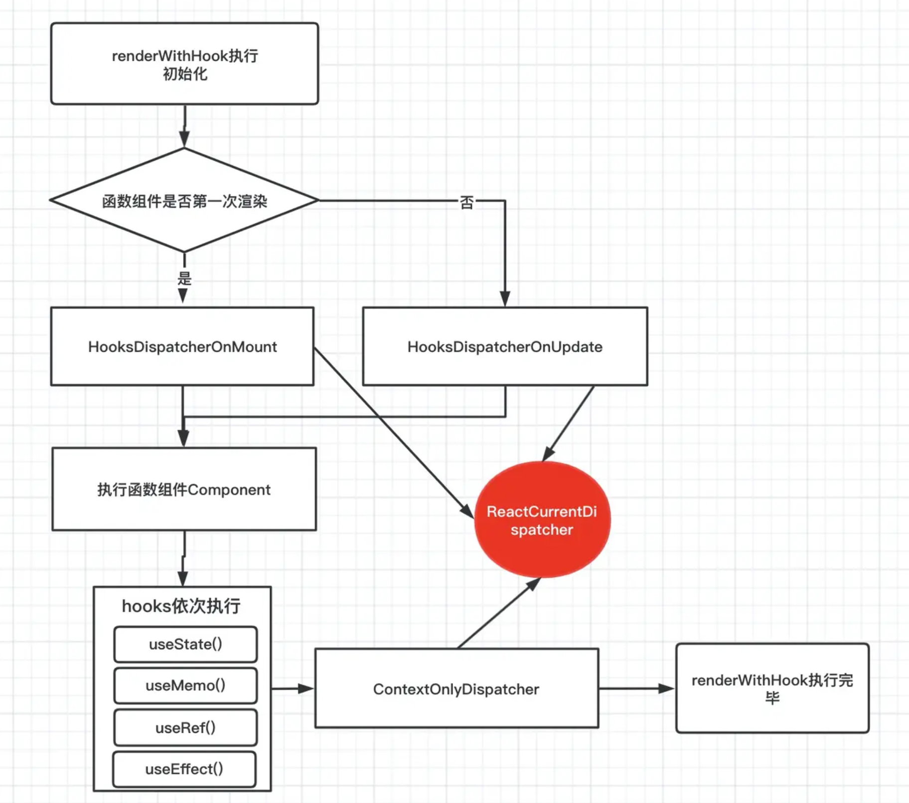

# React Hooks 详解

## Hooks 的出现

- 2015 年之前，React 通过 React.createClass 方法创建组件实例
- ES6 发布的 Class 语法得到支持后，React 遵循标准，从 v0.13.1 开始支持 Class 语法形式的组件，即 ClassComponent
- 为了解决 ClassComponent 存在的 **“业务逻辑分散”** 和 **“有状态的组件复用困难”** 两个问题，V16.8 带来了 Hooks
- 自 Hooks 问世后，React 的后续发展主要围绕 FC 展开，不再有关于 ClassComponent 的重要特性出现

## 心智模型——代数效应

### 概念

代数效应是函数式编程中的一个概念，用于将副作用从函数调用中分离。简单地说，就是一种在函数内部声明需要执行某些操作，但不立即执行它们的方式，这些操作的具体实现留给函数的调用者或者环境去处理。

## React Hooks 为什么没有使用细粒度更新?

原因在于 React 属于应用级框架，从关注“自变量与应用的对应关系”角度看，其更新粒度不需要很细，因此无需使用细粒度更新。

但是，作为代价，React Hooks 在使用上会受到两个制约：

1. 需要显式指明依赖
2. 不能在条件语句中声明 Hooks

## React Hooks 原理

### 引子

```js
import { useState } from 'react'

// useState 源码在 packages/react/src/ReactHooks.js
export function useState(initialState) {
  const dispatcher = resolveDispatcher()
  return dispatcher.useState(initialState)
}

// resolveDispatcher 函数定义
function resolveDispatcher() {
  const dispatcher = ReactCurrentDispatcher.current
  return dispatcher
}

// ReactCurrentDispatcher 的 current 默认定义为 null，后续会在 renderWithHooks 函数中真正赋值
const ReactCurrentDispatcher = {
  current: null,
}
```

### Hooks 的执行流程

1. FC 进入 render 流程之前，会先确定 ReactCurrentDispatcher.current 指向，此时涉及到 `renderWithHooks`
2. 进入 Hooks mount 流程时，执行 mount 对应逻辑，方法名一般为 “mountXXX”（例如调用 useState，实际会调用 mountState），此时涉及到 `mountWorkInProgressHook`
3. Hooks update 时，执行 update 对应逻辑，方法名一般为 “updateXXX”（例如调用 useState，实际会调用 updateState），此时涉及到 `updateWorkInProgressHook`

#### `renderWithHooks` 执行函数

包含 Hooks 功能的 FC 会在 `beginWork` 中执行 `renderWithHooks`，代码在：`packages/react-reconciler/src/ReactFiberBeginWork.js` 文件中

```
renderWithHooks(
  current, // current Fiber
  workInProgress, // workInProgress Fiber
  Component, // 函数组件本身
  props, // props
  secondArg,
  nextRenderLanes
)
```

##### 参数解释

1. **current**

   - **类型**：Fiber 节点
   - **说明**：表示组件在上一次渲染时的 Fiber 节点。如果是初次渲染，这个参数值为`null`。它包含了上一次渲染的状态，包括子 Fiber 节点、DOM 节点、钩子状态等。

2. **workInProgress**

   - **类型**：Fiber 节点
   - **说明**：表示当前正在进行的工作的 Fiber 节点。这是对`current`的克隆，React 将在这个节点上应用本次渲染期间的所有更新。一旦完成，它将成为下一次渲染的`current`。

3. **Component**

   - **类型**：函数组件
   - **说明**：当前正在渲染的函数组件本身。`renderWithHooks`将执行这个函数，传入`props`和`secondArg`（如果有的话），并处理返回的 jsx 或其他元素。

4. **props**

   - **类型**：Object
   - **说明**：包含组件接收到的所有属性的对象。这些是传递给组件函数的参数，组件内部通过这些`props`来渲染 UI 或执行逻辑。

5. **secondArg**

   - **类型**：任意
   - **说明**：这个参数通常用于传递给函数组件的第二个参数。对于大多数函数组件，这个参数是不需要的。在某些特殊情况下，比如使用`React.forwardRef`时，这个参数会被用来传递`ref`。

6. **nextRenderLanes**
   - **类型**：Lanes
   - **说明**：表示本次渲染的优先级。在 React 的并发模式中，每个更新都有自己的优先级（lane）。这个参数帮助 React 确定哪些更新应该在当前渲染中被处理，哪些可以被推迟到未来的渲染中。

```js
function renderWithHooks(current, workInProgress, Component, props, secondArg, nextRenderLanes) {
  renderLanes = nextRenderLanes
  currentlyRenderingFiber = workInProgress // workInProgress Fiber 节点
  workInProgress.memoizedState = null // 存储 Hooks 单向链表
  workInProgress.updateQueue = null // 存储 effect 有向环形链表
  workInProgress.lanes = NoLanes

  /*
 * 对于第一次渲染组件，那么用的是 HooksDispatcherOnMount hooks对象。
对于渲染后，需要更新的函数组件，则是 HooksDispatcherOnUpdate 对象，那么两个不同就是通过current树上是否memoizedState（hook信息）来判断的。如果current不存在，证明是第一次渲染函数组件。
 */
  {
    if (current !== null && current.memoizedState !== null) {
      ReactCurrentDispatcher.current = HooksDispatcherOnUpdate
    } else {
      ReactCurrentDispatcher.current = HooksDispatcherOnMount
    }
  }
  /**
   * 调用 Component(props, secondArg) 执行我们的函数组件，我们的函数组件在这里真正的被执行了，然后，我们写的 hooks 被依次执行，把 hooks 信息依次保存到 workInProgress Fiber 节点上
   */
  var children = Component(props, secondArg)
  /**
   * 将 ContextOnlyDispatcher 赋值给 ReactCurrentDispatcher.current，也就是说如果不是在函数组件中，调用的 hooks，都是 ContextOnlyDispatcher 对象上 hooks
   */
  ReactCurrentDispatcher.current = ContextOnlyDispatcher

  renderLanes = NoLanes
  currentlyRenderingFiber = null
  currentHook = null
  workInProgressHook = null

  return children
}
```

##### HooksDispatcherOnMount

初始化第一次渲染

```
const HooksDispatcherOnMount = {
  useCallback: mountCallback,
  useEffect: mountEffect,
  useLayoutEffect: mountLayoutEffect,
  useMemo: mountMemo,
  useReducer: mountReducer,
  useRef: mountRef,
  useState: mountState,
  //...
};

```

##### HooksDispatcherOnUpdate

更新组件

```
const HooksDispatcherOnUpdate = {
  useCallback: updateCallback,
  useEffect: updateEffect,
  useLayoutEffect: updateLayoutEffect,
  useMemo: updateMemo,
  useReducer: updateReducer,
  useRef: updateRef,
  useState: updateState
  //...
};

```

##### ContextOnlyDispatcher

```
const ContextOnlyDispatcher = {
    useState:throwInvalidHookError
    // ...
}
function throwInvalidHookError() {
  invariant(
    false,
    'Invalid hook call. Hooks can only be called inside of the body of a function component. This could happen for' +
      ' one of the following reasons:\n' +
      '1. You might have mismatching versions of React and the renderer (such as React DOM)\n' +
      '2. You might be breaking the Rules of Hooks\n' +
      '3. You might have more than one copy of React in the same app\n' +
      'See https://fb.me/react-invalid-hook-call for tips about how to debug and fix this problem.',
  );
}

```



#### 初始化阶段 `mountWorkInProgressHook`

FC 初始化的时候，第一次调用 hooks，例如 `useState`，都会首先调用`mountWorkInProgressHook`

```js
function mountWorkInProgressHook() {
  const hook: Hook = {
    memoizedState: null, // useState、useReducer 中 保存 state 信息 ｜ useEffect 中 保存着 effect 对象 ｜ useMemo 中 保存的是缓存的值和 deps [callback(), [...deps]] ｜ useRef中保存的是 ref 对象 {current: initialValue}
    baseState: null, // usestate和useReducer中,一次更新中 ，产生的最新state值。
    baseQueue: null, // usestate和useReducer中 保存最新的更新队列。
    queue: null, // 保存 update 对象，包含待更新队列 pendingQueue ，更新函数 dispatch 等信息。
    next: null, // 指向下一个 hooks 对象
  }
  if (workInProgressHook === null) {
    // 例如 useState(0) 是第一个 hooks 走的就是这样。
    currentlyRenderingFiber.memoizedState = workInProgressHook = hook
  } else {
    workInProgressHook = workInProgressHook.next = hook
  }
  return workInProgressHook
}
```

mountWorkInProgressHook 这个函数做的事情很简单，首先每次执行一个 hooks 函数，都产生一个 hook 对象，里面保存了当前 hook 信息,然后将每个 hooks 以链表形式串联起来，并赋值给 workInProgress Fiber 节点的 memoizedState。所以函数组件用 memoizedState 存放 hooks 链表。

#### 更新 `updateWorkInProgressHook`

```js
function updateWorkInProgressHook() {
  let nextCurrentHook
  if (currentHook === null) {
    /* 如果 currentHook = null 证明它是第一个hooks */
    const current = currentlyRenderingFiber.alternate
    if (current !== null) {
      nextCurrentHook = current.memoizedState
    } else {
      nextCurrentHook = null
    }
  } else {
    /* 不是第一个hooks，那么指向下一个 hooks */
    nextCurrentHook = currentHook.next
  }
  let nextWorkInProgressHook
  if (workInProgressHook === null) {
    //第一次执行hooks
    // 这里应该注意一下，当函数组件更新也是调用 renderWithHooks ,memoizedState属性是置空的
    nextWorkInProgressHook = currentlyRenderingFiber.memoizedState
  } else {
    nextWorkInProgressHook = workInProgressHook.next
  }

  if (nextWorkInProgressHook !== null) {
    /* 这个情况说明 renderWithHooks 执行 过程发生多次函数组件的执行 ，我们暂时先不考虑 */
    workInProgressHook = nextWorkInProgressHook
    nextWorkInProgressHook = workInProgressHook.next
    currentHook = nextCurrentHook
  } else {
    invariant(nextCurrentHook !== null, 'Rendered more hooks than during the previous render.')
    currentHook = nextCurrentHook
    const newHook = {
      //创建一个新的hook
      memoizedState: currentHook.memoizedState,
      baseState: currentHook.baseState,
      baseQueue: currentHook.baseQueue,
      queue: currentHook.queue,
      next: null,
    }
    if (workInProgressHook === null) {
      // 如果是第一个hooks
      currentlyRenderingFiber.memoizedState = workInProgressHook = newHook
    } else {
      // 重新更新 hook
      workInProgressHook = workInProgressHook.next = newHook
    }
  }
  return workInProgressHook
}
```

- 首先如果是第一次执行 hooks 函数，那么从 current 树上取出 memoizedState ，也就是旧的 hooks。
- 然后声明变量 nextWorkInProgressHook，这里应该值得注意，正常情况下，一次 renderWithHooks 执行开始时，workInProgress 上的 memoizedState 会被置空，hooks 函数顺序执行，nextWorkInProgressHook 应该一直为 null，那么什么情况下 nextWorkInProgressHook 不为 null,也就是当一次 renderWithHooks 执行过程中，执行了多次函数组件
- 最后复制 current 的 hook 的字段，把它赋值给 workInProgressHook，用于更新新的一轮 hooks 状态。

### `useState` 源码

#### 初始化 `useState` -> `mountState`

```js
function mountState(initialState) {
  // 生成新的 workInprogressHook 并把它放到 workInProgress Fiber 节点的 memoizedState 链表的最后
  const hook = mountWorkInProgressHook()
  if (typeof initialState === 'function') {
    // 如果 useState 第一个参数为函数，执行函数得到state
    initialState = initialState()
  }
  hook.memoizedState = hook.baseState = initialState
  const queue = (hook.queue = {
    pending: null, // 待更新的 update 环形链表
    dispatch: null, // 负责更新函数
    lastRenderedReducer: basicStateReducer, //用于得到最新的 state ,
    lastRenderedState: initialState, // 最后一次得到的 state
  })

  const dispatch = (queue.dispatch = dispatchSetState.bind(
    // 负责更新的函数
    null,
    currentlyRenderingFiber,
    queue
  ))
  return [hook.memoizedState, dispatch]
}

// useState 的 hook.queue.lastRenderedReducer
// useState 可以视为 lastRenderedReducer 为 basicStateReducer 的 useReducer
function basicStateReducer(state, action) {
  return typeof action === 'function' ? action(state) : action
}
```

#### 调用 `dispatch` 实际是调用 `dispatchSetState`

例如：`const [number, setNumber] = useState(0)` 中的 setNumber 就是 dispatchSetState，它的第一个参数和第二个参数，已经被 bind 给改成 currentlyRenderingFiber 和 queue,我们传入的参数是第三个参数 action

```js
function dispatchSetState(fiber, queue, action) {
  var lane = requestUpdateLane(fiber)

  // 创建一个 update 对象
  var update = {
    lane: lane,
    action: action,
    hasEagerState: false,
    eagerState: null,
    next: null,
  }
  if (isRenderPhaseUpdate(fiber)) {
    // 处于渲染阶段
    enqueueRenderPhaseUpdate(queue, update)
  } else {
    /* 把创建的 update 放入 hooks.queue.pending 的环形链表中 */
    const pending = queue.pending
    if (pending === null) {
      // 证明第一次更新
      update.next = update
    } else {
      // 不是第一次更新
      update.next = pending.next
      pending.next = update
    }
    var alternate = fiber.alternate
    if (fiber.lanes === NoLanes && (alternate === null || alternate.lanes === NoLanes)) {
      // The queue is currently empty, which means we can eagerly compute the
      // next state before entering the render phase. If the new state is the
      // same as the current state, we may be able to bail out entirely.
      var lastRenderedReducer = queue.lastRenderedReducer

      if (lastRenderedReducer !== null) {
        var prevDispatcher

        {
          prevDispatcher = ReactCurrentDispatcher.current
          ReactCurrentDispatcher.current = InvalidNestedHooksDispatcherOnUpdateInDEV
        }

        try {
          var currentState = queue.lastRenderedState
          var eagerState = lastRenderedReducer(currentState, action) // Stash

          update.hasEagerState = true
          update.eagerState = eagerState

          if (objectIs(eagerState, currentState)) {
            return
          }
        } catch (error) {
          // Suppress the error. It will throw again in the render phase.
        } finally {
          {
            ReactCurrentDispatcher.current = prevDispatcher
          }
        }
      }
    }

    var root = scheduleUpdateOnFiber(fiber, lane, eventTime)
  }
}
```

如果当前 fiber 没有处于更新阶段。那么通过调用 lastRenderedReducer 获取最新的 state,和上一次的 currentState，进行浅比较，如果相等，那么就退出，这就证实了为什么 useState，两次值相等的时候，组件不渲染的原因了

如果两次 state 不相等，那么调用 scheduleUpdateOnFiber 调度渲染当前 fiber，scheduleUpdateOnFiber 是 react 渲染更新的主要函数。

#### 更新 `useState` -> `updateState`

```js
function updateState(initialState) {
  // 此处也可以看出，useState 可以视为 lastRenderedReducer 为 basicStateReducer 的 useRecuer
  return updateReducer(basicStateReducer)
}

function updateReducer(reducer, initialArg, init) {
  debugger
  var hook = updateWorkInProgressHook()
  var queue = hook.queue

  if (queue === null) {
    throw new Error('Should have a queue. This is likely a bug in React. Please file an issue.')
  }

  queue.lastRenderedReducer = reducer
  var current = currentHook

  var baseQueue = current.baseQueue

  var pendingQueue = queue.pending

  if (pendingQueue !== null) {
    // We have new updates that haven't been processed yet.
    // We'll add them to the base queue.
    if (baseQueue !== null) {
      // Merge the pending queue and the base queue.
      var baseFirst = baseQueue.next
      var pendingFirst = pendingQueue.next
      baseQueue.next = pendingFirst
      pendingQueue.next = baseFirst
    }

    {
      if (current.baseQueue !== baseQueue) {
        // Internal invariant that should never happen, but feasibly could in
        // the future if we implement resuming, or some form of that.
        error('Internal error: Expected work-in-progress queue to be a clone. ' + 'This is a bug in React.')
      }
    }

    current.baseQueue = baseQueue = pendingQueue
    queue.pending = null
  }

  if (baseQueue !== null) {
    // We have a queue to process.
    var first = baseQueue.next
    var newState = current.baseState
    var newBaseState = null
    var newBaseQueueFirst = null
    var newBaseQueueLast = null
    var update = first

    do {
      var action = update.action
      newState = reducer(newState, action)

      update = update.next
    } while (update !== null && update !== first)

    if (newBaseQueueLast === null) {
      newBaseState = newState
    } else {
      newBaseQueueLast.next = newBaseQueueFirst
    } // Mark that the fiber performed work, but only if the new state is
    // different from the current state.

    if (!objectIs(newState, hook.memoizedState)) {
      markWorkInProgressReceivedUpdate()
    }

    hook.memoizedState = newState
    hook.baseState = newBaseState
    hook.baseQueue = newBaseQueueLast
    queue.lastRenderedState = newState
  }

  var dispatch = queue.dispatch
  return [hook.memoizedState, dispatch]
}
```

### `useEffect` 源码

React 中用于定义“有副作用因变量”的 Hook 有三个。

1. useEffect：回调函数会在 commit 阶段完成后异步执行，所以不会阻塞视图渲染。
2. useLayoutEffect：回调函数会在 commit 阶段的 Layout 子阶段同步执行，一般用于执行“DOM 相关操作”
3. useInsertionEffect：回调函数会在 commit 阶段的 Mutation 子阶段同步执行，useInsertionEffect 执行时无法访问“对 DOM 的引用”，这个 Hook 是转为 CSS-in-JS 库“插入全局 Style 元素或 Defs 元素（对于 SVG）”而设计的。

对于三个 “effect 相关 Hook”，hook.memoizedState 共用一套数据结构，就是 effect 对象

```js
const effect = {
  tag: tag, // 用于区分 effect 类型：Passive 代表 useEffect | Layout 代表 useLayoutEffect | Insertion 代表 useInsertionEffect
  create: create, // effect 回调函数
  destroy: destroy, // effect 销毁函数
  deps: deps, // 依赖项
  next: null, // 与当前 FC 的其他 effect 行程环状链表
}
```

#### 初始化 `useEffect` -> `mountEffect`

mountEffect 内部调用 `mountEffectImpl`

```js
function mountEffect(create, deps) {
  return mountEffectImpl(Passive | PassiveStatic, Passive, create, deps)
}
function mountEffectImpl(fiberFlags, hookFlags, create, deps) {
  var hook = mountWorkInProgressHook()
  var nextDeps = deps === undefined ? null : deps
  currentlyRenderingFiber.flags |= fiberFlags
  hook.memoizedState = pushEffect(HasEffect | hookFlags, create, undefined, nextDeps)
}

function pushEffect(tag, create, destroy, deps) {
  var effect = {
    tag: tag,
    create: create,
    destroy: destroy,
    deps: deps,
    next: null,
  }
  var componentUpdateQueue = currentlyRenderingFiber.updateQueue

  if (componentUpdateQueue === null) {
    componentUpdateQueue = {
      lastEffect: null,
      stores: null,
    }
    currentlyRenderingFiber.updateQueue = componentUpdateQueue
    componentUpdateQueue.lastEffect = effect.next = effect
  } else {
    var lastEffect = componentUpdateQueue.lastEffect

    if (lastEffect === null) {
      componentUpdateQueue.lastEffect = effect.next = effect
    } else {
      var firstEffect = lastEffect.next
      lastEffect.next = effect
      effect.next = firstEffect
      componentUpdateQueue.lastEffect = effect
    }
  }

  return effect
}
```

首先创建一个 effect ，判断组件如果第一次渲染，那么创建 componentUpdateQueue ，就是 workInProgress 的 updateQueue。然后将 effect 放入 updateQueue.lastEffect 中。

#### 更新 `useEffect` -> `updateEffect`

```js
function updateEffect(create, deps) {
  return updateEffectImpl(Passive, Passive, create, deps)
}

function updateEffectImpl(fiberFlags, hookFlags, create, deps) {
  var hook = updateWorkInProgressHook()
  var nextDeps = deps === undefined ? null : deps
  var destroy = undefined

  if (currentHook !== null) {
    var prevEffect = currentHook.memoizedState
    destroy = prevEffect.destroy

    if (nextDeps !== null) {
      var prevDeps = prevEffect.deps

      if (areHookInputsEqual(nextDeps, prevDeps)) {
        hook.memoizedState = pushEffect(hookFlags, create, destroy, nextDeps)
        return
      }
    }
  }

  currentlyRenderingFiber.flags |= fiberFlags
  hook.memoizedState = pushEffect(HasEffect | hookFlags, create, destroy, nextDeps)
}
```

updateEffectImpl 主要逻辑是判断两次 deps 相等，如果相等说明此次更新不需要执行，则直接调用 pushEffect，这里注意 effect 的标签是 hookEffectTag，如果不相等，那么更新 effect ,并且赋值给 hook.memoizedState，此时 effect 的标签是 HookHasEffect | hookEffectTag，然后在 commit 阶段，react 会通过标签来判断，是否执行当前的 effect 函数。

### `useMomo` 源码

#### 初始化 `useMemo` -> `mountMemo`

```js
function mountMemo(nextCreate, deps) {
  var hook = mountWorkInProgressHook()
  var nextDeps = deps === undefined ? null : deps
  var nextValue = nextCreate()
  hook.memoizedState = [nextValue, nextDeps]
  return nextValue
}
```

初始化 useMemo，就是创建一个 hook，然后执行 useMemo 的第一个参数,得到需要缓存的值，然后将值和 deps 记录下来，赋值给当前 hook 的 memoizedState。

#### 更新 `useMemo` -> `updateMemo`

```js
function updateMemo(nextCreate, deps) {
  var hook = updateWorkInProgressHook()
  var nextDeps = deps === undefined ? null : deps
  var prevState = hook.memoizedState

  if (prevState !== null) {
    if (nextDeps !== null) {
      var prevDeps = prevState[1]

      if (areHookInputsEqual(nextDeps, prevDeps)) {
        return prevState[0]
      }
    }
  }

  var nextValue = nextCreate()
  hook.memoizedState = [nextValue, nextDeps]
  return nextValue
}
```

### `useRef` 源码

#### 初始化 `useRef` -> `mountRef`

```js
function mountRef(initialValue) {
  const hook = mountWorkInProgressHook()
  const ref = { current: initialValue }
  hook.memoizedState = ref
  return ref
}
```

useRef 初始化很简单, 创建一个 ref 对象， 对象的 current 属性来保存初始化的值，最后用 memoizedState 保存 ref，完成整个操作。

#### 更新 `useRef` -> `updateRef`

```js
function updateRef(initialValue) {
  const hook = updateWorkInProgressHook()
  return hook.memoizedState
}
```

函数组件更新 useRef 做的事情更简单，就是返回了缓存下来的值，也就是无论函数组件怎么执行，执行多少次，hook.memoizedState 内存中都指向了一个对象，所以解释了 useEffect,useMemo 中，为什么 useRef 不需要依赖注入，就能访问到最新的改变值。

## React Hooks 实现细粒度更新

在 React 中定义因变量时需要显式指明“因变量依赖的自变量”，例如 useMemo 的第二个参数：`const y = useMemo(() => x * 2 + 1, x)`。

但是在 Vue 中并不需要显式指明，这是因为 Vue 使用“能自动追踪依赖的技术”被称为“细粒度更新”（Fine-Grained Reactivity）例如：`const y = computed(() => x.value * 2 + 1)`。

### 模拟实现 React Hooks 细粒度更新

```js
const effectStack = []

function cleanup(effect) {
  // 从该 effect 依赖的所有 state 对应的 subs 中移除该 effect
  for (const subs of effect.deps) {
    subs.delete(effect)
  }
  // 将该 effect 依赖的所有 state 对应的 subs 移除
  effect.deps.clear()
}

function subscribe(effect, subs) {
  // 订阅关系建立
  subs.add(effect)
  // 依赖关系建立
  effect.deps.add(subs)
}

function useState(value) {
  const subs = new Set()
  const getter = () => {
    const currentEffect = effectStack[0]
    if (currentEffect) {
      subscribe(currentEffect, subs)
    }
    return value
  }
  const setter = (nextValue) => {
    value = nextValue
    //通知所有订阅该state变化的effect执行
    // 因为此处对 subs 有修改，所以需要浅拷贝一份，不能在遍历 Set 的同时对 Set 进行修改。
    for (const effect of [...subs]) {
      effect.execute()
    }
  }
  return [getter, setter]
}

/*
useEffect 的行为
1、useEffect 执行后，回调函数立即执行
2、依赖的自变量变化后，回调函数立即执行
3、不需要显式指明依赖
*/

function useEffect(callback) {
  const effect = {
    execute,
    deps: new Set(),
  }
  function execute() {
    // 重置依赖
    cleanup(effect)
    // 将当前 effect 推入栈顶
    effectStack.unshift(effect)
    try {
      // 执行回调，访问到的 state 会收集订阅
      callback()
    } finally {
      // effect 出栈
      effectStack.shift()
    }
  }
  // 立即执行一次，建立订阅发布关系
  execute()
}

function useMemo(callback) {
  const [s, set] = useState()
  // 首次执行 callback，建立回调中 state 的订阅发布关系
  useEffect(() => set(callback()))
  return s
}
```

### 示例

#### 示例 1

```js
// 示例1
const [count, setCount] = useState(0)

// effect1
useEffect(() => {
  // 1.打印 “count is: 0”
  console.log('count is:', count())
})
// effect2
useEffect(() => {
  // 2.打印 “没我什么事儿”
  console.log('没我什么事儿')
})
setCount(2) // 3.打印 “count is: 2”
```

#### 示例 2

```js
// 示例2
const [name1, setName1] = useState('LiLei')
const [name2, setName2] = useState('HanMeiMei')
const [showAll, triggerShowAll] = useState(true)

const whoIsHere = useMemo(() => {
  if (!showAll()) {
    return name1()
  }
  return `${name1()} 和 ${name2()}`
})

// 打印1: 谁在那儿！LiLei 和 HanMeiMei
useEffect(() => console.log('谁在那儿！', whoIsHere()))

// 打印2：谁在那儿！XiaoMing 和 HanMeiMei
setName1('XiaoMing')

// 打印3：谁在那儿！XiaoMing
triggerShowAll(false)

// 不打印信息
setName2('XiaoHong')
```

### React Hooks 为什么没有使用细粒度更新？

因为 React 属于应用级框架，从关注“自变量与应用的对应关系”角度看，其更新粒度不需要很细，因此无需使用细粒度更新。

## 参考

- [一文吃透 react-hooks 原理](https://juejin.cn/post/6944863057000529933)
