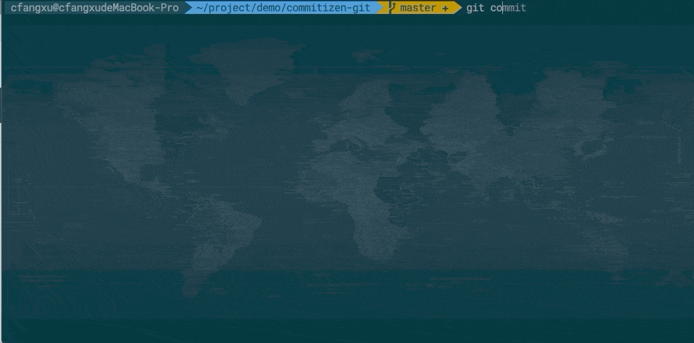

# 让你的 commit 更有价值

## 更新：cz-relax 一键初始化

之前配置 commitizen 需要好几步，例如首先 commitizen 需要进行初始化并且选择 commitizen adapter，然后需要安装 commitlint ，最后可能还需要 husky 配置 git hooks。

现在，只需要两步，就可以完成上面的工作，让一切变得轻松起来。

```sh
# 第一步在工作目录安装 cz-relax
npm install cz-relax --save-dev
# 第二步初始化，如果报错提示需要使用force，请在最后添加 --force
npx cz-relax init --language zh
```

## 提交规范

AngularJS 在[开发者文档](https://github.com/angular/angular.js/blob/master/DEVELOPERS.md#-git-commit-guidelines)中关于 git commit 的指导说明，提到严格的 git commit 格式规范可以在浏览项目历史的过程中看到更易读的信息，并且能用 git commit 的信息直接生成 AngularJS 的 change log 。

### commit messages 格式规范

commit messages 由 `header` 、`body` 、`footer` 组成。

`header` 又包含 `type` 、`scope` 、`subject` 。`header` 是必需的，不过其中的 `scope` 是可选的。

`body` 和 `footer` 可以省略。

```
<type>(<scope>): <subject>
// 空行
<BLANK LINE>
<body>
// 空行
<BLANK LINE>
<footer>
```

> 注：为了能在 github 以及各种 git 工具中看得更清晰，commit messages 的每一行都不要超过 100 个字符。

### Header

#### Type

类型必须是以下几种之一：

- **feat:** 新功能
- **fix:** bug 修复
- **docs:** 仅修改文档
- **style:** 修改格式（空格，格式化，省略分号等），对代码运行没有影响
- **refactor:** 重构（既不是修 bug ，也不是加功能）
- **build:** 构建流程、外部依赖变更，比如升级 npm 包、修改 webpack 配置等
- **perf:** 性能优化
- **test:** 测试相关
- **chore:** 对构建过程或辅助工具和库（如文档生成）的更改
- **ci:** ci 相关的更改

除此之外，还有一个特殊的类型 **revert** ，如果当前提交是为了撤销之前的某次提交，应该用 `revert` 开头，后面加上被撤销的提交的 `header`，在 `body` 中应该注明： `This reverts commit <hash>.` ，hash 指的就是将要被撤销的 commit SHA 。

```
// 例如

revert: feat(user): add user type

This reverts commit ca16a365467e17915f0273392f4a13331b17617d.
```

#### Scope

scope 可以指定提交更改的影响范围，这个视项目而定，当修改影响超过单个的 scope 时，可以指定为 `*` 。

#### Subject

`subject` 是指更改的简洁描述，长度约定在 50 个字符以内，通常遵循以下几个规范：

- 用动词开头，第一人称现在时表述，例如：`change` 代替 `changed` 或 `changes`
- 第一个字母小写
- 结尾不加句号（.）

### Body

`body` 部分是对本地 commit 的详细描述，可以分成多行。

跟 `subject` 类似，用动词开头，第一人称现在时表述，例如：`change` 代替 `changed` 或 `changes`。

`body` 应该说明修改的原因和更改前后的行为对比。

### Footer

`footer` 基本用在这两种情况：

- 不兼容的改动（ Breaking Changes ）,通常用 `BREAKING CHANGE:` 开头，后面跟一个空格或两个换行符。剩余的部分就是用来说明这个变动的信息和迁移方法等。
- 关闭 Issue, [github 关闭 Issue 的例子](https://docs.github.com/en/github/managing-your-work-on-github/linking-a-pull-request-to-an-issue)

```
// BREAKING CHANGE: 的例子
BREAKING CHANGE: isolate scope bindings definition has changed and
    the inject option for the directive controller injection was removed.

    To migrate the code follow the example below:

    Before:

    scope: {
      myAttr: 'attribute',
      myBind: 'bind',
      myExpression: 'expression',
      myEval: 'evaluate',
      myAccessor: 'accessor'
    }

    After:

    scope: {
      myAttr: '@',
      myBind: '@',
      myExpression: '&',
      // myEval - usually not useful, but in cases where the expression is assignable, you can use '='
      myAccessor: '=' // in directive's template change myAccessor() to myAccessor
    }

    The removed `inject` wasn't generaly useful for directives so there should be no code using it.


// Closes Issue 例子
Closes #2314, #3421
```

### 完整的例子

#### 例一: feat

```
feat($browser): onUrlChange event (popstate/hashchange/polling)

Added new event to $browser:
- forward popstate event if available
- forward hashchange event if popstate not available
- do polling when neither popstate nor hashchange available

Breaks $browser.onHashChange, which was removed (use onUrlChange instead)
```

#### 例二: fix

```
fix($compile): couple of unit tests for IE9

Older IEs serialize html uppercased, but IE9 does not...
Would be better to expect case insensitive, unfortunately jasmine does
not allow to user regexps for throw expectations.

Closes #392
Breaks foo.bar api, foo.baz should be used instead
```

#### 例三: style

```
style($location): add couple of missing semi colons
```

#### [查看更多例子](https://docs.google.com/document/d/1QrDFcIiPjSLDn3EL15IJygNPiHORgU1_OOAqWjiDU5Y/edit#heading=h.8sw072iehlhg)

### 规范 commit message 的好处

- 首行就是简洁实用的关键信息，方便在 git history 中快速浏览
- 具有详实的 body 和 footer ，可以清晰的看出某次提交的目的和影响
- 可以通过 type 过滤出想要查找的信息，也可以通过关键字快速查找相关提交
- 可以直接从 commit 生成 change log

```
// 列举几个常用的 log 参数

// 输出 log 的首行
git log --pretty=oneline

// 只输出首行的 commit 信息。不包含 hash 和 合并信息等
git log --pretty=format:%s

// 查找有关“更新菜单配置项”的提交
git log --grep="更新菜单配置项"

// 打印出 chenfangxu 的提交
git log --author=chenfangxu

// 红色的短 hash，黄色的 ref , 绿色的相对时间
git log --graph --pretty=format:'%Cred%h%Creset -%C(yellow)%d%Creset %s %Cgreen(%cr)%Creset'
```

## 用工具实现规范提交

上面介绍了规范提交的格式，如果让各位同学在 `git commit` 的时候严格按照上面的规范来写，首先心智是有负担的，得记住不同的类型到底是用来定义什么的，`subject` 怎么写，`body` 怎么写，`footer` 要不要写。其次，对人的规范大部分都是反人性的，所以很可能在过不了多久，就会有同学渐渐的不按照规范来写。靠意志力来控制自己严格按照规范来写是需要额外耗费一些精力的，把精力耗费在这种事情上面实在有些浪费。

用工具实现规范提交的方案，一种是在提交的时候就提示必填字段，另一种是在提交后校验字段是否符合规范。这两种在实际项目中都是很有必要的。

### Commitizen

> Zen-like commit messages for internet citizens. 嗯~~一种禅意

Commitizen 是一个帮助撰写规范 commit message 的工具。他有一个命令行工具 [cz-cli](https://github.com/commitizen/cz-cli)，接下来会把使用 Commitizen 分成几个阶段来介绍。

### 体验 git cz

```
// 全局安装 Commitizen
npm install -g commitizen
```

你的仓库可能还不是对 Commitizen 友好的，此时运行 `git cz` 的效果跟 `git commit` 一样，也就是没有效果。 不过，可以执行 `npx git-cz` 来体验。

如果想直接运行 `git cz` 实现语义化的提交，可以根据 [streamich/git-cz](https://github.com/streamich/git-cz) 文档中说的全局安装 `git cz`。

```
// 全局安装 git cz
npm install -g git-cz
```

除此之外还有一种更推荐的方式，就是让你的仓库对 Commitizen 友好。

### Commitizen 友好

全局安装 Commitizen 后，用 cz-conventional-changelog 适配器来初始化你的项目

```
// 初始化 cz-conventional-changelog 适配器
commitizen init cz-conventional-changelog --save-dev --save-exact
```

上面的初始化做了三件事：

- 安装 cz-conventional-changelog 依赖
- 把依赖保存到 package.json 的 `dependencies` 或 `devDependencies` 中
- 在根目录的 package.json 中 添加如下所示的 `config.commitizen`

```
"config": {
    "commitizen": {
      "path": "./node_modules/cz-conventional-changelog"
    }
  }
```

或者，在项目根目录下新建一个 .czrc 文件，内容设置为

```
{
  "path": "cz-conventional-changelog"
}
```

现在运行 `git cz` 效果如下：


### cz-customizable 自定义中文配置

通过上面的截图可以看到，提交的配置选项都是英文的，如果想改成中文的，可以使用 [cz-customizable](https://github.com/leoforfree/cz-customizable) 适配器。

运行下面的命令，**注意之前已经初始化过一次了，这次再初始化，需要加 `--force` 覆盖**

```
npm install cz-customizable --save-dev

commitizen init cz-customizable --save-dev --save-exact --force
```

现在 package.json 中 `config.commitizen` 字段为：

```
"config": {
    "commitizen": {
      "path": "./node_modules/cz-customizable"
    }
  }
```

cz-customizable 文档中说明了查找配置文件的方式有三种，我们按照第一种，在项目根目录创建一个 `.cz-config.js` 的文件。按照给出的示例 [cz-config-EXAMPLE.js](https://github.com/leoforfree/cz-customizable/blob/master/cz-config-EXAMPLE.js) 编写我们的 config。 commit-type 可以参考 [conventional-commit-types](https://github.com/commitizen/conventional-commit-types/blob/master/index.json) 。

可以点击查看我配置好的文件 [qiqihaobenben/commitizen-git/.cz-config.js](https://github.com/qiqihaobenben/commitizen-git/blob/master/.cz-config.js) ，里面中详细的注释。

### commitlint 校验提交

Commitizen 文档中开始就介绍到，Commitizen 可以在触发 `git commit` 钩子之前就能给出提示，但是也明确表示提交时对 commit messages 的校验也是很有用的。毕竟即使用了 Commitzen，也是能绕过去，所以提交最后的校验很重要。

[commitlint](https://github.com/conventional-changelog/commitlint) 可以检查 commit messages 是否符合常规提交格式，需要一份校验配置，推荐 [@commitlint/config-conventional](https://github.com/conventional-changelog/commitlint/tree/master/%40commitlint/config-conventional) 。

```
npm i --save-dev @commitlint/config-conventional @commitlint/cli
```

在项目根目录创建 commitlint.config.js 文件并设置校验规则：

```js
module.exports = {
  extends: ['@commitlint/config-conventional'],
  // rules 里面可以设置一些自定义的校验规则
  rules: {},
}
```

在项目中安装 husky ，并在项目根目录新建 husky.config.js 文件，加入以下设置：

```js
// 安装 husky
npm install --save-dev husky


// husky.config.js 中加入以下代码
module.exports = {
  "hooks": {
    "commit-msg": "commitlint -E HUSKY_GIT_PARAMS"
  }
}
```

> 注意：因为 [@commitlint/config-conventional](https://github.com/conventional-changelog/commitlint/tree/master/%40commitlint/config-conventional) 校验规则遵循 Angular 的规范， 所以我们在用 cz-customizable 自定义中文配置时， 是按照给出的符合 Angular 规范的示例 [cz-config-EXAMPLE.js](https://github.com/leoforfree/cz-customizable/blob/master/cz-config-EXAMPLE.js) 编写`.cz-config.js` 的。但是如果你自定义的 Commitizen 配置不符合 Angular 规范，可以使用 [commitlint-config-cz](https://github.com/whizark/commitlint-config-cz) 设置校验规则。（推荐还是按照 Angular 规范进行 cz-customizable 自定义配置）

```js
// 安装 commitlint-config-cz
npm install commitlint-config-cz --save-dev


// commitlint.config.js 改为
module.exports = {
  extends: [
    'cz'
  ]
};
```

### git commit 触发 git cz

在提交的时候，我们都习惯了 `git commit` ，虽然换成 `git cz` 不难，但是如果让开发者在 `git commit` 时无感知的触发 `git cz` 肯定是更好的，
而且也能避免不熟悉项目的人直接 `git commit` 提交一些不符合规范的信息。

我们可以在 husky.config.js 中设置：

```
"hooks": {
  "prepare-commit-msg": "exec < /dev/tty && git cz --hook || true",
}
```

> 注意： 在 window 系统，可能需要在 git base 中才能生效。

### 生成 CHANGELOG

[standard-version](https://github.com/conventional-changelog/standard-version)
是一个使用 [semver](https://semver.org/lang/zh-CN/) 和 [conventional-commits](https://github.com/conventional-commits) 支持生成 CHANGELOG 进行版本控制的实用程序。
standard-version 不只是能生成 CHANGELOG , 还能根据 commit 的 type 来进行版本控制。

```
// 安装 standard-verison
npm i --save-dev standard-version

// 在 package.json 中的 scripts 加入 standard-version
{
  "scripts": {
    "release": "standard-version"
  }
}
```

## 示例项目

可以查看 [commitizen-git](https://github.com/qiqihaobenben/commitizen-git) ，里面归纳了快速配置 Commitizen 友好仓库的步骤。
差不多三五分钟就能搞定。

可以看一下配置完后，执行 git commit 的效果。



## 扩展

### 更复杂的自定义提示

[cz-customizable](https://github.com/leoforfree/cz-customizable) 中自定义配置项通常情况是够用的，
commitlint 中校验的规则基本上也是够用的，但是会有比较硬核的开发者会觉得还是不够，还要更多。比如一些 prompt 更加自定义，
提交时询问的 question 添加更多的逻辑，比如可以把一些重要的字段校验提前到 Commitizen 中，或者添加更多自定义的校验。

如果真想这么干，那就去 fork 一份 [cz-conventional-changelog](https://github.com/commitizen/cz-conventional-changelog) 或者 [cz-customizable](https://github.com/leoforfree/cz-customizable) 来改，
或者直接自己写一个 adapter。

### Commitizen 友好徽章

如果把仓库配置成了对 Commitizen 友好的话，可以在 `README.md` 中加上这个小徽章：
[](http://commitizen.github.io/cz-cli/)

```
[](http://commitizen.github.io/cz-cli/)
```

## 参考文档

- [AngularJS Git Commit Message Conventions](https://docs.google.com/document/d/1QrDFcIiPjSLDn3EL15IJygNPiHORgU1_OOAqWjiDU5Y/edit)
- [conventional commit format](https://www.conventionalcommits.org/en/v1.0.0/)
- [Commit message 和 Change log 编写指南](http://www.ruanyifeng.com/blog/2016/01/commit_message_change_log.html)
- [Writing Git commit messages](https://365git.tumblr.com/post/3308646748/writing-git-commit-messages)
- [A Note About Git Commit Messages（文中讲了 subject 50 个字符的约定怎么来的）](https://tbaggery.com/2008/04/19/a-note-about-git-commit-messages.html)
- [个性化你的 Git Log 的输出格式](https://ruby-china.org/topics/939)
- [git pretty formats](https://git-scm.com/docs/pretty-formats)
