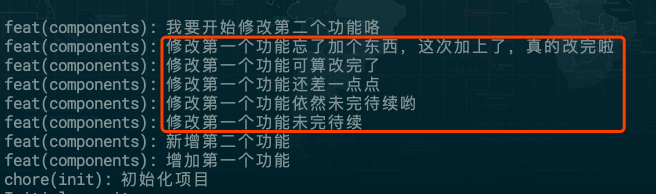
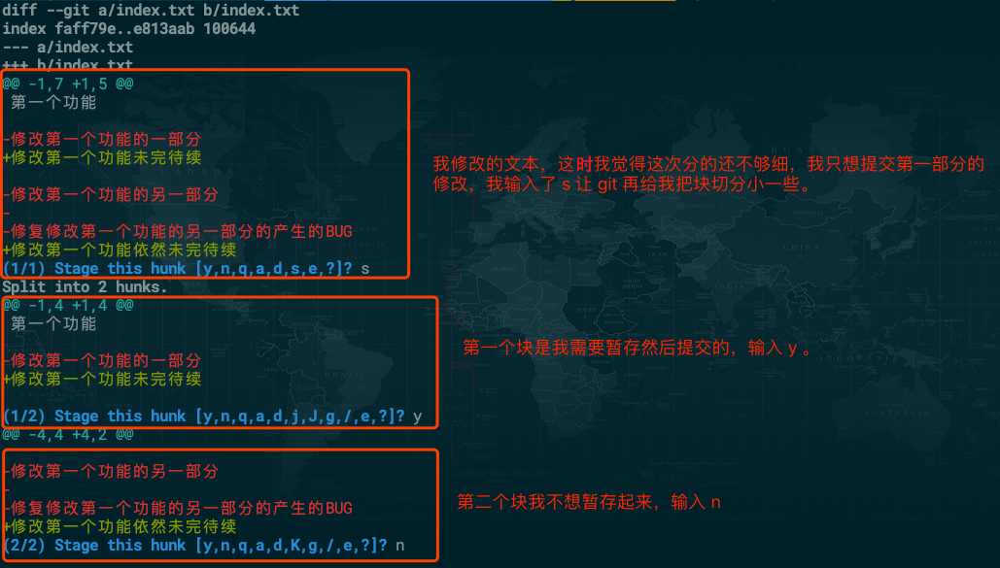
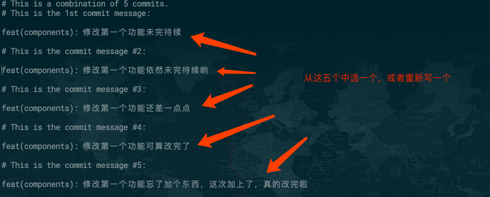

# 实用的 git 协作

一个人鼓捣自己的工具，或者在一个小团队中开发时，大家可能并没有特别在意项目中 commit 是什么鬼样子。但是如果身处一个比较大的团队，采用的是 github 类似的工作流，大家都是独特而有趣的个体，如果放飞自我的话，你会看到有些同学可能在用意念写 commit messages，并且富有诗意，有些同学一个功能就加两行代码，还要提交四五个 commit，并且大家乐此不疲的在各种分支上合来合去，Merge branch 的方向总是飘忽不定，而且还会出现大量无意义的合并信息。

下面列举几个实际工作中会出现的问题，先简单说一下解决方案，然后再详细展开聊一下。

#### 问题 1：commit messages 不规范

想要写出条理清晰且重点突出的 commit messages 是可以用工具辅助的，在之前一篇[《让你的 commit 更有价值》](https://chenfangxu.lap.360.cn/assistive-tools/git/commit.html)中介绍了 commit 的规范和实践。

#### 问题 2：一个小功能分多次提交

git 的最佳实践有一条是原子性提交（atomic commits），在意在一定程度上解决这个问题。但是如果你开发了一个较大的功能，里面分了几步实现，然后 pull request 的话，作者很可能会让你把 commit 合并成一个然后提交，因为中间怎么实现这个功能的细节可以省略，有助于开源项目 git 历史清晰简洁，这个时候 git rebase 就可以解决这个问题。

#### 3：commit messages 中包含了大量的错综复杂的合并

在只有你一个人开发的分支上，需要同步远程分支的最新更改，可以使用 git rebase ，这样就能避免因为同步分支导致的意义不大的合并，保持 git 提交历史记录的清爽。

## 原子性提交



简单模拟了几次提交，可以看到即使遵循提交规范，如果每次提交不按照原子性提交的话，通过 commit messages 看到的信息也会没有重点。

原子性本意指的是在一个大型系统中，形成一个不可分割的最简单单元或组件。原子性提交的意思就很明确了，提交的代码变动应该是尽可能的小而完整，包含一个不可分割的 feature 、 fix 等。

### 原子性提交的实践经验

#### 1、一个较小的功能尽量开发完再提交，如果是个很大的功能，那 ~ 再往下看。

#### 2、提交变动文件时只提交跟当前完成的功能相关的

我们在开发时，很可能存在某些代码跟当前要提交的这个功能不相关，所以在提交代码时， 可以用 `git add` 将功能相关的文件添加到暂存区，然后再执行提交。

#### 如果跟当前完成的功能不相干的变动在同一个文件的时候，可以使用 `git add --patch` 或者 `git add -p` 来实现文件局部的暂存提交。

```
# git add -p 执行后，会在最后一行问你要不要暂存当前块 Stage this hunk [y/n/a/d/K/j/J/e/?]?

y - 暂存当前块
n - 不暂存当前块
a - 暂存，并且之后的所有块都暂存
d - 不暂存，并且之后的所有块都不暂存
s - 将当前块分成更小的块
e - 可以让你手动编辑当前块
```



## git rebase


还是之前这张图，有同学说我开发的功能很大，而且要每天提交一下，因为怕发生各种奇怪的事情，导致电脑不能用了（丢了，进水，或者硬盘烧掉了），高频率的保持代码同步到远程仓库是个好习惯，风险意识很强。但是最后合并到主分支（或者主开发分支）时，就需要把属于一个功能的多次提交合并到一个。

### git rease 合并多次提交记录。

就拿上面那张截图中“修改第一个功能”相关的提交举例，我们把它们合并成一个提交。

git rebase -i 或者 git rebase --interactive ,这个命令把要 rebase 的提交记录列出来，用户在 git 编辑器中通过不同的指令来选择提交记录的合并，排序，删除等。

执行 `git rebase -i HEAD~6`，把要合并的 commit id 前面的 `pick` 改成 `s` 或者 `squash`，要注意一下截图中改成 `s` 的位置，是把上一个提交合进来。


```
# p, pick <commit> = 保留这个提交
# r, reword <commit> = 保留这个提交，不过要修改一下 commit messages
# e, edit <commit> = 保留这个提交，不过要暂停一下去执行修改
# s, squash <commit> = 保留这个提交，不过会把上一个提交合进来
# f, fixup <commit> = 类似 "squash", 不过要丢弃此提交的 commit messages
# b, break = rebase 到此为止
# d, drop <commit> = 移除提交
```

修改合并后要提交的 commit messages



合并后的提交历史如下：


#### 注意！！！

因为 `git rebase -i` 实际上是丢弃了之前的提交重新生成了新的提交，仔细看能发现 commit id 已经变了，所以使用 `git rebase -i` 修改提交记录的操作尽量在 commit 没有 push 到远程分支之前，如果想要修改已经同步到远程分支的提交记录，修改后，需要用 `git push -f` 来强制覆盖远程分支，谨慎操作，确保远程分支只有你一个人在使用。

https://zhuanlan.zhihu.com/p/29497618

https://segmentfault.com/a/1190000005937408

http://gitbook.liuhui998.com/4_2.html

https://blog.csdn.net/gtlbtnq9mr3/article/details/80222523

https://cloud.tencent.com/developer/news/231201

https://www.cnblogs.com/kidsitcn/p/5339382.html

https://git-scm.com/book/zh/v2/Git-%E5%88%86%E6%94%AF-%E5%8F%98%E5%9F%BA

https://juejin.im/post/6844903638070984718

### 变基

> 可以使用 `rebase` 命令将提交到某一分支上的所有修改都移至另一分支上，就好像“重新播放”一样，这种操作叫 `变基（rebase）` 。

#### 普通的 merge 操作

```
git merge experiment
```


最普通且容易的 `merge` 命令会把两个分支的最新快照（C3 和 C4）以及二者最近的共同祖先（C2）进行三方合并，合并的结果是生成一个新的快照（并提交）。最大的特点是**会在 git 提交历史中增加一个意义并不是很大的 C5 提交**

#### 变基操作

- 简单的变基

举个例子：检出 `experiment` 分支，然后将它变基到 `master` 分支上

```
git checkout experiment
git rebase master
git checkout master
git merge experiment
```


它的原理是首先找到这两个分支（即当前分支 experiment、变基操作的目标基底分支 master） 的最近共同祖先 `C2`，然后对比当前分支相对于该祖先的历次提交，提取相应的修改并存为临时文件存在 `.git/rebase` 目录下 ， 然后将当前分支指向目标基底 `C3`, 最后依次将之前另存为临时文件的修改应用到当前分支。上图的 `C4'` 跟上一个例子的 `C5` 内容时一样的。两种合并的方法最终结果没有任何区别，但是变基使得提交历史更加简洁。

- 复杂的变基

### 异常处理和其他命令

在 rebase 过程中，也许会出现冲突。在这种情况，git 会停止 rebase 让你去解决冲突。解决完冲突后，用 git add 重新暂存这些内容。

```
// 异常情况退出或者需要重新进入编辑时
git rebase --edit-todo

// 继续 rebase 后续的操作
git rebase --continue

// 撤销 rebase 操作
git rebase --abort

// 查看已经删除或者合并的 commit id ，你懂的
git reflog
```

#### 注意！！！

通过变基的原理可以知道，git rebase 是一个危险命令，它丢弃了之前的提交，生成了新的提交，所以它会改变历史。只要你的分支上需要 rebase 的所有 commit 没有被 push 到远程，是可以安全进行 `git rebase` 操作。如果想要 rebase 已经推到远程的 commit，请谨慎操作，确保只有你一个人在使用当前远程分支。

### 原子性提交和使用 git rebase 的好处

- 对 code review 更友好
  遵循原子性提交，一个较小功能的代码只出现在一次提交中，很容易 code review 。如果一个较大功能的代码，在开发中随时同步到远程仓库，让其他同学可以随时方便的 code review，合并进主分支时使用 git rebase 把多次提交合并成一次即可。

- 更容易回滚

原子性提交和 git rebase 都可以减少项目中无意义（或者意义不大的）commit，如果想要回滚，可以清晰快速的找到想回滚的 commit。

## git 工作流

http://www.qtcn.org/bbs/simple/?t53628.html

https://juejin.im/post/6844903895160881166

https://github.com/selfteaching/the-craft-of-selfteaching/issues/67

https://233px.com/15272402756177.html

https://segmentfault.com/a/1190000002918123

https://github.com/xirong/my-git/blob/master/git-workflow-tutorial.md

https://www.jianshu.com/p/efcc848798ee

https://juejin.im/post/6844904131115614221

## 补充操作

#### 因为各种原因，想要取消掉最后一次提交（此时没有 push 到远程仓库）,然后重新提交。

git commit --amend git reset

## 参考文档

- [Git 最佳实践：原子性提交（atomic commits）](https://hearrain.com/git-zui-jia-shi-jian-:-yuan-zi-xing-ti-jiao-atomic-commits)
- [彻底搞懂 Git-Rebase](http://jartto.wang/2018/12/11/git-rebase/)
- [git rebase 用法详解与工作原理](https://waynerv.com/posts/git-rebase-intro/)
