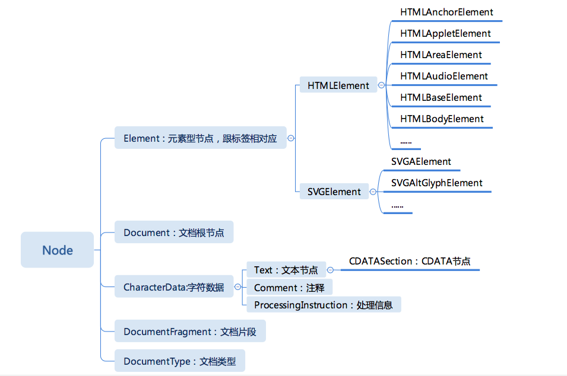
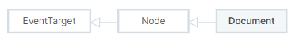
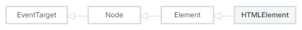

# DOM

DOM 是文档对象模型，顾名思义，文档对象模型是用来描述文档（这里特指 HTML 文档）的，同时它又是一个“对象模型”，这意味着它使用的是对象这样的概念来描述 HTML 文档。HTML 文档是一个由标签嵌套而成的树形结构，因此，DOM 也是使用树形的对象模型来描述一个 HTML 文档。

DOM API 大概包含 4 个部分：

- 节点：DOM 树形结构中的节点相关 API
- 事件：触发和监听事件相关 API
- Range：操作文字范围相关 API
- 遍历：遍历 DOM 需要的 API

## 节点

DOM 是一种宿主对象，即由运行环境（此处是浏览器）提供的对象，我们编写的 HTML 代码运行后，就会在内存中得到一棵 DOM 树，HTML 的写法会被转换成对应的文档模型，而我们则可以通过 JavaScript 等语言去访问这个文档模型。



其中经常用到的是 [Document](https://developer.mozilla.org/zh-CN/docs/Web/API/Document)、[Element](https://developer.mozilla.org/zh-CN/docs/Web/API/Element)、[Text](https://developer.mozilla.org/zh-CN/docs/Web/API/Text) 节点，[DocumentFragment](https://developer.mozilla.org/zh-CN/docs/Web/API/DocumentFragment) 也非常有用，常常被用来高性能地批量添加节点，其他的 [Comment](https://developer.mozilla.org/zh-CN/docs/Web/API/Comment)、 [ProcessingInstruction](https://developer.mozilla.org/en-US/docs/Web/API/ProcessingInstruction) 和 [DocumentType](https://developer.mozilla.org/zh-CN/docs/Web/API/DocumentType) 很少需要运行时去修改和操作。

我们简要分析一下上图，在标准中 Document 接口继承和扩展了 Node 接口 和 EventTarget 接口，在浏览器中 Document 接口的实现是`document`，表示任何在浏览器中载入的网页，并作为网页内容的入口（即 DOM 树的入口，或者说操作 DOM 的切入点），通过 document 可以获取 Element 元素节点，通过元素节点继承的 firstNode 等属性又可以获取 Text 文本节点或者其他节点，这些节点都是继承自 Node 的。

### Node

Node 是 DOM 树继承关系的根节点，它定义了 DOM 节点在 DOM 树上的操作，其他的节点通过继承也可以操作 DOM

#### Node 提供的属性

Node 提供了一组属性，来表示它在 DOM 树中的关系，这组属性可以从命名上看出它们提供了父、子、兄弟前、后的关系，有了这几个属性，可以很方便地根据相对位置获取元素。

- parentNode：返回指定的节点在 DOM 树中的父节点，还有一个 parentElement 只获取父元素
- childNodes：返回指定节点的子节点集合，类型是 [NodeList](https://developer.mozilla.org/zh-CN/docs/Web/API/NodeList) 类型，且为只读，该集合是实时集合（live collection）
- firstChild：返回指定节点的第一个子节点，只读属性，如果无子节点，返回 `null`。
- lastChild：返回指定节点的最后一个子节点，其他同上
- nextSibling：返回父节点的 [childNodes](https://developer.mozilla.org/zh-CN/docs/Web/API/Node/childNodes)列表中紧跟在指定节点后面的节点，只读属性，如果指定节点为最后一个节点，返回`null`
- previousSibling：返回指定节点的前一个兄弟节点，没有则返回`null`

> 注意：Gecko 内核的浏览器会在源代码中标签内部有空白符的地方插入一个文本节点(例如 /n)到文档中。因此，使用诸如 Node.firstChild 和 Node.previousSibling、Node.nextSibling 之类的方法可能会引用到一个空白符文本节点，而不是使用者所预期得到的节点。

其他的属性还有 [nodeName](https://developer.mozilla.org/zh-CN/docs/Web/API/Node/nodeName)、[nodeType](https://developer.mozilla.org/zh-CN/docs/Web/API/Node/nodeType)、[nodeValue](https://developer.mozilla.org/zh-CN/docs/Web/API/Node/nodeValue)、[textContent](https://developer.mozilla.org/zh-CN/docs/Web/API/Node/textContent)。

##### nodeName：返回当前的节点名，只读属性

列举几个常见的节点名：

- Element 节点名：等同于 `Element.tagName` 的值
- Document 节点名：`#document`
- Comment 节点名：`#comment`
- Text 节点名：`#text`

在 HTML 中，如果是元素节点，那么它 nodeName 和 tagName 会返回相同的值，并且是大写的（例如 DIV），如果是文本节点，nodeName 属性会返回`#text`，而 tagName 属性会返回 `undefined`。

##### nodeType：表示该节点的类型，只读属性

nodeType 属性可以用来区分不同类型的节点，比如 元素、文本、注释等。

列举几个常见的类型：

| nodeType 常量               | nodeType 值 | 描述                       |
| --------------------------- | ----------- | -------------------------- |
| Node.ELEMENT_NODE           | 1           | 元素节点类型，例如 `<div>` |
| Node.ATTRIBUTE_NODE         | 2           | 属性节点类型               |
| Node.TEXT_NODE              | 3           | 文本节点类型               |
| Node.COMMENT_NODE           | 8           | 注释节点类型               |
| Node.DOCUMENT_NODE          | 9           | Document 节点类型          |
| Node.DOCUMENT_TYPE_NODE     | 10          | DocumentType 节点类型      |
| Node.DOCUMENT_FRAGMENT_NODE | 11          | DocumentFragment 节点类型  |

##### nodeValue：返回或者设置当前节点的值

- Comment 节点的 nodeValue 是注释的文本内容
- Text 节点的 nodeValue 是文本节点的内容
- CDATASection 节点的 nodeValue 是 CDATA 的文本内容
- ProcessingInStruction 节点的 nodeValue 是整个标签的文本内容
- 其他的 Document、DocumentType、DocumentFragment、Element 节点的 nodeValue 都是 `null`。（如果 nodeValue 的值为 `null`，则对它赋值也不会有任何效果）

##### textContent：节点及其后代的文本内容，可以进行设置

textContent 的返回值取决于具体情况：

- 如果节点是一个 Document 或者 DocumentType，则 textContent 返回 null
- 如果节点是 [CDATASection](https://developer.mozilla.org/zh-CN/docs/Web/API/CDATASection)、Comment、ProcessingInStruction 或者 Text，textContent 返回节点内部的文本内容，类似于 Node.nodeValue
- 对于其他节点类型，textContent 将所有子节点的 textContent 合并后返回，如果该节点没有子节点的话，返回一个空字符串

**在节点上设置 textContent 属性的话，会删除它的所有子节点，并替换为一个具有给定值的文本节点。**

> 如果要获取整个文档的文本以及 CDATA data，可以使用 document.documentElement.textContent。

##### textContent 与 innerText 和 innerHTML 的区别？

- Node.textContent 和 [HTMLElement.innerText](https://developer.mozilla.org/zh-CN/docs/Web/API/HTMLElement/innerText) 很相似，但有重要的不同之处：textContent 会获取所有元素的内容，包括 `<script>`和`<style>`元素，而 innerText 只会获取展示给人看的元素的内容，并且还会受 CSS 样式的影响，不会反悔隐藏元素的文本，正是由于 innerText 受 CSS 样式影响，所以它会触发回流（reflow）去确保是最新的计算样式（回流在计算机上可能会非常昂贵，因此应尽可能避免）
- 与 innerHTML 的区别是：[Element.innerHTML](https://developer.mozilla.org/zh-CN/docs/Web/API/Element/innerHTML) 返回 HTML。通常，为了在元素中检索或写入文本，人们使用 innerHTML。但是，textContent 通常具有更好的性能，因为文本不会被解析为 HTML，所以 textContent 是可以防止 XSS 攻击的。

此外还有一个 [Element.outerHTML](https://developer.mozilla.org/zh-CN/docs/Web/API/Element/outerHTML)，它可以把一个字符串解析的节点替换当前元素，如果元素没有父元素，即如果它是文档的根元素，则设置其 outerHTML 属性时会抛出一个错误。此外，虽然当前元素在文档中被替换了，但是接收 outerHTML 属性的变量仍旧保持对当前元素的引用。

#### Node 提供了操作 DOM 树的 API

1、操作型 API

- **appendChild**

Node.appendChild() 方法将一个节点附加到指定父节点的子节点列表的末尾处。如果将被插入的节点已经存在于当前文档的文档树中，那么 appendChild() 只会将它从原先的位置移动到新的位置（不需要事先移除要移动的节点）。

这意味着，**一个节点不可能同时出现在文档的不同位置**。所以，如果某个节点已经拥有父节点，在被传递给此方法后，它首先会被移除，再被插入到新的位置。若要保留已在文档中的节点，可以先使用 Node.cloneNode() 方法来为它创建一个副本，再将副本附加到目标父节点下。请注意，用 cloneNode 制作的副本不会自动保持同步。

如果给定的子节点是 DocumentFragment，那么 DocumentFragment 的全部内容将转移到指定父节点的子节点列表中。

返回值是追加后的子节点，除非子节点是一个文档片段（DocumentFragment），这种情况将返回空文档片段。因为返回值的原因，所以链式调用可能无法按照你的预期去执行。

- **insertBefore**

Node.insertBefore() 方法在参考节点之前插入一个拥有指定父节点的子节点。如果将被插入的节点已经存在于当前文档中时，表现跟 appendChild 一样，如果给定的子节点是 DocumentFragment，表现跟 appendChild 一样。**需要注意的是：如果引用节点为 null，则将节点添加到子节点的末尾。**

语法是：`var insertedNode = parentNode.insertBefore(newNode, referenceNode);` 第二个参数 referenceNode 引用节点不是可选参数——你必须显式传入一个 Node 或者 null。如果不提供节点或者传入无效值，在不同的浏览器中会有不同的表现（可能会报错）

返回值跟 appendChild 一样。

- **removeChild**

Node.removeChild() 方法从 DOM 中删除一个子节点。返回删除的节点。

语法：`let oldChild = node.removeChild(child);`

被移除的这个子节点仍然存在于内存中，只是没有添加到当前文档的 DOM 树中，因此，你还可以把这个节点重新添加回文档中，当然，需要用变量接收（保存引用），例如上面的 oldChild，如果没有变量保存对这个节点的引用，则认为被移除的节点已经是无用的，在短时间内将会被内存管理回收。

如果上例中的 child 节点不是 node 节点的子节点，则该方法会抛出异常。

- **replaceChild**

Node.replaceChild() 方法用指定的节点替换当前节点的一个子节点，**并返回被替换掉的节点**。

语法：`parentNode.replaceChild(newChild, oldChild);`

> 这几个修改型的 API，全都是在父元素上操作的，比如想要实现“删除一个元素的上一个元素”，必须要先用 parentNode 获取其父元素。这样的操作符合面向对象的基本原则。“拥有哪些子元素”是父元素的一种状态，所以修改状态，应该是父元素的行为。

> 为什么 insert 只有 before 没有 after？实际上，appendChild 和 insertBefore 这个设计是一个“最小原则”的设计，这两个 API 是满足插入任意位置的必要 API，而 insertAfter，则可以由这两个 API 实现出来。

2、Node 的高级 API

- cloneNode

复制一个节点，如果传入参数 true，则会连同子元素做深拷贝

语法： `var dupNode = node.cloneNode(deep);`

克隆一个元素节点会拷贝它所有的属性以及属性值，当然也就包括了属性上绑定的事件 (比如 onclick="alert(1)"),但不会拷贝那些使用 addEventListener()方法或者 node.onclick = fn 这种用 JavaScript 动态绑定的事件。

如果复制的元素有 id，则其副本同样会包含该 id，由于 id 具有唯一性，所以在复制节点后必须要修改其 id

- contains

检查一个节点是否包含另一个节点，语法：`node.contains(otherNode)`，

- compareDocumentPosition

用于比较两个节点位置关系，语法：`let compareMask = node.compareDocumentPosition( otherNode )`，返回值是一个表示 Node 和 otherNode 在 Document 中关系的整数值：

| 常量名                         | 十进制值 | 含义                   |
| ------------------------------ | -------- | ---------------------- |
| DOCUMENT_POSITION_DISCONNECTED | 1        | 不在同一文档中         |
| DOCUMENT_POSITION_PRECEDING    | 2        | otherNode 在 node 之前 |
| DOCUMENT_POSITION_FOLLOWING    | 4        | otherNode 在 node 之后 |
| DOCUMENT_POSITION_CONTAINS     | 8        | otherNode 包含 node    |
| DOCUMENT_POSITION_CONTAINED_BY | 16       | otherNode 被 node 包含 |

**在一些场景下，可能设置了不止一位比特值。比如 otherNode 在文档中是靠前的且包含了 Node, 那么 DOCUMENT_POSITION_CONTAINS 和 DOCUMENT_POSITION_PRECEDING 位都会设置，所以结果会是 0x0A 即十进制下的 10。**

- isEqualNode

判断两个节点是否相等。当两个节点的类型相同，定义特征 (defining characteristics) 相同（对元素来说，即 id，孩子节点的数量等等），属性一致等，这两个节点就是相等的。一些具体的数据指出：多数时候的比较是根据节点的类型来的。

语法：`var isEqualNode = node.isEqualNode(otherNode);`

如果需要判断两个节点是否是同一个节点，直接使用 `node1 === node2`

### Document

在前面提到过，在标准中 Document 接口继承和扩展了 Node 接口 和 EventTarget 接口，在浏览器中 Document 接口的实现是`document`，表示任何在浏览器中载入的网页，并作为网页内容的入口（即 DOM 树的入口，或者说操作 DOM 的切入点）。在 EventTarget、Node 和 Document 接口中定义的属性和方法，document 都可以调用。

接口继承关系：



因为 document 是操作 DOM 的切入点，所以 DOM 标准中规定了节点必须从文档的 create 方法中创建出来，不能使用原声的 JavaScript。

- createElement
- createTextNode
- createCDATASection
- createComment
- createProcessingInstruction
- createDocumentFragment
- createDocumentType
- createAttribute

### Element

Node 接口提供了属性结构上节点相关的操作，大部分时候我们关注的是元素，Element 表示元素，它是 Node 的子类。这个接口描述了所有相同种类的元素所普遍具有的方法和属性。一些接口继承自 Element 并且增加了一些额外功能的接口描述了具体的行为。例如， HTMLElement 接口是所有 HTML 元素的基本接口，而 SVGElement 接口是所有 SVG 元素的基础。

接口继承关系：



元素对应 HTML 中的标签，它既有子节点，又有属性。可以通过 document 或其他元素直接获取已有的 Element 对象，也可以使用 document 来创建新的 Element 对象。

#### 通过 document 获取或创建元素

- document.documentElement：获取 html 根元素
- document.body：获取 body 元素
- document.getElementById：根据 id 获取一个元素
- document.getElementsByClassName：根据 class 获取元素集合 HTMLCollection（实时更新）
- document.getElementsByTagName：根据标签名获取元素集合（同上）
- document.getElementsByName：根据 name 属性获取元素集合 **NodeList**(实时更新)
- document.querySelector： 根据选择器获取一个元素
- document.querySelectorAll: 根据选择器获取元素列表 **NodeList**（非实时更新）
- document.createElement：创建一个 HTML 元素

> HTMLCollection 接口表示一个包含了元素（元素顺序为文档流中的顺序）的通用集合（与 arguments 相似的类数组 (array-like) 对象），还提供了用来从该集合中选择元素的方法和属性。一般 HTMLCollection 是动态的，NodeList 是静态的，但是可能因为历史原因，NodeList 有几种情况下也是动态的（childNodes、getElementsByName）

getElementById、getElementsByClassName、getElementsByTagName、getElementsByName 这几个 API 的性能高于 querySelectorAll，尽管 querySelector 系列的 API 非常强大和方便，如果考虑性能的话，还是尽量使用 getElement 系列的 API。

**除了 getElementById 只能由 document 调用外，其他的获取元素的 getElement 和 querySelector 系列的方法都能直接在 Element 上调用。**

getElementsByClassName、getElementsByTagName、getElementsByName 获取的集合 HTMLCollection 并非数组，而是一个能够动态更新的集合。这说明浏览器内部是有高效的索引机制来动态更新这样的集合。

以上获取的元素可以通过 children 获取子元素的集合 HTMLCollection（实时更新），与通过节点的 childNodes 相似，不过只包含元素。

Element 接口扩展的属性还有 firstElementChild、lastElementChild、nextElementSibling、previousElementSibling，跟 Node 接口的 firstChild、lastChild 相似，不过只包含元素，没有子元素的话返回 null。

#### Element 操作属性

属性也是一个节点对象（Attr），通常我们不会直接获取节点对象，而是通过元素来完成对属性的操作。

注意：对于 DOM 而言，Attribute 和 Property 是完全不同的含义，只有特性场景下（例如 id），两者才会互相关联，具体可以查看 [DOM property 和 attribute 的区别详解](https://juejin.cn/post/6844904114065768462)

##### 把元素的 Attribute 当做字符串对待

- getAttribute

返回元素上一个指定的属性值。如果指定的属性不存在，则返回 null 或 "" （空字符串）

- setAttribute

设置指定元素上的某个属性值。如果属性已经存在，则更新该值；否则，使用指定的名称和值添加一个新的属性。

- removeAttribute

从指定的元素中删除一个属性

要彻底移除一个属性的效果，应当使用 removeAttribute()，而不是使用 setAttribute() 将属性值设置为 null。对于许多属性，如果仅将其值设为 null，这不会造达成和预期一样的效果。

- hasAttribute

返回一个布尔值，指示该元素是否包含有指定的属性（attribute）

##### 把 Attribute 当做节点（性能更高）

- getAttributNode

返回指定元素的指定属性节点

- setAttributeNode

为指定的 Element 添加属性节点。

> attribute 在设置和获取的时候，都会转换成小写。

## 遍历

遍历 DOM 树，可以使用 JavaScript，实际上，DOM API 中还提供了 NodeIterator 和 TreeWalker 来遍历树。比起直接用属性来遍历，NodeIterator 和 TreeWalker 提供了过滤功能，还可以把属性节点也包含在遍历之内。

- [NodeIterator](https://developer.mozilla.org/zh-CN/docs/Web/API/Document/createNodeIterator)

```
// 示例
const nodeIterator = document.createNodeIterator(
    document.body,
    NodeFilter.SHOW_ELEMENT,
    {
      acceptNode(node) {
        return node.nodeName.toLowerCase() === 'p' ? NodeFilter.FILTER_ACCEPT : NodeFilter.FILTER_REJECT;
      }
    }
);
const pars = [];
let currentNode;

while (currentNode = nodeIterator.nextNode()) {
  pars.push(currentNode);
}
```

- [TreeWalker](https://developer.mozilla.org/zh-CN/docs/Web/API/TreeWalker)

```
//示例
var treeWalker = document.createTreeWalker(
  document.body,
  NodeFilter.SHOW_ELEMENT,
  { acceptNode: function(node) { return NodeFilter.FILTER_ACCEPT; } },
  false
);

var nodeList = [];
var currentNode = treeWalker.currentNode;

while(currentNode) {
  nodeList.push(currentNode);
  currentNode = treeWalker.nextNode();
}
```

比起 NodeIterator，TreeWalker 多了在 DOM 树上自由移动当前节点的能力，一般来说，这种 API 用于“跳过”某些节点，或者重复遍历某些节点。

## Range

Range 接口表示一个包含节点与文本节点的一部分的文档片段。Range API 是一个比较专业的领域，富文本编辑类的业务用的比较多。

Range API 表示一个 HTML 上的范围，这个范围以文字为最小单位，所以 Range 不一定包含完整的节点，它可能是 Text 节点中的一段，也可以是头尾两个 Text 的一部分加上中间的元素。

Range API 可以比节点 API 更精确地操作 DOM 树，凡是节点 API 能做到的，RangeAPI 都可以做到，而且可以做到更高性能，但是 Range API 使用起来比较麻烦，所以在实际项目中，并不常用，只有做底层框架和富文本编辑对它有强需求。

可以用 Document 对象的 Document.createRange 方法创建 Range，也可以用 Selection 对象的 getRangeAt 方法获取 Range。另外，还可以通过 Document 对象的构造函数 Range() 来得到 Range。

## 命名空间

在 HTML 场景中，需要考虑命名空间的场景不多。最主要的场景是 SVG。创建元素和属性相关的 API 都有带命名空间的版本：

- Document
  - createElementNS
  - createAttributeNS
- Element
  - getAttributeNS
  - setAttributeNS
  - getAttributeNodeNS
  - setAttributeNodeNS
  - removeAttributeNS
  - hasAttributeNS

若要创建 Document 或者 Doctype，也必须要考虑命名空间问题。DOM 要求从 document.implementation 创建。

- document.implementation.createDocument
- document.implementation.createDocumentType

除此之外，还提供了一个[快捷方式](https://developer.mozilla.org/zh-CN/docs/Web/API/DOMImplementation/createHTMLDocument) document.implementation.createHTMLDocument

## 其他

## 推荐阅读

- [JS 操作 DOM 常用 API 详解](https://segmentfault.com/a/1190000009588427)
