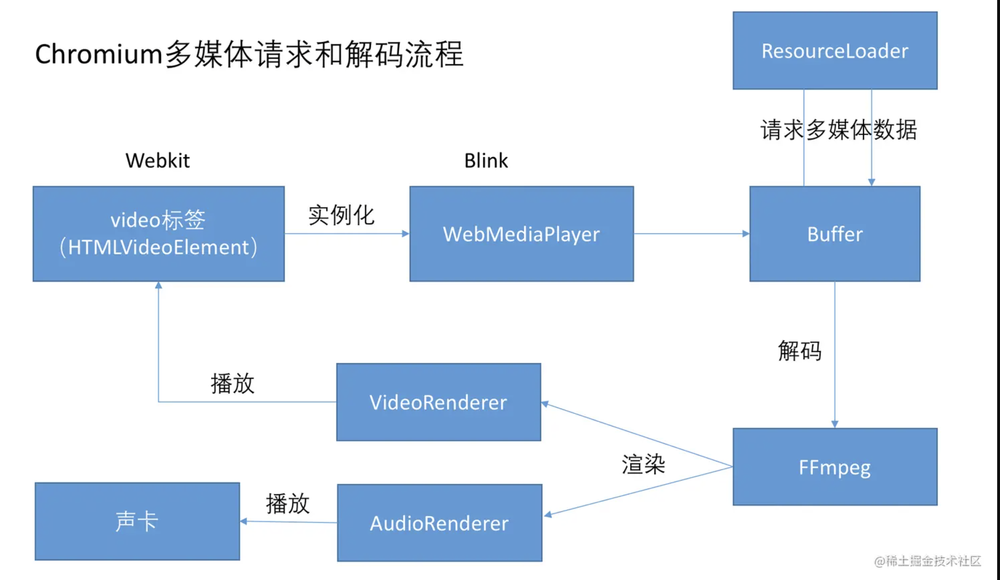

# video 标签详解

## 概念

HTML `<video>` 元素， 在文档中嵌入媒体播放器，用于支持文档内的视频播放。也可以将 `<video>` 标签用于音频内容，但是 `<audio>` 元素可能在用户体验上更合适。

```HTML
<video controls width="250">
    <source src="/media/cc0-videos/flower.webm"
            type="video/webm">
    <source src="/media/cc0-videos/flower.mp4"
            type="video/mp4">
    Sorry, your browser doesn't support embedded videos.
</video>
```

上面的例子展示了 `<video>` 元素的用法。和 `` 元素的使用类似，在 src 属性里加入一个我们需要展示的视频地址，同时也可以用其他属性来定义视频的宽度高度、是否自动或者循环播放、是否展示浏览器默认的视频控件等信息。

在 `<video></video>` 标签中间的内容，是针对浏览器不支持此元素时候的降级处理。

浏览器并不是都支持相同的视频格式，可以在 `<source>` 元素里提供多个视频源，然后浏览器将会使用它所支持的第一个源。

video 元素是**可替换元素**。可替换元素就是浏览器根据元素的标签和属性，来决定元素的具体显示内容。

这些元素往往没有实际的内容，即是一个空元素

### 属性

- autoplay 一个布尔属性；声明该属性后，视频会尽快自动开始播放，不会停下来等待数据全部加载完成。无法使用 autoplay="false" 来关闭视频的自动播放功能；只要 `<video>` 标签中有这个属性，视频就会自动播放。要移除自动播放，需要完全删除该属性。
- controls 如果存在该属性，浏览器会在视频底部提供一个控制面板，允许用户控制视频的播放，包括音量、拖动进度、暂停或恢复播放。
- controlslist 当浏览器显示视频底部的播放控制面板（例如，指定了 controls 属性）时，controlslist 属性会帮助浏览器选择在控制面板上显示哪些 video 元素控件。
  - 允许的值有 nodownload、nofullscreen 和 noremoteplayback。
  - 如果要禁用画中画模式（和控件），请使用 disablepictureinpicture 属性。
- disablepictureinpicture 防止浏览器显示画中画上下文菜单或在某些情况下自动请求画中画模式。
- loop 一个布尔属性；指定后会在视频播放结束的时候，自动返回视频开始的地方，继续播放。
- muted 一个布尔属性，指明在视频中音频的默认设置。设置后，音频会初始化为静音。默认值是 false, 意味着视频播放的时候音频也会播放。
- poster 海报帧图片 URL，用于在视频处于下载中的状态时显示。如果未指定该属性，则在视频第一帧可用之前不会显示任何内容，然后将视频的第一帧会作为海报（poster）帧来显示。
- src 要嵌到页面的视频的 URL。可选；你也可以使用 video 块内的 `<source>` 元素来指定需要嵌到页面的视频。
- width 视频显示区域的宽度，单位是 CSS 像素（仅限绝对值；不支持百分比）。
- height 视频显示区域的高度，单位是 CSS 像素（仅限绝对值；不支持百分比）。

### 事件

- canplay 浏览器可以播放媒体，但估计尚未缓冲足够的数据，无法流畅播放至视频结束，期间可能出现停顿以便缓冲更多内容。
- canplaythrough 浏览器估计它可以不间断地播放到媒体末尾，无需暂停以进行内容缓冲。
- complete 已终止 OfflineAudioContext 的渲染。
- durationchange duration 属性已更新。
- emptied 媒体内容已清空；例如，如果媒体已加载（或部分加载）完成，并调用 load() 方法重新加载。
- ended 视频停止播放，因为媒体已经到达结束点。
- error 获取媒体数据时出现错误，或者资源的格式不受支持。
- loadeddata 媒体的首帧已加载完成。
- loadedmetadata 元数据已加载完毕。
- loadstart 浏览器开始加载资源时触发。
- pause 播放已暂停。
- play 播放已开始。
- playing 已经在暂停或因数据不足而延迟后准备好进行播放。
- progress 在浏览器加载资源期间周期性触发。
- ratechange 播放速率发生变化。
- seeked 拖动进度（seek）操作完成。
- seeking 拖动进度操作开始。
- suspend 媒体数据加载已暂停。
- timeupdate 由 currentTime 属性指示的播放时间已更新。
- volumechange 音量发生变化。
- waiting 由于暂时缺少数据而停止播放。

### 使用注意事项

- 如果不指定 controls 属性，视频将不会包含浏览器的默认控件；可以使用 JavaScript 和 HTMLMediaElement API 来创建你自己的控件。
- 为了实现对视频（和音频）内容的精确控制，HTMLMediaElement 会触发多种不同的事件，除了提供可控性之外，这些事件还允许你监控媒体的下载进度和播放进度，以及播放状态和位置。
- 你可以使用 object-position 属性调整视频内容在元素框内的位置，和使用 object-fit 属性控制视频内容如何调整大小以适应外层元素框。
- 如果想在视频里展示字幕或者标题，你可以在 `<track>` 元素和 WebVTT 格式的基础上使用 JavaScript 来实现。
- 你可以使用 `<video>` 元素播放音频文件。如果你需要结合 WebVTT 字幕进行音频播放，这会非常有用，因为 `<audio>` 元素不支持使用 WebVTT 提供字幕。
- 要在支持该元素的浏览器上测试回退内容，你可以将 `<video>` 替换为不存在的元素，如 `<notavideo>`。

## 浏览器播放视频的理论

### 不同浏览器支持的视频格式不同

或者换一种说法：因为不同浏览器内置的视频播放器不同，所以支持的视频格式不同。

简单来说就是不同浏览器里的视频播放器有不同的实现，可以抽象成，在 Chrome 中预置的播放器是 CPlayer，Safari 中则是 SPlayer。不同播放器支持的视频格式当然也就不尽相同（这只是个比喻，实际看到下面硬解和软解就能清楚了）。不仅如此，在 UI、可控性和一些其他地方表现都各有差异。

**所以要谈 video 标签支持的视频格式，必须先指定浏览器**

### 浏览器只支持特定的视频格式


### 概念

视频的本质很简单，快速播放的图片而已。

几个简单的概念：

- 帧：每帧代表一幅静止的图像
- 帧率（fps）：每秒显示的图片数。帧率越大，画面越流畅；帧率越小，画面越卡
  - 12 fps：由于人类眼睛的特殊生理结构，如果所看画面之帧率高于每秒约 10-12 帧的时候，就会认为是连贯的
  - 24 fps：有声电影的拍摄及播放帧率均为每秒 24 帧，对一般人而言已算可接受
  - 30 fps：早期的高动态电子游戏，帧率少于每秒 30 帧的话就会显得不连贯，这是因为没有动态模糊使流畅度降低
  - 60 fps：在实际体验中，60 帧相对于 30 帧有着更好的体验
  - 85 fps：一般而言，大脑处理视频的极限

#### 视频源文件计算方法

计算一下按照最简单定义的视频大小：

- 用 RGB 来描述颜色，0~255 等于 256 种可能，刚好等于 1 个字节。所以一个像素 `255x255x255` 的大小为 3B
- 分辨率 `980x720` 的普通清晰度图片需要 `980x720x3B ≈ 2M`
- 正常视频帧率为 30，表示 1s 的时间里播放 30 张图片。也就是说一个 1 分钟的视频大小为 `2Mx30x60 ≈ 3.5G`

帧率 30，时长 1 分钟的 `980x720` 分辨率纯视频大小约为 3.5G，原始的 YUV、RGB 格式的视频源文件就是这么大。

##### MDN 给出的描述

由于未压缩的视频数据的使用巨大的空间，有必要对其进行压缩以便进行存储，更不用说通过网络传输了。想象一下存储未压缩视频所需的数据量：

- 单帧全彩色高清（1920x1080）视频（每像素 4 字节）为 8,294,400 字节。
- 在典型的每秒 30 帧的情况下，每秒高清视频将占用 248,832,000 字节（~249 MB）。
- 一分钟的高清视频需要 14.93 GB 的存储空间。
- 一个相当典型的 30 分钟视频会议需要大约 447.9 GB 的存储空间，而一部 2 小时的电影需要几乎 1.79 TB（即 1790 GB）的空间。

#### 编码

视频源文件不仅所需的存储空间巨大，而且传输这样的未压缩视频所需的网络带宽也将是巨大的，达到 249 MB/秒——不包括音频和开销。视频编码器在此时就派上用场了，视频编码器压缩视频数据并将其编码为以后可以解码和播放或编辑的格式。

编码可以可以理解为压缩，视频一般通过两种方式编码

##### 帧内编码

帧内编码就是压缩图片，比如把所有图片都压缩成 jpeg（原理是利用人眼对亮度的敏感程度要高于对色彩的敏感程度）。通常这一步之后就已经能减小视频 90% 的大小。

##### 帧间编码

帧间编码是利用帧与帧之间的相关性。例如第二帧与第一帧对比，只有某一块区域有变化，那么第二帧只需要存储相应的变化（类似 git，只保存 diff）。

经过压缩后的帧分为：I 帧、P 帧和 B 帧

- I 帧：关键帧，采用帧内压缩技术
- P 帧：向前参考帧，在压缩时，只参考前面已经处理的帧。采用帧间压缩技术
- B 帧：双向参考帧，在压缩时，它即参考前而的帧，又参考它后面的帧。采用帧间压缩技术

除了 I/P/B 帧外，还有图像序列 GOP。 GOP：两个 I 帧之间是一个图像序列，在一个图像序列中只有一个 I 帧，但是可以有多个 P 帧和 B 帧。

#### 编码格式

编码思路大致都能归为这两种，具体怎么实现，那就大家各显神通了。

不同公司、机构，不同年代都会有不同的方案。效率、成本也完全不同。

常见的编解码标准（大致按照编码效率从低到高，越下面的越好）

| 编码器简称                  | 编码器全称                                   | 支持的封装容器          | 推出机构   | 说明                                                                                                                          |
| --------------------------- | -------------------------------------------- | ----------------------- | ---------- | ----------------------------------------------------------------------------------------------------------------------------- |
| AVC (H.264)、MPEG-4 part 10 | Advanced Video Coding（高级视频编码器）      | 3GP, MP4, WebM, TS, FLV | MPEG/ITU-T | H.264 能够在低码率情况下提供高质量的视频图像。是目前最常见、主流的标准。                                                      |
| VP8                         | Video Processor 8                            | 3GP、Ogg、WebM          | Google     | 类似于 H.264。                                                                                                                |
| HEVC (H.265)                | High Efficiency Video Coding（高效视频编码） | MP4                     | MPEG/ITU-T | H.265 旨在在有限带宽下传输更高质量的网络视频，与 H.264 相比，同样的视觉质量的视频只占用一半的空间。                           |
| VP9                         | Video Processor 9                            | MP4、Ogg、WebM          | Google     | 类似于 H.265。                                                                                                                |
| AV1                         | AOMedia Video 1                              | MP4、WebM               | AOM        | AV1 具体的目标是，与 VP9 和 HEVC 相比，码率需要大幅度降低，目标是减少 30% 左右。解码是比较低的复杂度，目标大概是 VP9 的两倍。 |

##### AV1

AV1 作为目前压缩效率最高的主流视频编码格式，在 2025 年的今天已经在 YouTube、Netflix、Bilibili 等视频网站全面铺开，毫无疑问是最值得优先考虑的选择；除了优异的压缩效率以外，AV1 免版税的优势使得各硬件厂商和浏览器内核开发者可以无所顾忌的将 AV1 编码的支持添加到自己的产品中。

可惜的是，Safari 并没有对 AV1 编码添加软解支持，只有在搭载 Apple M3 及后续生产的 Mac 和 iPhone 15 Pro 后续的机型才拥有硬解 AV1 的能力，在此之前生产的产品均无法使用 Safari 播放 AV1 编码的视频。

##### H.265 / HEVC

作为 H.264 / AVC 的下一代继任者，H.265（又称 HEVC）的表现可谓是一手好牌打得稀巴烂。HEVC 由多个专利池（如 MPEG LA、HEVC Advance 和 Velos Media）管理，授权费用高且分散，昂贵的专利授权费用严重限制了它的普及速度和范围，尤其是在开放生态和网页端应用中。

Chromium / Firefox 不愿意当承担专利授权费的冤大头，拒绝在当今世界最大的两个开源浏览器内核中添加默认的 H.265 软解支持，目前主流浏览器普遍采用能硬解就硬解，硬解不了就摆烂的支持策略。Firefox on Linux 倒是另辟蹊径，不仅会尝试使用硬解，还会尝试使用用户在电脑上装的 ffmpeg 软解曲线救国。不过好在毕竟是 2013 年就确定的标准，现在大部分硬件厂商都集体被摁着脖子交了专利授权费以保证产品竞争力，Apple 更是 HEVC 的一等公民，保证了全系产品的 HEVC 解码能力。

目前未覆盖到的场景主要是 Chromium / Firefox on Windows 7 和 Chromium on Linux（包括 UOS、麒麟等一众国产 Linux 发行版）。

##### VP9

VP9 是 Google 于 2013 年推出的视频编码格式，作为 H.264 的继任者之一，在压缩效率上接近 H.265（HEVC），但最大的杀手锏是——彻底免专利费。这也让 VP9 成为 Google 对 HEVC 高额授权费用的掀桌式回应：你们慢慢吃，我开一桌免费的。

借着免专利的东风和 Google 自家产品矩阵的强推，VP9 在 YouTube、WebRTC 乃至 Chrome 浏览器中迅速站稳了脚跟。特别是在 AV1 普及之前，VP9 几乎是网页视频播放领域的事实标准，甚至逼得苹果这个“编解码俱乐部元老”在 macOS 11 Big Sur 和 iOS 14 上的 Safari 破天荒地加入了 VP9 支持（尽管 VP9 in webm 的支持稍晚一些，具体见上表）。

VP9 的软解码支持基本无死角：Chromium、Firefox、Edge 都原生支持，Safari 也一反常态地“从了”。硬件解码方面，从 Intel Skylake（第六代酷睿）开始，NVIDIA GTX 950 及以上、AMD Vega 和 RDNA 系显卡基本都具备完整的 VP9 解码能力——总之，只要不是博物馆级别的老电脑，就能愉快播放 VP9 视频。

当然，编码仍是 VP9 的短板。Google 官方提供的开源实现 libvpx，速度比不上 x264/x265 等老牌选手，在缺乏硬件加速的场景下，仍然属于“关机前压一宿”的那种体验。不过相比 AV1 的 libaom-av1，VP9 至少还能算“可用”，适合轻量化应用、实时通信或是对压制速度敏感的用户，而早在 7 代 Intel 的 Kaby Lake 系列产品就已经引入了 VP9 的硬件编码支持，各家硬件厂商对 VP9 硬件编码的支持发展到今天还算不错。

##### H.264/AVC

作为“老将出马一个顶俩”的代表，H.264 / AVC 无疑是过去二十年视频编码领域的霸主。自 2003 年标准确定以来，凭借良好的压缩效率、广泛的硬件支持和相对合理的专利授权策略，H.264 迅速成为从网络视频、蓝光光盘到直播、监控乃至手机录像的默认选择。如果你打开一个视频网站的视频流、下载一个在线视频、剪辑一个 vlog，大概率都绕不开 H.264 的身影。

H.264 的最大优势在于——兼容性无敌。不夸张地说，只要是带屏幕的设备，就能播放 H.264 视频。软解？早在十几年前的浏览器和媒体播放器中就已普及；硬解？从 Intel Sandy Bridge、NVIDIA Fermi、AMD VLIW4 这些“史前”架构开始就已加入对 H.264 的完整支持——你甚至可以在树莓派、智能冰箱上流畅播放 H.264 视频。

虽然 H.264 同样存在和 H.265 相同的专利问题，但其授权策略明显更温和——MPEG LA 提供的专利池授权门槛较低，且不向免费网络视频收取费用，使得包括 Chromium、Firefox 在内的浏览器都默认集成了 H.264 的软解功能。Apple 和 Microsoft 更是早早将其作为视频编码和解码的第一公民，Safari 和 Edge 天生支持 H.264，不存在任何兼容性烦恼。

当然，作为一项 20 多年前的技术，H.264 在压缩效率上已经明显落后于 VP9、HEVC 和 AV1。相同画质下，H.264 的码率要比 AV1 高出 30 ～ 50%，在追求极致带宽利用或存储节省的应用场景中就显得有些力不从心。然而在今天这个“能播比好看更重要”的现实环境中，H.264 依然是默认方案，是“稳健老哥”的代名词。

所以，即便 AV1、HEVC、VP9 各有亮点，H.264 依旧凭借“老、稳、全”三大核心竞争力，在 2025 年依然牢牢占据着视频生态链的中枢地位——只要这个世界还有浏览器不支持 AV1（可恶的 Safari 不支持软解），服务器不想烧钱转码视频，或用户设备太老，H.264 就不会退场。

##### 总结

所以，表中这些都只是规范而已（就和我们前端的 es6、es10 一样）。就算再先进，没人去推广、使用也白搭。
​
一个编解码器能否被推广和使用，不仅取决于效率，还和背后的组织、专利等一系列因素相关。目前最流行、广泛使用的是 H.264 编码规范。

换种说法，目前最流行的视频格式就是 H.264。

#### 封装格式

平常我们看到的 xxx.MP4、xxx.AVI 文件，准确来说叫做视频封装格式。是一个容器，容器中包含了视频编码（如 H.264）、音频编码（如 AAC），此外还可以包含同步信息、字幕和元数据（如标题）等，封装格式可以参考上面的表格的各个编解码器支持的封装容器。

再回看开始那个支持情况表格，用 Chrome 列举。H.264、H.265（HEVC）都能被封装到 MP4 中，但 Chrome 只支持前一种。

##### 音频（扩展讲解）

一个完整的「视频」是包含了视频编码、音频编码、字幕等众多信息的。

视频编码和音频编码一般是一起存在的。和视频类似，音频也是从源文件到编码，再到封装。目前使用最广泛的音频编码格式为 AAC

常见的音频编码标准：

| 标准 | 推出机构       | 说明               |
| ---- | -------------- | ------------------ |
| ACC  | MPEG           | 用于各个领域（新） |
| AC-3 | Dolby Inc.     | 电影               |
| MP3  | MPEG           | 用于各个领域（旧） |
| WMA  | Microsoft Inc. | 微软平台           |

### 视频处理

从上面我们了解到，播放器能否播放一个视频，关键取决于其编码格式，但是封装格式也无法被忽略

以被广泛使用的 FLV 格式举例：

#### 1、封装和解包

H.264 和 AAC，可以被封装成 MP4 或 FLV。但是 Chrome 只能播放前者而不支持后者，细想其实很没道理。就好比两个东西被装在 A 盒子里的时候能拆开用，但是装在 B 盒子里就不行了。

因为本质上重要的是东西（H.264、H.265），而不是盒子（MP4、FLV），所以还是得明白东西与盒子之间是怎面转化的。

把编码封装成文件的步骤叫做封装（remux），文件拆解成编码的步骤叫解包（demux）。

封装，抽象的说其实就是把东西按不同排列码到一块。
​
假设 H.264 的二进制文件是 123456789 ，不同封装如下所示（数字之外的可以代指音频、字幕等其它）

- MP4

```
ab
123456789
c
d
```

- FLV

```
a
b
123
c
456
d
789
```

所以看起来，我们完全可以把 FLV 先解包回 H.264 和音频、字幕登其他，再封包成 MP4

#### JS 解包和 MSE

其实还有更简单的方法，我们根本不用再封包了。

通过 Media Source Extensions API，解包出视频编码和音频编码之后，已经可以直接播放了。

媒体源扩展 API（MSE） 提供了实现无插件且基于 Web 的流媒体的功能。使用 MSE，媒体串流能够通过 JavaScript 创建，并且能通过使用 `<audio>` 和 `<video>` 元素进行播放。

业界比较有名的相关库是 B 站前员工开源的 flv.js，可以把指定编码的 flv 解包成 H.264、ACC 并通过 MSE 播放。

目前除了 iOS 和 IE 之外，基本都支持 MSE。

#### JS 解码

能用 js 解包，那么解码是不是也可以？



查看 video 的实现可以发现，浏览器的软解一般是通过 FFmpeg（或其他解码器） 来解码的，实际上用 js 或者 Wasm 都可以替代这一步骤。

假设现在我们拿到一个浏览器不支持的视频格式

- 解包完发现得到的编码格式也不支持
- 心一狠，通过 js 或者 Wasm 编译过的 FFmpeg 完成了解码，得到了视频源文件

之后有两个思路

- 编码成 H.264 再通过 MSE 播放
- 根据源文件 YUV、RGB，得到每一帧的原始图片。在 Canvas 中连续播放图片而形成视频，在 audio 中同步播放音频

这两个方法业界也有对应的实现，不过都因为性能和兼容性问题等没有大规模被使用。

因此理论上来说，任何格式的视频都能被播放。

## 浏览器视频播放的底层原理

整个过程可以概括为以下步骤：

1.  **获取视频资源 (Fetching):**

    - 用户请求播放一个视频（通过 `<video>` 标签的 `src` 属性或 `MediaSource Extensions API` ）。
    - 浏览器根据 URL 发起网络请求（HTTP/HTTPS）。
    - 服务器响应，返回视频数据流。数据通常以分片(Chunk)的形式传输。

2.  **解封装 (Demuxing - Demultiplexing):**

    - 接收到的原始数据通常是**容器格式**（如 MP4, WebM, MKV, MPEG-TS）。容器就像一个包裹，里面包含了：
      - **视频流：** 经过压缩编码的视频数据（如 H.264, VP9, AV1）。
      - **音频流：** 经过压缩编码的音频数据（如 AAC, Opus, MP3）。
      - **元数据：** 关键帧索引、时长、分辨率、编码格式、时间戳等。
    - **解封装器**负责解析容器格式，将视频流、音频流和元数据分离开来。这是播放前至关重要的一步。
    - 浏览器内置了解封装器（如 Chrome 的 `FFmpeg` 库集成， Firefox 的 `demuxed` 模块等），或依赖操作系统提供的功能。

3.  **解码 (Decoding):** **这是核心环节，也是硬解/软解发挥作用的地方。**

    - 分离出来的**视频流**和**音频流**是经过压缩编码的（为了减小文件体积和传输带宽），无法直接渲染/播放。需要解码成原始数据（YUV 像素数据、PCM 音频样本）。
    - **解码器**负责执行压缩算法的逆过程，将压缩的码流还原成可渲染/可播放的原始数据。
      - **视频解码器输出：** 通常是未压缩的帧数据，格式如 `YUV420p`, `NV12` 等。
      - **音频解码器输出：** 通常是未压缩的 `PCM` (脉冲编码调制) 样本数据。
    - 解码过程需要严格按照码流的语法规范进行，依赖码流中的帧类型（I 帧、P 帧、B 帧）进行帧间预测和运动补偿等复杂计算。**计算量巨大！**

4.  **音视频同步 (A/V Synchronization):**

    - 视频和音频是独立解码的，速度可能不一致。
    - 解码出的视频帧和音频样本都带有**时间戳**。
    - 播放器的同步机制（通常基于音频时钟或系统时钟）会比较这些时间戳，动态调整视频帧的显示时机或音频样本的播放速率，确保“口型对声音”，避免音画不同步。

5.  **渲染 (Rendering):**

    - **视频渲染：**
      - 解码后的原始视频帧（YUV）通常需要先**色彩空间转换**成显示器通用的 RGB 格式。
      - 转换后的帧数据被送入**图形管线**。
      - 浏览器（如 Chromium）使用 **`VideoFrame`** 等抽象表示一帧。
      - 帧数据最终被上传到 GPU 的纹理内存。
      - 浏览器合成引擎（Compositor）将视频纹理与其他页面元素（HTML, CSS）一起合成最终的画面。
      - 合成后的画面通过图形 API（OpenGL, Vulkan, DirectX, Metal）提交给操作系统/驱动，最终显示在屏幕上。
    - **音频渲染：**
      - 解码后的 PCM 音频样本被送入**音频输出设备**的缓冲区。
      - 操作系统/浏览器的音频子系统负责以正确的采样率和声道数播放出来。

6.  **缓冲 (Buffering):**
    - 网络传输和解码速度不稳定。为了避免播放卡顿，浏览器会预下载和解码一定量的数据存储在内存缓冲区中。
    - 当缓冲区数据量低于安全阈值时，浏览器会暂停播放并继续缓冲（表现为“加载中”）。
    - MediaSource Extensions (MSE) API 允许 JavaScript 更精细地控制缓冲区的填充和管理。

**总结流程：** `网络获取 -> 容器解封装 -> (视频解码 -> 视频渲染) + (音频解码 -> 音频播放) -> 音视频同步`，整个过程由缓冲区平滑衔接。

---

## 硬解与软解的深度解析

### 核心区别

- **软解 (Software Decoding):**

  - **执行者：** 中央处理器 (CPU)。
  - **原理：** 完全依靠运行在 CPU 上的通用软件代码（如 `FFmpeg` 的 `libavcodec` 库）执行解码算法。CPU 使用其通用的算术逻辑单元 (ALU) 和指令集（如 x86, ARM）进行解码所需的复杂数学运算（DCT/IDCT, 运动补偿，熵解码等）。
  - **流程：** `压缩码流 -> CPU 通用计算 -> 解码后的原始帧 (YUV/RGB)`
  - **优点：**
    - **灵活性高：** 软件可以轻松更新以支持新的编码格式或修复 bug。浏览器只需更新自身或依赖的库。
    - **兼容性广：** 理论上，只要 CPU 性能足够，可以解码任何格式（只要有对应的软件解码器实现）。
    - **易于实现复杂后处理：** 与软件集成方便。
  - **缺点：**
    - **功耗高：** CPU 进行密集计算会产生大量热量，显著消耗电池电量（对移动设备影响巨大）。
    - **性能瓶颈：** 高分辨率（4K/8K）、高帧率（60fps+）、复杂编码（如高 Profile H.264, HEVC, AV1）的视频可能使 CPU 不堪重负，导致卡顿、掉帧、风扇狂转。
    - **占用系统资源：** 大量 CPU 资源用于解码，可能影响其他应用程序运行。

- **硬解 (Hardware Decoding / Hardware Acceleration):**
  - **执行者：** 图形处理器 (GPU) 或专用视频处理单元 (VPU) 内的**固定功能硬件电路**。
  - **原理：**
    - GPU/VPU 内部设计有专门为特定视频编码标准（如 H.264, VP9, AV1）优化的硅晶电路模块。
    - 这些电路是“固化”的，针对解码流程中的关键步骤（如熵解码、反量化、反变换、运动补偿、去块滤波）进行了高度并行化和流水线化设计。
    - 驱动程序（OS/GPU Driver）提供 API（如 Windows 的 DXVA2/D3D11VA, macOS/iOS 的 VideoToolbox, Linux 的 V4L2/VDPAU/VAAPI, Android 的 MediaCodec）让应用程序（如浏览器）将压缩码流直接提交给硬件解码器。
  - **流程：** `压缩码流 -> GPU/VPU 专用电路 -> 解码后的原始帧 (通常直接存入 GPU 显存)`
  - **优点：**
    - **功耗极低：** 专用电路效率极高，完成相同解码任务比 CPU 耗电少得多（省电！）。
    - **性能强悍：** 轻松应对高分辨率、高帧率、高码率视频，流畅不卡顿。
    - **释放 CPU：** CPU 负担大大减轻，可用于其他任务，提升系统整体响应速度。
    - **渲染集成性好：** 解码后的帧通常直接存在于 GPU 显存中，渲染时无需从 CPU 内存拷贝到显存，延迟更低。
  - **缺点：**
    - **兼容性受限：**
      - **格式支持：** 硬件解码器是物理电路，只支持设计时确定的特定编码格式和特性（Profile, Level）。新出现的格式（如早期 AV1）需要新硬件支持。
      - **设备依赖：** 需要特定硬件（GPU/SoC 支持）和操作系统驱动支持。
    - **灵活性差：** 硬件电路无法通过软件更新支持新格式或修复所有问题（除非驱动或微码更新能解决）。
    - **驱动/实现质量差异：** 不同厂商、不同版本的驱动或硬件实现可能存在 Bug、性能差异或输出质量问题。

### 为什么有些格式可以“硬解优先，软解后备”，有些仅支持硬解？

1.  **可以“硬解优先，软解后备”的格式：**

    - **特点：** 该格式**同时存在成熟的软件解码器实现和广泛的硬件解码支持**。
    - **原理：**
      - **检测能力：** 浏览器在启动或初始化播放时，会通过操作系统提供的 API（如上述的 DXVA2, VideoToolbox, MediaCodec）查询当前系统硬件支持的**解码能力列表**。这个列表精确描述了硬件能解码哪些编码格式（Codec）、分辨率、帧率、Profile、Level 等。
      - **策略选择：** 当用户播放一个视频时，浏览器：
        - 检查视频的编码格式和参数。
        - 查询硬件能力列表。如果**匹配**（硬件明确支持该视频的参数），则**优先尝试启用硬解**。
        - 如果硬解**启用失败**（驱动错误、资源冲突、实际解码出错）或**硬件不支持**该视频的特定参数，浏览器会**自动回退（Fallback）到软解**。
      - **目的：** 在保证兼容性的前提下，最大化利用硬件优势（省电、流畅）。这是最理想的策略。**例子：** `H.264`, `VP9` (在较新的硬件上) 是最常见的支持硬解优先+软解后备的格式。

2.  **仅支持硬解（无软解）的格式：**
    - **特点：** 该格式**没有（或浏览器未集成）对应的软件解码器**，或者软件解码器**性能消耗过大以致不实用**。
    - **原因：**
      - **专利与许可：** 某些编码格式（尤其是 `HEVC/H.265`）的专利授权非常复杂且昂贵。浏览器厂商为了避免法律风险和高昂费用，**选择不在浏览器中内置这些格式的软件解码器**。解码任务被完全推给操作系统或硬件厂商（它们通常已获得必要的许可）。
      - **性能考量：** 像 `AV1` 这样最新的高效编码，其软件解码复杂度极高。即使在高端 CPU 上，解码 4K AV1 软解也可能非常吃力，导致高功耗和卡顿。浏览器厂商认为，在当前硬件条件下，提供 AV1 软解对用户体验弊大于利（耗电快、机器烫、可能卡顿）。因此，他们**只启用硬件加速路径**。如果硬件不支持 AV1 解码，浏览器就**完全不播放**该 AV1 视频（或提示不支持），而不是尝试低效的软解。
      - **技术策略：** 浏览器厂商可能将某些格式的解码完全委托给操作系统提供的媒体框架（如 Windows Media Foundation, macOS AVFoundation, Android MediaCodec）。如果这些框架只提供硬件解码路径，浏览器自然也就只能走硬解。
      - **格式过于老旧/小众：** 某些非常古老或专业小众的格式，浏览器可能只依赖系统/硬件的支持，自身不提供软解。
    - **例子：** `HEVC/H.265`, `AV1` (在 Chrome/Safari 等浏览器中，通常仅在检测到硬件支持时才启用播放)，某些专业编码格式。

### 开发者视角与用户影响

- **开发者：**
  - 使用 MediaCapabilities API 可以探测设备对特定媒体配置（编码、分辨率、帧率）的`解码能力`（是否支持、是否流畅、是否省电），帮助选择最优资源。
  - 理解硬解/软解限制对于处理兼容性问题至关重要（如某些 Android 设备仅支持 Baseline Profile 硬解）。
  - 使用 MSE 时，需要确保推送的媒体片段（Segment）格式与初始化的 `SourceBuffer` 设置的编码格式匹配，否则硬解可能失败回退软解或直接报错。
- **用户：**
  - **能播放但机器发烫/风扇响/耗电快：** 很可能在软解。
  - **高分辨率视频流畅且设备凉爽：** 硬解在工作。
  - **视频无法播放，提示“格式不支持”或黑屏：** 可能该格式（如特定 Profile 的 HEVC 或 AV1）在设备上既无硬解支持，浏览器也未提供（或禁用）软解。

### 技术栈图 (简化)

```
[ 网络层 ]
       |
       V
[ 容器解封装 (Demuxer) ]
       |               |
       |(Video ES)     |(Audio ES)
       V               V
[ 视频解码路径 ]       [ 音频解码路径 ]
  |          |           | (通常软解为主)
  |(硬解)    |(软解)     V
  |          |       [ 音频解码器 (e.g., ffmpeg) ]
  |          |           |
  V          V           V
[ GPU Driver/API ]   [ PCM Samples ]
       |                   |
       V                   V
[ GPU 显存 (Video Frames) ]  [ 音频输出缓冲区 ]
       |                   |
       V                   V
[ 视频渲染管线 (色彩转换, 纹理上传) ] [ 音频播放 ]
       |                   |
       |-------------------+ (同步)
       V
[ 浏览器合成器 (Compositor) ]
       |
       V
[ 操作系统图形栈 (OpenGL/Vulkan/DX/Metal) ]
       |
       V
[ 显示器 / 扬声器 ]
```

### 总结

浏览器视频播放是一个精心设计的管道，解封装是钥匙，解码是核心瓶颈。

**硬解**利用专用电路实现高性能、低功耗的解码，但受限于硬件支持和格式兼容性。

**软解**依靠 CPU 通用计算，灵活兼容广，但性能功耗代价高。

浏览器根据格式特性（专利、复杂度）、自身策略（是否集成软解）和系统能力（硬件支持列表）动态选择解码路径。对于 `H.264/VP9` 等成熟格式，采用“硬解优先，软解后备”保证兼容与效率；对于 `HEVC/AV1` 等，则常因专利或性能原因，仅在检测到硬件支持时启用硬解，不提供或不推荐软解路径。

## 浏览器视频画面尺寸调整

```HTML
<video width="320" height="240"></video>
```

上面的代码，在实际应用中，height 可能会不生效，因为 video 标签会保持替换内容的长宽比。如果想让 height 生效，可以使用 object-fit，object-fit 可以指定可替换元素（例如：`` 或 `<video>`）的内容应该如何适应到其使用高度和宽度确定的框。

例如，如果想让 video 填充满父元素，那么可以这样设置：

```HTML
<video style="width: 100%; height: 100%; object-fit: fill;"></video>
```

### object-fit

- contain 被替换的内容将被**缩放**，以在填充元素的内容框时保持其宽高比。整个对象在填充盒子的同时保留其长宽比，因此如果宽高比与框的宽高比不匹配，该对象将被添加“黑边”。**通俗来说：以短的一边为准，进行等比缩放，以便外层盒子能完全容纳整个可替换元素。**
- cover 被替换的内容在保持其宽高比的同时填充元素的整个内容框。如果对象的宽高比与内容框不相匹配，该对象将被剪裁以适应内容框。**通俗来说：以长的一边为准，进行等比缩放，一般是放大，放大后容纳不下的会被裁剪掉，以便外层盒子能没有黑边展示可替换元素。**
- fill 被替换的内容正好填充元素的内容框。整个对象将完全填充此框。如果对象的宽高比与内容框不相匹配，那么该对象将被拉伸以适应内容框。**通俗来说：不按照宽高比，进行随意拉伸，不用裁剪，以便外层盒子能没有黑边展示可替换元素。**
- none 被替换的内容将保持其原有的尺寸和宽高比。
- scale-down 内容的尺寸与 none 或 contain 中的一个相同，取决于它们两个之间谁得到的对象尺寸会更小一些。

### 可替换元素

在 CSS 中，可替换元素（replaced element）的展现效果不是由 CSS 来控制的。这些元素是一种外部对象，它们外观的渲染，是独立于 CSS 的。

简单来说，它们的内容不受当前文档的样式的影响。CSS 可以影响可替换元素的位置，但不会影响到可替换元素自身的内容。某些可替换元素，例如 `<iframe>` 元素，可能具有自己的样式表，但它们不会继承父文档的样式。

CSS 能对可替换元素产生的唯一影响在于，部分属性支持控制元素内容在其框中的位置或定位方式。

典型的可替换元素有：

- `<iframe>`
- `<video>`
- `<embed>`
- ``

有些元素仅在特定情况下被作为可替换元素处理，例如：

- `<option>`
- `<audio>`
- `<canvas>`
- `<object>`

HTML 规范也说了 `<input>` 元素可替换，因为 "image" 类型的 `<input>` 元素就像 `` 一样被替换。但是其他形式的控制元素，包括其他类型的 `<input>` 元素，被明确地列为非可替换元素（non-replaced element）。该规范用术语小挂件（Widget）来描述它们默认的限定平台的渲染行为。

用 CSS content 属性插入的对象是匿名的可替换元素。它们并不存在于 HTML 标记中，因此是“匿名的”。

#### 控制内容框中的对象位置

某些 CSS 属性可用于指定可替换元素中包含的内容对象在该元素的盒区域内的位置或定位方式。这些属性的具体定义可以在 CSS3 Images 规范中找到：

- object-fit 指定可替换元素的内容对象在元素盒区域中的填充方式。（有些类似于 background-size ）

- object-position 指定可替换元素的内容对象在元素盒区域中的位置。（类似于 background-position ）

## 阅读文章

- [完全理解」video 标签到底能播放什么](https://juejin.cn/post/7018373086072766472)
- [2025 年，如何为 web 页面上展示的视频选择合适的压缩算法？](https://zhul.in/2025/06/02/choosing-the-right-video-compression-format-for-web-in-2025/)
