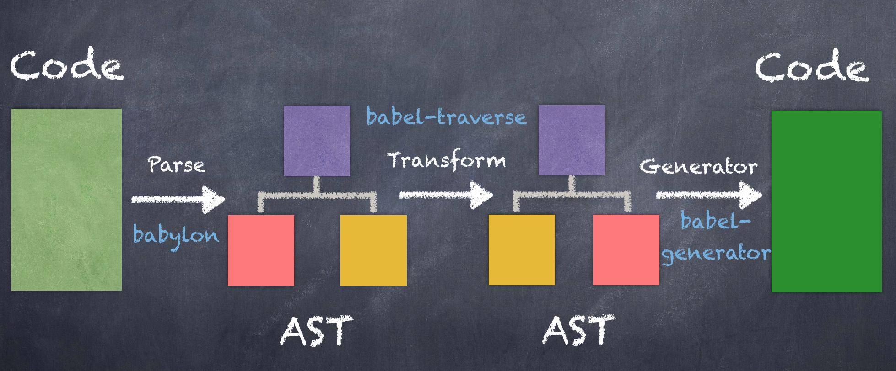

# Babel 备忘录

JavaScript 作为宿主语言，强烈依赖执行的环境（浏览器、node 等），不同环境对 JavaScript 语法的支持是不同的，特别是 ES6 止呕，ECMAScript 对版本的更新已经到了一年一次的结构，虽然每年更新的内容不是很多，但是每年还有很多处在不同阶段的提案，Babel 就是为了解决把使用新标准编写的代码或者实验性质的代码转译为当前环境可运行的代码。

Babel 是一个 JavaScript Transpiler(转译器)。

Babel 具体的工作有三个：

- 语法转换
- 通过 polyfill 的方式在目标环境中添加缺失的特性
- JavaScript 源码转换

> 一般编译器（Compiler）是指高级语言到低级语言的转换工具，特殊的高级语言到高级语言的转换工具，被叫做转换编译器，简称转译器（Transpiler）。

## Babel 运行原理

### Babel 转译的三个阶段

1. parse ： 源码 parse 生成 AST（Babel parser 叫 babylon，是基于 acorn 实现的）
2. transform ： 遍历 AST 并调用各种 transform 插件对 AST 进行各种增删改，生成新的 AST
3. generate ： 以新的 AST 为基础生成目标代码字符串，并生成 sourcemap



代码解析和代码生成是靠 @babel/core，代码转换是靠 babel 插件

### AST

整个解析 AST 的过程主要分为两个步骤：词法分析和语法分析

#### 词法分析

词法分析，这一步主要是将字节流（char stream） 转换为令牌流（token stream），又成为分词，其中拆分出来的各个部分被称为词法单元（Token）。

词法分析就是把代码从 string 类型转换成了数组，数组的元素就是代码中的 token，并且标记了每个 token 的类型。

#### 语法分析

语法分析会将词法分析出来的词法单元转化成有语法含义的抽象语法树结构（AST），同时验证语法，语法如果有错，会抛出语法错误。

经过语法分析阶段转换后生成的 AST，通过树形的层属关系建立了词法单元之间的联系。

例如[这篇文章中对于代码转换成 AST 结构的对照](https://developer.aliyun.com/article/62671)

```js
function abs(number) {
  if (number >= 0) {
    // test
    return number // consequent
  } else {
    return -number // alternate
  }
}
```


在这个例子中，我们主要关注函数声明里的内容， IfStatement 对应代码中的 if...else 区块的内容，我们先对条件（test）进行判断，这里是个简单的二进制表达式，我们的分支也会从这个条件继续进行下去，consequent 代表条件值为 true 的分支，alternate 代表条件值为 false 的分支，最后两条分支各自在 ReturnStatement 节点进行返回。

#### AST 节点

转换后的 AST 是由很多 AST 节点组成，主要有以下几种类型：字面量（Literal）、标志符（Identifer）、语句（Statement）、声明（Declaration）、表达式（Expression）、注释（Comment）、程序（Program）、文件（File）。

每种 AST 节点都有自己的属性，但是他们也有一些公共属性：

- 节点类型（type） ： AST 节点的类型
- 位置信息（loc）： 包括三个属性 start、end、loc。其中 start 和 end 代表该节点对应的源码字符串的开始和结束下标，不区分行列。loc 属性是一个对象，有 line 和 column 属性分别记录开始和结束行列号。
- 注释（comments） ： 主要分为三种 leadingComments、innerComments、trailingComments，分别表示开始的注释、中间的注释、结尾的注释。

## Babel 相关库的作用

### @babel/core 和 @babel/cli

`@babel/core` 是 Babel 核心库，由 `@babel/parse` 、 `@babel/traverse` 、 `@babel/types` 、 `@babel/template` 、 `@babel/generator` 等组成，它提供了完整的 Babel 编译 JavaScript 的能力。

`@babel/cli` 是 Babel 的命令行工具，即执行 `babel xxx` 时用到的。

这两个是搭配使用的，因为 `@babel/cli` 在执行的时候依赖 `@babel/core` 提供的生成 AST 相关的方法。

不过只有这两个库虽然可以执行，但是此时生成的代码并没有被编译，因为 Babel 将原来集成一体的各种编译功能分离出去，独立成插件，要编译文件就需要安装对应的插件或者预设（插件集合），例如：`@babel/preset-stage-0` 、 `@babel/preset-stage-1` 、`@babel/preset-env` 。其通过 plugin 对外提供了介入 @babel/core 的能力，类似 Webpack 的 plugin 对外提供接入 Webpack 编译流程的能力，所以我们也能实现自定义的 Babel 插件。

#### @babel/parser

针对 Babel 的 parse 阶段，用于把源码转换成 AST。

#### @babel/traverse

针对 Babel 的 transform 阶段，通过深度优先的方式遍历 AST，用于增删改查 AST。

#### @babel/types 和 @babel/template

在 Babel 的 transform 阶段，当需要判断和生成结点时，需要 `@babel/types`，当需要批量创建 AST 的时候可以使用 `@babel/template` 来简化 AST 创建逻辑。

#### @babel/generate

针对 Babel 的 generate 阶段，用于把转换后的 AST 打印为目标代码字符串，同时生成 sourcemap。

以上几个库可以查看[这篇文章的【babel 常用的 api】部分](https://mp.weixin.qq.com/s/LlQRx5SPmFgnTDO8VunGnw)。

### @babel/preset-stage-xxx

`@babel/preset-stage-xxx` 是 ES 在不同阶段提案的转码规则而产生的预设，随着被批准为 ES 新版本的组成部分而进行相应的改变（例如 ES6/ES2015）。

提案分为以下几个阶段：

- `stage-0` -设想（Strawman）：只是一个想法，可能有 Babel 插件，stage-0 的功能范围最广大，包含 stage-1、stage-2 以及 stage-3 的所有功能。
- `stage-1` -建议（Proposal）：这是值得跟进的
- `stage-2` -草案（Draft）：初始规范
- `stage-3` -候选（Candidate）：完成规范并在浏览器上初步实现
- `stage-4` -完成（Finished）：将添加到下一个年度版本发布中

### @babel/preset-env

多个 plugin 组合在一起形成的集合，被称为 preset。

`@babel/preset-env` 是一个智能的预设，它允许你使用最新的 JavaScript，而不需要自己管理你的目标环境需要哪些语法转换，它是通过 browserslist 和 compat-table 相结合来实现之恩能够的引入语法转换工具。babel 的 compat-data 注明了什么特性在什么环境下支持，再结合通过 browserslist 查询出环境版本号，就可以确定需要引入哪些 plugin 或者 preset。

`@babel/preset-env` 有三个常用的关键可选项：

- targets
- useBuiltIns
- corejs

在 babel@7 推出之际，Babel 官方把 stage-x 以及 es2015、es2016 等等预设都废弃了，取而代之的是 `@babel/preset-env`。

preset-env 主要做的是转换 JavaScript 最新的 Syntax（指的是 const let ... 等）， 而作为可选项 preset-env 也可以转换 JavaScript 最新的 API （指的是比如数组最新的方法 filter 、includes，Promise 等等）。

在 babel@6 年代，我们使用的 preset 是 stage，那 stage 其实只会翻译 Syntax，而 API 则交给 babel-plugin-transform-runtime 或者 babel-polyfill 来实现。

在 babel@7 年代，我们废弃了 stage，使用 preset-env，同时他也可以提供 polyfill 的能力

具体可以看一下 [这篇文章【preset-env 的三个关键参数】部分](https://zhuanlan.zhihu.com/p/361874935) 或者 [这篇文章【三个常用的关键可选项】部分](https://mp.weixin.qq.com/s/LlQRx5SPmFgnTDO8VunGnw)。

`@babel/preset-env` 的 polyfill 是 useBuiltIns 配合 core-js 一起生效的。此时的 polyfill 跟 @babel/polyfill（已废弃） 实现方式一样，会污染全局，但是在自己的业务项目或者应用中其实是可控的，也推荐这么使用。

#### core-js

core-js 是一套模块化的 JavaScript 标准库，包括：

- 最新标准的 ES 的 polyfill
- promise、symbols、iterators 等一些特性的实现
- ES 提案中的特性实现
- 跨平台的 WHATWG/W3C 特性，比如 URL

### @babel/runtime 和 @babel/plugin-transform-runtime

虽然经过了 preset-env 的转换，代码已经可以实现不同版本的特性兼容了。但是会产生两个问题：

1. 全局污染：preset-env 转换后引入的 polyfill，是通过 require 进行引入的，这就意味着，对于 Array.from 等静态方法，以及 includes 等实例方法，会直接在 global 上添加。这就导致引入的 polyfill 方法可能和其他库发生冲突。

2. 辅助代码重复：babel 转换代码的时候，可能会使用一些帮助函数来协助转换，这些帮助函数会重复创建。

`@babel/plugin-transform-runtime` 搭配 `@babel/runtime` 可以让帮助函数从 `@babel/runtime` 中引用，解决辅助代码重复问题。并且这个插件也有一个 corejs 配置，这里配置的是 runtime-corejs 的版本，有 2、3 两个版本，通过配置 corejs 可以实现 polyfill，此处的 polyfill 是不会影响全局的，更适合 Library 作者使用。

#### 注意：`@babel/plugin-transform-runtime` 的 corejs 配置

- `corejs: false` ： 设置 fasle ，或者不设置 corejs，需要安装 `@babel/runtime`，即 `npm install --save @babel/runtime`
- `corejs: 2` ： 需要安装 `@babel/runtime-corejs2`，即 `npm install --save @babel/runtime-corejs2`
- `corejs: 3` ： 需要安装 `@babel/runtime-corejs3`，即 `npm install --save @babel/runtime-corejs3`

根据上面的安装命令可以看出 `@babel/runtime` 、 `@babel/runtime-corejs2` 、 `@babel/runtime-corejs3` 要作为项目的 dependencies，因为从这些包中引入的代码是要在实际项目中运行的。

### 特别解释：`@babel/plugin-transform-runtime` 的 `corejs` 配置与 `@babel/preset-env` 的 `useBuiltIns` 关系

如果 `@babel/plugin-transform-runtime` 开启 `corejs`，并且 `@babel/preset-env` 也开启 `useBuiltIns` 会怎么样？结论是：被使用到的高级 API polyfill 将会采用 `runtime` 的不污染全局的方案（注意：此时 `@babel/preset-env` 的 `targets` 设置将会失效）,而不被使用到的将会采用污染全局的方式。

这是由于 babel 是先执行 plugins 后执行 presets 的内容，`@babel/plugin-transform-runtime` 插件先于 preset-env 将 polyfill 引入了，并且做了一层包装，所以就无需再通过 `@babel/preset-env` 来引入 polyfill 了。

所以如果是工具、库、框架或者公共组件的开发者，因为无需关注 `@babel/preset-env` 的 `targets`，直接开启 `@babel/plugin-transform-runtime` 的 `corejs`， polyfill 的引入由 `@babel/plugin-transform-runtime` 完成，不会污染全局。

配置示例：

```
// babel.config.json

{
  "presets": [
    [
      "@babel/preset-env",
    ]
  ],
  "plugins": [
    [
      "@babel/plugin-transform-runtime",
      {
        "corejs": {
          "version": 3,
          "proposals": true
        }
      }
    ]
  ]
}
```

如果是业务或者项目开发者，开启 `@babel/preset-env` 的 `targets` 和 `useBuiltIns`，并关闭 `@babel/plugin-transform-runtime` 的 `corejs`，这样 polyfill 的引入由 `@babel/preset-env` 完成。

配置示例：

```
// babel.config.json

{
  "presets": [
    [
      "@babel/preset-env",
      {
        "targets": {
          "chrome": 58
        },
        "useBuiltIns": "entry",
        "corejs": {
          "version": 3,
          "proposals": true
        }
      }
    ]
  ],
  "plugins": [
    [
      "@babel/plugin-transform-runtime"
    ]
  ]
}

// 入口文件处引入
import "core-js/stable";
```

## 推荐阅读

- [babel-从入门到上手](https://mp.weixin.qq.com/s/LlQRx5SPmFgnTDO8VunGnw)
- [99% 开发者没弄明白的 babel 知识](https://zhuanlan.zhihu.com/p/361874935)
- [重点看一下 path 和 scope 的介绍](https://juejin.cn/post/6844903746804137991#heading-4)
- [​babel 背后到底执行了什么？](https://mp.weixin.qq.com/s/Jd7sX1yNYdXPgepwlq-XLw)
- [理解 Babel 插件](https://developer.aliyun.com/article/62671)
- [前端工程师的自我修养-关于 Babel 那些事儿](https://www.zoo.team/article/babel-2)
- [由 Babel 理解前端编译原理](https://mp.weixin.qq.com/s/Wjw6zdpwcw5LbSmqzkN5RA)
