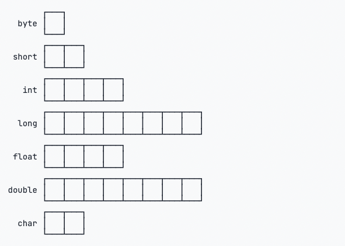

# Java 基础

## Java 试用

### 基本操作

1. 下载 JDK 并安装，配置环境变量

2. 创建一个 Hello.java 文件

- 一个 Java 源码文件只能定义一个 public 类型的 class，Java 文件中类名必须跟文件名相同，类名以大写字母开头，大小写敏感
  - 因为 Java 是面向对象的编程语言，一个程序的基本单位就是 class
- 一个类中有且只有一个主方法（main）。Java 规定，某个类定义的 public static void main(String[] args)是 Java 程序的固定入口方法，因此，Java 程序总是从 main 方法开始执行。
- Java 源码的缩进不是必须的，但是用缩进后，格式好看，很容易看出代码块的开始和结束，缩进一般是 4 个空格或者一个 tab。

```java
// 定义一个公有的类，类名必须跟文件名相同，类名以大写字母开头，大小写敏感
// class 用来定义一个类，public 表示这个类是公开的，public、class 都是 Java 的关键字，必须小写
public class Hello {
  // 定义一个 main 方法（也叫主方法），是程序的入口
  // 一个程序中有且只有一个主方法
  public static void main(String[] args) {
    // 在控制台输出一串文字，双引号中的内容就是要输出的文字内容
    // System.out.println 是 Java 提供的内置功能，println 是 printline 的 缩写，如果没有参数，会输出一行空行。
    // 方法体中的语句必须用 ; (英文分号)结尾
    System.out.println("Hello, World!");
  }
}
```

3. 编译并运行

- 编译命令：javac Hello.java
- 运行命令：java Hello

Java 源码本质上是一个文本文件，我们需要先用 javac 把 Hello.java 编译成字节码文件 Hello.class，然后，用 java 命令执行这个字节码文件。

因此，可执行文件 javac 是编译器，而可执行文件 java 就是虚拟机。

> 扩展：[轻松看懂 Java 字节码](https://juejin.cn/post/6844903588716609543)

> 扩展：在 JAVA_HOME 的 bin 目录下找到很多可执行文件

- java : 这个可执行程序其实就是 JVM，运行 Java 程序，就是启动 JVM，然后让 JVM 执行指定的编译后的代码；
- javac : 这是 Java 的编译器，它用于把 Java 源码文件（以.java 后缀结尾）编译为 Java 字节码文件（以.class 后缀结尾）；
- jar : 用于把一组.class 文件打包成一个.jar 文件，便于发布；
- javadoc : 用于从 Java 源码中自动提取注释并生成文档；
  - 所有的 Java 文档注释都以`/**`开头，`*/`结尾，而不是`/*`或`//`，并且如果有多行，每行通常以星号开头
  - 文档注释覆盖范围包括：类、接口、方法、构造器、成员字段，如果写在其他位置，比如函数内部，被视为无效的文档注释
  - 每个 Java 文档注释都要和其后对应的类/方法/字段/包保持同样的缩进
  - Java 文档注释的内容，支持采用 HTML 语法规则书写，同时也支持一些额外的辅助标签
- jab : Java 调试器，用于开发阶段的运行调试。

### 使用 IDE 编写代码

#### IDE 是集成开发环境：Integrated Development Environment 的缩写。

使用 IDE 的好处在于，可以把编写代码、组织项目、编译、运行、调试等放到一个环境中运行，能极大地提高开发效率。

IDE 提升开发效率主要靠以下几点：

编辑器的自动提示，可以大大提高敲代码的速度；
代码修改后可以自动重新编译，并直接运行；
可以方便地进行断点调试。

#### 例如使用 IntelliJ IDEA 编写 Hello.java

1. 创建 project，可以指定 JDK 版本
2. 在 project 目录上创建 module，也可以指定 JDK 版本
3. 在 module 目录上新建 `.java` 源代码（Java Class），设置类名并确认后，进入代码编辑页面，代码中会默认生成一个根据刚才类名创建的类，类的语句块中默认没有内容。
4. 在类中编写代码，输入 `psvm` 自动生成主方法代码，输入 `sout` 自动生成输出语句
5. 通过页面中的三角形按钮（所有）可以编译并运行当前的代码

## Java 数据类型

### 基本数据类型

基本数据类型是 CPU 可以直接进行运算的类型。

> 前置知识

计算机内存的最小存储单元是字节（byte），一个字节就是一个 8 位二进制数，即 8 个 bit。它的二进制表示范围从 00000000~11111111，换算成十进制是 0~255，换算成十六进制是 00~ff。

内存单元从 0 开始编号，称为内存地址。每个内存单元可以看作一间房间，内存地址就是门牌号。

一个字节是 1byte，1024 字节是 1K，1024K 是 1M，1024M 是 1G，1024G 是 1T。

不同的数据类型占用的字节数不一样，如下图:



byte 恰好就是一个字节，而 long 和 double 需要 8 个字节。

#### 整型

整型也叫整数型，表示整数数据类型。

对于整型类型，Java 只定义了带符号的整型，因此，最高位的 bit 表示符号位（0 表示正数，1 表示负数）。各种整型能表示的最大范围如下：

- 小整型 byte -128 ~ 127
- 短整型 short -32768 ~ 32767
- 整型 int -2147483648 ~ 2147483647
- 长整型 long -9223372036854775808 ~ 9223372036854775807

```java
// 定义整型
public class Main {
    public static void main(String[] args) {
        int i = 2147483647;
        int i2 = -2147483648;
        int i3 = 2_000_000_000; // 加下划线更容易识别
        int i4 = 0xff0000; // 十六进制表示的16711680
        int i5 = 0b1000000000; // 二进制表示的512

        long n1 = 9000000000000000000L; // long型的结尾需要加L
        long n2 = 900; // 没有加L，此处900为int，但int类型可以赋值给long
        int i6 = 900L; // 错误：不能把long型赋值给int
    }
}
```

#### 浮点型

浮点类型的数就是小数，因为小数用科学计数法表示的时候，小数点是可以“浮动”的，如 1234.5 可以表示成 12.345x102，也可以表示成 1.2345x103，所以称为浮点数。

- 单精度浮点型 float ： 对于 float 类型，需要加上 f 后缀。
- 双精度浮点型 double

浮点数可表示的范围非常大，float 类型可最大表示 3.4x1038，而 double 类型可最大表示 1.79x10308。

```java
float f1 = 3.14f;
float f2 = 3.14e38f; // 科学计数法表示的3.14x10^38
float f3 = 1.0; // 错误：不带f结尾的是double类型，不能赋值给float

double d = 1.79e308;
double d2 = -1.79e308;
double d3 = 4.9e-324; // 科学计数法表示的4.9x10^-324
```

> 扩展：浮点数可表示的范围非常大是为什么？

在 Java 中，`float` 和 `double` 类型能够表示非常大的数字范围，这主要得益于 **浮点数的表示方式** 和 **指数扩展机制**。

---

#### **1. 浮点数的表示方式**

Java 的 `float` 和 `double` 类型都是基于 **IEEE 754 标准** 的 **浮点数表示法**。这种表示法将浮点数分为三个部分：**符号位**、**指数部分** 和 **尾数部分**。

##### **浮点数公式**

浮点数的值可以用以下公式表示：

```
值 = 符号位 × 尾数 × 2^(指数)
```

- **符号位（S）**：1 位，决定正负号（0 表示正数，1 表示负数）。
- **尾数（M，也叫有效数或小数部分）**：表示数字的精确部分。
- **指数（E）**：指数部分，用来扩展数字的范围，通过指数的大小控制数字的数量级。

---

#### **2. float 和 double 的位数分配**

| 类型   | 总位数 | 符号位 | 指数位 | 尾数位 |
| ------ | ------ | ------ | ------ | ------ |
| float  | 32 位  | 1 位   | 8 位   | 23 位  |
| double | 64 位  | 1 位   | 11 位  | 52 位  |

##### **位数的含义**

1. **符号位（1 位）**：
   - 决定数字是正数还是负数。
2. **指数位（E 位）**：
   - 决定指数部分的大小，可以表示的指数范围越大，浮点数的范围越大。
3. **尾数位（M 位）**：
   - 决定数字的精度，表示了有效数字的部分。

---

#### **3. 为什么范围很大？**

##### **（1）指数位决定了范围**

指数位是决定浮点数范围的关键，因为它控制了数字的数量级。

- **float 的指数位有 8 位**：

  - 8 位指数可以表示的值范围是 **-126 到 +127**（用偏移量编码法，实际存储的是 `E + 127`）。
  - 因此，`float` 的最大值是：`2^127 × 最大有效尾数`。

- **double 的指数位有 11 位**：
  - 11 位指数可以表示的值范围是 **-1022 到 +1023**（用偏移量编码法，实际存储的是 `E + 1023`）。
  - 因此，`double` 的最大值是：`2^1023 × 最大有效尾数`。

###### **对比：指数位越多，范围越大**

- `float` 的指数范围：`-126 到 127`，表示的值范围大约是 `10^-38 到 10^38`。
- `double` 的指数范围：`-1022 到 1023`，表示的值范围大约是 `10^-308 到 10^308`。

##### **（2）尾数（精度）的作用**

尾数部分（23 位或 52 位）决定了数字的精确程度，但它对表示范围没有直接影响。

- 尾数越多，数字的精度越高，但**范围主要由指数控制**。
- 比如：
  - 一个 `float` 可以精确到 6~7 位十进制数字。
  - 一个 `double` 可以精确到 15~16 位十进制数字。

因此，虽然 `double` 的尾数更多，但它的范围主要还是由 11 位的指数决定的。

---

#### **4. 实现原理：指数编码和尾数的作用**

##### **（1）指数的编码方式**

浮点数使用 **偏移量编码**（Bias Encoding）来存储指数部分，这样可以表示正指数和负指数。

- 对于 `float` 的指数位：

  - 偏移量是 `127`，实际指数值 = 存储的指数值 - 127。
  - 所以存储的指数值范围是 `0~255`，实际指数范围是 `-126~+127`。

- 对于 `double` 的指数位：
  - 偏移量是 `1023`，实际指数值 = 存储的指数值 - 1023。
  - 所以存储的指数值范围是 `0~2047`，实际指数范围是 `-1022~+1023`。

##### **（2）尾数的作用**

尾数（有效数部分）存储的是一个 **归一化的二进制小数**，范围是 `[1.0, 2.0)`。比如：

- `1.101` 表示的小数是 `1 + 0.5 + 0.125 = 1.625`。
- 尾数部分不影响范围，只影响精度。

##### **（3）举例说明**

举个例子，`float` 的最大值 `3.4 × 10^38` 在内存中的表示：

- 符号位：`0`（正数）。
- 指数位：`254`（存储值），实际指数是 `127`。
- 尾数位：`1.11111111111111111111111`（23 位有效数字，接近 2）。

---

#### **5. 为什么 double 的范围更大？**

1. **指数位更多**：

   - `float` 的指数只有 8 位，而 `double` 的指数有 11 位。
   - 每多 1 位指数，指数范围大约扩展 **2 倍**。
   - 所以 `double` 的范围远大于 `float`。

2. **精度更高**：
   - 虽然精度不直接影响范围，但 `double` 的 52 位尾数可以更精确地表示更大的数字。

---

#### **6. 通俗总结**

浮点数的范围主要由 **指数位的数量** 决定。指数位越多，能够表示的数量级越大：

1. **float**：

   - 8 位指数，指数范围是 `-126 到 +127`，因此可以表示大约 `10^-38 到 10^38` 的数字。

2. **double**：
   - 11 位指数，指数范围是 `-1022 到 +1023`，因此可以表示大约 `10^-308 到 10^308` 的数字。

**为什么范围特别大？**

- 浮点数可以通过指数位实现数字的“压缩表达”，比如一个巨大的数字 `1,000,000,000,000` 可以写成 `1.0 × 10^12`，只需要存储有效部分 `1.0` 和指数部分 `12`。

---

#### **7. 总结对比表**

| 类型   | 指数位 | 指数范围       | 最大值        | 最小值（正数） |
| ------ | ------ | -------------- | ------------- | -------------- |
| float  | 8 位   | -126 到 +127   | 3.4 × 10^38   | 1.4 × 10^-45   |
| double | 11 位  | -1022 到 +1023 | 1.79 × 10^308 | 4.9 × 10^-324  |

#### 字符型 char

表示单个字符类型。字符型就是平时使用的各种字符、字母、数字，以及各种标点符号。

字符类型 char 表示一个字符。Java 的 char 类型除了可表示标准的 ASCII 外，还可以表示一个 Unicode 字符：

```java
// 字符类型
public class Main {
    public static void main(String[] args) {
        char a = 'A';
        char zh = '中';
        System.out.println(a);
        System.out.println(zh);
    }
}
```

注意 char 类型使用单引号'，且仅有一个字符，要和双引号"的字符串类型区分开。

#### 布尔类型 boolean

表示真或假（true/false），布尔类型 boolean 只有 true 和 false 两个值

```java
boolean b1 = true;
boolean b2 = false;
boolean isGreater = 5 > 3; // 计算结果为true
int age = 12;
boolean isAdult = age >= 18; // 计算结果为false
```

Java 语言对布尔类型的存储并没有做规定，因为理论上存储布尔类型只需要 1 bit，但是通常 JVM 内部会把 boolean 表示为 4 字节整数。

#### 空类型 null

也叫 NULL 类型（null），他是 Java 中一种比较特殊的常量值，通常用于引用数据类型的初始化。

### 引用数据类型

除了上述基本类型的变量，剩下的都是引用类型。例如，引用类型最常用的就是 String 字符串

引用类型的变量类似于 C 语言的指针，它内部存储一个“地址”，指向某个对象在内存的位置

#### 字符串型 String

表示多个字符集合类型。字符串就是多个字符的集合，多个字符组成的串。

在 Java 中表示字符串的时候，需要通过一对双引号将其括起来。

#### 数组 Array

#### 类 class

#### 接口 interface

#### Lambda Lambda

### 单双引号的区别

字符串与单个字符的区别——单个字符使用单引号，而字符串使用双引号，即使双引号中只有一个字符，其表示的也是一个字符串，只不过字符串中的有效字符只有一个而已。

## Java 变量

Java 中，在我们想要使用变量之前，需要先定义一个变量，也就是需要向内存申请一块存储空间，目的是存储某些值，这些值在未来程序运行的某个时间节点可能会发生变化。

在定义变量的时候，需要指定申请的是什么类型的变量，即告诉 Java 要申请多少字节的存储空间来存储什么值。

### 变量的命名规范

- 只能由大小写字母、数字、下划线 `_` 和 `$` 符组成
- 不能由数字开头
- 不能使用 Java 的关键字，如 `class`、`interface`、`int` 等
- 变量名区分大小写
- 推荐命名方式为见名知意，动宾结合，如 openDoor（小驼峰法，常用于变量和方法名），StudentScore（大驼峰法，常用于类名）。
- 切忌中英混合，如 openDoor（可取）/ openMen（不可取）

> #### 扩展

- 表达式（expression）Java 中最基本的功能单位，例如 `int abc`、`1 + 2` 都是表达式。
- 语句（statement） 可以类比于平时说话时的一句话，它由表达式组成，以 `;` 分号结束。例如 `int a = 1;`、`System.out.println(a);` 都是语句。
- 代码块 一对大括号括起来的就是一个代码块

### 使用变量的注意事项

#### 变量的作用域：语句块内有效

在 Java 中，多行语句用`{ ... }`括起来。很多控制语句，例如条件判断和循环，都以`{ ... }`作为它们自身的范围

只要正确地嵌套这些`{ ... }`，编译器就能识别出语句块的开始和结束。而在语句块中定义的变量，它有一个作用域，就是从定义处开始，到语句块结束。超出了作用域引用这些变量，编译器会报错。举个例子：

```java
{
    ...
    int i = 0; // 变量i从这里开始定义
    ...
    {
        ...
        int x = 1; // 变量x从这里开始定义
        ...
        {
            ...
            String s = "hello"; // 变量s从这里开始定义
            ...
        } // 变量s作用域到此结束
        ...
        // 注意，这是一个新的变量s，它和上面的变量同名，
        // 但是因为作用域不同，它们是两个不同的变量:
        String s = "hi";
        ...
    } // 变量x和s作用域到此结束
    ...
} // 变量i作用域到此结束
```

定义变量时，要遵循作用域最小化原则，尽量将变量定义在尽可能小的作用域，并且，不要重复使用变量名。

#### 变量的初始化：变量必须初始化后再使用

### 变量类型转换

#### 隐式类型转换（自动类型转换）：小转大（不丢精度）

##### 两个整数类型

在运算过程中，如果参与运算的两个数类型不一致，那么计算结果为较大类型的整型。例如，short 和 int 计算，结果总是 int，原因是 short 首先自动被转型为 int：

```java
// 类型自动提升与强制转型
public class Main {
    public static void main(String[] args) {
        short s = 1234;
        int i = 123456;
        int x = s + i; // s自动转型为int
        short y = s + i; // 编译错误!
    }
}
```

##### 整数与浮点数

如果参与运算的两个数其中一个是整型，一个是浮点型，那么整型可以自动提升到浮点型：

```java
// 类型提升
public class Main {
    public static void main(String[] args) {
        int n = 5;
        double d = 1.2 + 24.0 / n; // 6.0
        System.out.println(d);
    }
}
```

需要特别注意，在一个复杂的四则运算中，两个整数的运算不会出现自动提升的情况。例如：

```java
double d = 1.2 + 24 / 5; // 结果不是 6.0 而是 5.2
```

计算结果为 5.2，原因是编译器计算 24 / 5 这个子表达式时，按两个整数进行运算，结果仍为整数 4。

要修复这个计算结果，可以将 24 / 5 改为 24.0 / 5。由于 24.0 是浮点数，因此，计算除法时自动将 5 提升为浮点数。

#### 显示类型转换（需要进行强制类型转换）：大转小（可能丢精度）

##### 整数类型转换

也可以将结果强制转型，即将大范围的整数转型为小范围的整数。强制转型使用(类型)，例如，将 int 强制转型为 short：

```java
int i = 12345;
short s = (short) i; // 12345
```

要注意，超出范围的强制转型会得到错误的结果，原因是转型时，int 的两个高位字节直接被扔掉，仅保留了低位的两个字节：

```java
// 强制转型
public class Main {
    public static void main(String[] args) {
        int i1 = 1234567;
        short s1 = (short) i1; // -10617
        System.out.println(s1);
        int i2 = 12345678;
        short s2 = (short) i2; // 24910
        System.out.println(s2);
    }
}
```

##### 浮点数类型转换为整数类型

可以将浮点数强制转型为整数。在转型时，浮点数的小数部分会被丢掉。如果转型后超过了整型能表示的最大范围，将返回整型的最大值。例如：

```java
int n1 = (int) 12.3; // 12
int n2 = (int) 12.7; // 12
int n3 = (int) -12.7; // -12
int n4 = (int) (12.7 + 0.5); // 13
int n5 = (int) 1.2e20; // 2147483647
```

如果要进行四舍五入，可以对浮点数加上 0.5 再强制转型：

```java
// 四舍五入
public class Main {
    public static void main(String[] args) {
        double d = 2.6;
        int n = (int) (d + 0.5);
        System.out.println(n);
    }
}

```

## Java 常量

定义变量的时候，如果加上 final 修饰符，这个变量就变成了常量：

```java
final double PI = 3.14; // PI是一个常量
double r = 5.0;
double area = PI * r * r;
PI = 300; // compile error!
```

常量在定义时进行初始化后就不可再次赋值，再次赋值会导致编译错误。

常量的作用是用有意义的变量名来避免魔术数字（Magic number），例如，不要在代码中到处写 3.14，而是定义一个常量。如果将来需要提高计算精度，我们只需要在常量的定义处修改，例如，改成 3.1416，而不必在所有地方替换 3.14。

**为了和变量区分开来，根据习惯，常量名通常全部大写。**

## Java 运算符

- 算术运算符：`+`、`-`、`*`、`/`、`%`
- 关系运算符：`>`, `<`, `>=`, `<=`, `==`, `!=`
- 逻辑运算符：`&&`、`||`、`!`
- 赋值运算符：`=`、`+=`、`-=`、`*=`、`/=`、`%=`
- 位运算符：`&`、`|`、`^`、`~`、`<<`、`>>`
- 条件运算符：`? :`
- instanceof 运算符：`instanceof`

### 运算符优先级

在 Java 的计算表达式中，运算优先级从高到低依次是：

- `()`
- `!` `~` `++` `--`
- `*` `/` `%`
- `+` `-`
- ` <<`` >> ` `>>>`
- `&`
- `|`
- `+=` `-=` `*=` `/=`

记不住也没关系，只需要加括号就可以保证运算的优先级正确。

https://i.bjpowernode.com/article/368.html

### 整数运算

#### 整数运算规则

Java 的整数运算遵循四则运算规则，可以使用任意嵌套的小括号。四则运算规则和初等数学一致。

整数的数值表示不但是精确的，而且整数运算永远是精确的，即使是除法也是精确的，因为两个整数相除只能得到结果的整数部分：

```java
int x = 12345 / 67; // 184
int y = 12345 % 67; // 12345÷67的余数是17
```

**特别注意：整数的除法对于除数为 0 时运行时将报错，但编译不会报错。**

#### 整数运算溢出

特别注意，整数由于存在范围限制，如果计算结果超出了范围，就会产生溢出，而溢出不会出错，却会得到一个奇怪的结果：

```java
// 运算溢出
public class Main {
    public static void main(String[] args) {
        int x = 2147483640;
        int y = 15;
        int sum = x + y;
        System.out.println(sum); // -2147483641
    }
}
```

要解决上面的问题，可以把 int 换成 long 类型，由于 long 可表示的整型范围更大，所以结果就不会溢出：

```java
long x = 2147483640;
long y = 15;
long sum = x + y;
System.out.println(sum); // 2147483655
```

#### 自增/自减

注意：`++`写在前面和后面计算结果是不同的，`++n`表示先加 1 再引用 n，`n++`表示先引用 n 再加 1。不建议把++运算混入到常规运算中，容易自己把自己搞懵了。

#### 位运算

位运算是按位进行与、或、非和异或的运算。

与运算的规则是，必须两个数同时为 1，结果才为 1：

```java
n = 0 & 0; // 0
n = 0 & 1; // 0
n = 1 & 0; // 0
n = 1 & 1; // 1
```

或运算的规则是，只要任意一个为 1，结果就为 1：

```java
n = 0 | 0; // 0
n = 0 | 1; // 1
n = 1 | 0; // 1
n = 1 | 1; // 1
```

非运算的规则是，0 和 1 互换：

```java
n = ~0; // 1
n = ~1; // 0
```

异或运算的规则是，如果两个数不同，结果为 1，否则为 0：

```java
n = 0 ^ 0; // 0
n = 0 ^ 1; // 1
n = 1 ^ 0; // 1
n = 1 ^ 1; // 0
```

### 浮点数运算

#### 浮点数误差

浮点数运算和整数运算相比，只能进行加减乘除这些数值计算，不能做位运算和移位运算。

在计算机中，浮点数虽然表示的范围大，但是，浮点数有个非常重要的特点，就是浮点数常常无法精确表示。

浮点数 0.1 在计算机中就无法精确表示，因为十进制的 0.1 换算成二进制是一个无限循环小数，很显然，无论使用 float 还是 double，都只能存储一个 0.1 的近似值。但是，0.5 这个浮点数又可以精确地表示。

因为浮点数常常无法精确表示，因此，浮点数运算会产生误差：

```java
// 浮点数运算误差
public class Main {
    public static void main(String[] args) {
        double x = 1.0 / 10;
        double y = 1 - 9.0 / 10;
        // 观察x和y是否相等:
        System.out.println(x);
        System.out.println(y);
    }
}
```

由于浮点数存在运算误差，所以比较两个浮点数是否相等常常会出现错误的结果。正确的比较方法是判断两个浮点数之差的绝对值是否小于一个很小的数：

```java
// 比较x和y是否相等，先计算其差的绝对值:
double r = Math.abs(x - y);
// 再判断绝对值是否足够小:
if (r < 0.00001) {
    // 可以认为相等
} else {
    // 不相等
}
```

#### 浮点数溢出

整数运算在除数为 0 时会报错，而浮点数运算在除数为 0 时，不会报错，但会返回几个特殊值：

- NaN 表示 Not a Number
- Infinity 表示无穷大
- -Infinity 表示负无穷大

```java
double d1 = 0.0 / 0; // NaN
double d2 = 1.0 / 0; // Infinity
double d3 = -1.0 / 0; // -Infinity
```

这三种特殊值在实际运算中很少碰到，我们只需要了解即可。

## 布尔运算

## Java 数组

### 定义

```java
// 第一种方法
int[] arr = new int[5];
// 第二种方法
int[] arr = {1, 2, 3, 4, 5};

```

### 初始化

### 特性

## 方法（函数）

### 概念和定义

### 使用方法的好处

### 名词解析

### 注意事项

### 方法的重载

## 面向对象

### 类和对象的概念

- 类是对象的抽象
- 对象是类的实例

### 对象的使用步骤

以 IDEA 编辑器为例

#### 1. 创建包

在创建类的时候可以先创建包，然后在包里创建自定义类。实际上，包就是项目目录中的子目录。

创建方法：在项目的 src 目录上单击右键->选择 new（新建）->选择 Packages（包）->输入包名->确认

定义包名的时候，通常使用域名逆序的排列来定义，这样能保证唯一性。（例如：com.example.xxx）

#### 2. 创建自定义类

包创建成功后，在项目目录下会出现一个新的目录，这个目录就是刚才创建的包。在包目录上单击右键->选择 new（新建）->选择 Java Class（Java 类）->输入类名->确认

在 IDEA 的包中创建类时，IDEA 会默认添加一行代码，指定当前的包名。

```java
package com.example.PersonDemo;
```

#### 3. 在使用类之前，需要实现导入这个类所在的包。语法是：`import 包名.类名;`

注意：当前使用的类和当前类处于同一个包下的时候，不需要 import，如果不在同一个包内，就需要使用 import 导入包。

另外，IDEA 会在实例化（new）对象的时候自动生成 import 语句。

#### 4. 实例化对象：`类名 对象名 = new 类名();`，之后通过对象名调用类实例属性及方法：`对象名.属性名 或 对象名.方法名`

### 类的变量和方法

- 实例（成员）变量
  - 公有实例属性
  - 私有实例属性
  - 受保护的实例属性
- 静态变量
- 局部变量
- 实例（成员）方法
  - 公有实例方法
  - 私有实例方法
  - 受保护的实例方法
- 静态方法

### 修饰符

#### 访问修饰符

- public
- private
- protected

#### 非访问修饰符

- static
- final
- abstract
- synchronized
- volatile

#### final 修饰符

final 修饰符是一种 Java 关键字，表示最终的，用于修饰类、变量和方法，用来限定其不能被继承、修改或删除。可以用来保护代码和数据的安全性。

final 修饰符在以下几种场景中可以具体使用：

1. 类：当声明一个类为 final 时，它就成为一个不可变类，不能被其它类继承。
2. 方法：当声明一个方法为 final 时，它就不能被子类重写。
3. 变量：当声明一个变量为 final 时，它就成为一个常量，不能被修改。

##### 使用语法

```
[modifier] final class ClassName
[modifier] final [type] variableName
[modifier] final returnType methodName(parameters)
```

##### 注意事项

- 使用 final 修饰符的时候需要注意以下几点：
- 不要试图修改一个 final 变量，因为它是一个常量，只能被初始化一次。
- 当使用 final 修饰符修饰一个方法时，该方法就不能被子类重写。
- 不要尝试继承一个 final 类，因为它不能被继承。
- 尽量不要把一个类声明为 final，因为这样会限制类的扩展性。
- 使用 final 修饰的引用类型的变量不能被重新赋值（仅仅保证变量的地址不变），但可以改变引用类型所引用对象的内容。

### 构造方法

#### 构造方法特点

### 继承（复习一下 JavaScript 的继承）

#### 继承的特点

#### 父类、子类、局部变量名重复、冲突时的访问规则

#### 继承中的权限

## 抽象（abstract）

在 Java 中，`abstract` 是一个修饰符，用 `abstract` 修饰的类叫抽象类，用 `abstract` 修饰的方法叫作抽象方法。

### abstract 注意事项

## 接口（interface）

接口（interface）是一种公共的规范，是一种引用数据类型。

### 接口的定义

### 接口中的成员

#### 接口中的常量

#### 接口中的抽象方法

#### 接口中的默认方法

#### 接口中的静态方法

#### 接口中的私有方法

### 接口的实现

#### 实现接口的格式

## 多态

### 格式

### 多态调用成员方法

### 多态调用成员属性

### 对象的上下转型

## 内部类

Java 中的内部类是一种特殊的类，它定义在另一个类的内部，即在一个类中定义另一个类，这个在类中定义的类就叫做内部类

内部类可以访问外部类的所有成员变量和方法，即使它们是私有的（private）、静态的（static）。

外部类是指定义在另一个类外部的类。一个外部类可以有多个内部类，而一个内部类也可以嵌套其他内部类

### 格式

### 内部类的访问特点

### 内部类的分类

根据内部类在类中定义的位置不同

- 成员内部类 ： 在类的成员位置
  - 静态成员内部类 ： 使用 static 修饰符
  - 非静态成员内部类 ： 没有使用 static 修饰符
- 局部内部类 ： 在类的局部位置（在成员方法中）
- 匿名内部类

#### 静态成员内部类和非晶态成员内部类的区别

还有其他的 https://blog.csdn.net/liuxiao723846/article/details/108006609

非静态内部类在编译完成之后会隐含地保存着一个引用，该引用是指向创建它的外部类的对象，但是静态内部类却没有。

静态内部类没有这个引用就意味着：

- 它的创建是不需要依赖于外部类的对象
- 它不能使用任何外部类的非 static 成员变量和方法（因为在没有外部类的对象的情况下，可以创建静态内部类的对象，如果允许访问外部类的非 static 成员就会产生矛盾，因为外部类的非 static 成员必须依附于具体的对象）
- 静态内部类内允许有 static 属性、方法；

#### 局部内部类

局部内部类就像是方法里面的一个局部变量一样，是不能有 public、protected、private 以及 static 修饰符的。

## 常用类

### 包装类

#### 包装类对应表

Byte、Short、Integer、Long、Float、Double、Boolean、Character

它们的具体含义如下所示：

- Byte：表示一个字节，取值范围为-128~127。
- Short：表示一个短整型，取值范围为-32768~32767。
- Integer：表示一个整型，取值范围为-2147483648~2147483647。
- Long：表示一个长整型，取值范围为-9223372036854775808~9223372036854775807。
- Float：表示单精度浮点数，取值范围为 1.4e-45~3.4028235e38。
- Double：表示双精度浮点数，取值范围为 4.9e-324~1.7976931348623157e308。
- Boolean：表示布尔值，取值范围为 true 和 false。
- Character：表示字符，取值范围为 0~65535。

#### 拆箱

拆箱是指将包装类对象转换为基本类型数据的操作。此操作可以通过调用基本类型的值来实现，如 intValue(),doubleValue() 等。

#### 装箱

装箱是指将基本类型数据转换为包装类对象的操作，它可以通过调用包装类的静态方法 valueOf()来实现。

### String 类

无论是常量还是变量，只要是字符串，在 Java 中就都是字符串对象。

#### 字符串类的特点

#### String 对象的特点

#### StringBuilder

##### String 和 StringBuilder 的相互转换

### Object 类

Object 类是一个特殊的类，

### 时间类型

Java 中的日期类型可以分为两类：旧的日期类型和新的日期类型。

- 旧的日期类型

旧的日期类型包括 Date 和 Calendar，它们可以用于表示日期和时间。

- 新的日期类型

另一类新的日期类型是 Java 8 推出的新特性，称为新的日期和时间 API。它提供了一种更为简单的方式来处理日期和时间，允许开发人员更轻松地实现日期和时间的计算。新的日期和时间 API 包括 LocalDate、LocalTime 和 LocalDateTime 等类。

Java 中的日期类主要有以下几个：

- Date 类：转化后精度损失较多，不推荐使用。
- Calendar 类：比较繁琐，但提供了丰富的日期操作方法。
- SimpleDateFormat 类：可以将日期与字符串互相转化，常用于日期的格式化操作。
- LocalDate、LocalTime、LocalDateTime、ZonedDateTime 类：Java 8 新增，使用简单，提供了丰富的日期操作方法，并且支持时区。

其中，LocalDate 表示日期，LocalTime 表示时间，LocalDateTime 表示日期和时间，ZonedDateTime 则表示带时区的日期和时间。这些类都封装了日期和时间的操作方法，并且支持创建、比较、格式化、解析等各种操作。同时，它们也遵循了不可变性的原则，保证了操作安全和线程安全。

#### Date

Java 中的 Date 类是用于表示日期和时间的类。 Date 类封装了当前时间，以及毫秒数，以便能够进行计算和转换，主要包含以下几个方法：

- long getTime()：返回自 1970 年 1 月 1 日 00:00:00 GMT 以来此 Date 对象表示的毫秒数。
- void setTime(long time)：设置此 Date 对象表示时间点，以表示自 1970 年 1 月 1 日 00:00:00 GMT 以来的毫秒数。
- boolean before(Date when)：当此 Date 对象表示的时间在 when 之前时，返回 true，否则返回 false。
- boolean after(Date when)：当此 Date 对象表示的时间在 when 之后时，返回 true，否则返回 false。
- boolean equals(Object obj)：当此 Date 对象表示的时间和 obj 表示的时间相同时，返回 true，否则返回 false。

#### Calendar

- Calendar getInstance()：静态方法，用于获取由当前日期和时间初始化的 Calendar 对象。
- void set(int field, int value)：将给定的时间字段（如年、月、日等）设置为给定值。
- void add(int field, int amount)：将给定的时间字段（如年、月、日等）的值按照给定的量进行加减运算。
- int get(int field)：获取指定时间字段的值。
- Date getTime()：返回以 Date 类型表示的 Calendar 对象当前表示的日期和时间
- before(Object when)和 after(Object when)：用于比较所代表的日期是否在指定日期之前或之后。参数为 Object 类型，实际上通常传入的是 Date 类型对象。

#### SimpleDateFormat

- SimpleDateFormat(String pattern)：构造一个新的 SimpleDateFormat 对象并使用指定的日期格式模式。
- String format(Date date)：将给定的日期对象格式化为字符串。
- Date parse(String source)：将给定的字符串解析为日期对象。
- void setLenient(boolean lenient)：指定解析日期时是否允许使用宽松的解析规则，默认为 true，即启用宽松的解析规则。

#### LocalDate

Java 8 中引入了 LocalDate 类，它是一个表示日期（年、月、日）的不可变类。

- now()：静态方法，用于获取当前系统日期。
- of(int year, int month, int dayOfMonth)：静态方法，用于创建指定日期的 LocalDate 对象。
- getYear()、getMonthValue()和 getDayOfMonth()：获取日期的年、月、日。
- plusDays()、plusMonths()和 plusYears()：将日期加上指定的天数、月数、年数。
- minusDays()、minusMonths()和 minusYears()：将日期减去指定的天数、月数、年数。
- isBefore()和 isAfter()：用于比较当前日期是否在指定日期之前或之后。
- format()：将日期格式化为指定格式的字符串。

#### 关于 Java 中的日期类使用，总结了一些经验：

优先使用 Java 8 的新日期/时间 API：java.time 包，它是早期的 java.util 包的替代品，更简单易用。

尽量避免使用过时的 java.util.Date 和 SimpleDateFormat 类，因为它们可能会导致严重的 bug，并且不支持时区。

使用 ISO 8601 格式（yyyy-MM-dd）来表示日期，以确保正确性。

尽可能地尝试使用线程安全的类，例如 java.time.LocalDateTime 和 java.time.LocalDate。

如果需要，可以使用 java.util.Calendar 类来表示日期，但需要谨慎处理，因为它不是线程安全的。

使用预定义格式解析和格式化日期字符串：在使用 SimpleDateFormat 进行格式化和解析日期时，通常需要自己定义日期格式。这种方式容易出错且容易导致代码的可读性下降。Java 8 中新增了 DateTimeFormatter 类，该类提供了预定义的日期格式以及自定义的格式化和解析。使用 DateTimeFormatter 类进行日期格式化和解析可以减少犯错的机会。

使用 Calendar 时要注意月份的索引从 0 开始：在使用 Calendar 类获取月份时，月份的索引从 0 开始，即 0 表示 1 月，1 表示 2 月，以此类推。这可能会导致混淆和错误，因此建议使用 LocalDate 代替。

使用 Period 和 Duration 进行日期和时间的计算：Period 和 Duration 类分别用于计算日期和时间之间的差异。这些类提供了易于使用且灵活的 API，可用于计算日期之间的差异（例如年、月和天）以及时间之间的差异（例如小时，分钟和秒）。

#### 为什么 Java 8 的新日期/时间 API 比早期的 java.util 包更好？

Java 8 的新日期/时间 API 比早期的 java.util 包更好，因为它提供了更加简便、可读性更好的 API，并且支持时区，更加安全可靠。此外，它提供了用于计算、比较、格式化日期/时间的许多方法，以及用于将日期/时间转换为字符串的格式化方法，使得操作日期/时间变得更加容易。

## 异常

- 空指针异常（NullPointerException）: 当程序试图在没有引用的对象上调用方法，或者试图访问或修改一个不存在的对象时，抛出此异常。

- 类型转换异常（ClassCastException）: 当一个类型的对象转换成不兼容的类型时，抛出此异常。

- 数组负下标异常（ArrayIndexOutOfBoundsException）: 当程序试图访问一个数组中不存在的索引时，抛出该异常。

- 数学异常（ArithmeticException）: 数学运算异常时抛出此异常。

- 算术异常（IllegalArgumentException）: 当传递给方法的参数不合法时，抛出此异常。

- 违反安全原则异常（SecurityException）: 当一个程序违反安全原则时，抛出此异常。

- 文件未找到异常（FileNotFoundException）: 当程序尝试访问不存在的文件时，抛出此异常。

- 栈溢出异常（StackOverflowError）: 当程序堆栈溢出时，抛出此异常。

- 字符串解析异常（NumberFormatException）: 当程序试图将字符串转换成不支持的数字格式时，抛出此异常。

- 运行时异常（RuntimeException）: 所有可能在 Java 程序运行时发生的异常的基类.

## 集合

### 单列集合 Collection

#### List

Java 的 List 类型集合是指位于 java.util 包下的 List 接口，主要分类有两种，分别是 ArrayList 和 LinkedList 两个类

值可以重复

- ArrayList
- LinkedList

##### ArrayList

ArrayList 是基于数组实现的 List 集合，底层其实就是使用了一个数组进行的元素存储。

当我们不断往 ArrayList 里面添加元素的时候，内部会有一个判断机制，判断数组的容量是否达到了一定阈值，如果达到了就会发生一个数组拷贝操作，将旧的数组的内容拷贝到新的数组里面去，这部分的操作会比较消耗性能，所以说它的插入和删除操作效率比较低。但是采用数组进行存储，底层会有数组的索引下标存在，因此当我们需要根据索引下标去检索数据的时候，其效率会非常高。

##### LinkedList

LinkedList 是基于双向链表实现的，当我们插入对象的时候，内部会创建一个新的节点对象，然后放入到一条链表的尾部，由于没有牵扯到类似于 ArrayList 那样的数组拷贝操作，所以它的插入和删除操作效率比较高。但是由于没有类似于数组的索引下标的存在，所以在进行数据检索的时候，效率会稍微弱一些。

##### List 是否真的可以无限量添加元素？

不行，List 实际上有一个容量限制，即 List 的容量是受内存限制的，当内存的容量不够时，List 就不能无限量添加元素了。

#### Set

值不可重复

Set 集合是 Java 中的一种特殊的集合，它不允许集合中出现重复元素。Set 集合中的元素是无序的，不可重复的，没有索引。

Set 集合本身的定义是一个接口类型，但是其下可以使用 HashSet、TreeSet 等实现，其中 HashSet 提供了最快的查找和插入速度，而 TreeSet 则提供了有序的元素组织。

- HashSet
- LinkedHashSet
- TreeSet

#### HashSet

HashSet 是 Java 中的一种 Set 接口实现，它不允许集合中有重复的元素。它使用哈希表实现，允许插入和检索操作的时间复杂度为 O(1)。

它的实现是基于哈希函数的，因此元素的存储次序与插入次序无关，而且比较两个元素时，不需要使用 equals()方法，只需要调用 hashCode()方法就可以判断两个元素是否相等。

它的一个优势是，它可以检测集合中的重复元素，因此不会出现重复的元素。另外，它也可以快速检索元素，因为它使用哈希函数来存储元素，因此可以快速检索元素。

#### TreeSet

TreeSet 是 java.util 包中的一个集合类，它继承自 AbstractSet，是基于 TreeMap 实现的，TreeSet 中的元素是按照元素的自然顺序排序的，或者根据构造函数传入的 Comparator 进行排序的。

TreeSet 不允许集合中存在重复元素，它提供了多种操作集合元素的方法，如添加、删除、查找等，还提供了多种不同的迭代器，可以用 Iterator 或 ListIterator 迭代 TreeSet 中的元素。

### 双列集合 Map

双列集合，就是常说的键值对集合，在存储的时候都是一个键对应一个值，键是不可以重复的，值是可以重复的。所以在 Map 集合中，键是具备唯一性的。

哈希表是一种以键值对方式进行存储的数据结构，在 Java 体系中，所有的哈希表都会基于统一的 Map 接口去实现。

Java 中的 Map 接口位于 java.util 包路径下。

- HashMap
- HashTable
- LinkedHashMap
- TreeMap

#### HashMap

HashMap 是一种常用的哈希表实现，它使用哈希算法存储键值对，允许使用 null 值和 null 键，提供快速的查找和插入操作。HashMap 是非线程安全的，不支持顺序遍历。

#### HashTable

HashTable 是一种古老的哈希表实现，它使用哈希算法存储键值对，不允许使用 null 值和 null 键，提供快速的查找和插入操作。HashTable 是线程安全的，不支持顺序遍历。

#### LinkedHashMap

LinkedHashMap 是一种哈希表实现，它使用哈希算法存储键值对，允许使用 null 值和 null 键，提供快速的查找和插入操作。LinkedHashMap 支持顺序遍历，但不是线程安全的。

#### TreeMap

TreeMap 是一种基于红黑树实现的有序哈希表，它使用键的自然顺序或者比较器来排序键值对，提供快速的查找和插入操作。TreeMap 是非线程安全的，支持顺序遍历。

根据实际情况，可以根据以下几点来选择不同的哈希表实现：

- 是否需要线程安全性：如果需要，则可以选择 HashTable；如果不需要，则可以选择 HashMap 或者 LinkedHashMap 等。

- 是否需要排序：如果需要，则可以选择 TreeMap 或者 LinkedHashMap；如果不需要，则可以选择 HashMap 或者 HashTable。

- 是否允许 null 值和 null 键：如果允许，则可以选择 HashMap 或者 LinkedHashMap；如果不允许，则可以选择 HashTable 或者 TreeMap。

### 有了数组，为什么还要有集合的出现？

- 数组只能存储单一类型的数据，而集合可以存储多种类型的数据；

- 数组的长度是固定的，而集合的长度是可变的；

- 数组的存储操作比较复杂，而集合的存储操作比较简单；

- 数组不支持一些高级的操作，比如排序、查找等，而集合支持；

## IO

io 可以理解为是 input 和 output 的两个缩写，分别代表了数据的 ”输入“和”输出“ 。io 流则是描述了将数据从内存和数据源之间拷贝的一个过程。

输入：数据从数据源加载到内存。

输出：数据从内存写回到数据源。

### 字节流

字节流（Byte Stream）是 Java 中的一种流，它是处理二进制数据的最基本的流，可以处理任何类型的数据，例如字符串、图像等。 字节流的特点是把数据看成一个个字节，它们是无类型的，可以处理任何类型的数据。

#### 常见的字节流

- InputStream：字节输入流，这个是字节流的抽象类，提供了某些字节流操作的基本实现，比如读取、关闭流等。

- OutputStream：字节输出流，同样也是字节流抽象类，提供字节流操作的基本实现，比如写入、关闭流等。

FileInputStream：允许应用程序以字节的方式从文件中读取数据。

FileOutputStream：允许应用程序以字节的方式向文件写入数据。

ByteArrayInputStream：允许应用程序从一个字节数组中读取数据。

ByteArrayOutputStream：允许应用程序以字节的方式向字节数组中写入数据。

DataInputStream：允许应用程序从输入流中读取基本的 Java 数据类型。

DataOutputStream：允许应用程序以字节的方式向输出流中写入基本的 Java 数据类型。

BufferedInputStream：允许应用程序从输入流中读取数据，同时将数据存储在缓冲区中，以提高读取效率。

BufferedOutputStream：允许应用程序以字节的方式向输出流中写入数据，同时将数据存储在缓冲区中，以提高写入效率。

### 字符流

#### Java 中常见的关闭 IO 流操作有哪些？

使用 try-with-resources 方法关闭资源：try-with-resources 语句可以优雅地关闭 IO 流，它可以在 try 语句块结束时自动关闭资源，而不需要手动关闭；

使用 close()方法关闭资源：close()方法是用来关闭输入流或输出流的方法，它处理的是一次性的资源关闭，其具体的实现是将资源的引用设置为 null；

使用 flush()方法清空缓冲区：flush()方法是用来清空输出缓冲区的方法，它会将缓冲区中的内容刷新到输出流中，使得缓冲区清空，这样就可以避免程序出现异常。

### 字符流

Java 中的字符流也称为字符输入/输出流，是把字符数据读入程序或者将字符数据写出程序的流。字符流以字符为单位读取数据，而不是以字节为单位，因此可以更有效地处理文本文件。字符流基于字符集，因此可以以更高效的编码方式来处理文本，从而提高性能。 Java 中提供了两个基本的字符流类：Reader 和 Writer，它们分别用于读取和写入数据。比如，FileReader 用于从文件中读取数据，而 FileWriter 用于将数据写入文件中。

#### 常见的字符流

- InputStreamReader：从字节流转换为字符流。
- BufferedReader：字符输入流，使用缓冲区。
- CharArrayReader：从字符数组中读取数据。
- StringReader：从字符串中读取数据。
- FileReader：从文件中读取数据。
- OutputStreamWriter：将字符流转换为字节流。
- BufferedWriter：字符输出流，使用缓冲区。
- CharArrayWriter：向字符数组中写入数据。
- StringWriter：向字符串中写入数据。
- FileWriter：将数据写入文件中。

## 反射

在 Java 的反射应用中，最常见的就是对 Class 类的相关操作，Class 类常用的反射接口。

- String getName(): 返回类的完整名称，包括包名。

- Class getSuperclass(): 返回当前类的直接父类。

- Class getDeclaringClass(): 返回声明当前类的 Class 对象。

- Class[] getInterfaces(): 返回当前类实现的接口 Class 对象数组。

- int getModifiers(): 返回类的修饰符（public、private、protected 等）。

- Field[] getFields(): 返回类的公共属性。

- Method[] getMethods(): 返回类的公共方法。

- Constructor[] getConstructors(): 返回类的构造方法。

- Field[] getDeclaredFields(): 返回类的所有属性（包括私有属性）。

- Method[] getDeclaredMethods(): 返回类的所有方法（包括私有方法）。

- Constructor[] getDeclaredConstructors(): 返回类的所有构造方法（包括私有构造方法）。

- Object newInstance(): 创建实例。
