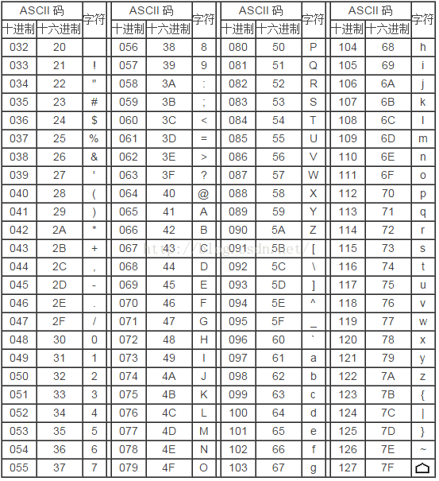

# [ES6]字符到底发生了什么变化

## 1、 JavaScript 字符编码的“坑”和“填坑”

计算机内部处理的信息，都是一个些二进制值，每一个二进制位（bit）有 0 和 1 两种状态。
一个字节（byte）有八个二进制位，也就是说，一个字节一共可以用来表示 256 种不同的状态，每一个状态对应一个符号，就是 256 个符号，从`00000000`到`11111111`。转换成十六进制，一个字节就是`0x00`到`OxFF`。

### 1.1 先来聊聊字符编码的历程

先祭出一张图，建议放大看


<b style="color: #4F86C6;">（1） ASCII 码 </b>

上个世纪 60 年代，美国制定了一套字符编码，对英语字符与二进制位之间的关系，做了统一规定。这被称为 ASCII 码(美国信息交换标准代码)，一直沿用至今。

ASCII 码一共规定了 128 个字符的编码,只占用了一个字节的后面 7 位，最前面的一位统一规定为 0。

第一部分：0 ～ 31（0x00~0x1F）及 127(共 33 个)是控制字符或通信专用字符,有些可以显示在屏幕上,有些则不能显示,但能看到其效果(如换行、退格)如下表:


第二部分：是由 20~7E 共 95 个,这 95 个字符是用来表示阿拉伯数字、英文字母大小写和下划线、括号等符号,都可以显示在屏幕上如下表:



<b style="color: #4F86C6;"> (2) 非 ASCII 编码 </b>

英语用 128 个符号编码就够了，但是世界上可不只有英语这一种语言，先不说汉语，就是那些不说英语的欧洲国家，128 个符号是不够的。

一些欧洲国家就决定，利用字节中闲置的最高位编入新的符号，这些欧洲国家使用的编码体系，可以表示最多 256 个符号。大家你加你的，我加我的。因此，哪怕它们都使用 256 个符号的编码方式，代表的字母却不一样。

1981 年 IBM PC ROM256 个字符的字符集，即 IBM 扩展字符集，这 128 个扩充字符是由 IBM 制定的,并非标准的 ASCII 码.这些字符是用来表示框线、音标和其它欧洲非英语系的字母。如下图：


在 Windows 1.0（1985 年 11 月发行）中，Microsoft 没有完全放弃 IBM 扩展字符集，但它已退居第二重要位置。因为遵循了 ANSI 草案和 ISO 标准，纯 Windows 字符集被称作「ANSI 字符集」。


由此可见扩展 ASCII 不再是国际标准。

而对于亚洲国家的文字，使用的符号就更多了，汉字就多达 10 万左右（《中华辞海》共收汉字 87019 个，日本《今昔文字镜》收录汉字超 15 万）。一个字节只能表示 256 种符号，肯定是不够的，就必须使用多个字节表达一个符号。比如，简体中文常见的编码方式是 GB2312(中华人民共和国国家标准简体中文字符集)，使用两个字节表示一个汉字，所以理论上最多可以表示 256 x 256 = 65536 个符号。其实 GB 2312 标准共收录 6763 个汉字，它所收录的汉字已经覆盖中国大陆 99.75%的使用频率。

<b style="color: #4F86C6;"> (3) Unicode </b>

之前的编码，大家在自己的国家使用都挺好的。世界上存在着多种编码方式，同一个二进制数字可以被解释成不同的符号，所以一旦不同国家进行数据传输，结果就只有乱码了。

如果有一种编码，将世界上所有的符号都纳入其中。每一个符号都给予一个独一无二的编码，那么乱码问题就会消失。这就是 Unicode，就像它的名字所表示的，这是一种所有符号的编码。

Unicode，定义很简单，用一个码点(code point)映射一个字符。码点值的范围是从 U+0000 到 U+10FFFF，可以表示超过 110 万个符号。

Unicode 最新版本的是 11.0，总共 137,374 个字符，这么看来，还是挺够用的。

Unicode 最前面的 65536 个字符位，称为基本平面（BMP-—Basic Multilingual Plane），它的码点范围是从 U+0000 到 U+FFFF。最常见的字符都放在这个平面，这是 Unicode 最先定义和公布的一个平面。
剩下的字符都放在补充平面（Supplementary Plane），码点范围从 U+010000 一直到 U+10FFFF，共 16 个。

**需要注意的是，Unicode 只是一个符号集，它只规定了符号的二进制代码，却没有规定这个二进制代码应该如何存储。**

```
// 例如下面的字符对应的码点
A的码点 U+0041
a的码点 U+0061
©的码点 U+00A9
☃的码点 U+2603
💩的码点 U+1F4A9
```

正是因为上面说的，没有规定怎么存储，所以出现了 Unicode 的多种存储方式，不同的实现导致了 Unicode 在很长一段时间内无法推广，而且本来英文字母只用一个字节存储就够了，如果 Unicode 统一规定，每个符号用三个或四个字节表示，那么每个英文字母前都必然有二到三个字节是 0，这对于存储来说是极大的浪费，文本文件的大小会因此大出二三倍，这是无法接受的。

在这个时候往往需要一个强大的外力推动，大家诉诸于利益，共同实现一个目标。所以，真正意义上的互联网普及了，地球变成了村子，交流越来越多，乱码是怎么能行。

<b style="color: #4F86C6;"> (4) UTF-8、UTF-16、UTF-32 </b>

UTF（Unicode transformation format）Unicode 转换格式，是服务于 Unicode 的，用于将一个 Unicode 码点转换为特定的字节序列。
上面三种都是 Unicode 的实现方式之一。 UTF-16（字符用两个字节或四个字节表示）和 UTF-32（字符用四个字节表示），不过 UTF-8 是在互联网上使用最广的一种 Unicode 的实现方式。

`UTF-8`

1992 年开始设计，1993 年首次被正式介绍，1996 年 UTF-8 标准还没有正式落实前，微软的 CAB（MS Cabinet）规格就明确容许在任何地方使用 UTF-8 编码系统。但有关的编码器实际上从来没有实现这方面的规格。2003 年 11 月 UTF-8 被 RFC 3629 重新规范，只能使用原来 Unicode 定义的区域，U+0000 到 U+10FFFF，也就是说最多四个字节（之前可以使用一至六个字节为每个字符编码）

UTF-8 是一种变长的编码方式。它可以使用 1~4 个字节表示一个符号，根据不同的符号而变化字节长度。越是常用的字符，字节越短，最前面的 128 个字符，只使用 1 个字节表示，与 ASCII 码完全相同（也就是所说的兼容 ASCII 码）。在英文下这样就比 UTF-16 和 UTF-32 节省空间。

UTF-8 的编码规则很简单，只有二条：

1）对于单字节的符号，字节的第一位设为 0，后面 7 位为这个符号的 Unicode 码。因此对于英语字母，UTF-8 编码和 ASCII 码是相同的。

2）对于 n 字节的符号（n > 1），第一个字节的前 n 位都设为 1，第 n + 1 位设为 0，后面字节的前两位一律设为 10。剩下的没有提及的二进制位，全部为这个符号的 Unicode 码。

`UTF-16`

基本平面的字符占用 2 个字节，辅助平面的字符占用 4 个字节。也就是说，UTF-16 的编码长度要么是 2 个字节（U+0000 到 U+FFFF），要么是 4 个字节（U+010000 到 U+10FFFF）。

这里涉及到一个怎么判断两个字节是一个字符，还是两个字节加两个字节组成的四个字节是一个字符？

解决方法是：在基本平面内，从 U+D800 到 U+DFFF 是一个空段，即这些码点不对应任何字符。因此，这个空段可以用来映射辅助平面的字符。

具体来说，辅助平面的字符位共有 2<sup>20</sup>个，也就是说，对应这些字符至少需要 20 个二进制位。UTF-16 将这 20 位拆成两半，前 10 位映射在 U+D800 到 U+DBFF（空间大小 2<sup>10</sup>），称为高位（H），后 10 位映射在 U+DC00 到 U+DFFF（空间大小 2<sup>10</sup>），称为低位（L）。这意味着，一个辅助平面的字符，被拆成两个基本平面的字符表示(代理对的概念)。

所以，当我们遇到两个字节，发现它的码点在 U+D800 到 U+DBFF 之间，就可以断定，紧跟在后面的两个字节的码点，应该在 U+DC00 到 U+DFFF 之间，这四个字节必须放在一起解读。

UTF-16 编码介于 UTF-32 与 UTF-8 之间，同时结合了定长和变长两种编码方法的特点。

`UTF-32`

UTF-32 最直观的编码方法，每个码点使用四个字节表示，字节内容一一对应码点。

UTF-32 的优点在于，转换规则简单直观，查找效率高。缺点在于浪费空间，同样内容的英语文本，它会比 ASCII 编码大三倍。这个缺点很致命，导致实际上没有人使用这种编码方法，HTML 5 标准就明文规定，网页不得编码成 UTF-32。

<b style="color: #4F86C6;"> (5) UCS UCS-2 </b>

国际标准化组织（ISO）的 ISO/IEC
JTC1/SC2/WG2 工作组是 1984 年成立的，想要做统一字符集，并与 1989 年开始着手构建 UCS（通用字符集），也叫 ISO 10646 标准，当然另一个想做统一字符集的是 1988 年成立的 Unicode 团队，等到他们发现了对方的存在，很快就达成一致：世界上不需要两套统一字符集（幸亏知道的早啊）。

1991 年 10 月，两个团队决定合并字符集。也就是说，从今以后只发布一套字符集，就是 Unicode 标准，并且修订此前发布的字符集，UCS 的码点将与 Unicode 完全一致。（两个标准同时是存在）

UCS 的开发进度快于 Unicode，1990 年就公布了第一套编码方法 UCS-2，使用 2 个字节表示已经有码点的字符。（那个时候只有一个平面，就是基本平面，所以 2 个字节就够用了。）UTF-16 编码迟至 1996 年 7 月才公布，明确宣布是 UCS-2 的超集，即基本平面字符沿用 UCS-2 编码，辅助平面字符定义了 4 个字节的表示方法。

两者的关系简单说，就是 UTF-16 取代了 UCS-2，或者说 UCS-2 整合进了 UTF-16。所以，现在只有 UTF-16，没有 UCS-2。

UCS-2 使用 2 个字节表示已经有码点的字符,第一个字节在前，就是"大尾方式"（Big endian），第二个字节在前就是"小尾方式"（Little endian）。

那么很自然的，就会出现一个问题：计算机怎么知道某一个文件到底采用哪一种方式编码？

Unicode 规范定义，每一个文件的最前面分别加入一个表示编码顺序的字符，这个字符的名字叫做"零宽度非换行空格"（zero width no-break space），用 FEFF 表示。这正好是两个字节，而且 FF 比 FE 大 1。

如果一个文本文件的头两个字节是 FE FF，就表示该文件采用大尾方式；如果头两个字节是 FF FE，就表示该文件采用小尾方式。

### 1.2 JavaScript 编码方法存在的问题

最上面给出的图中字符的发展历史和 JavaScript 的诞生时间对比下，可以知道 JavaScript 如果要想用 Unicode 字符集，**比较恰的选择是 UCS-2 编码方法**，UTF-8,UTF-16 都来的晚了一些，UCS-4 倒是有的，但是英文字符本来一个字节就可以的，现在也要用 4 个字节，还是挺严重的事情的。96 年那个时候，电脑普遍配置内存 8MB-16MB，硬盘 850MB—1.2GB。

<b style="color: #c03546">ECMAScript 6 之前，JavaScript 字符编码方式使用 UCS-2，是导致之后 JavaScript 对位于辅助平面的字符（超过两个字节的字符）操作出现异常情况的根本原因。</b>

<b style="color: #c03546">ECMAScript 6 强制使用 UTF-16 字符串编码来解决字符超过两个字节时出现异常的问题，并按照这种字符编码来标准化字符串操作。</b>

JavaScript 字符串把每个 UTF-16 单元当做一个字符来处理，所以处理非 BMP（超出 U+0000 - U+FFFF 范围）的字符时，需要格外小心。JavaScript 这个设计继承自 Java，最新标准中是这样解释的，这样设计是为了“性能和尽可能实现起来简单”。因为现实中很少用到 BMP 之外的字符。

```
// 存在的问题
const text = '😂';

console.log(text.length)  //打印 2 ，其实是一个Emoji表情符
console.log(/^.$/.test(text)) // false , 正则匹配也出了问题，说不是一个字符
console.log(/^..$/.test(text)) // true , 是两个字符
console.log(text.charAt(0)) // � 前后两个字节码位都是落在U+D800到U+DFFF这个空段，打印不出东西
console.log(text.charAt(1)) // �
console.log(text.charCodeAt(0)) // 55357 转成十六进制 0xd83d
console.log(text.charCodeAt(1) //56834 转成十六进制 0xde02

// 经过查询Unicode的字符表，😂的码位是U+1f602
console.log('\u1f602' === '😂') //false
console.log('\ud83d\ude02' === '😂') // true
```

<b style="color: #fc913a">扩展：� 的 Unicode 码点是 U+FFFD，通常用来表示 Unicode 转换时无法识别的字符（也就是乱码）</b>

### 1.3 ECMAScript 6 解决字符编码的问题

<b style="color: #4F86C6;"> (1) 为解决`charCodeAt()`方法获取字符码位错误的问题，新增`codePointAt()`方法</b>

`codePointAt()`方法完全支持 UTF-16,参数接收的是编码单元的位置而非字符位置，返回与字符串中给定位置对应的码位，即一个整数。

<b style="color: #fc913a">对于 BMP 字符集中的字符，codePointAt()方法的返回值跟 charCodeAt()相同，而对于非 BMP 字符集来说，返回值不同。</b>

```
const text = '😂';

console.log(text.charCodeAt(0)) // 位置0处的一个编码单元 55357
console.log(text.charCodeAt(1)) // 位置1处的一个编码单元 56834

console.log(text.codePointAt(0)) // 位置0处的编码单元开始的码位，此例是从这个编码单位开始的两个编码单元组合的字符（四个字节），所以会打印出所有码位，即四字节的码位 128514 即0x1f602，大于0xffff，也证明了是占四个字节的存储空间。
console.log(text.codePointAt(1)) // 位置1处的编码单元开始的码位 56834
```

<b style="color: #4F86C6;"> (2) 为解决超过两个字节的码点与字符转换问题，新增了`fromCodePoint()`方法</b>

```
// 打印😂
console.log(String.fromCharCode(128514)) // 打印失败 
console.log(String.fromCharCode(55357,56834)) // 参数可以接收一组序列数字，表示 Unicode 值。打印成功 😂

console.log(String.fromCodePoint(128514)) // 打印成功 😂
console.log(String.fromCodePoint(0x1f602)) // 可以接收不同进制的参数，打印成功 😂
```

<b style="color: #4F86C6;"> (3) 为解决正则表达式无法正确匹配超过两个字节的字符问题，ES6 定义了一个支持 Unicode 的 `u` 修饰符</b>

```
const text = '😂';

console.log(/^.$/.test(text)) // false , 正则匹配出了问题，说不是一个字符
console.log(/^..$/.test(text)) // true , 是两个字符

console.log(/^.$/u.test(text)) // true， 加入 u 修饰符，匹配正确
```

<b style="color: #fc913a">注意：u 修饰符是语法层面的变更，在不支持 ES6 的 JavaScript 的引擎中使用它会导致语法错误，可以使用 RegExp 构造函数和 try……catch 来检测，避免发生语法错误</b>

<b style="color: #4F86C6;"> (4) 为解决超过\uffff 码点的字符无法直接用码点表示的问题，引入了\u{xxxxx}</b>

```
console.log('\u1f602' === '😂') //false
console.log('\ud83d\ude02' === '😂') // true

console.log('\u{1f602}' === '😂') // true
```

<b style="color: #4F86C6;"> (5) 解决字符串中有四个字节的字符的 length 问题</b>

```
const text = '笑哭了😂';

// 解决一
// 上线UTF-16如果是在辅助平面（占4个字节）的话，会有代理对，U+D800-U+DBFF和U+DC00-U+DFFF
var surrogatePair = /[\uD800-\uDBFF][\uDC00-\uDFFF]/g; // 匹配UTF-16的代理对

function firstGetRealLength(string) {
	return string
		// 把代理对改为一个BMP的字符,然后获取长度
		.replace(surrogatePair, '_')
		.length;
}
firstGetRealLength(text); // 4

// 解决二（推荐）
// 字符串是可迭代的，可以用Array.from()来转化成数组计算length
function secondGetRealLength(string) {
	return Array.from(string).length;
}
secondGetRealLength(text); // 4

// 解决三
// 使用正则新增加的修饰符u
function thirdGetRealLength(string) {
    let result = text.match(/[\s\S]/gu);
	return result?result.length:0;
}
thirdGetRealLength(text); // 4
```

<b style="color: #4F86C6;"> (5) 解决字符串中有四个字节的字符的字符串反转问题</b>

```
const text = '笑哭了😂';

function reverse(string) {
    return string.split('').reverse().join('');
}

function reversePlus(string) {
	return Array.from(string).reverse().join('');
}

console.log(reverse(text)) // ��了哭笑 因为😂是\ud83d\ude02反转后是\ude02\ud83d,不是一个合法的代理对（高低字节范围不同）
console.log(reversePlus(text)) // 😂了哭笑
```

### 2、 ECMAScript 6 模板字面量

模板字面量的填补的 ES5 的一些特性

- 多行字符串
- 基本的字符串格式化,有将变量的值嵌入字符串的能力
- HTML 转义，向 HTML 中插入经过安全转换后的字符串的能力

<b style="color: #4F86C6;">(1)多行字符串中反撇号中的所有空白符都属于字符串的一部分</b>

```
let message = `a
            b`;
console.log(message.length) //15
```

<b style="color: #4F86C6;">(2)标签模板：模板字符串可以紧跟在一个函数名后面，该函数将被调用来处理这个模板字符串。这被称为“标签模板”功能（tagged template）。</b>

标签模板其实不是模板，而是函数调用的一种特殊形式。“标签”指的就是函数，紧跟在后面的模板字符串就是它的参数。

```
let a = 5;
let b = 10;
function tag(s, v1, v2) {
  console.log(s[0]);
  console.log(s[1]);
  console.log(s[2]);
  console.log(v1);
  console.log(v2);

  return "OK";
}

// 标签模板调用
tag`Hello ${ a + b } world ${ a * b }`;
// 等同于
tag(['Hello ', ' world ', ''], 15, 50);

//打印
// "Hello "
// " world "
// ""
// 15
// 50
// "OK"
```

“标签模板”的一个重要应用，就是过滤 HTML 字符串，防止用户输入恶意内容。标签模板的另一个应用，就是多语言转换（国际化处理）。

### 参考链接

[字符编码笔记：ASCII，Unicode 和 UTF-8](http://www.ruanyifeng.com/blog/2007/10/ascii_unicode_and_utf-8.html)

[谈谈 Unicode 编码——其中有“大尾”和“小尾”的来源描述小人国呦](http://www.pconline.com.cn/pcedu/empolder/gj/other/0505/616631.html)

[字符编码趣闻](https://qiqihaobenben.gitbooks.io/front-end-basics/content/article/oldTechnologyArticle/zifubianma.html)

[Javascript 有个 Unicode 的天坑](http://www.alloyteam.com/2016/12/javascript-has-a-unicode-sinkhole/)

[Unicode 与 JavaScript 详解](http://www.ruanyifeng.com/blog/2014/12/unicode.html)

[UTF-8, a transformation format of ISO 10646](http://www.ietf.org/rfc/rfc3629.txt)

[ASCII](https://zh.wikipedia.org/wiki/ASCII)

[UTF-8](https://zh.wikipedia.org/wiki/UTF-8)

[UTF-8 遍地开花](http://utf8everywhere.org/zh-cn)

[UTF-16](https://zh.wikipedia.org/wiki/UTF-16)

[通用字符集](https://zh.wikipedia.org/wiki/%E9%80%9A%E7%94%A8%E5%AD%97%E7%AC%A6%E9%9B%86)

[Unicode 官网](http://www.unicode.org/)

[Javascript 诞生记](http://www.ruanyifeng.com/blog/2011/06/birth_of_javascript.html)
