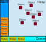
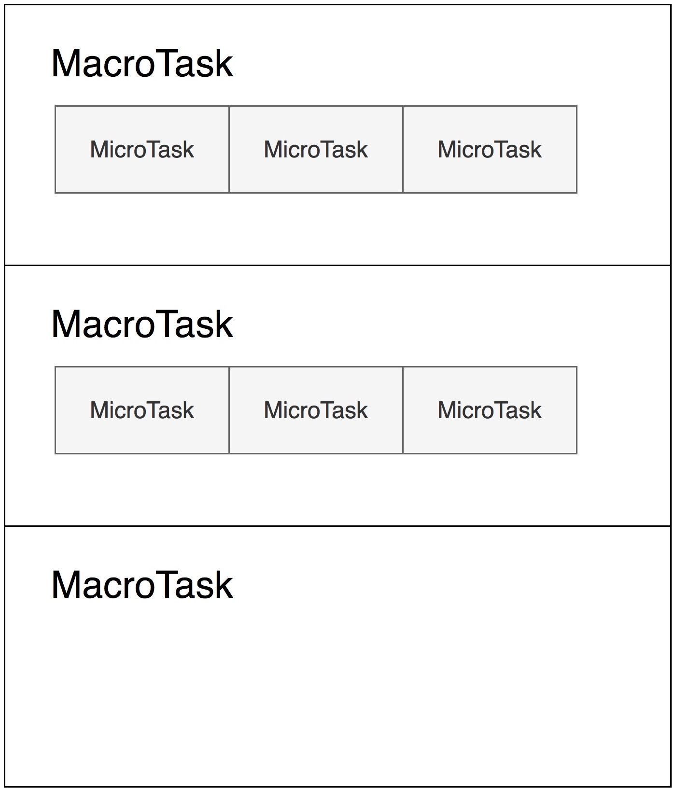
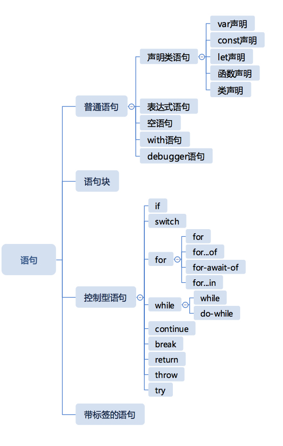

# JavaScript 引擎的执行原理

当拿到一段 JavaScript 代码时，浏览器或者 Node 环境首先要做的就是：传递给 JavaScript 引擎，并要求它去执行。

以浏览器为例，所有包含在脚本元素中的 JavaScript 代码由浏览器的 JavaScript 引擎执行，例如 Firefox 的 Spidermonkey 引擎，Chrome 和 Opera 的 V8 引擎和 Edge 的（IE 的）Chakra 引擎，Edge 后来改为 V8 引擎。

## JavaScript 引擎执行的三个阶段

- 词法和语法分析阶段
- 预处理阶段
- 代码执行阶段

不论是外部脚本文件（不异步加载），还是内部脚本代码块，都是一样的原理，并且都在同一个全局作用域中。浏览器首先按顺序加载由`<script></script>`标签引入 JavaScript 文件（通过 src 引入）或分隔的 JavaScript 代码块，加载 JavaScript 代码完毕后，立刻进入以上三个阶段，然后再按顺序查找下一个 JavaScript 代码块，再继续执行以上三个阶段。

## 词法和语法分析阶段

JavaScript 脚本代码块，会首先进入语法分析阶段。该阶段主要作用是：分析该 JavaScript 脚本代码块的词法和语法是否正确，如果出现不正确，则向外抛出一个语法错误（SyntaxError），停止该 JavaScript 代码块的执行，然后继续查找并加载下一个代码块；如果语法正确，则进入预编译阶段。

### 词法分析详情（附链接）

### 语法分析详情（附链接）

## 预处理阶段

JavaScript 代码块经过语法分析正确后，会进入预处理阶段（有时也叫预编译阶段）。预处理阶段会启动 JavaScript 的预处理机制。

### 预处理机制

JavaScript 执行前，会对脚本、模块、函数体和块级作用域中的语句进行预处理。预处理过程将会提前处理 var 语句、函数声明、class 声明、const 和 let 语句，以确定其中变量的意义。

词法环境又称作用域，可以分类：

- 全局环境，包括脚本和模块
- 函数环境
- 块环境

#### var 声明

var 声明永远作用于全局（脚本、模块）和函数体这个级别，**在预处理阶段，不关心赋值的部分，只是在当前作用域声明这个变量**。

```
var a = 1;

function foo() {
    console.log(a);
    var a = 2;
}

foo(); // 打印：undefined
```

上面的代码声明了脚本级别的 a，又声明了 foo 函数体级别的 a，虽然函数体级别的 var 是在 console.log 语句之后，但是预处理过程在执行之前，所以有函数体级别的变量 a ，就不会去访问外层作用域中的变量 a 了，不过函数体级别的变量 a 此时还没有赋值，所以是 undefined。

```
var a = 1;

function foo() {
    console.log(a);
    if(false) {
        var a = 2;
    }
}

foo(); // 打印：undefined
```

这段代码跟上一段代码相比唯一的区别是 `var a = 2` 外面包了一个 `if`，我们知道 `if(false)` 中的代码永远不会被执行，但是不影响预处理，var 的作用能够穿透一切语句结构，它只认脚本、模块和函数体三种语法结构。所以这里的结果跟上一段代码完全一样，会得到 undefined。

**注：当使用关键字 var 时，该变量是在距离最近的函数内部或全局词法环境中定义的（注意：忽略块级作用域），这种行为有些怪异，因此 ES6 提供了两个新的声明变量的关键字：let 和 const。let 和 const 直接在最近的词法环境中定义变量（可以是在块级作用域内：例如循环中、函数内或全局环境内），我们可以使用 let 和 const 定义块级别、函数级别、全局级别的变量。**

#### function 声明

在全局（脚本、模块、和函数体级别），function 声明表现跟 var 类似，不同之处在于，**function 声明在预处理阶段不只是在作用域中声明了，还进行了赋值。**

```
console.log(foo);
function foo() {

}
```

这段代码声明了函数 foo，在声明之前，我们用 console.log 打印函数 foo，可以发现打印出来的已经是函数 foo 的值了。

**function 声明出现在 if 等语句中（块级作用域）的情况比较复杂，它仍然作用于脚本、模块和函数体级别，在预处理阶段，仍然会产生变量，但是不再被提前赋值。**

```
console.log(foo);
if(true) {
  function foo() {

  }
}
```

注：出现在 if 等语句中的 function，在 if 创建的作用域中仍然会被提前，并且产生赋值的效果。

#### class 声明

class 声明在全局的行为跟 function 和 var 都不一样。

在 class 声明之前使用 class 名，会抛出错误。很像是 class 没有预处理，但是实际上并非如此，class 声明也会被预处理，它会在作用域中创建变量，并要求在声明之前访问它时抛出错误。

```
console.log(c);
class c{

}
```

上面的代码试图在 class 声明前打印变量 c，跟没有预处理一样，报错了。

```
var c = 1;
function foo(){
    console.log(c);
    class c {}
}
foo();
```

我们把实例代码修改一下，class 放入函数体中，在外层作用域中有变量 c，然后试图在 class 之前打印 c，执行后发现仍然抛出了错误，如果去掉 class 声明，则会正常打印出 1，说明出现在后面的 class 声明影响了前面语句的结果。

注 1：class 声明作用不会穿透 if 等语句结构，所以只有写在全局环境才会有声明作用。

注 2：class 设计比 function 和 var 更符合直觉，而且在遇到一些比较奇怪的用法时，倾向抛出错误，按照现代语言设计的评价标准，及早抛错是好事，它能够帮助我们尽量在开发阶段就发现代码可能存在的问题。

注 3：const 和 let 跟 class 的机制相同。

#### 总结整个预处理的过程

详细来说，经过 JavaScript 引擎的词法和语法分析阶段，一旦创建了新的词法环境，就会执行预处理阶段。在这一阶段，没有执行代码，但是 JavaScript 引擎会访问并注册在当前词法环境中所声明的变量和函数（预处理）。

具体的预处理过程如下：

1. 如果是创建一个函数环境，那么创建形参及函数参数的默认值。如果是非函数环境，将跳过此步骤。
2. 如果是创建全局或函数环境，就扫描当前代码进行函数声明（不会扫描其他函数的函数体），但是会忽略函数表达式或箭头函数。对于所找到的函数声明，将创建函数，并绑定到当前环境与函数名相同的标识符（变量）上。若该标识符已经存在，那么该标识符的值将被重写。如果是块级作用域，将跳过此步骤。
3. 扫描当前代码进行变量声明。在全局或函数环境中，查找所有当前函数以及其他函数之外通过 var 声明的变量，并查找所有通过 let 或 const 定义的变量。在块级环境中，仅查找当前块中通过 let 或 const 定义的变量。对于所查找到的变量，若该标识符不存在，进行注册并将其初始化为 undefined。若该标识符已经存在，将保留原来的值。

在其他地方可能会成为“变量提升”，但是通过上面描述可以看出，变量和函数声明并没有实际发生移动。只是代码执行之前，现在词法环境中进行了注册。

## JavaScript 代码执行阶段

预处理阶段后，就进入了 JavaScript 引擎的代码执行阶段。

### 运行环境(词法环境)

JavaScript 代码的运行环境主要有四种：

- 全局环境（包括全局的代码和模块）：JavaScript 代码加载完毕后，进入代码预编译即进入全局环境。
- 函数环境：函数调用执行时，进入该函数环境，不同的函数则函数环境不同。
- 块环境：ES6 新增的块级环境。
- eval：不建议使用，会有安全、性能问题。

每进入一个不同的运行环境都会创建一个相应的执行上下文（Execution Context），那么在一段 JavaScript 程序中一般都会创建多个执行上下文，JavaScript 引擎会以栈的方式对这些执行上下文进行处理，形成调用栈（call stack）。

### 词法环境和变量作用域

#### 使用词法环境跟踪变量的作用域

词法环境（lexical environment）是 JavaScript 引擎内部用来跟踪标识符和特定变量之间的映射关系。

**词法环境是 JavaScript 作用域的内部实现机制，人们通常称为作用域（scopes）。**

通常来说，词法环境与特定的 JavaScript 代码结构关联，既可以是一个函数、一段代码片段，也可以是 try-catch 语句。这些代码结构（函数、代码片段、try-catch）可以具有独立的标识符映射表。

#### 代码嵌套

词法环境主要基于代码嵌套，通过代码嵌套可以实现代码结构包含另一代码结构。

在作用域范围内，每次执行代码时，代码结构都获得与之关联的词法环境。例如，每次调用一个函数，都将创建新的函数词法环境。

内部代码结构可以访问外部代码结构中定义的变量。这种访问变量的方式我们已经习以为常了，但是 JavaScript 引擎是如何跟踪这些变量的呢？如何判断可访问性的呢？这就是词法环境的作用。

#### 代码嵌套与词法环境

有代码嵌套时，除了跟踪局部变量、函数声明、函数的参数和词法环境外，还有必要跟踪外部（父级）的词法环境。因为我们需要访问外部代码结构中的变量，如果在当前环境中无法找到某一标识符，就会对外部环境进行查找。一旦查找到匹配的变量，或是在全局环境中仍然无法查找到对应的标识符而返回错误，就会停止查找。

##### 为什么不直接跟踪整个执行上下文

为什么不直接跟踪整个执行上下文，直接搜索与环境相匹配的标识符映射表呢？因为 JavaScript 函数可以作为任意对象进行传递，定义函数时的环境与调用函数时的环境往往是不同的。（例如闭包的某些场景）

#### 函数与词法环境

在特定的执行上下文中，我们的程序不仅直接访问词法环境中定义的局部变量，而且还会访问外部环境中定义的变量。为了实现这一点，我们需要跟踪这些外部环境。JavaScript 实现这一点得益于函数是第一类对象的特性。

无论何时调用函数，都会创建一个新的执行上下文，被推入执行上下文栈，每个执行上下文都有一个与之关联的词法环境，词法环境中包含了在上下文中定义的标识符的映射表。

此外被调用的函数在一开始创建的时候，同时还会创建一个与之相关联的外部词法环境（只要至少有一个通过闭包访问外部环境变量的函数存在，这个环境就会一直保存），并存储在名为 `[[Environment]]` 的内部属性上（内部属性无法直接访问或操作）。两个中括号用于标志内部属性。

最重要的是：外部环境与新建的词法环境之间的关系，JavaScript 引擎将调用函数内置 `[[Environment]]`属性与创建函数时的外部环境进行关联。（《JavaScript 忍者秘籍图 5.9》）

#### 扩展

在 JavaScript 的 ES6 初版中，词法环境只能与函数关联。变量只存在于函数作用域中。这带来了一些混淆，因为 JavaScript 是一门类 C 的语言，从其他类 C 语言（C++、C#、Java 等）转向 JavaScript 的开发者通常会预期一些初级概念，例如块级作用域。在 ES6 中最终修复了块级作用域问题。

### JavaScript 的运行时概念



#### 栈

函数调用形成了一个由若干帧组成的栈。

#### 堆

对象被分配在堆中，堆是一个用来表示一大块（通常是非结构化的）内存区域的计算机术语。

#### 队列

一个 JavaScript 运行时包含一个待处理任务的任务队列。每一个任务都关联着一个用以处理这个任务的回调函数。

在事件循环期间的某个时刻，运行时会从最先进入队列的任务开始处理队列中的任务。被处理的任务会被移出队列，并作为输入参数来调用与之关联的函数。正如前面所提到的，调用一个函数总会为其创造一个新的栈帧。

函数的处理会一直进行到执行栈再次为空为止；然后事件循环将会处理队列中的下一个任务（如果还有的话）。

### JavaScript 的执行上下文

JavaScript 中与闭包“环境部分”相对应的属性是“词法环境”，但是 JavaScript 函数比 λ 函数要复杂的多，还要处理 this，变量声明、with 等等一系列的复杂语法，所以在 JavaScript 的设计中，词法环境只是 JavaScript 执行上下文的一部分。

JavaScript 标准把一段代码（包括函数），执行所需的所有信息定义为：“执行上下文”。

执行上下文在 ES3 中，包含三个部分：

- scope：作用域，也常常被叫做作用域链。
- variable object：变量对象，用于存储变量的对象
- this value：this 值。

在 ES5 中，改进了命名方式：

- lexical environment：词法环境，当获取变量时使用。
- variable environment： 变量环境，当声明变量时使用。
- this value：this 值

在 ES2018 中，执行上下文又变成了下面这个样子，this 值被归入 lexical environment

- lexical environment：词法环境，当获取变量或者 this 值时使用。
- variable environment：变量环境，当生命变量时使用。
- code evaluation state：用于恢复代码执行位置。
- Function：执行的任务是函数时使用，表示正在被执行的函数。
- ScriptOrModule: 执行的任务是脚本或者模块时使用，表示正在被执行的代码。
- Realm：使用的基础库和内置对象实例。
- Generator：仅生成器上下文有这个属性，表示当前生成器。

建议同意使用最新的 ES2018 中规定的术语定义。

#### 两种最普通的执行上下文

在 JavaScript 中，代码执行的基础单元是函数。JavaScript 代码有两种类型：一种是全局代码（包括脚本、模块），在所有函数外部定义；一种是函数代码，位于函数内部。

**JavaScript 引擎执行代码时，每一条语句都处于特定的执行上下文（execution context）中** 。既然具有两种类型的代码，那么就有两种执行上下文：全局执行上下文和函数执行上下文。二者最重要的差别是：全局执行上下文只有一个，当 JavaScript 程序开始执行时就已经创建了全局上下文；而函数执行上下文是在每次调用函数时，就会创建一个新的。（ES3 中每个执行上下文都有一个表示变量的对象——变量对象。全局环境的变量对象（global object）始终存在，而函数这样的局部环境的变量对象（variable object），只在函数执行的过程中存在（activation object）。调用函数时，会创建一个预先包含全局变量对象的作用域链，这个作用域链被保存在内部的[[Scope]]属性中，当调用函数是，会创建一个执行环境，然后通过复制函数的[[Scope]]属性中的对象构建起执行环境的作用域链）

在某个特定的时刻只能执行特定的代码。一旦发生函数调用，当前的执行上下文必须停止执行，并创建新的函数执行上下文来执行函数。当函数执行完成后，将函数执行上下文销毁，并重新回到发生调用时的执行上下文中（以上所说的过程也称为“切换上下文”）。所以需要跟踪执行上下文——正在执行的上下文以及正在等待的上下文。最简单的跟踪方法是使用执行上下文栈（execution context stack）或称为调用栈（call stack）

例如：

```
function skulk(ninja) {
  report(ninja + " skulking");
}
function report(message) {
  console.log(message);
}

skulk('Kuma')
```

上面的代码，执行上下文的行为如下：

1. 每个 JavaScript 程序只创建一个全局执行上下文，并从全局执行上下文开始。当执行全局代码时，全局执行上下文处于活跃状态。
2. 首先在全局代码中定义两个函数：skulk 和 report，然后调用 skulk('Kuma')。由于在同一个特定时刻只能执行特定代码，所以 JavaScript 引擎停止执行全局代码，开始执行带有 Kuma 参数的 skulk 函数。创建新的函数执行上下文，并置于执行上下文栈的顶部。
3. skulk 函数进而调用 report 函数。又一次因为在同一个特定时刻只能执行特定代码，所以，暂停 skulk 执行上下文，创建新的 Kuma skulking 作为参数的 report 函数的执行上下文，并置于执行上下文栈的顶部。
4. report 通过内置函数 console.log 打印出消息后，report 函数执行完成，代码又回到了 skulk 函数。report 函数执行上下文从执行上下文栈的顶部弹出，skulk 函数执行上下文重新激活，skulk 函数继续执行。
5. skulk 函数执行完成后也发生类似的事情：skulk 函数执行上下文从栈顶端弹出，重新激活一直在等待的全局执行上下文并恢复执行。JavaScript 的全局代码恢复执行。

#### Realm

在最新的标准（9.0）中，JavaScript 引入了一个新概念 Realm。Realm 中包含一组完整的内置对象，而且是复制关系。

对不同 Realm 中的对象操作，会有一些需要格外注意的问题，比如 instanceOf 几乎是失效的。

以下代码展示了在浏览器环境中获取来自两个 Realm 的对象，它们跟本土的 Object 做 instanceOf 时会产生差异。

```

var iframe = document.createElement('iframe')
document.documentElement.appendChild(iframe)
iframe.src="javascript:var b = {};"

var b1 = iframe.contentWindow.b;
var b2 = {};

console.log(typeof b1, typeof b2); //object object

console.log(b1 instanceof Object, b2 instanceof Object); //false true
```

可以看到，由于 b1、b2 由同样的代码“{}”在不同的 Realm 中执行，所以表现出了不同的行为。

### JavaScript 的执行模型

#### JavaScript 是基于单线程的执行模型

我们常说的“JavaScript 是单线程的”中，所谓的单线程，是指在 JavaScript 引擎中负责解释和执行 JavaScript 代码的线程只有一个（即 JS 引擎线程，例如 V8），可以理解为是**主线程**，在这个线程中，一次只能完成一个任务，如果有多个任务，就必须排队，前面的一个任务完成，再执行后面一个任务，以此类推。

但是除此之外还存在其他的线程。例如：处理 Ajax 请求的 HTTP 异步请求线程、处理 DOM 事件的事件触发线程、定时器线程、读写文件的线程。这些线程可能存在于 JavaScript 引擎之内，也可能存在于 JavaScript 引擎之外，这些线程可以理解为是**工作线程**。

这种模式的好处是实现起来比较简单，执行环境相对单纯；坏处是只要有一个任务耗时较长，后面的任务都必须排队等着，会拖延整个程序的执行。常见的浏览器无响应（假死），往往就是因为某一段 JavaScript 代码长时间运行（比如死循环），导致整个页面卡在这个地方，其他任务无法执行。为了解决这个问题，JavaScript 语言将任务的执行模式分成两种：同步（Synchronous）和异步（Asynchronous）。

##### 为什么 JavaScript 是单线程的？

JavaScript 之所以设计为单线程，这与它的用途有关。它作为浏览器脚本语言，主要用途是负责与页面的交互，以及操作 DOM，它只能是单线程的，否则它就会带来很复杂的同步问题。

比如，在网页上有若干个操作，如果是多线程的话，一个线程任务是在某个 DOM 节点上添加内容，另一个线程任务是删除这个节点，这时浏览器应该以哪个线程为准？

所以为了避免复杂性，从最初诞生，JavaScript 就是单线程的，这时语言的核心特征，将来也不会改变。

不过这里的单线程是指在 JavaScript 引擎中负责解释和执行 JavaScript 代码的线程只有一个，但浏览器是多线程的，两个并不矛盾，浏览器只是 JavaScript 运行环境的宿主。

后来，为了利用多喝 CPU 的计算能力，HTML5 提出 Web Worker 标准，允许 JavaScript 脚本创建多个线程，但是子线程完全受主线程控制，且不得操作 DOM。所以这个标准并没有改变 JavaScript 单线程的本质。

##### 扩展

进程：它是系统进行资源分配和调度的一个独立单位，具有一定独立功能的程序关于某个数据集合上一次运行活动，可以粗略的理解为主（大）任务。

线程：安排 CPU 执行的最小单位，可以理解为子任务。线程可以视作进行的子集，一个进程可以有多个线程并发执行。

进程和线程的主要差别在于，他们是不同的操作和管理系统资源的方式。进程有独立的地址空间，一个进程崩溃后，在保护模式下不会对其他进程产生影响，而线程只是一个进程中的不同执行路径。线程有自己的堆栈和局部变量，但线程之间没有单独的地址空间，一个线程死掉就等于整个进程死掉，所以多进程的程序要比多线程的程序健壮，但在进程切换时，耗费资源较大，效率要差一些。但对于一些要求同时进行并且又要共享某些变量的并发操作，只能用线程，不能用进程。

#### 同步和异步

##### 同步：

广义上，同步模式就是后一个任务等待前一个任务结束，然后再执行，程序的执行顺序与任务的排列顺序是一致的、同步的；

狭义上，假设存在一个函数 A，同步就是如果函数 A 在返回的时候，调用者就能够得到预期结果（即拿到了预期的返回值或者看到了预期的效果），那么这个函数就是同步的。

##### 异步：

广义上，异步模式是每一个任务有一个或多个回调函数（callback），前一个任务结束后，不是执行后一个任务，而是执行回调函数，后一个任务则是不等前一个任务结束就执行，所以程序的执行顺序与任务的排列顺序是不一致的，异步的。

狭义上，假设存在一个函数 A，异步就是如果在函数 A 返回的时候，调用者还不能够得到预期结果，而是需要在将来通过一定的手段得到，那么这个函数就是异步的。

异步模式非常重要。在浏览器端，耗时很长的操作都应该异步执行，避免浏览器失去响应，最好的例子就是 Ajax 操作。在服务器端，异步模式甚至是唯一的模式，因为执行环境是单线程的，如果允许同步执行所有 http 请求，服务器性能会急剧下降，很快就会失去响应。

##### 异步过程的构成要素

显然，异步函数实际上很快就调用完成了。但是后面还有工作线程执行异步任务、通知主线程、主线程调用回调函数等很多步骤。我们把整个过程叫做异步过程。异步函数的调用在整个一步过程中，只是一小部分。

一个异步过程通常是这样的：

主线程发起一个异步请求，相应的工作线程接收请求并告知主线程已收到（异步函数返回）；主线程可以继续执行后面的代码，同时工作线程执行异步任务；工作线程完成工作后，通知主线程；主线程收到通知后，执行一定的动作（调用回调函数）。

异步过程中的异步函数通常具有以下的形式（一种抽象的表示，并不代表回调函数一定要作为发起函数的参数）：

```
A(args..., callbackFn)
```

上面的函数可以叫做异步过程的发起函数，或者叫做异步任务的注册函数。所以，从主线程的角度看，一个异步过程包括以下两个要素：

- 发起函数（或叫注册函数）
- 回调函数 callbackFn

例如：

```
setTimeout(fn, 1000)
```

##### 同步和异步控制代码执行顺序的方式

同步和异步控制代码执行顺序的方式不同。同步代码可以利用函数调用栈，将我们想要执行的代码放入回调函数中。异步代码是利用任务队列和事件循环，将不同的代码放入到宏任务或者微任务队列中。

### 全局环境——基本运行（页面构建）

JavaScript 在全局环境中是逐行进行读取，从上至下执行的。

#### JavaScript 中的全局对象

在浏览器中，由于代码的主要目的是提供动态页面，故而浏览器通过全局对象提供了一个 API，使 JavaScript 引擎可以与之交互并改变页面内容。

浏览器暴露给 JavaScript 引擎的主要全局对象是 window 对象，它代表了包含着一个页面的窗口。window 对象是获取所有其他全局对象、全局变量（甚至包含用户定义对象）和浏览器 API 的访问途径。全局 window 对象最重要的属性是 document，它代表了当前页面的 DOM。通过使用这个对象，JavaScript 代码就能在任何程度上改变 DOM，包括修改或移除现存的节点，以及创建和插入新的节点。

一般来说，JavaScript 代码能够在任何程度上修改 DOM 结构，它能创建新的节点或移除现有 DOM 节点。但它依然不能做某些事，例如选择和修改还没被创建的节点。这就是为什么要把 script 元素放在页面底部的原因。如此一来，我们就不必担心是否某个 HTML 元素已经加在为 DOM。

#### JavaScript 中的全局代码

我们可以根据代码的位置来确定全局代码，在所有函数之外的代码就叫做全局代码。全局代码由 JavaScript 引擎以一种直接的方式自动执行，每当遇到这样的代码就一行接一行地执行。

#### JavaScript 的全局执行上下文

进入全局环境会创建一个唯一的全局执行上下文（Global Execution Context），在调用栈中，栈底永远是全局执行上下文，栈顶则永远是当前执行上下文。

#### 页面构建阶段，JavaScript 代码在全局的执行情况

当浏览器在页面构建阶段遇到了脚本节点，它会停止 HTML 到 DOM 的构建，转而开始执行 JavaScript 代码，也就是执行包含在脚本元素的全局 JavaScript 代码（以及由全局代码执行中调用的函数代码）。一旦 JavaScript 引擎执行到了脚本元素中 JavaScript 代码的最后一行，浏览器就推出了 JavaScript 执行模式，并继续将余下的 HTML 构建为 DOM 节点。在这期间，如果浏览器再次遇到脚本元素，那么从 HTML 到 DOM 的构建再次暂停，JavaScript 运行环境开始执行余下的 JavaScript 代码。需要重点注意：JavaScript 应用在此时依然会保持全局状态。所有在某个 JavaScript 代码执行期间用户创建的全局变量都能正常被其他脚本元素中的 JavaScript 代码所访问到。原因在于全局 window 对象会存在于整个页面的生命周期之间，在它上面存储着所有的 JavaScript 变量。

只要还有没处理完的 HTML 元素和没执行完的 JavaScript 代码，下面两个步骤都会一直交替执行：

- 将 HTML 构建为 DOM。
- 执行 JavaScript 代码。（即执行 JavaScript 引擎的三个阶段）

最后，当浏览器处理完所有 HTML 元素后，页面构建阶段就结束了。随后浏览器就会进入应用生命周期的第二部分：事件处理。

### 全局环境——异步执行（事件处理/循环）

单线程就意味着，所有任务需要排队，前一个任务结束，才会执行后一个任务。如果前一个任务耗时很长，后一个任务就不得不一直等着。

不过执行 JavaScript 代码并非同步执行一次，而且 JavaScript 是单线程的，那又是如何实现异步的呢？就是通过事件循环（event loop）实现的。JavaScript 有一个基于事件循环的并发模型，事件循环负责执行代码、收集和处理事件以及执行队列中的子任务。

在 ES3 和更早的版本中，JavaScript 本身还没有异步执行代码的能力（注意是 JavaScript “本身”没有，宿主环境是有的，例如“事件”），宿主环境传递给 JavaScript 引擎一段代码，引擎就把代码直接顺次执行了，这个任务也就是宿主发起的任务。

但是在 ES5 之后，JavaScript 引入了 Promise，这样，不需要浏览器的安排，JavaScript 引擎本身也可以发起任务了。根据 JSC 引擎的术语，宿主发起的任务称为宏观任务，把 JavaScript 引擎发起的任务称为微观任务。

#### 异步执行的机制

在异步过程中，工作线程在异步操作完成后需要通知主线程，通知机制可以利用任务队列和事件循环。

工作线程将任务放到任务队列，主线程通过事件循环过程去取任务。

- 任务队列：任务队列是一个先进先出的事件队列，它里面存放和各种事件。（也可以理解为消息的队列）
- 事件循环：事件循环是指主线程重复从任务队列中取任务，执行的过程。

异步执行的运行机制如下：

（1）所有同步任务都在主线程上执行，形成一个执行栈（execution context stack）。
（2）主线程之外，还存在一个“任务队列”（task queue）。只要异步任务有了运行结果，就在“任务队列”之中放置一个事件。
（3）一旦“执行栈”中的所有同步任务执行完毕，系统就会读取“任务队列”，看看里面有哪些事件，那些对应的异步任务，于是结束等待状态，进入执行栈，开始执行。
（4）主线程不断重复上面的第三步。

实际上，主线程只会做一件事，只要主线程空了，就会去任务队列里面取任务、执行任务、再取任务、再执行。当任务队列为空时，就会等待直到任务队列变成非空。而且主线程只有在将当前的任务执行完成后，才会去取下一个任务。这个过程是循环不断的，所以这种机制就叫做事件循环机制，取一个任务并执行的过程叫做一次循环。

任务的具体结构跟具体的实现有关，简单起见，可以认为：任务就是注册异步任务时添加的回调函数。并且，异步过程的回调函数，一定不在当前这一轮事件循环中执行。

从生产者和消费者的角度看，异步过程是这样的：

工作线程是生产者，主线程是消费者（只有一个消费者）。工作线程执行异步任务，执行完成后把对应的回调函数封装成一条任务放到任务队列中；主线程不断地从任务队列中取任务并执行。


#### 事件循环

事件循环为什么里面有个“事件”呢？那是因为任务队列中的每条任务实际上都对应着一个事件。有一类很重要的异步过程就是 DOM 事件。客户端 Web 应用是一种 GUI 应用。也就是说这种应用会对不同类型的事件作响应，如鼠标移动、单击等。因此，在页面构建阶段执行的 JavaScript 代码，除了会影响全局应用状态和修改 DOM 外，还会注册事件监听器（或处理器）。这类监听器会在事件发生时，由浏览器调用执行。

事件的概念实际上并不是必须的，事件机制实际上就是异步过程的通知机制。只不过，Promise 之前，异步任务都是宿主用事件注册的。

“循环”是因为它经常按照类似如下的方式来实现：

```
while (queue.waitForMessage()) {
  queue.processNextMessage();
}
```

事件循环基于两个基本原则：

- 一次处理一个任务。
- 一个任务开始后直到运行完成，不会被其他任务中断。

##### 事件处理器概览

浏览器执行环境的核心思想基于：同一时刻只能执行一个代码片段，即所谓的单线程执行模式。可以类比银行柜台排队，但 JavaScript 只开启了一个营业柜台。

当一个事件抵达后，浏览器需要执行相应的事件处理函数，浏览器需要一种方式来跟踪已经发生但尚未处理的事件，为了实现这个目标，浏览器使用了事件队列。所有已生成的事件都会放在同一个事件队列中，以它们被浏览器检测到的顺序排列。事件处理的过程可以简单描述为：

- 浏览器检查事件队列头；
- 如果浏览器没有在队列中检测到事件，则继续检查；
- 如果浏览器在队列头中检测到了事件，则取出该事件并执行相应的事件处理器（如果存在）。在这个过程中，余下的事件在事件队列中耐心等待，直到轮到它们被处理。

由于一次只能处理一个事件，所以我们必须格外注意处理所有事件的总时间。执行需要花费大量时间执行的事件处理函数会导致 Web 应用无响应！而且要重点注意，放置事件的队列是独立于主线程的，事件被推入事件队列完全取决于事件何时发生，何时从事件队列中取出执行，则取决于主线程是否空闲。

事件是异步的，事件可能会以难以预计的时间和顺序发生。我们对事件的处理，以及处理函数的调用是异步的。

事件的类型大概如下：

- 浏览器事件，例如当页面加载完成后或无法加载时；
- 网络事件，例如来自服务器的响应（Ajax 事件和服务器端事件）；
- 用户事件，例如鼠标单击、鼠标移动和键盘事件；
- 计时器事件，当 timeout 时间到期或又触发了一次时间间隔。

Web 应用的 JavaScript 代码中，大部分内容都是对上述事件的处理。


上图中，主线程运行的时候，产生堆（heap）和栈（stack），栈中的代码调用各种外部 API，它们在“任务队列”中加入各种事件（click，load，done）。只要栈中的代码执行完毕，主线程就会去读取“任务队列”，依次执行那些事件所对应的回调函数。

##### 注册事件处理器

事件处理器是当某个特定事件发生后我们希望执行的函数，所以，我们必须告知浏览器要处理哪个事件。这个过程叫作注册事件处理器。在客户端 Web 应用中，有两种方式注册事件。

- 通过把函数赋给某个特殊属性；
- 通过使用内置 addEventListener 方法。

##### 处理事件

事件处理背后的主要思想是：当事件发生时，浏览器调用相应的事件处理器。如前面提到的，由于单线程执行模型，所以同一时刻只能处理一个事件。任何后面的事件都只能在当前事件处理器完全结束执行后才能被处理。在事件处理阶段，事件循环会检查队列。

##### 宏观和微观任务

JavaScript 引擎等待宿主环境分配宏观任务，在操作系统中，通常等待的行为都是一个事件循环，所以一在 Node 术语中，也会把这部分称为事件循环。

事件循环的原理，在底层的 C/C++代码中，这个事件循环是一个跑在独立线程中的循环，我们用伪代码来表示大概是这样的：

```
while(TRUE) {
  r = wait();
  execute(r);
}
```

整个循环做的事情基本上就是反复“等待——执行”。

这里每次的执行过程，其实都是一个宏观任务。我们可以大概理解：宏观任务的队列就相当于事件循环。

在宏观任务中，JavaScript 的 Promise 还会产生异步代码，JavaScript 必须保证这些异步代码在一个宏观任务中完成，因此，每个宏观任务中又包含了一个微观任务队列：



有个宏观任务和微观任务机制，我们就可以实现 JavaScript 引擎级和宿主级的任务了，例如：Promise 永远在当前宏观任务的微观任务队列尾部添加微观任务。script 标签或 setTimeout 等宿主 API，则会添加宏观任务。

宏任务的例子很多，包括创建主文档对象、解析 HTML、执行主线（或全局）JavaScript 代码，更改当前 URL 以及各种事件，如页面加载、输入、网络事件和定时器事件。从浏览器的角度来看，宏任务代表一个个离散的、独立工作单元。运行完任务后，浏览器可以继续其他调度，如重新渲染页面的 UI 或执行垃圾回收。

而微任务是更小的任务。微任务更新应用程序的状态，但必须在浏览器任务继续执行其他任务之前执行，浏览器任务包括重新渲染页面的 UI。微任务的案例包括 Promise 回调函数、DOM 发生变化等。微任务需要尽可能快得通过异步方式执行，。微任务使得我们能够在重新渲染 UI 之前执行指定的行为，避免不必要的重绘，UI 重绘会使应用程序的状态不连续。

事件循环的实现至少应该含有一个用于宏任务的队列和至少一个用于微任务的队列。大部分的实现通常会更多用于不同类型的宏任务和微任务的队列。这使得事件循环能够根据任务类型进行优先处理。例如，优先考虑对性能敏感的任务，如用户输入。另一方面，由于市面上的浏览器和 JavaScript 执行环境多如牛毛，所以如果发现所有任务都在一个队列的事件循环，也不要过分惊讶。

全局来看，事件循环将首先检查宏任务队列，如果宏任务等待，则立即开始执行宏任务。直到该任务（每次执行一项任务）运行完成（或队列为空），事件循环将移动去处理微任务队列。如果有任务在该队列中等待，则事件循环将依次开始执行，完成一个后继续执行余下的微任务，直到队列中所有微任务执行完毕。**注意处理宏任务和微任务队列之间的区别：单次循环迭代中，最多处理一个宏任务（其余的在队列中等待），而队列中的所有微任务都会被处理。**

当微任务队列处理完成并清空时，事件循环会检查是否需要更新 UI 渲染，如果是，则会重新渲染 UI 视图。至此，当前事件循环结束，之后将回到最初第一个环节，再次检查红任务队列，并开启新一轮的事件循环。

##### Promise

Promise 是 JavaScript 语言提供的一种标准化的异步管理方式，它的总体思想是，需要进行 io、等待或者其他异步操作的函数，不返回真实结果，而返回一个“承诺”，函数的调用方可以在合适的时机，选择等待这个承诺兑现（通过 Promise 的 then 方法的回调）。

Promise 的 then 回调是一个异步的执行过程，Promise 函数中的执行顺序可以通过一段代码来看：

```
var r = new Promise(function(resolve, reject) {
  console.log("a")
  resolve()
})
r.then(() => console.log("c"))
console.log("b")
```

执行这段代码，输出的顺序是 a b c 。

在下面的代码中，加入 setTimeout，形成两段互不相干的异步操作：

```
var r = new Promise(function(resolve, reject) {
  console.log("a")
  resolve()
})
setTimeout(() => console.log("d"), 0)
r.then(() => console.log("c"))
console.log("d")
```

执行这段代码，输出的顺序是 a b c d 。可以发现，不论代码顺序如何，d 必定发生在 c 之后，因为 Promise 产生的是 JavaScript 引擎内部的微任务，而 setTimeout 是浏览器 API，它产生的是宏任务。

为了理解微任务始终先于宏任务，我们设计一个实验：执行一个耗时 1 秒的 Promise，这里强制了 1 秒的耗时，可以确保任务 c2 是在 d 之后被添加到任务队列。

```
setTimeout(() => console.log("d"), 0)
var r = Promise.resolve()
r.then(() => {
  var begin = Date.now()
  while(Date.now() - begin < 1000);
  console.log("c1")
  new Promise(function(resolve, reject) {
    resolve()
  }).then(() => console.log("c2"))
})
```

即使是耗时一秒的 c1 执行完毕，在 enque 的 c2，仍然先于 d 执行了，这很好地解释了微任务有限的先例。

Promise 是 JavaScript 中的一个定义，但是实际编写代码时，我们可以发现，它似乎并不比回调的方式书写更简单。但是从 ES6 开始，我们有个 async/await，这个语法改进跟 Promise 配合，能够有效的改善代码结构。

##### async/await

async/await 是 ES2016 新加入的特性，它提供了用 for、if 等代码结构来编写异步的方式。它的运行时基础是 Promise。

async 函数必定返回 Promise，我们把所有返回 Promise 的函数都可以认为是异步函数。

```
function sleep(duration) {
  return new Promise(function(resolve, reject) {
    setTimeout(resolve,duration);
  })
}
async function foo() {
  console.log("a")
  await sleep(2000)
  console.log("b")
}
foo()
```

async 函数的强大之处在于，它是可以嵌套的。我们在定义了一批原子操作的情况下，可以利用 async 函数组合出新的 async 函数。

此外，generator/iterator 也常常跟异步一起来讲，必须说明 generator/iterator 并非异步代码。只是在缺少 async/await 的时候，一些框架（例如 co）使用这样的特性来模拟 async/await。但是 generator 并非被设计成实现异步，所以有了 async/await 之后，generator/iterator 来模拟异步的方法应该被废弃。

##### 异步总结

把宿主发起的任务称为宏观任务，把 JavaScript 引擎发起的任务称为微观任务。许多的微观任务的队列组成了宏观任务。

通过一系列的实验，总结一下如何分析异步执行的顺序：

- 首先我们分析有多少个宏任务；
- 在每个宏任务中，分析有多少个微任务；
- 根据调用次序，确定宏任务中的微任务执行次序；
- 根据宏任务的触发规则和调用次序，确定宏任务的执行次序；
- 确定整个顺序。

### 函数环境

在 JavaScript 中，代码执行的基础单元是函数。JavaScript 代码有两种类型：一种是全局代码（包括脚本、模块），在所有函数外部定义；一种是函数代码，位于函数内部。

**JavaScript 引擎执行代码时，每一条语句都处于特定的执行上下文（execution context）中** 。既然具有两种类型的代码，那么就有两种执行上下文：全局执行上下文和函数执行上下文。二者最重要的差别是：全局执行上下文只有一个，当 JavaScript 程序开始执行时就已经创建了全局上下文；而函数执行上下文是在每次调用函数时，就会创建一个新的。（ES3 中每个执行上下文都有一个表示变量的对象——变量对象。全局环境的变量对象（global object）始终存在，而函数这样的局部环境的变量对象（variable object），只在函数执行的过程中存在（activation object）。调用函数时，会创建一个预先包含全局变量对象的作用域链，这个作用域链被保存在内部的[[Scope]]属性中，当调用函数是，会创建一个执行环境，然后通过复制函数的[[Scope]]属性中的对象构建起执行环境的作用域链）

在某个特定的时刻只能执行特定的代码。一旦发生函数调用，当前的执行上下文必须停止执行，并创建新的函数执行上下文来执行函数。当函数执行完成后，将函数执行上下文销毁，并重新回到发生调用时的执行上下文中（以上所说的过程也称为“切换上下文”）。所以需要跟踪执行上下文——正在执行的上下文以及正在等待的上下文。最简单的跟踪方法是使用执行上下文栈（execution context stack）或称为调用栈（call stack）

例如：

```
function skulk(ninja) {
  report(ninja + " skulking");
}
function report(message) {
  console.log(message);
}

skulk('Kuma')
```

上面的代码，执行上下文的行为如下：

1. 每个 JavaScript 程序只创建一个全局执行上下文，并从全局执行上下文开始。当执行全局代码时，全局执行上下文处于活跃状态。
2. 首先在全局代码中定义两个函数：skulk 和 report，然后调用 skulk('Kuma')。由于在同一个特定时刻只能执行特定代码，所以 JavaScript 引擎停止执行全局代码，开始执行带有 Kuma 参数的 skulk 函数。创建新的函数执行上下文，并置于执行上下文栈的顶部。
3. skulk 函数进而调用 report 函数。又一次因为在同一个特定时刻只能执行特定代码，所以，暂停 skulk 执行上下文，创建新的 Kuma skulking 作为参数的 report 函数的执行上下文，并置于执行上下文栈的顶部。
4. report 通过内置函数 console.log 打印出消息后，report 函数执行完成，代码又回到了 skulk 函数。report 函数执行上下文从执行上下文栈的顶部弹出，skulk 函数执行上下文重新激活，skulk 函数继续执行。
5. skulk 函数执行完成后也发生类似的事情：skulk 函数执行上下文从栈顶端弹出，重新激活一直在等待的全局执行上下文并恢复执行。JavaScript 的全局代码恢复执行。

#### 创建执行上下文

执行上下文可理解为当前的执行环境，与该运行环境相对应。在 ES3 中，创建执行上下文的过程中，主要做了以下三件事情：

1. 创建变量对象（variable object）
2. 建立作用域链（scope chain）
3. 确定 this 指向

##### 1、创建变量对象

创建变量对象主要经过以下几个过程：

1. 创建 arguments 对象，检查当前上下文中的参数，建立该对象的属性与属性值，仅在函数环境（非箭头函数）中进行，全局环境没有此过程。
2. 检查当前上下文的函数声明，按代码顺序查找，将找到的函数提前声明，如果当前上下文的变量对象没有该函数名属性，则在该变量对象以函数名建立一个属性，属性值则为指向该函数所在堆内存地址的引用，如果存在，则会被新的引用覆盖。
3. 检查当前上下文的变量声明，按代码顺序查找，将找到的变量提前声明，如果当前上下文的变量对象没有该变量名属性，则在该变量对象以变量名建立一个属性，属性值为 undefined；如果存在，则忽略该变量声明。

注：在全局环境中，window 对象就是全局执行上下文的变量对象，所有的变量和函数都是 window 对象的属性方法。

注：创建变量对象发生在预处理阶段，但尚未进入执行阶段，该变量对象都是不能访问的，因为此时的变量对象中的变量属性尚未赋值，值仍未 undefined，只有进入执行阶段，变量对象中的变量属性进行复制后，变量对象（variable object）转为活动对象（active object）后，才能进行访问，这个过程就是 VO -> AO 的过程。

##### 2、建立作用域链

作用域链由当前执行环境的变量对象（未进入执行阶段前）与上层环境的一系列活动对象组成，它保证了当前执行环境对符合访问权限的变量和函数的有序访问。

作用域链的活动对象或变量对象可以直接理解为作用域：

- 作用域链的第一项永远是当前作用域（当前上下文的变量对象或活动对象）；
- 最后一项永远是全局作用域（全局执行上下文的活动对象）；
- 作用域链保证了变量和函数的有序访问，查找方式是沿着作用域链从左至右查找变量或函数，找到则会停止查找，如果一直查找到全局作用域还是找不到，就会抛出引用错误。

#### 完整的执行过程

JavaScript 忍者秘籍第五章中使用执行上下文跟踪 JavaScript 程序执行和使用词法环境（Lexical Environment）跟踪变量的作用域有详细描述。

### 语句

语句是任何编程语言的基础结构，与 JavaScript 对象一样，JavaScript 语句同样具有“看起来很像其他语言，但是其实一点都不一样”的特点。

除了常见的变量声明、表达式、条件、循环等，我们来看一下 JavaScript 语句执行机制涉及的一种基础类型：Completion 类型。

下面就以 Completion Record 类型为线索，了解 JavaScript 语句的执行原理：因为 JavaScript 语句存在着嵌套关系，所以之心过程实际上主要在一个树形结构上进行，树形结构的每一个节点执行后产生 Completion Record，根据语句的结构和 Completion Record，JavaScript 实现了各种分支和跳出逻辑。

#### Completion 类型

##### 在 try 中有 return 语句，finally 中的内容还会执行吗？

```
function foo() {
  try{
    return 0;
  } catch(err) {

  } finally {
    console.log("a")
  }
}

console.log(foo())
```

通过实际试验，finally 确实执行了，而且 return 语句也生效了，foo()返回了结果 0。

虽然 return 执行了，但是函数没有立即返回，却又执行了 finally 里面的内容，这样的行为违背了很多人的直觉。

##### 在上一个例子中，在 finally 中加入 return 语句，会发生什么呢？

```
function foo(){
  try{
    return 0;
  } catch(err) {

  } finally {
    return 1;
  }
}

console.log(foo())
```

通过实际执行，可以看到，finally 中的 return“覆盖”了 try 中的 return。在一个函数中能执行两次 return，这已经超出了很多人的常识，也是其它语言中不会出现的行为。

上面两个如此怪异的行为，背后有一套机制在运作，这一机制的基础正是 JavaScript 语句执行的完成状态，我们用一个标准类型来表示：Completion Record（用于描述异常，跳出等语句执行过程）。

Completion Record 表示一个语句执行完之后的结果，它有三个字段：

- [[type]]表示完成的类型，有 break continue return throw 和 normal 几种类型；
- [[value]]表示语句的返回值，如果语句没有，则是 empty；
- [[target]]表示语句的目标，通常是一个 JavaScript 标签

JavaScript 正是依靠语句的 Completion Record 类型，才可以在语句的复杂嵌套结构中，实现各种控制。下面我们来看一下 JavaScript 使用 Completion Record 类型，控制语句执行的过程。

#### 语句的分类及 Completion Record 类型控制语句执行的过程



##### 普通语句

在 JavaScript 中，我们把不带控制能力的语句成为普通语句。普通语句有下面几种。

- 声明类语句
  - var 声明
  - const 声明
  - let 声明
  - 函数声明
  - 类声明
- 表达式语句
- 空语句
- debugger 语句

这些语句在执行时，从前到后，顺次执行（先忽略 var 和函数声明的预处理机制），没有任何分支或者重复执行逻辑。

普通语句执行后，会得到[[type]]为 normal 的 Completion Record，JavaScript 引擎遇到这样的 Completion Record，会继续执行下一条语句。

这些语句中，只有表达式语句会产生[[value]]，当然，从引擎控制的角度，这个 value 并没有什么用处。

Chrome 控制台显示的正是语句的 Completion Record 的[[value]]。


##### 语句块

语句块就是拿大括号括起来的一组语句，它是一种语句的复合结构，可以嵌套。

语句块本身并不复杂，需要注意的是语句块内部的语句的 Completion Record 的[[type]]如果不为 normal，会打断语句块后续的语句执行。

比如我们考虑，一个[[type]]为 return 的语句，出现在一个语句块中的情况。从语句的这个 type 中，我们大概可以猜到它由那些特定于巨产生，return 语句可能产生 return 或者 throw 类型的 Completion Record。

举例：先给出一个内部为普通语句的语句块，在每一行的注释中，我们给出了语句的 Completion Record。

```
{
  var i = 1; // normal, undefined, empty
  i++; // normal, 1, empty
  console.log(i) // normal, undefined, empty
} // normal, undefined, empty
```

我们看到，在一个 block 中，如果每一个语句都是 normal 类型，那么它会顺次执行。

举例：接下来加入 return 试试看。

```
{
  var i = 1; // normal, undefined, empty
  return i; // return, 1, empty
  i++;
  console.log(i)
} // return, 1, empty
```

假如我们再 block 中插入了一条 return 语句，产生了一个非 normal 记录，那么整个 block 会成为非 normal。这个结构就保证了非 normal 的完成类型可以穿透复杂的语句嵌套，产生控制效果。

##### 控制型语句

控制型语句带有 if、switch 关键字，它们会对不同类型的 Completion Record 产生反应。

控制型语句分成两部分

- 一类是对其内部造成影响，如 if、switch、while/for、try。
- 另一类是对外部造成影响如 break、continue、return、throw。

这两类语句的配合会产生控制代码执行顺序和执行逻辑的效果，这也是我们编程的主要工作。一般来说，for/while - break/continue 和 try - throw 这样比较符合逻辑的组合是大家比较熟悉的。但是实际上，我们需要控制语句跟 break、continue、return、throw 四种类型与控制语句两两组合产生效果。


根据上表，因为 finally 中的内容必须保证执行，所以 try/catch 执行完毕，即使得到的结果是非 normal 类型的完成记录，也必须要执行 finally（特殊处理）。

穿透和消费，报错应该是连贯的，“穿透”就是指不在当前这一层处理，向外逐层寻找可以“消费”的那一层，直到最后都没找到就报错

##### 带标签的语句

实际上，任何 JavaScript 语句都是可以加标签的，在语句前加冒号即可：

```
firstStatement: var i = 1;
```

大部分时候，这个东西类似于注释，没有任何用处。唯一有作用的时候是：与完成记录类型中的 target 相配合，用于跳出多层循环。

```
outer: while(true) {
  inner: while(true) {
    break outer;
  }
}
console.log("finished")
```

break/continue 语句如果后跟了关键字，会产生带 target 的完成记录。一旦完成记录带了 target,那么只有拥有对应 label 的循环语句会消费它。

## 参考文档

[js 引擎的执行过程（一）](https://heyingye.github.io/2018/03/19/js%E5%BC%95%E6%93%8E%E7%9A%84%E6%89%A7%E8%A1%8C%E8%BF%87%E7%A8%8B%EF%BC%88%E4%B8%80%EF%BC%89/)

[js 引擎的执行过程（二）](https://heyingye.github.io/2018/03/26/js%E5%BC%95%E6%93%8E%E7%9A%84%E6%89%A7%E8%A1%8C%E8%BF%87%E7%A8%8B%EF%BC%88%E4%BA%8C%EF%BC%89/)

[JavaScript 运行机制详解：再谈 Event Loop](http://www.ruanyifeng.com/blog/2014/10/event-loop.html)
