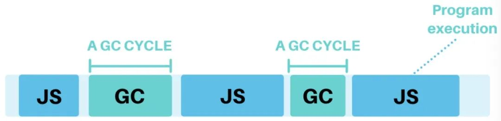

# JavaScript 内存相关

## JavaScript 运行环境的栈和堆

### 栈内存（Stack memory）

> 栈（Stack）的特点是“LIFO，即后进先出（last in first out）”。数据存储时只能从顶部逐个存入，取出时也需要从顶部逐个取出。

栈内存之所以叫做栈内存，是因为栈内存使用了栈的结构，栈内存是一段连续的内存空间，得益于栈结构的简单直接，栈内存的访问和操作速度都非常快。

栈内存空间比较小（例如 V8 默认栈区的大小是 984K），主要用于存放函数调用信息和变量等数据，大量的内存分配操作会导致栈溢出（Stack overflow），例如函数递归没有终止条件等。

栈内存中储存的数据基本都是临时性的，数据会在使用完之后立即被回收（如函数内创建的局部变量在函数执行完毕后就会被回收），而且不需要程序进行操作，操作系统会自动回收。

> 补充栈内存大小：栈内存由操作系统直接管理，所以栈内存的大小也由操作系统决定。通常来说，每一个线程（Thread）都会有独立的栈内存空间，操作系统给每条线程分配的栈内存默认大小为 1MB

### 堆内存（Heap memory）

> 堆（Heap）的特点是“无序”的 `key-value`“键值对”存储方式，堆的存取方式跟顺序没有关系，不局限出入口。

堆内存虽然名字里有个“堆”字，但是它和数据结构中的堆关系不大，只是名字相近。

堆内存是一大片内存空间，堆内存中的内存分配是动态且不连续的，程序可以按需申请堆内存空间，但是访问速度要比栈内存慢不少。

堆内存里的数据可以长时间存在，无用的数据需要程序主动去回收，如果大量无用数据占用内存就会造成内存泄漏（Memory leak）。

> 补充堆内存大小：在 Node.js 中，堆内存默认上限在 64 位系统中约为 1.4GB，在 32 位系统中约为 0.7GB。而在 Chrome 浏览器中，每个标签页的内存上限为 4GB（64 位系统）和 1GB（32 位系统）。通常来说，一个进程（Process）只会有一个堆内存，同一进程下的多个线程会共享同一个堆内存。

### 总结一下栈内存和堆内存的特点

- 栈内存适合存放生命周期短、占用空间小且固定的数据。而且无需手动管理，函数调用时创建，调用结束则消失
- 堆内存适合存放生命周期长、占用空间大或占用空间不固定的数据。

## JavaScript 变量存储机制

首先确定一点，“一个变量，如果是原始类型，数据本身是存在栈内，如果是对象，数据本身会存储在堆中，在栈中存的只是一个堆内地址的引用” 这样的说法是有问题的。

JavaScript 中变量存储在内存中的位置取决于 JavaScript 引擎的实现，早期的 JavaScript 编译器甚至把所有的变量都存在一个名为闭包的对象中，因为 JavaScript 是一门以函数为基础的语言，其中的函数变化无穷（闭包），因此使用栈内存并不能解决语言方面的问题，而堆内存则方便存储各种类型得到的变量。

现在的 JavaScript 引擎通常做了很多优化，变量的存储位置也是根据具体情况而定的。比如，一个 string 类型的变量可能有几十 M，栈内存肯定是放不下的，再比如闭包中外层函数的局部变量有时并不会随外层函数的调用结束而清空。

### 函数调用栈

JavaScript 函数调用栈（Call Stack）是一个栈数据结构，用于记录 JavaScript 代码执行期间函数调用的顺序。每当一个函数被调用时，它会被添加到调用栈的顶部，当函数执行完成后，它会从调用栈中弹出，控制权回到调用它的函数。

当函数被调用时，会将函数推入栈内存中，生成一个栈帧（Stack frame），栈帧存储了一个函数的执行上下文，包括函数的参数、局部变量、this 指针、函数的返回地址 <font size="1">（保存了函数执行完毕后返回到哪条指令继续执行，通常是函数调用的下一行）</font> 和具体的执行上下文<font size="1">（实际上是上下文对象的引用）</font> ；当函数调用另外一个函数时，又会将另一个函数也推入栈内存中生成一个栈帧，周而复始，直到最后一个函数返回，便从栈顶开始讲栈内存中的元素逐个弹出，直到栈内存中不再有元素时则此次调用结束。在函数执行完毕后，对应的栈帧

> 上面说到的具体的执行上下文是一个抽象的概念，它代表了代码执行过程中的环境和状态。执行上下文可以看作是一个 JavaScript 引擎内部的数据结构，它是用来管理函数执行过程中所需的所有信息，从实现角度来说，具体的执行上下文通常是一个对象，一个典型的执行上下文对象可能包含：1、变量对象（Variable Object），该对象用于存储函数内部的变量、函数声明、函数参数等信息，它在函数执行过程中被创建，并且在函数执行结束后被销毁，当前执行函数的变量对象也称为活动对象（Active Object）。2、作用域链（Scope Chain），该属性用于解析变量和函数的引用。它是由当前函数的活动对象和父级作用域的作用域链组成的，用于确定变量的访问权限。3、this 值，该属性用于存储当前函数的 this 值，它在函数执行过程中被确定，并且在函数执行结束后被销毁。4、可能还包含一些其他的属性，例如 arguments 对象、callee 对象等。**变量对象和作用域链构成了当前函数的作用域。**

> 作用域链的创建方式有两种：静态作用域和动态作用域。JavaScript 使用的是静态作用域，也称为词法作用域。在词法作用域中，作用域链是在函数定义时就确定好的，与函数的调用位置无关。这种方式可以保证函数的执行环境与定义环境一致，避免了因上下文切换带来的性能损失。所以，作用域链的构建过程是在函数创建时完成的。在函数创建时，JavaScript 引擎会将当前作用域链保存到函数的内部属性`[[Scopes]]`中，当函数执行时，引擎会创建一个新的栈帧并将其推入函数调用栈中，其中就包含了具体的执行上下文，此时执行上下文会创建一个新的变量对象，同时将函数的`[[Scopes]]`属性中保存的作用域链赋值给执行上下文的作用域链，变量对象和作用域链构成了当前函数的作用域，这样在执行函数时，引擎就可以通过作用域链来解析变量和函数的引用了。

> 具体的执行上下文中的变量信息跟栈帧中的不同，不仅包括了函数内部的参数和局部变量，还包括了全局变量，闭包变量等信息。栈帧中的变量是在函数执行时动态创建的，它们的生命周期只限于函数执行期间，函数执行完成后，他们会被销毁，释放内存空间。但是函数上下文对象中的变量可以通过闭包等方式被保存和共享，它们的作用域可以扩月多个函数和代码块。

在同一线程下（JavaScript 是单线程的），所有被执行的函数以及函数的参数和局部变量都会被推入到同一个栈内存中，这也就是大量递归会导致栈溢出（Stack overflow）的原因。

### 普通的 JavaScript 引擎的变量存储

在 JavaScript 程序运行时，非全局作用域中产生的局部变量存储在栈内存中，不过，只有原始类型的变量是真正地把值存储在栈内存中，而引用类型的变量只在栈内存中储存一个引用地址，这个引用指向堆内存里的真正的值。

所有结论是：**在大多数情况下，原始类型的数据存储在栈内存，而引用类型的数据（对象）则存储在堆内存，但是要特别注意，全局变量以及被闭包引用的变量（即使是原始类型）均存储在堆内存中**

#### 全局变量

在全局作用域下创建的所有变量都会成为全局对象（如 `window` 对象）的属性，而全局对象储存在堆内存中，所以**全局变量必然也会存储在堆内存中**。

全局变量会被默认添加到函数作用域链最低端，也就是函数的内部属性 `[[Scopes]]` 中的最后一个。

全局变量要特别注意一点：**var 和 let/const 的区别，全局的 var 变量其实仅仅是为 window 对象添加了一条属性；而全局的 let/const 变量不会修改 window 对象，而是将变量放在了一个特殊的对象下（Script），也有一种说法是 let/const 变量实际上是执行一个自执行函数，所以那些变量就放到了类似闭包的地方。**

#### 闭包中的变量（又称被捕获的变量）

在函数声明中，函数执行后仍有其他未执行作用域（函数或是类）使用到该变量，那么该变量就是被捕获变量。被捕获变量会存在一个特殊对象（Closure），对象都是存放在堆中的。

### V8 引擎的变量存储

#### 字符串

当我们声明一个字符串时，V8 内部有一个名为 StringTable 的 hashmap 缓存了所有字符串，在 V8 阅读我们的代码，转换抽象语法树时，每遇到一个字符串，会根据其特征换算为一个 hash 值，插入到 hashmap 中。在之后如果遇到了 hash 一致的字符串，会优先从里面取出来进行对比，一致的话就不会生成新字符串类。

通俗一点说就是，我们在创建字符串的时候，V8 会先从堆内存中查找是否有已经创建的完全一致的字符串，如果存在，直接复用。如果不存在，则开辟一块新的内存空间存进这个字符串，然后把引用地址赋给变量

#### 数字

数字在 V8 中分为 smi 和 headNumber，smi 可以理解为整数，直接存进当前内存。所有非 smi 的数字就是 headNumber，类似于字符串，需要新开辟一个内存空间。

可以理解为 **小整数存放在栈中，其他类型存在堆中**

#### 其他基本类型

`null`、`undefined`、`true`、`false`、`""` 这些基本类型都拓展自 oddBall 基本类型，其存储地址是固定的。也就是说，V8 跑起来的第一时间，不管我们有没有声明这些基本类型，他们都已经被穿件完毕了。而后续我们的代码里声明变量时，赋的是他们的引用。

## 垃圾回收

在计算机科学中，垃圾回收（Garbage Collection 简称 GC）是一种存储器管理机制，也就是清除内存中不再需要的数据，释放内存空间。

当某个程序（执行环境）占用的一部分内存空间不再被这个程序（执行环境）访问时，这个程序（执行环境）会借助垃圾回收算法向操作系统归还这部分内存空间（垃圾回收器做的事情）。垃圾回收可以是手动触发，也可以是自动的。

JavaScript 是一门具有自动垃圾回收机制的编程语言，由执行环境（例如 V8 引擎）负责在代码执行时管理内存。JavaScript 的自动垃圾回收机制很简单：**找出那些不再继续使用的变量，然后释放其所占用的内存**，垃圾回收器会按照固定的时间间隔周期性地执行这一操作。在 JavaScript 中，原始类型的数据被分配到栈空间中，引用类型的数据会被分配到堆空间中。局部变量只有在函数执行的过程中存在，在这个过程中，一般情况下会为局部变量在栈内存上分配空间，然后在函数中使用这些变量，直至函数执行结束。

> **垃圾回收**是一种存储器管理机制，每个程序都可以实现垃圾回收这个机制，不同的程序使用不同的**垃圾回收算法**构成了不同的**垃圾回收器**，触发垃圾回收器进行垃圾回收可以分为手动和自动，JavaScript 的**自动垃圾回收机制**就是让垃圾回收器按照固定的时间间隔周期性的找出那些不再继续使用的变量，然后释放其所占用的内存。



### 垃圾回收的几个概念

#### 可达性（Reachability）

在 JavaScript 中，可达性指的是一个变量是否直接或间接通过全局对象访问到，如果可以那么该变量就是可达的，否则就是不可达的。

上面的全局对象有时还被称为 GC Roots 对象，浏览器环境中的 GC Root 有很多，通常包括了以下几种（但是不止于这几种）：

- 全局的 window 对象（位于每个 iframe 中）
- 文档 DOM 树，由可以通过遍历文档到达的所有原生 DOM 节点组成
- 存放在栈上的变量

### 垃圾回收原理

垃圾回收器必须追踪每个变量的使用情况，为那些不再使用的变量打上标记，用于将来能及时回收其占用的内存，用于标识无用变量的策略主要有引用计数法和标记清除法。

#### 引用计数法

引用计数算法是基于“引用计数”实现的垃圾回收算法，这是最初级但已经被弃用的垃圾回收算法。

引用计数算法需要 JavaScript 引擎在程序运行时记录每个变量被引用的次数，随后根据引用的次数来判断变量是否能够被回收。

引用计数算法虽然很美好，但是它有一个致命的缺点，就是无法处理循环引用。

```js
function foo() {
  let a = { target: null }
  let b = { target: null }
  a.target = b
  b.target = a
}

foo()
// 当 foo 函数执行完毕之后，对象 a 和 b 都已经离开了作用域，理论上它们都应该能够被回收才对。但是由于它们互相引用了对方，所以垃圾回收器就认为它们都还在被引用着，导致不会被回收，造成内存泄漏
```

> 内存泄漏：指的是程序运行时由于某种原因未能释放那些不再使用的内存，造成内存空间的浪费。轻微的内存泄漏或许不太会对程序造成什么影响，但是一旦泄露严重，就会开始影响程序的性能，甚至导致程序的崩溃。

#### 标记-清除/标记-整理

标记指的是标记变量的状态的过程，标记变量的具体方法有很多种，但是基本理念是相似的。对于标记算法，我们不需要知道所有细节，只需明白标记的基本原理即可：

当一个变量进入执行上下文时，它就会被标记为“处于上下文中”；而当变量离开执行上下文时，则会被标记为“已离开上下文”，垃圾回收器将定期扫描内存中的所有变量，将处于上下文中以及被处于上下文中的变量引用的变量的标记去除，将其余变量标记为“待删除”，随后，垃圾回收器会清除所有带有“待删除”标记的变量，并释放他们所占用的内存。

需要注意的是，频繁回收对象后，内存中就会存在大量不连续的空间，称为内存碎片。当出现了大量的内存碎片之后，不利于分配较大的连续内存。后续的整理阶段可以解决内存碎片化的问题，提高内存空间的可用性。

### V8 的垃圾回收


#### 两个垃圾回收器

- Minor GC（副 GC）

它还有个名字叫做 Scavenger（清道夫），具体使用的是 Cheney's Algorithm （Cheney 算法）

它将新生代分为两个相等的半空间（semispace）from space、to space，这两个区域也叫做：对象区域、空闲区域。

新加入的对象会储存在对象区域，当对象区域快被写满时，就需要执行一次垃圾清理工作，垃圾回收的过程：

1. 首先要对对象区域中的，副垃圾回收器会把仍然在用的对象复制到空闲区域中，同时还会把这些对象有序地排列起来，复制的过程，相当于完成了内存整理操作，复制后空闲区域没有内存碎片。
2. 完成复制后，进行角色翻转。把原来的对象区域变成空闲区域、空闲区域变成对象区域

- Major GC（主 GC）

因为老生代中的对象通常比较大，复制大对象非常耗时，会导致回收执行效率不高，所以使用的是文章前面提到的 Mark-Compact Algorithm（标记-整理算法）

#### 两个区域

- New Space（新空间）

又称 Young generation（新生代），用于储存新生成的大多数小的对象，由 Minor GC 进行管理，通常只支持 1 ~ 8M 的容量（也有说 32 位大概 16M、64 位大概 32M）。储存在 New Space 里的新生对象大多都只是临时使用的，而且 New Space 的容量比较小，为了保持内存的可用率，Minor GC 会频繁地进行。

- Old Space（旧空间）

又称为 Old generation（老生代），用于储存那些大多数占用空间大(32 位大概 700M、64 位大概 1.4G)，存活时间长的对象，例如在 New Space 中经过两次 GC 后仍然存活的对象。由 Major GC 进行管理。也就是说，只要在 New Space 里的对象熬过了两次 GC，就会被转移到 Old Space（还有一种说法是 New Space 在进行垃圾回收的复制时，大于空闲区域空间的 25% 的对象也会转移到 Old Space）。Old Space 里的对象存活时间都比较长，所以 Major GC 没那么勤快，这一定程度上降低了频繁 GC 带来的性能损耗

老生代可以分为以下几个

> 弱分代假说：V8 的垃圾回收主要建立在这个假说之上。有两个概念，第一，绝大部分的对象生命周期都很短，即存活时间很短；第二，生命周期很长的对象，基本都是常驻对象。基于这两个概念，V8 将内存分为新生代和老生代两个区域。

#### 优化垃圾回收器

由于运行 JavaScript 的引擎是单线程的，垃圾回收时会阻塞 JavaScript 的执行，造成页面卡顿等问题。

为了解决上述问题，V8 团队从两个方面解决垃圾回收效率的问题：

1. 将一个完整的垃圾回收任务拆分成多个小的任务，解决单次垃圾回收时间长的问题
2. 将标记对象、移动对象等任务转移到后台线程进行，减少阻塞主线程的时间

##### 并行回收

### 关注内存提升性能

## 问题

### 为什么说 JavaScript 是一门具有自动垃圾回收机制的编程语言？

这是站在开发者的角度来看的，在 C 和 C++ 等语言中，开发人员需要直接控制内存的申请和回收，但是在 Java、C#、JavaScript 语言中，变量的内存空间的申请和释放都由程序（例如 V8 引擎）自己处理，开发人员不需要特别关心。

### JavaScript 哪些数据类型会保存在栈中，哪些数据类型会保存在堆中

## 文章推荐

- [JavaScript 内存详解 & 分析指南](https://www.cnblogs.com/ifaswind/p/javascript-memory.html)

V8 的新生代的容量是多少
