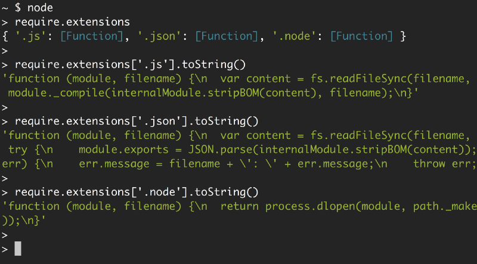

# JavaScript 的模块

## 介绍

模块通常是指编程语言所提供的代码组织机制，利用此机制可将程序拆解为独立且通用的代码单元。

模块化这个词最早出现在一本研究工程设计的探路性质的书《Design Rules》中。

软件模块化是随着软件的复杂性诞生的。模块化的意义在于降低软件的复杂性，不至于随着软件或系统变大而不可控，使其可控，可维护，可扩展。

无论那种语言，封装是写模块的首要特质。即模块不会暴露自身的实现细节，不会调用其它模块的实现代码，不会共享全局变量。一切只靠接口通信。模块化和封装是密不可分的

所谓模块化主要是解决代码分割、作用域隔离、模块之间的依赖管理以及发布到生产环境时的自动化打包与处理等多个方面。

### 模块的优点

1. **可维护性。** 因为模块是独立的，一个设计良好的模块会让外面的代码对自己的依赖越少越好，这样自己就可以独立去更新和改进。
2. **命名空间。** 在 JavaScript 里面，如果一个变量在最顶级的函数之外声明，它就直接变成全局可用。因此，常常不小心出现命名冲突的情况。使用模块化开发来封装变量，可以避免污染全局环境。
3. **重用代码。** 我们有时候会喜欢从之前写过的项目中拷贝代码到新的项目，这没有问题，但是更好的方法是，通过模块引用的方式，来避免重复的代码库。我们可以在更新了模块之后，让引用了该模块的所有项目都同步更新，还能指定版本号，避免 API 变更带来的麻烦。

## CommonJS

CommonJS 最开始是 Mozilla 的工程师于 2009 年开始的一个项目，它的目的是让浏览器之外的 JavaScript （比如服务器端或者桌面端）能够通过模块化的方式来开发和协作。

在 CommonJS 的规范中，每个 JavaScript 文件就是一个独立的模块上下文（module context），在这个上下文中默认创建的属性都是私有的。也就是说，在一个文件定义的变量（还包括函数和类），都是私有的，对其他文件是不可见的。

需要注意的是，CommonJS 规范的主要适用场景是服务器端编程，所以采用同步加载模块的策略。如果我们依赖 3 个模块，代码会一个一个依次加载它们。

该模块实现方案主要包含 require 与 module 这两个关键字，其允许某个模块对外暴露部分接口并且由其他模块导入使用。

```
//sayModule.js
function SayModule () {
    this.hello = function () {
        console.log('hello');
    };

    this.goodbye = function () {
        console.log('goodbye');
    };
}

module.exports = SayModule;

//main.js 引入sayModule.js
var Say = require('./sayModule.js');
var sayer = new Say();
sayer.hello(); //hello
```

作为一个服务器端的解决方案，CommonJS 需要一个兼容的脚本加载器作为前提条件。该脚本加载器必须支持名为 require 和 module.exports 的函数，它们将模块相互导入导出。

### `Node.js`

Node 从 CommonJS 的一些创意中，创造出自己的模块化实现。由于 Node 在服务端的流行，Node 的模块形式被（不正确地）称为 CommonJS。

Node.js 模块可以分为两大类，一类是核心模块，另一类是文件模块。

**核心模块** 就是 Node.js 标准的 API 中提供的模块，如 fs、http、net 等，这些都是由 Node.js 官方提供的模块，编译成了二进制代码，可以直接通过 require 获取核心模块，例如 require('fs')，核心模块拥有最高的加载优先级，如果有模块与核心模块命名冲突，Node.js 总是会加载核心模块。

**文件模块** 是存储为单独的文件（或文件夹）的模块，可能是 JavaScript 代码、JSON 或编译好的 C/C++代码。在不显式指定文件模块扩展名的时候，Node.js 会分别试图加上.js、.json、.node(编译好的 C/C++代码)。

> 加载方式

- 按路径加载模块
  如果 require 参数以"/"开头，那么就以绝对路径的方式查找模块名称，如果参数以"./"、"../"开头，那么则是以相对路径的方式来查找模块。

- 通过查找 node_modules 目录加载模块
  如果 require 参数不以"/"、"./"、"../"开头，而该模块又不是核心模块，那么就要通过查找 node_modules 加载模块了。我们使用的 npm 获取的包通常就是以这种方式加载的。

> 加载缓存

Node.js 模块不会被重复加载，这是因为 Node.js 通过文件名缓存所有加载过的文件模块，所以以后再访问到时就不会重新加载了。
_注意：_ Node.js 是根据实际文件名缓存的，而不是 require()提供的参数缓存的，也就是说即使你分别通过 require('express')和 require('./node_modules/express')加载两次，也不会重复加载，因为尽管两次参数不同，解析到的文件却是同一个。

Node.js 中的模块在加载之后是以单例化运行，并且遵循值传递原则：如果是一个对象，就相当于这个对象的引用。

> 模块载入过程

加载文件模块的工作，主要由原生模块 module 来实现和完成，该原生模块在启动时已经被加载，进程直接调用到 runMain 静态方法。

```
例如运行： node app.js

Module.runMain = function () {
    // Load the main module--the command line argument.
    Module._load(process.argv[1], null, true);
};

//_load静态方法在分析文件名之后执行
var module = new Module(id, parent);

//并根据文件路径缓存当前模块对象，该模块实例对象则根据文件名加载。
module.load(filename);
```

具体说一下上文提到了文件模块的三类模块,这三类文件模块以后缀来区分，Node.js 会根据后缀名来决定加载方法，具体的加载方法在下文`require.extensions`中会介绍。

- `.js` 通过 fs 模块同步读取 js 文件并编译执行。
- `.node` 通过 C/C++进行编写的 Addon。通过 dlopen 方法进行加载。
- `.json` 读取文件，调用 JSON.parse 解析加载。

接下来详细描述 js 后缀的编译过程。Node.js 在编译 js 文件的过程中实际完成的步骤有对 js 文件内容进行头尾包装。以 app.js 为例，包装之后的 app.js 将会变成以下形式：

```
//circle.js
var PI = Math.PI;
exports.area = function (r) {
    return PI * r * r;
};
exports.circumference = function (r) {
    return 2 * PI * r;
};

//app.js
var circle = require('./circle.js');
console.log( 'The area of a circle of radius 4 is ' + circle.area(4));

//app包装后
(function (exports, require, module, __filename, __dirname) {
    var circle = require('./circle.js');
    console.log('The area of a circle of radius 4 is ' + circle.area(4));
});

//这段代码会通过vm原生模块的runInThisContext方法执行（类似eval，只是具有明确上下文，不污染全局），返回为一个具体的function对象。最后传入module对象的exports，require方法，module，文件名，目录名作为实参并执行。
```

这就是为什么 require 并没有定义在 app.js 文件中，但是这个方法却存在的原因。从 Node.js 的 API 文档中可以看到还有`__filename`、`__dirname`、`module`、`exports`几个没有定义但是却存在的变量。其中`__filename`和`__dirname`在查找文件路径的过程中分析得到后传入的。`module`变量是这个模块对象自身，`exports`是在 module 的构造函数中初始化的一个空对象（{}，而不是 null）。
在这个主文件中，可以通过 require 方法去引入其余的模块。而其实这个 require 方法实际调用的就是 module.\_load 方法。
load 方法在载入、编译、缓存了 module 后，返回 module 的 exports 对象。这就是 circle.js 文件中只有定义在 exports 对象上的方法才能被外部调用的原因。

**以上所描述的模块载入机制均定义在 lib/module.js 中。**

> require 函数

require 引入的对象主要是函数。当 Node 调用 require() 函数，并且传递一个文件路径给它的时候，Node 会经历如下几个步骤：

- Resolving：找到文件的绝对路径；

- Loading：判断文件内容类型；

- Wrapping：打包，给这个文件赋予一个私有作用范围。这是使 require 和 module 模块在本地引用的一种方法；

- Evaluating：VM 对加载的代码进行处理的地方；

- Caching：当再次需要用这个文件的时候，不需要重复一遍上面步骤。

> require.extensions 来查看对三种文件的支持情况
> 
> 可以清晰地看到 Node 对每种扩展名所使用的函数及其操作：对 .js 文件使用 module.\_compile；对 .json 文件使用 JSON.parse；对 .node 文件使用 process.dlopen。

_文件查找策略_

- 从文件模块缓存中加载
  尽管原生模块与文件模块的优先级不同，但是优先级最高的是从文件模块的缓存中加载已经存在的模块。

- 从原生模块加载
  原生模块的优先级仅次于文件模块缓存的优先级。require 方法在解析文件名之后，优先检查模块是否在原生模块列表中。以 http 模块为例，尽管在目录下存在一个`http`、`http.js`、`http.node`、`http.json`文件，`require(“http”)`都不会从这些文件中加载，而是从原生模块中加载。
  原生模块也有一个缓存区，同样也是优先从缓存区加载。如果缓存区没有被加载过，则调用原生模块的加载方式进行加载和执行。

- 从文件加载
  当文件模块缓存中不存在，而且不是原生模块的时候，Node.js 会解析 require 方法传入的参数，并从文件系统中加载实际的文件，加载过程中的包装和编译细节在前面说过是调用 load 方法。
  ··

```
当 Node 遇到 require(X) 时，按下面的顺序处理。

（1）如果 X 是内置模块（比如 require('http'）)
　　a. 返回该模块。
　　b. 不再继续执行。

（2）如果 X 以 "./" 或者 "/" 或者 "../" 开头
　　a. 根据 X 所在的父模块，确定 X 的绝对路径。
　　b. 将 X 当成文件，依次查找下面文件，只要其中有一个存在，就返回该文件，不再继续执行。
        X
        X.js
        X.json
        X.node

　　c. 将 X 当成目录，依次查找下面文件，只要其中有一个存在，就返回该文件，不再继续执行。
        X/package.json（main字段）
        X/index.js
        X/index.json
        X/index.node

（3）如果 X 不带路径
　　a. 根据 X 所在的父模块，确定 X 可能的安装目录。
　　b. 优先搜索当前目录下的node_modules目录，如果找不到，会递归向上搜索父级目录，直到找到或者到达操作系统的根目录为止

（4） 抛出 "not found"
```


<br />

#### Module.exports 与 exports 的关系

在一个 Node.js 模块文件开始执行时，module.exports 和 exports 实际上指向同一个对象。这个对象是该模块对外暴露的接口。以认为 exports 是 module.exports 的一个引用或别名，因此对 exports 进行的修改也会反映在 module.exports 上。**需要注意：引擎最后返回的是 module.exports，所以不要重新赋值 exports，推荐只使用 module.exports 或 exports 中的一个来导出模块内容，避免混用造成混淆**

在 Node.js 的源码中，`module.exports` 和 `exports` 指向同一个对象的实现基于 JavaScript 的引用机制。当 Node.js 执行一个模块时，它实际上会按照以下步骤操作：

1. **创建模块对象**：Node.js 为每个模块创建一个 `Module` 实例。这个实例有一个 `exports` 属性，初始时指向一个空对象 `{}`。

2. **设置 exports 别名**：在模块的代码执行环境中，Node.js 设置了一个局部变量 `exports`，并将其指向 `module.exports` 的初始对象。因此，`exports` 和 `module.exports` 开始时都引用同一个对象。

3. **执行模块代码**：当模块代码执行时，可以通过 `exports` 或 `module.exports` 添加、修改或删除属性。由于它们指向同一个对象，对任一个对象的修改都会反映在另一个上。

4. **导出模块**：当模块执行完毕后，Node.js 使用 `module.exports` 的当前值作为模块的导出值。

### 源码简化表示

在 Node.js 的实现中，可以简化地理解为以下过程：

```javascript
function require(/* ... */) {
  // ...
  var module = { exports: {} }
  var exports = module.exports

  // 模块代码在这里执行，可以修改 exports 或 module.exports

  // 最终返回 module.exports
  return module.exports
}
```

CommonJS 规范有 1、2 两个版本，`exports.属性名 = ...`的用法属于早期，也就是 CommonJS 1 的用法。`module.exports`用法属于 CommonJS 2 的用法，我们应该尽量用 `module.exports`，避免用 `exports.属性名 =`的写法。

## AMD

AMD 是 Asynchronous Module Definition 的简称，即“异步模块定义”，是从 CommonJS 讨论中诞生的。AMD 优先照顾浏览器的模块加载场景，使用了异步加载和回调的方式。

AMD 和 CommonJS 一样需要脚本加载器，尽管 AMD 只需要对 define 方法的支持。define 方法需要三个参数：模块名称，模块运行的依赖数组，所有依赖都可用之后执行的函数（该函数按照依赖声明的顺序，接收依赖作为参数）。只有函数参数是必须的。define 既是一种引用模块的方式，也是定义模块的方式。

```
// file lib/sayModule.js
define(function (){
    return {
        sayHello: function () {
            console.log('hello');
        }
    };
});

//file main.js
define(['./lib/sayModule'], function (say){
    say.sayHello(); //hello
})
```

main.js 作为整个应用的入口模块，我们使用 define 关键字声明了该模块以及外部依赖(没有生命模块名称)；当我们执行该模块代码时，也就是执行 define 函数的第二个参数中定义的函数功能，其会在框架将所有的其他依赖模块加载完毕后被执行。这种延迟代码执行的技术也就保证了依赖的并发加载。

### `RequireJS`

RequireJS 是一个前端的模块化管理的工具库，遵循 AMD 规范,通过一个函数来将所有所需要的或者说所依赖的模块实现装载进来，然后返回一个新的函数（模块），我们所有的关于新模块的业务代码都在这个函数内部操作，其内部也可无限制的使用已经加载进来的以来的模块。

```
<script data-main='scripts/main' src='scripts/require.js'></script>
//scripts下的main.js则是指定的主代码脚本文件，所有的依赖模块代码文件都将从该文件开始异步加载进入执行。
```

defined 用于定义模块，RequireJS 要求每个模块均放在独立的文件之中。按照是否有依赖其他模块的情况分为独立模块和非独立模块。
**1、独立模块 不依赖其他模块。直接定义**

```
define({
    methodOne: function (){},
    methodTwo: function (){}
});

//等价于

define(function (){
    return {
        methodOne: function (){},
        methodTwo: function (){}
    };
});
```

**2、非独立模块，对其他模块有依赖**

```
define([ 'moduleOne', 'moduleTwo' ], function(mOne, mTwo){
    ...
});

//或者

define( function( require ){
    var mOne = require( 'moduleOne' ),
        mTwo = require( 'moduleTwo' );
    ...
});
```

如上代码， define 中有依赖模块数组的 和 没有依赖模块数组用 require 加载 这两种定义模块，调用模块的方法合称为 AMD 模式，定义模块清晰，不会污染全局变量，清楚的显示依赖关系。AMD 模式可以用于浏览器环境并且允许非同步加载模块，也可以按需动态加载模块。

## CMD

CMD（Common Module Definition），在 CMD 中，一个模块就是一个文件。

全局函数 define，用来定义模块。
参数 factory 可以是一个函数，也可以为对象或者字符串。
当 factory 为对象、字符串时，表示模块的接口就是该对象、字符串。

_定义 JSON 数据模块：_

```
define({ "foo": "bar" });
```

_factory 为函数的时候，表示模块的构造方法，执行构造方法便可以得到模块向外提供的接口。_

```
define( function(require, exports, module) {
    // 模块代码
});
```

### `SeaJS`

**sea.js 核心特征：**

1. 遵循 CMD 规范，与 NodeJS 般的书写模块代码。
2. 依赖自动加载，配置清晰简洁。

`seajs.use` 用来在页面中加载一个或者多个模块

```
 // 加载一个模块
seajs.use('./a');

// 加载模块，加载完成时执行回调
seajs.use('./a'，function(a){
    a.doSomething();
});

// 加载多个模块执行回调
seajs.use(['./a','./b']，function(a , b){
    a.doSomething();
    b.doSomething();
});
```

> `AMD和CMD最大的区别是对依赖模块的执行时机处理不同，注意不是加载的时机或者方式不同。`
> 很多人说 requireJS 是异步加载模块，SeaJS 是同步加载模块，这么理解实际上是不准确的，其实加载模块都是异步的，只不过 AMD 依赖前置，js 可以方便知道依赖模块是谁，立即加载，而 CMD 就近依赖，需要使用把模块变为字符串解析一遍才知道依赖了那些模块，这也是很多人诟病 CMD 的一点，牺牲性能来带来开发的便利性，实际上解析模块用的时间短到可以忽略。

> `为什么说是执行时机处理不同？`
> 同样都是异步加载模块，AMD 在加载模块完成后就会执行该模块，所有模块都加载执行完后会进入回调函数，执行主逻辑，这样的效果就是依赖模块的执行顺序和书写顺序不一定一致，看网络速度，哪个先下载下来，哪个先执行，但是主逻辑一定在所有依赖加载完成后才执行。
> CMD 加载完某个依赖模块后并不执行，只是下载而已，在所有依赖模块加载完成后进入主逻辑，遇到 require 语句的时候才执行对应的模块，这样模块的执行顺序和书写顺序是完全一致的。

## UMD

统一模块定义（UMD：Universal Module Definition ）就是将 AMD 和 CommonJS 合在一起的一种尝试，常见的做法是将 CommonJS 语法包裹在兼容 AMD 的代码中。

```
(function(define) {
    define(function () {
        return {
            sayHello: function () {
                console.log('hello');
            }
        };
    });
}(
    typeof module === 'object' && module.exports && typeof define !== 'function' ?
    function (factory) { module.exports = factory(); } :
    define
));
```

该模式的核心思想在于所谓的 IIFE（Immediately Invoked Function Expression），该函数会根据环境来判断需要的参数类别

## ES6 模块(module)

### 严格模式  

ES6 的模块自动采用严格模式，不管有没有在模块头部加上"use strict";。
严格模式主要有以下限制。

- 禁止使用未声明的变量：在严格模式下，如果尝试使用未声明的变量，JavaScript 会抛出错误。

```
"use strict";
x = 3.14; // ReferenceError: x is not defined
```

- 禁止重复的函数参数名称：在严格模式下，函数不能有重名的参数。

```
"use strict";
function myFunc(a, a) { // SyntaxError: Duplicate parameter name not allowed in this context
}
```

- 禁止重复的对象字面量属性名称：在严格模式下，对象字面量中出现重复的名称会导致语法错误。

```
"use strict";
var obj = {a: 1, a: 2}; // SyntaxError: Duplicate data property in object literal not allowed in strict mode
```

- 不能使用 with 语句
- 不能对只读属性赋值，否则报错
- 不能使用前缀 0 表示八进制数，否则报错
- 不能删除不可删除的属性，否则报错
- 不能删除变量 delete prop，会报错，只能删除属性 delete global[prop]
- 更严格的 eval 行为：在严格模式下，eval 拥有自己的作用域，而不是共享本地作用域

```
"use strict";
var x = 2;
eval("var x = 5;");
alert(x); // 2, 因为eval中声明的x不会影响外部作用域

```

- eval 和 arguments 不能被重新赋值，在严格模式下，不能对 eval 和 arguments 赋值，且它们被视为关键字，因此不能用作变量或函数名。

```
"use strict";
eval = 17; // SyntaxError
var arguments = 42; // SyntaxError
```

- arguments 不会自动反映函数参数的变化
- 不能使用 arguments.callee
- 不能使用 arguments.caller
- this 关键字在全局作用域中的值为 undefined，而不是指向全局对象（在非严格模式下，它会指向全局对象，例如浏览器中的 window 对象）。

```
"use strict";
function myFunction() {
  return this; // 在严格模式下，这里的this将是undefined
}
```

- 不能使用 fn.caller 和 fn.arguments 获取函数调用的堆栈
- 增加了保留字（比如 protected、static 和 interface）

### 模块 Module

一个模块，就是一个对其他模块暴露自己的属性或者方法的文件。

### 导出 Export

作为一个模块，它可以选择性地给其他模块暴露（提供）自己的属性和方法，供其他模块使用。

```
// profile.js
export var firstName = 'chen';
export var lastName = 'fangxu';
export var year = 1991;

//等价于

var firstName = 'chen';
var lastName = 'fangxu';
var year = 1991;
export {firstName, lastName, year}
```

`1、 通常情况下，export输出的变量就是本来的名字，但是可以使用as关键字重命名。`

```
function v1() { ... }
function v2() { ... }

export {
  v1 as streamV1,
  v2 as streamV2,
  v2 as streamLatestVersion
};

//上面代码使用as关键字，重命名了函数v1和v2的对外接口。重命名后，v2可以用不同的名字输出两次。
```

`2、 需要特别注意的是，export命令规定的是对外的接口，必须与模块内部的变量建立一一对应关系。`

```
// 报错
export 1;

// 报错
var m = 1;
export m;

//上面两种写法都会报错，因为没有提供对外的接口。第一种写法直接输出1，第二种写法通过变量m，还是直接输出1。1只是一个值，不是接口。
// ES6模块的设计旨在提高代码的可读性和维护性，需要明确地声明哪些变量、函数或类是可供外部使用的。这种设计要求开发者显式声明他们想要导出的内容，而不是隐式地做这件事（比如直接导出一个字面量）。这样做可以让模块的结构更加清晰，也便于开发者和工具理解和分析代码。


// 写法一
export var m = 1;

// 写法二
var m = 1;
export {m};

// 写法三
var n = 1;
export {n as m};

//上面三种写法都是正确的，规定了对外的接口m。其他脚本可以通过这个接口，取到值1。它们的实质是，在接口名与模块内部变量之间，建立了一一对应的关系。
// 注意，export 后面的 {} 并不是一个对象，而是 export 规定的语法，是一个只读引用。
```

`3、最后，export命令可以出现在模块的任何位置，只要处于模块顶层就可以。如果处于块级作用域内，就会报错，接下来说的import命令也是如此。`

```
function foo() {
  export default 'bar' // SyntaxError
}
foo()
```

### 导入 import

作为一个模块，可以根据需要，引入其他模块的提供的属性或者方法，供自己模块使用。

`1、 import命令接受一对大括号，里面指定要从其他模块导入的变量名。大括号里面的变量名，必须与被导入模块（profile.js）对外接口的名称相同。如果想为输入的变量重新取一个名字，import命令要使用as关键字，将输入的变量重命名。`

```
import { lastName as surename } from './profile';
```

`2、import后面的from指定模块文件的位置，可以是相对路径，也可以是绝对路径，.js路径可以省略。如果只是模块名，不带有路径，那么必须有配置文件，告诉 JavaScript 引擎该模块的位置。`

`3、注意，import命令具有提升效果，会提升到整个模块的头部，首先执行。`

```
foo();

import { foo } from 'my_module';

//上面的代码不会报错，因为import的执行早于foo的调用。这种行为的本质是，import命令是编译阶段执行的，在代码运行之前。
```

`4、由于import是静态执行，所以不能使用表达式和变量，这些只有在运行时才能得到结果的语法结构。`

```
// 报错
import { 'f' + 'oo' } from 'my_module';

// 报错
let module = 'my_module';
import { foo } from module;

// 报错
if (x === 1) {
  import { foo } from 'module1';
} else {
  import { foo } from 'module2';
}
```

`5、最后，import语句会执行所加载的模块，因此可以有下面的写法。`

```
import 'lodash';
//上面代码仅仅执行lodash模块，但是不输出任何值。
```

## 默认导出(export default)

每个模块支持我们导出`一个`没有名字的变量，使用关键语句 export default 来实现.

```
export default function(){
            console.log("I am default Fn");
        }
//使用export default关键字对外导出一个匿名函数，导入这个模块的时候，可以为这个匿名函数取任意的名字

//取任意名字均可
import sayDefault from "./module-B.js";
sayDefault();
//结果：I am default Fn
```

`1、默认导出和正常导出的比较`

```
// 第一组
export default function diff() { // 输出
  // ...
}

import diff from 'diff'; // 输入

// 第二组
export function diff() { // 输出
  // ...
};

import {diff} from 'diff'; // 输入

//上面代码的两组写法，第一组是使用export default时，对应的import语句不需要使用大括号；第二组是不使用export default时，对应的import语句需要使用大括号。
```

> export default 命令用于指定模块的默认输出。显然，一个模块只能有一个默认输出，因此 export default 命令只能使用一次。所以，import 命令后面才不用加大括号，因为只可能对应一个方法。

<br />

`2、因为export default本质是将该命令后面的值，赋给default变量以后再默认，所以直接将一个值写在export default之后。`

```
/ 正确
export default 42;

// 报错
export 42;

//上面代码中，后一句报错是因为没有指定对外的接口，而前一句指定外对接口为default。
```

`3、如果想在一条import语句中，同时输入默认方法和其他变量，可以写成下面这样。`

```
import _, { each } from 'lodash';

//对应上面代码的export语句如下
export default function (){
    //...
}
export function each (obj, iterator, context){
    //...
}
```

## export 与 import 的复合写法

如果在一个模块之中，先输入后输出同一个模块，import 语句可以与 export 语句写在一起。

```
export { foo, bar } from 'my_module';

// 等同于
import { foo, bar } from 'my_module';
export { foo, bar };

/ 接口改名
export { foo as myFoo } from 'my_module';

// 整体输出
export * from 'my_module';
```

> 注意事项
> 1、声明的变量，对外都是只读的。但是导出的是对象类型的值，就可修改。
> 2、导入不存在的变量，值为 undefined。

### ESModule 的向下兼容

在 Node.js 环境中，ES Modules 向下兼容 CommonJS，因此用 import 方式可以引入 CommonJS 方式导出的 API，但是会以 default 方式引入。

```
// abc.js 这是一个 CommonJS 规范的模块
const a = 1;
const b = 2;
const c = () => a + b;

module.exports = {a, b, c};
```

```
// index.mjs 是一个 ESModule 规范的模块，可以使用 import 导入 CommonJS 模块
// 错误方式：import {a, b, c} from './test.js';
import abc from './test.js';
console.log(abc.a, abc.b, abc.c()); // 1 2 3

// module.exports = {a, b, c} 相当于：
// const abc = {a, b, c};
// export default abc;
```

### 实例

```
//---module-B.js文件---
//导出变量：name
export var name = "cfangxu";

moduleA模块代码：
//导入 模块B的属性 name    
import { name } from "./module-B.js";   
console.log(name)
//打印结果：cfangxu
```

_批量导出_

```
//属性name
var name = "cfangxu";
//属性age
var age  = 26;
//方法 say
var say = function(){
            console.log("say hello");
         }
//批量导出
export {name,age,say}
```

_批量导入_

```
//导入 模块B的属性
import { name,age,say } from "./module-B.js";
console.log(name)
//打印结果：cfangxu
console.log(age)
//打印结果：26
say()
//打印结果：say hello
```

_重命名导入变量_

```
import {name as myName} from './module-B.js';
console.log(myName) //cfangxu
```

_整体导入_

```
/使用*实现整体导入
import * as obj from "./module-B.js";

console.log(obj.name)
//结果："cfangxu"
console.log(obj.age)
//结果：26
obj.say();
//结果：say hello
```

## CommonJS 和 ESModule 规范两者有五个不同：

1. 重命名导出的公共 API 的方式不同；

2. CommonJS 在 require 文件的时候可以忽略 .js 文件扩展名，而 ES Module 在 import 文件的时候不能忽略 .mjs 的扩展名；

3. CommonJS 规范的 require 是可以放在块级作用域中的，而 ES Module 的 import 则不能放在任何语句块中；

4. CommonJS 的 require 是一个函数，可以动态拼接文件路径，而 ES Modules 的 import 语句是不允许用动态路径的。虽然 ES Module 规范不允许 import 语句动态拼接路径，但是它允许 import 作为异步函数异步动态加载模块。

5. CommonJS 运行时才引入模块，ESModule 是编译时加载。

## CommonJS 和 ESModule 的循环引用处理

### CommonJS 循环引用处理

Node.js 中的 CommonJS 模块系统处理循环引用的方式较为直接且实用。

#### 缓存模块实例

当 Node.js 首次加载一个模块时，它会缓存该模块的 `exports` 对象。如果在循环引用场景中再次遇到该模块的导入请求，Node.js 会直接使用缓存中的 `exports` 对象，而不是重新加载模块。这样做可以防止无限循环加载，并确保模块实例的唯一性。

#### 返回部分完成的对象

在循环引用时，模块可能还未执行完毕就被再次请求。此时，Node.js 会提供该模块当前的 `exports` 对象的状态，即便它还没有完全执行完毕。这意味着在循环引用的情况下，模块可能会返回一个“部分完成”的对象。

#### 处理循环引用的步骤

1. **开始加载模块 A**：Node.js 执行模块 A 的代码。
2. **模块 A 导入模块 B**：在模块 A 的执行过程中，如果遇到对模块 B 的导入请求，Node.js 会暂停模块 A 的执行，开始加载模块 B。
3. **模块 B 导入模块 A**：如果模块 B 中存在对模块 A 的导入，由于模块 A 已经开始加载并且被缓存，Node.js 会将当前的（部分完成的）`module.exports` 对象提供给模块 B。
4. **继续执行模块 B**：模块 B 可以使用模块 A 中已经定义的部分，尽管这部分可能还未完全执行完成。
5. **完成模块 B 的加载**：一旦模块 B 加载完毕，控制权回到模块 A，继续执行未完成的部分。

通过这种机制，Node.js 的 CommonJS 模块系统能够在循环引用的场景下正常工作，尽管这可能导致一些复杂的依赖关系和时序问题。在设计模块时，最好尽可能避免循环引用，或者仔细管理依赖关系以避免出现运行时错误。

#### 代码示例

```
//创建两个文件，module1.js 和 module2.js，并且让它们相互引用
// module1.js
exports.a = 1;
require('./module2');
exports.b = 2;
exports.c = 3;

// module2.js
const Module1 = require('./module1');
console.log('Module1 is partially loaded here', Module1);

//执行 node module2.js 打印： {a:1,b:2,c:3}
//执行 node module1.js 打印： {a:1}
```

在 module1 完全加载之前需要先加载 module2，而 module2 的加载又需要 module1。这种状态下，我们从 exports 对象中能得到的就是在发生循环依赖之前的这部分。上面代码中，只有 a 属性被引入，因为 b 和 c 都需要在引入 module2 之后才能加载进来。

### ESModule 循环引用处理

ESModule 采用静态导入和导出，这意味着模块间的依赖关系在代码执行前就已确定。下面是 ESModule 处理循环引用的基本过程：

#### 1. 导入和导出解析

在执行任何代码之前，ESModule 系统会首先解析所有模块的导入和导出语句。这个解析阶段确定了模块之间的依赖关系，但不会执行模块的具体代码。

#### 2. 实例化

每个模块都会被实例化。在实例化阶段，模块的导出被创建并绑定，但导出的值可能还未被赋值。即使模块存在循环依赖，这个阶段也可以完成，因为实际的值尚未被使用，只是建立了导出的“框架”。

#### 3. 评估

模块代码的执行（或称为评估）会根据依赖关系顺序进行。如果模块 A 依赖模块 B，那么模块 B 会先于模块 A 执行。当一个模块执行时，它对导出值的赋值操作会反映到所有依赖于该模块的其他模块中。

#### 处理循环依赖的关键点

- **Live Bindings**：ESModule 使用的是“活绑定”（live bindings），意味着导入的变量是对导出变量的实时绑定。即使在循环依赖的情况下，当模块的导出值在模块内部被更新时，依赖于这个模块的其他模块会立即看到这个更新。

```
//------ lib.js ------
export let counter = 3;
export function incCounter() {
    counter++;
}

//------ main.js ------
import { counter, incCounter } from './lib';

// The imported value `counter` is live
console.log(counter); // 3
incCounter();
console.log(counter); // 4

// The imported value can’t be changed
counter++; // TypeError
```

- **延迟执行**：由于 ESModule 的导入和导出是静态分析的，循环依赖不会直接导致运行时错误。相反，它允许延迟执行某些依赖项的代码，直到所有相关模块都已经加载并实例化。

#### 循环引用的示例

假设有两个模块相互依赖：

- **模块 A** 导出一个变量和一个函数，函数依赖于**模块 B**的某个导出。
- **模块 B** 导入**模块 A**的变量或函数，并在某个点上使用它。

即使这两个模块相互依赖，由于“活绑定”和静态解析的特性，它们可以正常工作，前提是不立即在模块的顶层代码中使用彼此的导出（以避免在执行顺序上造成问题）。

```
//------ a.js ------
import {bar} from 'b'; // (1)
export function foo() {
  bar(); // (2)
}

//------ b.js ------
import {foo} from 'a'; // (3)
export function bar() {
  if (Math.random()) {
    foo(); // (4)
  }
}
```

假设先加载模块 a，在模块 a 加载完成之后，bar 间接性地指向的是模块 b 中的 bar。无论是加载完成的 imports 还是未完成的 imports，imports 和 exports 之间都有一个间接的联系，所以（不立即执行的情况下）总是可以正常工作。

总之，ESModule 通过静态分析、实例化阶段的绑定创建，以及执行阶段的活绑定，有效地处理循环依赖，确保即使在复杂的依赖关系中也能正常工作。

## 推荐资料

- [ JavaSript 模块规范 - AMD 规范与 CMD 规范介绍 ](http://blog.chinaunix.net/uid-26672038-id-4112229.html)
- [JavaScript 模块演化简史](https://mp.weixin.qq.com/s?__biz=MjM5MTA1MjAxMQ==&mid=2651226355&idx=1&sn=aedf47d5a3be53f6c7d5562977624861&chksm=bd4959778a3ed06198cbb746067393cd0f189612f4fc577417e0741df3a2b620373ea025978b&scene=21#wechat_redirect)
- [require() 源码解读](http://www.ruanyifeng.com/blog/2015/05/require.html)
- [在 Node.js 中引入模块：你所需要知道的一切都在这里](https://segmentfault.com/a/1190000009060866#articleHeader0)
- [深入浅出 Node.js（三）：深入 Node.js 的模块机制](http://www.infoq.com/cn/articles/nodejs-module-mechanism#)
- [ESModule 加载与运行机制](https://mp.weixin.qq.com/s/wxUz5E1Xs5dqYFPRPOnAlw)
