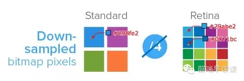
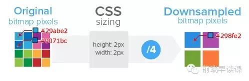

# 移动端适配

### 基础概念

- **PX(CSS pixels)**
  虚拟像素，可以理解为“直觉”像素，CSS 和 JS 使用的抽象单位，浏览器内的一切长度都是以 CSS 像素为单位的，CSS 像素的单位是 px。
  在 CSS 规范中，长度单位可以分为两类，绝对(absolute)单位以及相对(relative)单位。px 是一个相对单位，相对的是物理像素(device pixel)。
  px 实际是 pixel（像素）的缩写，它是图像显示的基本单元，既不是一个确定的物理量，也不是一个点或者小方块，而是一个抽象概念。所以在谈论像素时**一定要清楚它的上下文**！

- **屏幕尺寸**
  屏幕大小的物理尺寸，屏幕对角线长度衡量。
  单位：英寸，1 英寸 = 2.54 厘米

- **像素密度(PPI)**
  像素密度(Pixels Per Inch)，所表示的是每英寸所拥有的像素数量。因此 PPI 数值越高，即代表显示屏能够以越高的密度显示图像。

- **物理像素(physical pixel 或 device pixel)**
  一个物理像素是显示器(手机屏幕)上最小的物理显示单元，在操作系统的调度下，每一个设备像素都有自己的颜色值和亮度值。

- **设备独立像素(density-independent pixel 或 device independent pixel)**
  设备独立像素(也叫密度无关像素、逻辑像素)，可以认为是计算机坐标系统中的一个点，这个点代表一个可以由程序使用的虚拟像素(比如: css 像素)，然后由相关系统转换为物理像素。

- **设备像素比(device pixel ratio)**
  设备像素比(简称 dpr)定义了物理像素和设备独立像素的对应关系，它的值可以按如下的公式的得到：

```
设备像素比 = 物理像素 / 设备独立像素 // 在某一方向上，x方向或者y方向
```

在 javascript 中，可以通过 window.devicePixelRatio 获取到当前设备的 dpr。
在 css 中，可以通过-webkit-device-pixel-ratio，-webkit-min-device-pixel-ratio 和 -webkit-max-device-pixel-ratio 进行媒体查询，对不同 dpr 的设备，做一些样式适配(这里只针对 webkit 内核的浏览器和 webview)。

<br />

> 以 iphone6 为例

设备宽高为 375×667，可以理解为设备独立像素(或 css 像素)。
dpr 为 2，根据上面的计算公式，其物理像素就应该 ×2，为 750×1334。


如上图，对于这样的 css 样式`width: 2px; height: 2px;`
在不同的屏幕上(普通屏幕 vs retina 屏幕)，css 像素所呈现的大小(物理尺寸)是一致的，不同的是 1 个 css 像素所对应的物理像素个数是不一致的。
在普通屏幕下，1 个 css 像素 对应 1 个物理像素(1:1)。
在 retina 屏幕下，1 个 css 像素对应 4 个物理像素(1:4)。

<br />

- **位图像素**
  一个位图像素是栅格图像(如：png, jpg, gif 等)最小的数据单元。每一个位图像素都包含着一些自身的显示信息(如：显示位置，颜色值，透明度等)。

> 问题一： retina 下图片的展示情况？

理论上，1 个位图像素对应于 1 个物理像素，图片才能得到完美清晰的展示。
在普通屏幕下是没有问题的，但是在 retina 屏幕下就会出现位图像素点不够，从而导致图片模糊的情况。



如上图：对于 dpr=2 的 retina 屏幕而言，1 个位图像素对应于 4 个物理像素，由于单个位图像素不可以再进一步分割，所以只能就近取色，从而导致图片模糊(注意上述的几个颜色值)。
所以，对于图片高清问题，比较好的方案就是两倍图片(@2x)。
如：200×300(css pixel)img 标签，就需要提供 400×600 的图片。
如此一来，位图像素点个数就是原来的 4 倍，在 retina 屏幕下，位图像素点个数就可以跟物理像素点个数形成 1 : 1 的比例，图片自然就清晰了。

> 问题二：普通屏幕下，也用了两倍图片，会怎样呢？

在普通屏幕下，200×300(css pixel)img 标签，所对应的物理像素个数就是 200×300 个，而两倍图片的位图像素个数则是 200×300\*4，所以就出现一个物理像素点对应 4 个位图像素点，所以它的取色也只能通过一定的算法(显示结果就是一张只有原图像素总数四分之一，我们称这个过程叫做 downsampling)，肉眼看上去虽然图片不会模糊，但是会觉得图片缺少一些锐利度，或者是有点色差(但还是可以接受的)。如下图展示：


### 三个 viewport

- layout viewport
  layout viewport 的宽度可以通过 document.documentElement.clientWidth 来获取。（DOM 的宽度）
  layout viewport 的宽度是大于浏览器可视区域的宽度的
  移动设备默认的 viewport 是 layout viewport

- visual viewport
  代表浏览器可视区域的大小，在移动端可以描述为屏幕宽度。visual viewport 的宽度可以通过 window.innerWidth 来获取。

- ideal viewport
  移动设备的理想 viewport，ideal viewport 的宽度等于移动设备的屏幕宽度，作用是使布局视口就是可见视口。

### 多屏适配布局问题

移动端布局，为了适配各种大屏手机，目前最好用的方案莫过于使用相对单位 rem。rem 的应用其本质就是等比缩放，就是屏幕分成多少个 rem 份，然后每一份大小就会根据根节点 html 的 font-size 大小动态改变。
基于 rem 的原理，我们要做的就是: 针对不同手机屏幕尺寸和 dpr 动态的改变根节点 html 的 font-size 大小(基准值)。

```
font-size = document.documentElement.clientWidth * dpr / 10;
```

说明：
乘以 dpr，是因为页面有可能为了实现 1px border 页面会缩放(scale) 1/dpr 倍(如果没有，dpr=1)
除以 10，是为了取整，方便计算(理论上可以是任何值)，这里的 10 就表示有 10rem 份
所以就像下面这样，html 的 font-size 可能会：
iphone3gs: 320px / 10 = 32px
iphone4/5: 320px _ 2 / 10 = 64px
iphone6: 375px _ 2 / 10 = 75px

- **方案一：**
  

缺点：要加载一段 js 代码
优点：
可以精确地算出不同屏幕所应有的 rem 基准值，解决了
1）border: 1px 问题
2）图片高清问题
3）屏幕适配布局问题

- **方案二**
  搭配 vw 和 rem

```
// rem 单位换算：定为 75px 只是方便运算，750px-75px、640-64px、1080px-108px，如此类推
$vw_fontsize: 75; // iPhone 6尺寸的根元素大小基准值
@function rem($px) {
     @return ($px / $vw_fontsize ) * 1rem;
}
// 根元素大小使用 vw 单位
$vw_design: 750;
html {
    font-size: ($vw_fontsize / ($vw_design / 2)) * 100vw;
    // 同时，通过Media Queries 限制根元素最大最小值
    @media screen and (max-width: 320px) {
        font-size: 64px;
    }
    @media screen and (min-width: 540px) {
        font-size: 108px;
    }
}
// body 也增加最大最小宽度限制，避免默认100%宽度的 block 元素跟随 body 而过大过小
body {
    max-width: 540px;
    min-width: 320px;
}
```

### 推荐资源

- [移动端高清、多屏适配方案（上）](https://mp.weixin.qq.com/s/gS-odjwmojzeiR6ibEuWmg)
- [移动端高清、多屏适配方案（下）](https://mp.weixin.qq.com/s/8NIc7z4l0ZoAj9NRc3v22Q)

- [CSS 像素、物理像素、逻辑像素、设备像素比、PPI、Viewport](https://github.com/jawil/blog/issues/21)
