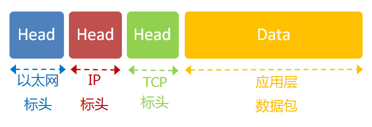

# 网络基础

## 网络分层模型

### TCP/IP 四层模型

- 应用层
- 传输层
- 网络层
- 网络接口层

### OSI 七层模型

- 应用层
- 表示层
- 会话层
- 传输层
- 网络层
- 数据链路层
- 物理层


### 五层模型

- 应用层
- 传输层
- 网络层
- 链接层 ： 它在"实体层"的上方，确定了 0 和 1 的分组方式。例如：以太网协议
- 实体层 ： 就是把电脑连接起来的物理手段。它主要规定了网络的一些电气特性，作用是负责传送 0 和 1 的电信号。例如，光缆、电缆、双绞线、无线电波等

## 网络传输

### 以太网协议

以太网规定，一组电信号构成一个数据包，叫做"帧"（Frame）。每一帧分成两个部分：标头（Head）和数据（Data）。

"标头"包含数据包的一些说明项，比如发送者、接受者、数据类型等等；"数据"则是数据包的具体内容。

- "标头"的长度，固定为 18 字节。
- "数据"的长度，最短为 46 字节，最长为 1500 字节。
- 因此，整个"帧"最短为 64 字节，最长为 1518 字节。
- 如果数据很长，就必须分割成多个帧进行发送。

#### MAC 地址

以太网规定，连入网络的所有设备，都必须具有"网卡"接口。数据包必须是从一块网卡，传送到另一块网卡。网卡的地址，就是数据包的发送地址和接收地址，这叫做 MAC 地址。

每块网卡出厂的时候，都有一个全世界独一无二的 MAC 地址，长度是 48 个二进制位，通常用 12 个十六进制数表示，例如：`00:1A:2B:3C:4D:5E`。

以太网数据包的"标头"，包含了发送者和接受者的信息，发送者和接受者就是通过 MAC 地址标识的。

#### 广播

有了 MAC 地址，系统怎样才能把数据包准确送到接收方？

回答是以太网采用了一种很"原始"的方式，它不是把数据包准确送到接收方，而是向本网络内所有计算机发送，让每台计算机自己判断，是否为接收方。

例如：1 号计算机向 2 号计算机发送一个数据包，同一个子网络的 3 号、4 号、5 号计算机都会收到这个包。它们读取这个包的"标头"，找到接收方的 MAC 地址，然后与自身的 MAC 地址相比较，如果两者相同，就接受这个包，做进一步处理，否则就丢弃这个包。这种发送方式就叫做"广播"（broadcasting）。

#### ARP 地址解析协议

#### 链接层

有了数据包的定义、网卡的 MAC 地址、广播的发送方式，"链接层"就可以在多台计算机之间传送数据了。

### IP 协议

#### 网络层的来源

以太网协议，依靠 MAC 地址发送数据。理论上，单单依靠 MAC 地址，上海的网卡就可以找到洛杉矶的网卡了，技术上是可以实现的。不过上海和洛杉矶的电脑在同一个巨型网络中，这几乎是不可能的，巨型网络必须分成一个个的子网络，子网络在分成一个个的子网络，这样才是一个合理的架构，所以上海和洛杉矶肯定会不同的子网络中。

单单依靠 MAC 地址，上海的网卡就可以找到洛杉矶的网卡了，技术上是可以实现的，不过这样做有一个重大的缺点。以太网采用广播方式发送数据包，所有成员人手一"包"，不仅效率低，而且局限在发送者所在的子网络。也就是说，如果两台计算机不在同一个子网络，广播是传不过去的。这种设计是合理的，否则互联网上每一台计算机都会收到所有包，那会引起灾难。

例如 MAC 地址是每个人的身份证号，网络通信想象成在一个大城市派送快递，仅仅知道身份证号，快递员不知道该去哪里送，肯定不能挨家挨户的去敲门比对身份证。

因此，必须找到一种方法，能够区分哪些 MAC 地址属于同一个子网络，哪些不是。如果是同一个子网络，就采用广播方式发送，否则就采用"路由"方式发送。遗憾的是，MAC 地址本身无法做到这一点。它只与厂商有关，与所处网络无关。

这就导致了"网络层"的诞生。它的作用是引进一套新的地址，使得我们能够区分不同的计算机是否属于同一个子网络。这套地址就叫做"网络地址"，简称"网址"。这个地址就像你们家的门牌号，快递员就可以按照门牌号找到你家，再验证你的身份中就可以确定是否派送正确。即网络设备根据 IP 地址选择路径，根据 MAC 地址进行实际传输。

于是，"网络层"出现以后，每台计算机有了两种地址，一种是 MAC 地址，另一种是网络地址。两种地址之间没有任何联系，MAC 地址是绑定在网卡上的，网络地址则是管理员分配的，它们只是随机组合在一起。

**网络地址帮助我们确定计算机所在的子网络，MAC 地址则将数据包送到该子网络中的目标网卡。因此，从逻辑上可以推断，必定是先处理网络地址，然后再处理 MAC 地址。**

#### IP 协议详情

规定网络地址的协议，叫做 IP 协议。它所定义的地址，就被称为 IP 地址。

目前，广泛采用的是 IP 协议第四版，简称 IPv4。这个版本规定，网络地址由 32 个二进制位组成。习惯上，我们用分成四段的十进制数表示 IP 地址，从 0.0.0.0 一直到 255.255.255.255。

- 172.16.254.1
- 10101100.00010000.11111110.00000001

互联网上的每一台计算机，都会分配到一个 IP 地址。这个地址分成两个部分，前一部分代表网络，后一部分代表主机。比如，IP 地址 172.16.254.1/24，这是一个 32 位的地址，它的网络部分是前 24 位（172.16.254），那么主机部分就是后 8 位（最后的那个 1）。处于同一个子网络的电脑，它们 IP 地址的网络部分必定是相同的，也就是说 172.16.254.2 应该与 172.16.254.1 处在同一个子网络。

怎样才能从 IP 地址，判断两台计算机是否属于同一个子网络呢？这就要用到另一个参数"子网掩码"（subnet mask）。

所谓"子网掩码"，就是表示子网络特征的一个参数。它在形式上等同于 IP 地址，也是一个 32 位二进制数字，它的网络部分全部为 1，主机部分全部为 0。比如，IP 地址 172.16.254.1，如果已知网络部分是前 24 位，主机部分是后 8 位，那么子网络掩码就是 11111111.11111111.11111111.00000000，写成十进制就是 255.255.255.0。

知道"子网掩码"，我们就能判断，任意两个 IP 地址是否处在同一个子网络。方法是将两个 IP 地址与子网掩码分别进行 AND 运算（两个数位都为 1，运算结果为 1，否则为 0），然后比较结果是否相同，如果是的话，就表明它们在同一个子网络中，否则就不是。

比如，已知 IP 地址 172.16.254.1 和 172.16.254.233 的子网掩码都是 255.255.255.0，请问它们是否在同一个子网络？两者与子网掩码分别进行 AND 运算，结果都是 172.16.254.0，因此它们在同一个子网络。

#### IP 数据包

根据 IP 协议发送的数据，就叫做 IP 数据包。不难想象，其中必定包括 IP 地址信息。

但是前面说过，以太网数据包只包含 MAC 地址，并没有 IP 地址的栏位。那么是否需要修改数据定义，再添加一个栏位呢？

回答是不需要，我们可以把 IP 数据包直接放进以太网数据包的"数据"部分，因此完全不用修改以太网的规格。这就是互联网分层结构的好处：上层的变动完全不涉及下层的结构。

具体来说，IP 数据包也分为"标头"和"数据"两个部分。

"标头"部分主要包括版本、长度、IP 地址等信息，"数据"部分则是 IP 数据包的具体内容。

IP 数据包的"标头"部分的长度为 20 到 60 字节，整个数据包的总长度最大为 65,535 字节。因此，理论上，一个 IP 数据包的"数据"部分，最长为 65,515 字节。前面说过，以太网数据包的"数据"部分，最长只有 1500 字节。因此，如果 IP 数据包超过了 1500 字节，它就需要分割成几个以太网数据包，分开发送了。

### TCP、UDP 协议

#### 传输层的来源

有了 MAC 地址和 IP 地址，我们已经可以在互联网上任意两台主机上建立通信。

接下来的问题是，同一台主机上有许多程序都需要用到网络，比如，你一边浏览网页，一边与朋友在线聊天。当一个数据包从互联网上发来的时候，你怎么知道，它是表示网页的内容，还是表示在线聊天的内容？

也就是说，我们还需要一个参数，表示这个数据包到底供哪个程序（进程）使用。这个参数就叫做"端口"（port），它其实是每一个使用网卡的程序的编号。每个数据包都发到主机的特定端口，所以不同的程序就能取到自己所需要的数据。

"端口"是 0 到 65535 之间的一个整数，正好 16 个二进制位。0 到 1023 的端口被系统占用，用户只能选用大于 1023 的端口。不管是浏览网页还是在线聊天，应用程序会随机选用一个端口，然后与服务器的相应端口联系。

**"传输层"的功能，就是建立"端口到端口"的通信。相比之下，"网络层"的功能是建立"主机到主机"的通信。只要确定主机和端口，我们就能实现程序之间的交流。因此，Unix 系统就把主机+端口，叫做"套接字"（socket）。**有了它，就可以进行网络应用程序开发了。

#### UDP 协议

经过上面的分析我们必须在数据包中加入端口信息，这就需要新的协议。最简单的实现叫做 UDP 协议，它的格式几乎就是在数据前面，加上端口号。

UDP 数据包，也是由"标头"和"数据"两部分组成。

"标头"部分主要定义了发出端口和接收端口，"数据"部分就是具体的内容。然后，把整个 UDP 数据包放入 IP 数据包的"数据"部分，而前面说过，IP 数据包又是放在以太网数据包之中的，所以整个以太网数据包现在变成了下面这样：


UDP 数据包非常简单，"标头"部分一共只有 8 个字节，总长度不超过 65,535 字节，正好放进一个 IP 数据包。

### TCP 协议

UDP 协议的优点是比较简单，容易实现，但是缺点是可靠性较差，一旦数据包发出，无法知道对方是否收到。

为了解决这个问题，提高网络可靠性，TCP 协议就诞生了。这个协议非常复杂，但可以近似认为，它就是有确认机制的 UDP 协议，每发出一个数据包都要求确认。如果有一个数据包遗失，就收不到确认，发出方就知道有必要重发这个数据包了。

因此，TCP 协议能够确保数据不会遗失。它的缺点是过程复杂、实现困难、消耗较多的资源。

TCP 数据包和 UDP 数据包一样，都是内嵌在 IP 数据包的"数据"部分。TCP 数据包没有长度限制，理论上可以无限长，但是为了保证网络的效率，通常 TCP 数据包的长度不会超过 IP 数据包的长度，以确保单个 TCP 数据包不必再分割。

### 应用层传输协议（HTTP、FTP、SMTP、POP3、IMAP4、DHCP）

"应用层"的作用，就是规定应用程序的数据格式。

举例来说，TCP 协议可以为各种各样的程序传递数据，比如 Email、WWW、FTP 等等。那么，必须有不同协议规定电子邮件、网页、FTP 数据的格式，这些应用程序协议就构成了"应用层"。

这是最高的一层，直接面对用户。它的数据就放在 TCP 数据包的"数据"部分。



#### DHCP

设备联网后有一个所谓"动态 IP 地址"，指计算机开机后，会自动分配到一个 IP 地址，不用人为设定。它使用的协议叫做 DHCP 协议。

它是一种应用层协议，建立在 UDP 协议之上，所以整个数据包是这样的：


这个协议规定，每一个子网络中，有一台计算机负责管理本网络的所有 IP 地址，它叫做"DHCP 服务器"。新的计算机加入网络，必须向"DHCP 服务器"发送一个"DHCP 请求"数据包，申请 IP 地址和相关的网络参数。

前面说过，如果两台计算机在同一个子网络，必须知道对方的 MAC 地址和 IP 地址，才能发送数据包。但是，新加入的计算机不知道这两个地址，怎么发送数据包呢？DHCP 协议做了一些巧妙的规定。

（1）最前面的"以太网标头"，设置发出方（本机）的 MAC 地址和接收方（DHCP 服务器）的 MAC 地址。前者就是本机网卡的 MAC 地址，后者这时不知道，就填入一个广播地址：FF-FF-FF-FF-FF-FF。

（2）后面的"IP 标头"，设置发出方的 IP 地址和接收方的 IP 地址。这时，对于这两者，本机都不知道。于是，发出方的 IP 地址就设为 0.0.0.0，接收方的 IP 地址设为 255.255.255.255。

（3）最后的"UDP 标头"，设置发出方的端口和接收方的端口。这一部分是 DHCP 协议规定好的，发出方是 68 端口，接收方是 67 端口。

这个数据包构造完成后，就可以发出了。以太网是广播发送，同一个子网络的每台计算机都收到了这个包。因为接收方的 MAC 地址是 FF-FF-FF-FF-FF-FF，看不出是发给谁的，所以每台收到这个包的计算机，还必须分析这个包的 IP 地址，才能确定是不是发给自己的。当看到发出方 IP 地址是 0.0.0.0，接收方是 255.255.255.255，于是 DHCP 服务器知道"这个包是发给我的"，而其他计算机就可以丢弃这个包。

接下来，DHCP 服务器读出这个包的数据内容，分配好 IP 地址，发送回去一个"DHCP 响应"数据包。这个响应包的结构也是类似的，以太网标头的 MAC 地址是双方的网卡地址，IP 标头的 IP 地址是 DHCP 服务器的 IP 地址（发出方）和 255.255.255.255（接收方），UDP 标头的端口是 67（发出方）和 68（接收方），分配给请求端的 IP 地址和本网络的具体参数则包含在 Data 部分。

新加入的计算机收到这个响应包，于是就知道了自己的 IP 地址、子网掩码、网关地址、DNS 服务器等等参数。

## 网络通信的过程

发送者和接受者通过 MAC 地址标识，这是第一步：定义地址

随后的第一个问题就是一块网卡怎么会知道另一块网卡的 MAC 地址？或者说发送方的网卡怎么知道接收方的 MAC 地址？

就算有了接收方的 MAC 地址，系统怎样才能把数据包准确送到接收方？

有了对方的 MAC 地址和 IP 地址，数据包才能准确送到接收者手中。但是，前面说过，MAC 地址有局限性，如果两台电脑不在同一个子网络，就无法知道对方的 MAC 地址，必须通过网关（gateway）转发。

例如：1 号电脑要向 4 号电脑发送一个数据包。它先判断 4 号电脑是否在同一个子网络，结果发现不是，于是就把这个数据包发到网关 A。网关 A 通过路由协议，发现 4 号电脑位于子网络 B，又把数据包发给网关 B，网关 B 再转发到 4 号电脑。

1 号电脑把数据包发到网关 A，必须知道网关 A 的 MAC 地址。所以，数据包的目标地址，实际上分成两种情况：

- 在同一个子网络，必须知道对方的 MAC 地址，对方的 IP 地址，采用广播方式发送数据包。
- 在不同的子网络，必须知道自己网关的 MAC 地址，对方的 IP 地址，采用路由方式发送数据包。

### 对方的网关 IP 如何获得？

路由器如何确定目标网关 IP：

1. 路由表（Routing Table）机制：

```
路由器根据目标IP地址（192.168.2.100）和子网掩码判断：
- 查看自己的路由表
- 匹配最佳路由路径
- 确定下一跳（next hop）的IP地址
```

2. 路由表示例：

```
目标网络        子网掩码          下一跳          接口
0.0.0.0/0      0.0.0.0         10.0.0.1        eth0    (默认路由)
192.168.1.0    255.255.255.0   直连            eth1
192.168.2.0    255.255.255.0   192.168.3.1     eth2
```

3. 路由选择过程：

- 当收到目标 IP 为 192.168.2.100 的数据包
- 路由器将目标 IP 和路由表中的每个条目匹配
- 发现 192.168.2.0/24 这个网段匹配
- 查找对应的下一跳 IP：192.168.3.1

就像快递分拣：

- 查看收件地址的邮编（IP 地址）
- 对照分拣路线表（路由表）
- 确定要转发到哪个分拨中心（下一跳）

如果没有具体匹配的路由：

- 使用默认路由（0.0.0.0/0）
- 转发给默认网关
- 就像不认识的地址都转给总分拨中心处理

#### 路由表和互联网路由

路由表的来源和互联网路由过程：

1. 路由表的来源：

```
A. 直连路由
- 路由器自动添加直接连接的网段
- 如本地局域网 192.168.1.0/24

B. 静态路由
- 网络管理员手动配置
- 适用于小型网络

C. 动态路由
- 通过路由协议自动学习
- 常见协议：
  - 内部网关协议(IGP)：OSPF、RIP
  - 外部网关协议(EGP)：BGP
```

2. 跨互联网寻找目标过程：

```
示例：从 192.168.1.100 访问 59.100.2.100

A. 局域网内部
192.168.1.100 -> 本地网关(192.168.1.1)

B. ISP网络
本地网关 -> ISP边缘路由器
- 使用ISP的动态路由协议
- BGP协议在不同ISP之间交换路由信息

C. 骨干网络
- 通过BGP找到目标IP所属的ISP
- 选择最优路径转发

D. 目标网络
最终到达目标IP所在的网关
```

就像邮政系统：

- 你的包裹先到社区邮局（本地网关）
- 转给市级分拨中心（ISP）
- 通过省级中心（骨干网）
- 最终到达目标城市分拨中心（目标网关）

3. BGP 的作用：

```
- 维护全网路由表
- 交换路由信息
- 选择最佳路径
- 确保不同ISP之间的互联互通
```

这就是为什么即使只知道目标 IP，数据包也能准确送达的原因。整个过程依赖于：

- 本地路由表
- ISP 的路由协议
- 全球 BGP 系统
- 各级路由器的协同工作

## 网络通信中的数据包

### HTTP 数据包

以 HTTP 为例，浏览网页用的是 HTTP 协议，它的整个数据包构造是这样的：


HTTP 部分的内容，类似于下面这样：

```
　　GET / HTTP/1.1
　　Host: www.google.com
　　Connection: keep-alive
　　User-Agent: Mozilla/5.0 (Windows NT 6.1) ......
　　Accept: text/html,application/xhtml+xml,application/xml;q=0.9,*/*;q=0.8
　　Accept-Encoding: gzip,deflate,sdch
　　Accept-Language: zh-CN,zh;q=0.8
　　Accept-Charset: GBK,utf-8;q=0.7,*;q=0.3
　　Cookie: ... ...
```

假定这个部分的长度为 4960 字节，它会被嵌在 TCP 数据包之中。

### TCP 数据包

TCP 数据包需要设置端口，接收方（Google）的 HTTP 端口默认是 80，发送方（本机）的端口是一个随机生成的 1024-65535 之间的整数，假定为 51775。

TCP 数据包的标头长度为 20 字节，加上嵌入 HTTP 的数据包，总长度变为 4980 字节。

### IP 数据包

然后，TCP 数据包再嵌入 IP 数据包。IP 数据包需要设置双方的 IP 地址，这是已知的，发送方是 192.168.1.100（本机），接收方是 172.194.72.105（Google）。

IP 数据包的标头长度为 20 字节，加上嵌入的 TCP 数据包，总长度变为 5000 字节。

### 以太网数据包

最后，IP 数据包嵌入以太网数据包。以太网数据包需要设置双方的 MAC 地址，发送方为本机的网卡 MAC 地址，接收方为网关 192.168.1.1 的 MAC 地址（通过 ARP 协议得到）。

以太网数据包的数据部分，最大长度为 1500 字节，而现在的 IP 数据包长度为 5000 字节。因此，IP 数据包必须分割成四个包。因为每个包都有自己的 IP 标头（20 字节），所以四个包的 IP 数据包的长度分别为 1500、1500、1500、560。

### 服务端接收到包

经过多个网关的转发，Google 的服务器 172.194.72.105，收到了这四个以太网数据包。

根据 IP 标头的序号，Google 将四个包拼起来，取出完整的 TCP 数据包，然后读出里面的"HTTP 请求"，接着做出"HTTP 响应"，再用 TCP 协议发回来。

本机收到 HTTP 响应以后，就可以将网页显示出来，完成一次网络通信。
