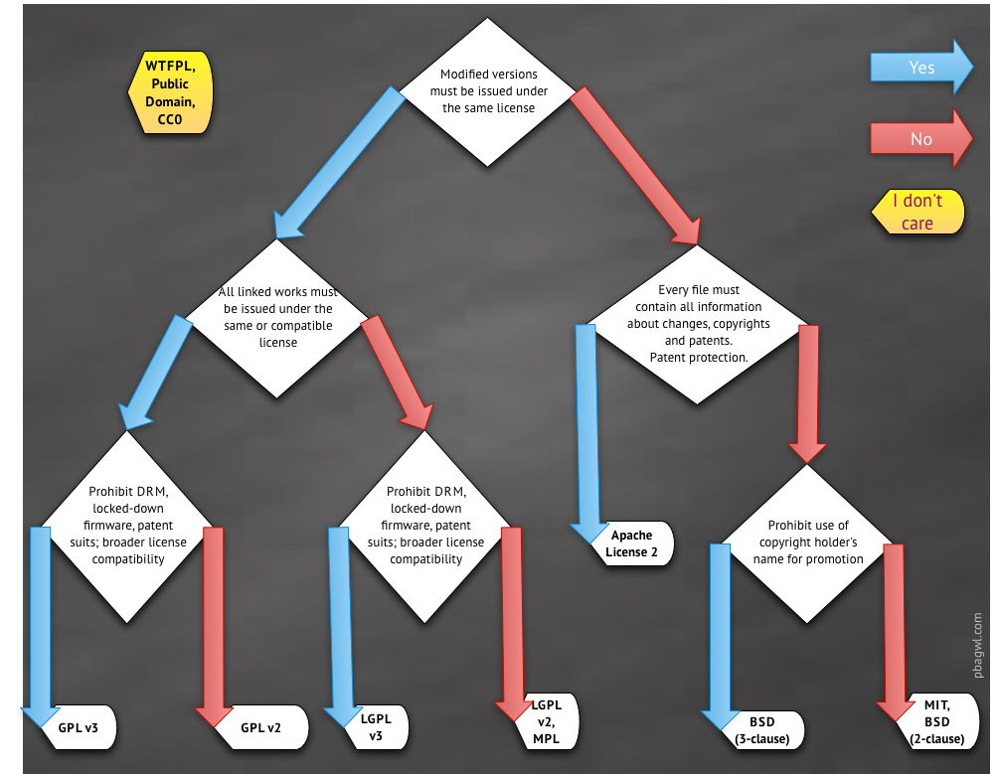

# npm 备忘

npm 是 Node 包管理器（npm package manager），由三个不同的部分组成：网站、注册表和 CLI。网站是用户发现软件包的主要工具，注册表是一个关于软件包信息的大型数据库，而 CLI 则是开发者如何在注册表上发布他们的软件包或下载他们希望安装的软件包。

## npm 常用指令

### npm set

`npm set` 用来设置环境变量，等于给 `npm init` 设置了默认值，这些环境变量会存放在用户主目录的 `~/.npmrc` 文件，如果每个项目都有不同的设置，可以针对该项目运行 `npm config`。

```
npm set init-license "MIT"
```

### npm config

`npm config` 可以查看和设置项目的 npm 配置。

`npm config list` 可以查看 npm 设置的配置

`npm config ls -l` 和 `npm config list --json` 可以查看包括默认配置在内的所有的 npm 配置

`npm config set prefix` 可以设置全局安装的路径

`npm config --help` 可以查看所有 config 相关的命令

#### `.npmrc` 配置文件在哪里？

通过执行 `npm config list` 可以看到有注释表明 user config 的文件地址

```
; "user" config from /Users/cfangxu/.npmrc

home = "https://www.npmjs.org"
init-license = "MIT"
registry = "https://registry.npmmirror.com/"
```

除了使用 CLI 的 `npm config` 命令显示修改 npm 配置，还可以通过 npmrc 文件直接修改配置。

npmrc 文件会有多个，优先级由高到底包括：

- 项目工程内配置文件：`项目path/.npmrc`
- 用户配置文件： `~/.npmrc`
- 全局配置文件： 可以通过 `npm config get globalconfig` 获取路径
- npm 内置配置文件

通过这个机制我们可以方便的在项目工程目录创建一个 `.npmrc` 文件共享团队 npm 运行相关的配置。

#### npm 的缓存目录在哪里？

可以通过 `npm config get cache` 获取

#### npm 的全局安装的包在哪里？

可以通过 `npm config get prefix` 获取到全局安装包的前缀目录

也可以通过 `npm root --location=global` 获取到全局安装包的完成路径

### npm bin

`npm bin` 命令显示相对于当前目录的 node 模块的可执行脚本所在的目录（即 `.bin` 目录）

`npm bin --location=global` 命令显示全局安装的模块的可执行脚本所在的目录

### npm link

`npm link` 的功能是在本地包和全局包之间创建符号链接。

- 将全局包链接到本地：使用全局模式安装的包不能直接通过 `require` 使用，但是可以通过 `npm link` 命令可以打破这一限制。例如通过 `npm i -g express` 安装的 express，在我们的项目开发目录下运行命令 `npm link express`，我们就可以在项目的 node_modules 目录中发现一个指向安装到全局的 express 包的符号链接。然后，我们可以通过 `npm unlink express` 来解除这个链接。
- 将本地包连接到全局：使用方法是在本地包目录（package.json 所在的目录）中运行 `npm link` 命令。如果我们要开发一个包，利用这种方法可以非常方便的在不同的工程间进行测试，具体操作就是在我们开发的包目录执行 `npm link`，然后再我们进行测试的项目目录执行 `npm link xxx`。

### 一些指令的简写

- `npm install cz-relax` => `npm i cz-relax`
- `npm i --global cz-relax` => `npm i -g cz-relax`
- `npm i --save cz-relax` => `npm i -S cz-relax`
- `npm i --save-dev cz-relax` => `npm i -D cz-relax`

## npm 定义脚本命令

npm 允许在 `package.json` 文件里面，使用 `scripts` 字段定义脚本命令。

npm 脚本的原理非常简单。每当执行 `npm run`，就会自动新建一个 Shell，在这个 Shell 里面执行指定的脚本命令。因此，只要是 Shell(一般是 bash)可以运行的命令，就可以写在 npm 脚本里面。

其中有一点比较特别，`npm run` 新建的这个 Shell，会将当前目录及其父级目录的 `node_modules/.bin` 子目录加入 `PATH` 变量，执行结束后，再将 `PATH` 变量恢复原样。这意味着，当前目录的 `node_modules/.bin` 子目录里面的所有脚本，都可以直接用脚本名调用，而不必加上路径。现在使用 `npx` 命令也能做到。

由于 npm 脚本的唯一要求就是可以在 Shell 执行，因此它不一定是 Node 脚本，任何可执行文件都可以写在里面。

npm 脚本的退出码，也遵守 Shell 脚本规则。如果退出码不是 0 ，npm 就认为这个脚本执行失败。

> `npm run` 或者 `npm run-script` 可以列出当前项目所有可用的脚本命令， `npm run-script` 是 `npm run` 命令的完整版。

> `PATH` 环境变量，是告诉系统，当要求系统运行一个程序而没有告诉它程序所在的完整路径时，系统除了在当前目录下面寻找此程序外，还应到哪些目录下去寻找。

> `npx`：npm 从 5.2 开始，增加了 npx 命令，npx 的原理很简单，就是运行的时候，会到 `./node_modules/.bin` 路径和环境变量 `$PATH` 里面检查命令是否存在，如果存在，就调用执行。除了调用项目内部模块，npx 还可以从 npm 仓库下载包到本地全局，执行完命令以后再删除，也就是说可以使用 npx 来使用你本地没有安装过但是存在 npm 仓库上的包。
>
> 其实 `npm init` 跟 npx 也有联系，`npm init <initializer>` 通常被用于创建一个新的或者已经存在的 npm 包。initializer 在这里实际映射的是一个名为 `create-<initializer>` 的 npm 包，该包将由 npx 来下载执行，会进行一些初始化相关的操作。具体可以查看 [你不知道的 npm init](https://juejin.cn/post/6844903684032167950)

### 执行顺序

- 如果是并行执行（即同时的平行执行），可以使用 `&` 符号
- 如果是继发执行（即只有前一个任务成功，才执行下一个任务），可以使用 `&&` 符号
- npm 脚本有 `pre` 和 `post` 两个钩子，举例来说：`build` 脚本命令的钩子就是 `prebuild`和`postbuild`，用户在执行 `npm run build` 时，会按照这个顺序执行 `npm run prebuild && npm run build && npm run postbuild`
- npm 默认有一个 `prepare` 钩子，会在 `npm install` （不带任何参数） 命令之前运行

### 变量

npm 脚本有一个非常强大的功能，就是可以使用 npm 的内部变量。通过 `npm run` 运行的脚本，如果是 JavaScript 脚本，我们可以通过环境变量 `process.env` 对象的 `npm_package_` 前缀，拿到 `package.json` 的字段值，例如：`process.env.npm_package_version` 可以拿到当前包的版本。如果是 Bash 脚本，可以使用 `$npm_package_version` 来获取。

npm 脚本还可以通过 `npm_config_` 前缀，拿到 npm 的配置变量， 即 `npm config get xxx` 命令返回的值

> `npm run env` 命令可以列出所有环境变量

## package.json

### 主要属性

#### name

- name 是必要属性
- name 不能以 `_` 或 `.` 开头
- name 不能含有大写字母
- name 不要使用和 node 核心模块一样的名称，不能与其他模块重名（`npm view <packageName>` 可以查看模块名是否已被使用，没有被使用会返回 404）
- name 会成为 url 的一部分，不能含有 url 非法字符
- name 也许会被写在 `require()` 的参数中，所以最好取个简短而语义化的值

> `validate-npm-package-name` 包可以检测模块名是否合法

#### version

- version 是必要属性
- version 必须可以被 npm 依赖的 `node-semver` 模块解析

> name 和 version 两个必备的字段组成了一个 npm 模块的唯一标识。

版本号的使用规范如下：

- 版本号的命名遵循语义化版本 2.0.0 规范，格式为：主版本号.次版本号.修订号，通常情况下，修改主版本号是做了大的功能性的改动，修改次版本号是新增了新功能，修改修订号就是修复了一些 bug；
- 如果某个版本的改动较大，并且不稳定，可能如法满足预期的兼容性需求，就需要发布先行版本，先行版本通过会加在版本号的后面，通过“-”号连接以点分隔的标识符和版本编译信息：内部版本（alpha）、公测版本（beta）和候选版本（rc，即 release candiate）。

可以通过 `npm view react verisons` 查看 react 所有的版本，还是复合版本号的规范的。

关于语义化版本可以查看[语义化版本 2.0.0](https://semver.org/lang/zh-CN/)和[语义化版本控制模块-Semver](https://juejin.cn/post/6844903516754935816)

#### description

一个描述，方便别人了解你的模块作用，搜索的时候也有用

#### keywords

一个字符串数组，方便别人搜索到本模块

#### homepage

项目主页 url

#### author

包的作者，有两种形式。

- 字符串形式

```json
"author": "chenfangxu <chenfangxu_qixin@163.com> (https://github.com/qiqihaobenben)"
```

- 对象形式

```json
"author": {
  "name": "chenfangxu",
  "email": "chenfangxu_qixin@163.com",
  "url": "https://github.com/qiqihaobenben"
}
```

#### contributors

包的贡献者，该属性是一个数组，包含所有的贡献者，同样有字符串形式和对象形式两种写法。

#### repository

代码存放仓库的地址，有两种形式：

- 字符串形式

```json
"repository": "git+https://github.com/qiqihaobenben/commitizen-relax.git"
```

- 对象形式

```json
"repository": {
  "type": "git",
  "url": "git+https://github.com/qiqihaobenben/commitizen-relax.git"
}
```

#### bugs

项目提交问题的地址，该属性是一个对象，可以添加一个提交问题的地址和反馈的邮箱

```json
"bugs": {
  "url": "https://github.com/qiqihaobenben/commitizen-relax/issues"
}
```

#### license

指定软件的开源协议，开源协议表述了其他人获得代码后拥有的权利，可以对代码进行何种操作，何种操作又是被禁止的。

常用协议及规则如下：



所有协议列表可以查看：[https://spdx.org/licenses](https://spdx.org/licenses/#)。这里还有一个网站：[https://choosealicense.com/](https://choosealicense.com/)，可以通过回答一些问题来选择合适的开源协议。

#### files

- 发布文件配置
- 使用 `npm publish` 命令后推送到 npm 服务器的文件列表，如果指定文件夹，则文件夹内的所有内容都会包含进来。
- 说的通俗一点，就是如果设置了 files 字段，发布的 npm 包除了一些必要的文件外，就只会包含 files 中设置的文件和文件夹。

#### main

- 定义项目的入口，指定加载的入口文件
- 当不指定 main 时，默认值是模块根目录的 `index.js` 文件

#### browser

browser 字段可以定义 npm 包在 browser 环境下的入口文件。如果 npm 包只在 web 端使用，并且严禁在 server 端使用，可以使用 browser 来定义入口文件。

#### module

定义 npm 包的 ESM 规范的入口文件，browser 环境和 node 环境均可使用。

#### bin

- 指定各个内部命令对应的可执行文件的位置，相当于做了一个命令名和本地文件名的映射
- 当用户安装带有 `bin` 字段的包时：
  - 如果是全局安装，npm 将会使用符号链接把这些文件链接到 `/usr/local/node_modules/bin/`或其他环境变量能访问到的地方，并将这些路径加入系统的 PATH 变量；
  - 如果是本地安装，会链接到 `./node_modules/.bin/`

```json
"bin": {
  "cz-relax": "lib/cli.js"
}
```

#### private

- 定义私有模块
- 一般公司的非开源项目，都会设置 private 属性为 `true`。因为 npm 拒绝发布私有模块，通过设置该属性可以防止私有模块被无意间发布出去。

#### preferGlobal

如果您的软件包主要用于安装到全局的命令行应用程序，那么该值设置为 true ，如果它被安装在本地，则提供一个警告。实际上该配置并没有阻止用户把模块安装到本地，只是防止该模块被错误的使用引起一些问题。

#### dependencies

**业务依赖**，是指项目的生产环境中所必须的依赖包，通过 `npm install <PACKAGENAME>` 或 `npm install --save <PACKAGENAME>` 安装的 npm 包都会被自动插入到此配置项中。

这些依赖在项目最终上线或者发布 `npm` 包时所需要的，即其中的依赖项应该属于线上代码的一部分。

#### devDependencies

**开发依赖**，是指开发阶段需要的依赖包，如 Webpack、ESLint、Babel 等，用于辅助开发，这些依赖项不应该属于先上代码的一部分。通过 `npm install --save-dev <PACKAGENAME>` 安装的包会自动插入到此配置项中。在生产环境中运行的代码如果不需要这些包，可以通过 `npm install --production` 只安装生产环境的依赖包（业务依赖）

#### peerDenpendencies

**同伴依赖**，用来供插件指定其所需要的主工具的版本，需要注意，从 npm3.0 开始，peerDenpendencies 不再会默认安装了

#### optionalDependencies

**可选依赖**，如果需要在找不到包或者安装包失败时，npm 仍然可以继续运行，可以配置在此处，optionalDependencies 对象中的包会覆盖 dependencies 中同名的包，所以不要把一个包同时写进两个对象中。需要注意，由于 optionalDependencies 中的依赖可能并未安装成功，所以一定要做异常处理，否则当获取这个依赖时，如果获取不到就会报错。

#### bundledDependencies

打包依赖，上面几个依赖相关的配置项都是一个对象，而 bundledDependencies 配置项是一个数组，数组里可以指定一些模块，这些模块将在使用 `npm pack` 是打成一个包。

需要注意，这个字段数组中的值必须是在 dependencies、devDependencies 两个里面声明过的包。

#### os

指定模块适用的系统

```json
"os": ["darwin", "linux"] # 适用系统
"os": ["!win32"] # 黑名单
```

#### cpu

指定模块适用的 cpu 架构

```json
"cpu": ["x64", "ia32"] # 适用 cpu
"cpu": ["!arm", "!mips"] # 黑名单
```

#### engines

指定项目运行适用的 node 版本 和 npm 版本，对于项目周期很长的项目，建议填写该属性，避免之后项目跑不起来了。

```json
"engines": {
  "node": ">= 16.16.0",
  "npm": ">= 8.11.0"
}
```

需要注意的是，engines 属性只是起到一个说明的作用，当前用户版本不符合指定值时也不影响 npm 包的安装。如果需要添加强约束，需要自己写脚本钩子，读取并解析 engines 字段的 semver range 并与运行环境做比对校验。

#### config

常用来配置 scripts 运行时的配置参数。

```json
"scripts": {
  "dev": "node ./demo.js"
},
"config": {
 "port": 3000
}
```

```js
// demo.js
console.log(process.env.npm_package_config.port) // 运行 npm run dev 打印：3000
```

> `process.env` 中有很多关于 npm 的变量 `npm_package_config` 只是其中一个。

## npm 安装依赖

### npm 2

npm2 在安装依赖包时，采用简单的递归安装方法，即嵌套模式进行依赖管理。

优点是 node_modules 的结构和 package.json 结构一一对应，层级结构明显，并且保证了每次安装目录结构都是相同的。存在的问题就是依赖地狱，包重复安装和嵌套层级过深。

### npm 3

npm3 的 node_modules 目录改成了更加扁平的层级结构，通过扁平化的方式将子依赖项安装在 node_modules 的根目录中（hoisting 提升），以减少依赖项嵌套导致的深层树和冗余，解决这个问题得益于 node 的模块加载机制。

优先将模块安装在 `node_modules` 根目录中，当安装到相同模块时，判断已安装的模块版本是否符合新模块的版本范围，如果符合就跳过安装，不符合则在当前模块的 node_modules 下安装该模块。也可以理解为 npm 实现了额外的依赖查找算法，核心是递归向上查找 node_modules。在安装新的包时，会不停向上级 node_modules 中查找。如果找到符合版本的包就不会重新安装，在遇到版本冲突时才会在模块下的 node_modules 目录下存放该模块子依赖，这样就解决了大量包重复安装的问题，依赖的层级也不会太深。

存在的问题就是幽灵依赖（依赖不安全，我们可以使用依赖文件中并没有声明的 npm 包）、多重依赖和不确定性，具体可以看一下这篇文章[《关于依赖管理的真相 — 前端包管理器探究》](https://mp.weixin.qq.com/s?__biz=MzI5NjM5NDQxMg%3D%3D&mid=2247495463&idx=1&sn=591c5b3bfcf78f10c718153fe2dc8228#rd&inApp=true&exportTheme=light&isTablet=0)

#### 那么安装相同名称但是版本不同的包时是按照什么顺序处理？

`npm install` 时，首先将 `package.json` 里的依赖按照字母（`@`排在最前）进行排序，然后将排序后的依赖包按照广度优先遍历的算法进行安装，最先被安装到的模块会被优先安装在一级 `node_modules` 目录下。所谓的广度优先遍历的安装方式，就是优先将同一层级的模块包及其依赖安装好，而不是优先将一个模块及其所有子模块安装好。

**注意：与本地依赖包不同，如果我们通过 `npm install --global` 全局安装包到全局目录时，得到的 目录依然是“传统的”目录结构。如果使用 npm 3 想要得到“传统”形式的本地 node_modules 目录，使用 `npm install --global-style` 命令即可**

### npm 5

npm 5 的实现是扁平化 + lock，当项目有 package.json 文件并且首次执行 `npm install` 安装后，会自动生成一个 package-lock.json 文件，该文件里面记录了 package.json 依赖的模块，以及模块的子依赖。并且给每个依赖标明了版本、获取地址和验证模块完整性哈希值。通过 package-lock.json，保障了依赖包安装的确定性和兼容性，使得每次安装都会出现相同的结果。

#### package-lock.json

package-lock.json 的详细描述主要由 version、resolved、integrity、dev、requires、dependencies 这几个字段构成：

- version：包唯一的版本号
- resolved：安装源
- integrity：表明包完整性的 hash 值（验证包是否已失效）
- dev：如果为 true，则此依赖关系仅是顶级模块的开发依赖关系或者间接的开发依赖、开发依赖的传递依赖关系
- requires：依赖包所需要的所有依赖项，对应依赖包 package.json 里 dependencies 中的依赖项
- dependencies：因为版本冲突等原因没有安装在一级 `node_modules` 中的依赖项

通过实际查看，`package-lock.json` 文件和 `node_modules` 目录结构是一一对应的，即项目目录下存在 `package-lock.json` 可以让每次安装生成的依赖目录结构保持相同。

> npm 5.x 以上的版本，最好使用 5.6 以上的，因为在 5.0~5.6 中间对 package-lock.json 的处理逻辑更新过几个版本，5.6 以上才开始稳定。

## 升级依赖包

项目开发中，依赖包安装后基本上就不会再升级了，可以是依赖包的版本基本都是在不断更新了，那么我们项目中的依赖包是否需要同样不断更新。

前端更新迭代特别快，保持依赖库的更新，可以起到优化项目，利于维护等好处。因为新版本的 npm 库一般是进行了功能的扩展、或者一些已知 bug 的修复和性能优化，并且新版本的 npm 库都是新的文档，查阅比较方便，对于新人比较友好。

升级依赖包的几种方式：

- `npm update xxx`
- 使用 `npm-check-updates`，自动将所有 package.json 中的包更新为最新版

```sh
# 全局安装
npm install npm-check-updates -g

# 升级 package.json 中的包
ncu -u

# 重新安装包，和更新 package-lock.json
npm install
```

## 设置 npm registry

- global registry

```
npm config set registry=https://registry.npmmirror.com
```

之后在代码层面就可以通过 `process.env.npm_config_registry` 获取这里的配置

- npmrc

npm 默认会从项目的 `.npmrc` 文件读取配置

```
registry = https://registry.npmmirror.com
```

- `--registry`

在执行 `npm publish` 的时候可以通过 `--registry` 来告知对应的包管理工具要发布的 registry

```
npm publish --registry=https://registry.npmjs.org
```

- publishConfig

可以在要执行 publish 命令的项目 `package.json` 中的 publishConfig 的 registry 来告知 npm 要发布的 registry。

```
"publishConfig": {
  "registry": "https://registry.npmjs.org"
}
```

## Yarn

Yarn 是一款新的 JavaScript 包管理工具，同样是一个从 npm 注册源获取模块的新的 CLI 工具，它并没有试图完全取代 npm，它存在的目的是为了解决开发项目时使用 npm 面临的少数问题。

Yarn 是 2016 年开源的，yarn 的出现是为了解决 npm v3 中存在的一些问题，那时 npm v5 还没有发布。Yarn 被定义为快速、安全、可靠的依赖管理。

### Yarn 跟 npm 比较

相同点：

- Yarn 生成的 node_modules 目录结构和 npm v5 是相同的。
- 都默认生成一个 lock 文件

不同点：

- yarn.lock 使用自定义格式而不是 JSON，并且将依赖都放在顶层。
- package-lock.json 文件里记录的依赖的版本都是确定的，不会出现语义化版本范围符号（`~ ^ *`），而 yarn.lock 文件里仍然会出现语义化版本范围符号
- package-lock.json 文件内容更丰富，实现了更准确的锁文件，包括子依赖的提升信息

  - npm v5 只需要 package-lock.json 文件就可以确定 node_modules 目录结构
  - yarn.lock 无法确定顶层依赖，需要 package.json 和 yarn.lock 两个文件才能确定 node_modules 目录结构。 node_modules 目录中 package 的位置是在 yarn 内部计算出来的，在使用不同版本的 yarn 时可能会引起不确定性。

  ## Yarn v2

  在 Yarn 的 2.x 版本重点推出了 Plug'n'Play（PnP）零安装模式，放弃了 node_modules，更加保证了依赖的可靠性，构建速度也得到更大的提升。

  因为 Node 依赖的 node_modules 查找依赖，node_modules 的生成会涉及到下载依赖包，解压到缓存，拷贝到本地文件目录等一系列重 I/O 的操作，包括依赖查找以及处理重复依赖都是非常耗时的操作，基于 node_modules 的包管理器并没有很多优化的空间。因此 yarn 反其道而行之，既然包管理器已经拥有了项目依赖树的结构，那也可以直接由包管理器通知解析器包在磁盘上的位置并管理依赖包版本与子依赖关系。

  执行 `yarn --pnp` 即可开启 PnP 模式，在 PnP 模式，yarn 会生成 .pnp.cjs 文件代替 node_modules 。该文件维护了依赖包到磁盘位置与子依赖项列表的映射。同时 .pnp.js 还实现了 resolveRequest 方法处理 require 请求。该方法会直接根据映射表确定依赖在文件系统中的位置，从而避免了在 node_modules 查找依赖的 I/O 操作。

  ### PnP 的优缺点

  - 优点： 摆脱 node_modules，安装模块速度加载快；所有 npm 模块都会存放在全局的缓存目录下，避免多重依赖；严格模式下子依赖项不会提升，也避免了幽灵依赖。
  - 缺点：自建 resolver 处理 Node require 方法，执行 Node 文件需要通过 yarn node 解释器执行，脱离 Node 现存生态，兼容性不太好。

  ## pnpm

  pnpm 1.0 于 2017 年正式发布，pnpm 具有安装速度快、节约磁盘空间、安全性好等优点，它的出现也是为了解决 npm 和 yarn 存在的问题。

  因为在扁平化 node_modules 的结构下，虽然解决了依赖地狱、一致性与兼容性问题，但是多重依赖和幽灵依赖并没有好的解决方式。

  pnpm 通过硬链接和符号链接结合的方式，更加精确的模拟依赖结构图 DAG（有向无环图）来解决 yarn 和 npm 的问题。

  ### 局限性

  - 忽略了 package-lock.json，npm 的锁文件旨在反映平铺的 node_modules 布局。但是 pnpm 默认创建隔离布局，无法由 npm 的锁文件格式反映出来，而是使用自身的锁文件 pnpm-lock.yaml
  - 符号链接兼容性。存在符号链接不能使用的一些场景，比如 Electron 应用、部署在 lambda 上的应用无法使用 pnpm
  - 不同应用的依赖是硬链接到同一份文件，如果在调试时修改了文件，有可能会无意中影响到其他项目

## 推荐阅读

- [npm 命令高级指南](https://adispring.github.io/2021/04/30/npm-cli-advance-guide/)
- [npm package.json 属性详解](https://zoucz.com/blog/2016/02/17/npm-package/)
- [关于前端大管家 package.json，你知道多少？](https://mp.weixin.qq.com/s/Np-tDI84_VTJPHAIAl8aGQ)
- [如何选择开源许可证？](http://www.ruanyifeng.com/blog/2011/05/how_to_choose_free_software_licenses.html)
- [各种 License 介绍](https://liferay.dev/ask/questions/general/-license--1)
- [开源协议漫谈](https://howiezhao.github.io/2018/11/02/open-sourse-license/)
- [Npm vs Yarn 之备忘详单](https://www.jeffjade.com/2017/12/30/135-npm-vs-yarn-detial-memo/)
- [⭐️ 关于依赖管理的真相 — 前端包管理器探究](https://mp.weixin.qq.com/s?__biz=MzI5NjM5NDQxMg%3D%3D&mid=2247495463&idx=1&sn=591c5b3bfcf78f10c718153fe2dc8228#rd&inApp=true&exportTheme=light&isTablet=0)
- [⭐️npm install 原理分析](https://mp.weixin.qq.com/s?__biz=Mzk0MDMwMzQyOA==&mid=2247490258&idx=1&sn=b293a8deef3b41693e9b547c95f7b135&source=41#wechat_redirect)
- [JavaScript 包管理器简史（npm/yarn/pnpm）](https://mp.weixin.qq.com/s/0Nx093GdMcYo5Mr5VRFDjw)
- [深入浅出 npm & yarn & pnpm 包管理机制](https://mp.weixin.qq.com/s/ZTI-8RI0l314Ki9oBxqRWw)
- [⭐️ 包管理工具的演进](https://mp.weixin.qq.com/s/beP1bxgbTT1Z91KS3svDvw)
- [从 npm 切换到 pnpm 小记](https://mp.weixin.qq.com/s/nQeB8jmqyuGlhd3VcNhy9A)
- [新一代包管理工具 pnpm](https://www.qjidea.com/pnpm/)
- [深入浅出 tnpm rapid 模式 - 如何比 pnpm 快 10 秒](https://mp.weixin.qq.com/s/7fLqa0EvDZXFCa8HBU2DLw)
- [浅谈 NPM 依赖治理](https://mp.weixin.qq.com/s/ibmDnso_rPQlu_2MEuLLhQ)
- [为什么你应该考虑将 node_modules 上传到远程仓库](https://mp.weixin.qq.com/s/YH96X8U8HAIShkbuShhHog)
- [规范升级 NPM 包](https://juejin.cn/post/7143025612267978760)
