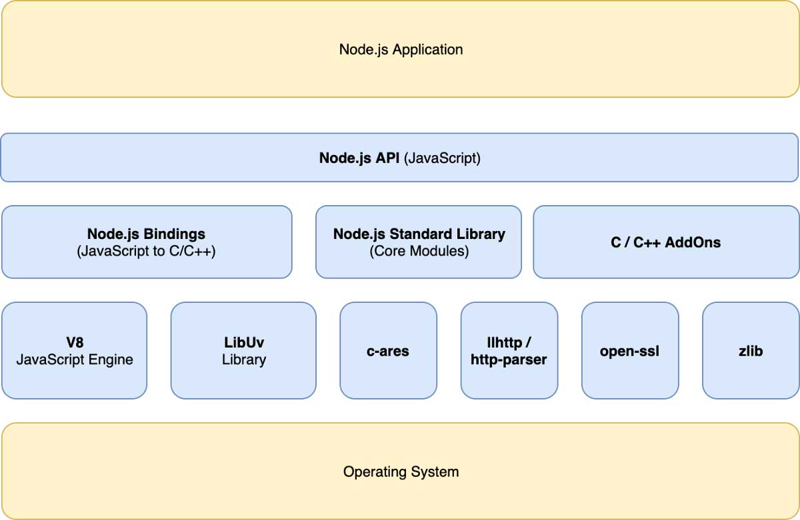

# NodeJS 备忘

## NodeJS 基本架构

上图可以看出 Node.js 是运行在操作系统之上的

它底层由 V8 JavaScript 引擎，以及一些 C/C++ 写的库构成，包括 libUV 库、c-ares、llhttp/http-parser、open-ssl、zlib 等等。其中：libUV 负责处理事件循环，c-ares、llhttp/http-parser、open-ssl、zlib 等库提供 DNS 解析、HTTP 协议、HTTPS 和文件压缩等功能。

在这些模块的上一层是中间层，中间层包括 Node.js Bindings、Node.js Standard Library 以及 C/C++ AddOns。Node.js Bindings 层的作用是将底层那些用 C/C++ 写的库接口暴露给 JS 环境，而 Node.js Standard Library 是 Node.js 本身的核心模块。至于 C/C++ AddOns，它可以让用户自己的 C/C++ 模块通过桥接的方式提供给 Node.js。

中间层之上就是 Node.js 的 API 层了，我们使用 Node.js 开发应用，主要是使用 Node.js 的 API 层，所以 Node.js 的应用最终就运行在 Node.js 的 API 层之上。

## NodeJS 事件循环

先精读一下这个[setTimeout 和 setImmediate 到底谁先执行，本文让你彻底理解 Event Loop](https://juejin.cn/post/6844904100195205133)

事件循环通俗来说就是一个无限的 while 循环。

Node.js 事件循环的发起点（即执行完一个完整的事件循环）有五个：

- Node.js 启动后；
- setTimeout 回调函数；
- setInterval 回调函数；
- setImmediate 回到函数；
- I/O 后的回调函数；（异步 I/O 又分为网络 I/O 和文件 I/O）

可以看出以上都是宏任务，即每次事件循环都是开始于一次宏任务。

### 宏任务和微任务

宏任务：在 Node.js 中宏任务包含 5 种——Node.js 启动主线程执行、 setTimeout、 setInterval、 setImmediate 和 I/O。宏任务到底谁先执行，还得看下次时间循环之前谁准备好了，setTimeout、 setInterval 和 I/O 都是耗时操作，setImmediate 是在主线程执行完所有代码后执行，其实就是插空执行。所以到底哪个宏任务先执行就需要看 Node.js 事件循环的 6 个流程其中的：timers（对应 setTimeout 和 setInterval）、poll（对应 I/O 及其他几乎所有回调函数）、check（对应 setImmediate） 这个几个阶段是否有准备就绪的回调任务。

微任务：在 Node.js 中微任务包含 2 种——process.nextTick 和 Promise。微任务在事件循环中优先级是最高的，因此如果事件循环中有微任务，会先把微任务队列清空。并且无论加入队列的顺序如何 process.nextTick 的优先级比 Promise 高。

主线程除了是一次宏任务之外，还要执行每次事件循环遍历所有任务，每次事件循环包含一个宏任务外加清空微任务队列，即使是在执行微任务队列中的某个任务时，又往微任务队列中添加了微任务，这个微任务也是需要在此次事件循环中执行的。

主线程是单线程的，但是 Node.js 是多线程执行，Node.js 还包括其他例如定时器触发线程、异步 I/O 事件线程、垃圾回收线程等。

## Node.js 应用场景

Node.js 异步非阻塞的特性，适合网络 I/O 较多，并发高，但是 CPU 计算较少，业务复杂度高和业务迭代快的服务，或者一些通用性服务，所以 Node.js 适合应用在业务网关、中台服务及运营系统等。不适合**大内存**和 **CPU 密集**的场景。

## 写 Node.js 模块的 3 种方式

JavaScript 引入标准的模块机制 ES Modules，写 Node.js 模块的时候，可以有 3 种方式：

1. 直接采用最新的 ES Modules，在 Node.js v13.2.0 以后的版本中可行，但是使用上有些条件，文件的后缀名需要改为 `.mjs`，如果要用 ES Modules 定义 .js 文件的模块，可以在 Node.js 的配置文件 package.json 中设置参数 type: module。。
2. 采用 ES Modules，通过 Babel 编译。
3. 仍然使用旧的 CommonJS 规范，预计未来 Node.js 在很长一段时间内依然会同时兼容 ES Modules 和 CommonJS。
