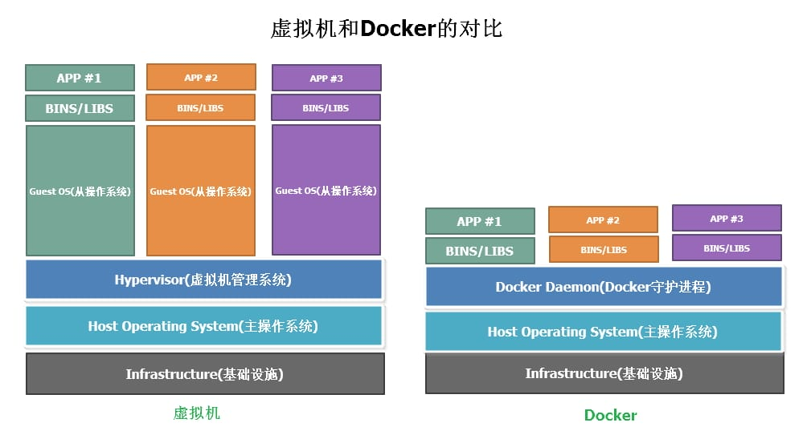

# Docker 入门

## Docker 简介

- [容器编排器的自我介绍](https://mp.weixin.qq.com/s/F9g-r4yBYDZ1Q9z6uq5feQ)

## 环境配置难题

软件开发最大的麻烦事之一，就是环境配置。

环境配置如此麻烦，换一台机器，就要重来一次，旷日费时。很多人想到，能不能从根本上解决问题，软件可以带环境安装？也就是说，安装的时候，把原始环境一模一样地复制过来。

### 虚拟机

虚拟机（Virtual machine）就是带环境安装的一种解决方案

#### 缺点

- 资源占用多

  需要为每个虚拟机分配固定的 CPU、内存、存储资源。它运行的时候，其他程序就不能使用这些资源了。哪怕虚拟机里面的应用程序，真正使用的内存只有 1MB，虚拟机依然需要几百 MB 的内存才能运行。

- 占用空间大，冗余步骤多

  每个虚拟机都有完整的操作系统，一些系统级别的操作步骤，往往无法跳过，比如用户登录。

- 启动慢

  启动操作系统需要多久，启动虚拟机就需要多久。可能要等几分钟，应用程序才能真正运行。

### Linux 容器

由于虚拟机存在的缺点，Linux 发展出了另一种虚拟化技术：Linux 容器（Linux Containers，缩写为 LXC）。

Linux 容器不是模拟一个完整的操作系统，而是对进程进行隔离。或者说，在正常进程的外面套了一个保护层。对于容器里面的进程来说，它接触到的各种资源都是虚拟的，从而实现与底层系统的隔离。

由于容器是进程级别的，相比虚拟机有很多优势：

- 启动快

直接运行在宿主机的操作系统上，启动容器相当于启动本机的一个进程，而不是启动一个操作系统，速度就快很多。

- 资源占用少

容器只占用需要的资源，不占用那些没有用到的资源；虚拟机由于是完整的操作系统，不可避免要占用所有资源。另外，多个容器可以共享资源，虚拟机都是独享资源。

- 体积小

与宿主机共享同一个操作系统内核，容器只要包含用到的组件即可（通过 Linux 的 namespace 和 cgroups 技术实现隔离，没有引导程序、驱动程序等底层组件），而虚拟机是整个操作系统的打包，所以容器文件比虚拟机文件要小很多。



## 虚拟机和容器的形象比喻

### 虚拟机 就像 租整套别墅：

- 每套别墅都有自己的厨房、卫生间、客厅、卧室、各种家具和家电（完整的操作系统和各种驱动程序）
- 每套别墅都需要按一个电表，占用一块固定的大小的地块（独占 CPU、内存资源）
- 搬家时要打包所有家具家电（镜像很大）

### 容器 就像 胶囊旅馆：

- 只有一个小房间，但共享大楼的水电、空调系统（共享宿主机内核）
- 房间里只放必需品：床、小桌子、充电器（只包含应用运行需要的文件）
- 搬家只需要一个行李箱（镜像很小）

### Docker

Docker 是一个开源的应用容器引擎，基于 Go 语言 并遵从 Apache2.0 协议开源，属于 Linux 容器的一种封装，提供简单易用的容器使用接口。

Docker 将应用程序与该程序的依赖，打包在一个文件里面。运行这个文件，就会生成一个虚拟容器。程序在这个虚拟容器里面运行，就好像在真实的物理机上运行一样，不用再担心环境问题。

## Docker 核心

Docker 的核心是标准化。

### 首先，标准化要有标准化的文档规范，要定义系统软件版本等一系列内容。

为了避免长期维护的时候文档内容过时，docker 给出的答案是：用 dockerfile，dockfile 就是你的文档，并且用来产生镜像。要改变 docker 镜像中的环境，只需要修改 dockerfile，然后重新构建镜像即可，这样就能保证文档和实际环境的一致性。

### 其次，标准化要有对应用统一操作的方法

docker 只提供 docker start 或 run 作为统一标准，一个容器内只给启动一个进程。

### 第三，为了维护生产环境的一致性和配置变更的幂等，docker 创造性的使用了类似 git 管理代码的方式对环境镜像进行管理。

## 容器原理

我用更通俗的例子来解释 namespace 和 cgroups 这两个核心技术：

## Namespace（命名空间）- 让每个容器"看不见"对方

就像给每个容器戴上了"魔法眼镜"，让它以为自己独占整台机器。

### 7 种主要的 namespace：

#### 1. PID Namespace（进程隔离）

**例子**：

```bash
# 宿主机上看到的进程
$ ps aux
PID   COMMAND
1     /sbin/init
123   nginx
456   mysql
789   docker容器里的进程

# 但容器内部看到的：
$ docker exec -it myapp ps aux
PID   COMMAND
1     /my-app        # 容器以为自己的进程是PID=1
2     /helper-script
```

**就像**：每个容器都以为自己是"一号员工"，看不到其他容器的存在。

#### 2. Network Namespace（网络隔离）

**例子**：

```bash
# 宿主机网络
$ ip addr
eth0: 192.168.1.100

# 容器1的网络
$ docker exec container1 ip addr
eth0: 172.17.0.2

# 容器2的网络
$ docker exec container2 ip addr
eth0: 172.17.0.3
```

**就像**：每个房间都有自己的门牌号和邮箱，互不干扰。

#### 3. Mount Namespace（文件系统隔离）

**例子**：

```bash
# 宿主机文件系统
/home/user/data/
├── file1.txt
├── secret.txt    # 敏感文件

# 容器只能看到挂载给它的部分
/app/data/
├── file1.txt     # 只能访问这个
```

**就像**：每个租客只能看到自己房间，看不到房东的其他房间。

#### 4. UTS Namespace（主机名隔离）

**例子**：

```bash
# 宿主机
$ hostname
server-001

# 容器内
$ docker exec myapp hostname
web-app-container
```

#### 5. User Namespace（用户隔离）

**例子**：

```bash
# 容器内以为自己是root用户（UID=0）
$ docker exec myapp whoami
root

# 但实际上在宿主机上是普通用户（UID=1000）
$ ps aux | grep container-process
1000  12345  container-process
```

**就像**：小孩在玩具王国里当"国王"，但在现实中还是普通小孩。

## Cgroups（控制组）- 资源配额管理

就像物业管理，给每户分配水电气的使用量。

### 主要资源控制：

#### 1. CPU 限制

```bash
# 给容器分配0.5个CPU核心
$ docker run --cpus="0.5" nginx

# 相当于告诉系统：这个容器最多只能用50%的CPU
```

**例子**：

```bash
# 监控CPU使用
$ docker stats
CONTAINER   CPU %     MEM USAGE
webapp      49.23%    # 不会超过50%
database    25.10%
```

#### 2. 内存限制

```bash
# 限制容器最多使用512MB内存
$ docker run -m 512m nginx

# 如果超出限制，容器会被杀死（OOM Killed）
```

**生活例子**：就像每个房间只能用 500 度电，超了就断电。

#### 3. 磁盘 I/O 限制

```bash
# 限制读写速度
$ docker run --device-read-bps /dev/sda:1mb nginx  # 读取限制1MB/s
$ docker run --device-write-bps /dev/sda:1mb nginx # 写入限制1MB/s
```

#### 4. 网络带宽限制

```bash
# 通过tc命令限制网络带宽
$ docker run --network mynet nginx
# 然后对mynet网络设置带宽限制
```

## 实际运作例子

假设运行一个 Web 应用容器：

```bash
$ docker run -d \
  --name webapp \
  --cpus="1.0" \          # CPU限制
  -m 1g \                 # 内存限制1GB
  -p 8080:80 \           # 端口映射
  --hostname web-server \ # 主机名
  nginx
```

**系统底层发生了什么**：

1. **Namespace 隔离**：

   - 创建新的 PID 空间（容器内进程从 PID=1 开始）
   - 创建网络空间（分配 172.17.0.x IP）
   - 挂载独立的文件系统视图
   - 设置主机名为"web-server"

2. **Cgroups 资源控制**：

   ```bash
   # 系统会在以下路径创建控制文件
   /sys/fs/cgroup/cpu/docker/容器ID/cpu.cfs_quota_us    # CPU配额
   /sys/fs/cgroup/memory/docker/容器ID/memory.limit_in_bytes  # 内存限制
   ```

3. **监控效果**：
   ```bash
   $ docker stats webapp
   CONTAINER   CPU %   MEM USAGE / LIMIT   MEM %
   webapp      45.2%   256MB / 1GB         25.6%
   ```

这样，容器就像住在一个有独立门牌、限定用电量的单间里，既与其他房间隔离，又不会占用过多资源。

## 文章

- [什么是 Docker ？](https://cloud.tencent.com/developer/article/1005172)
