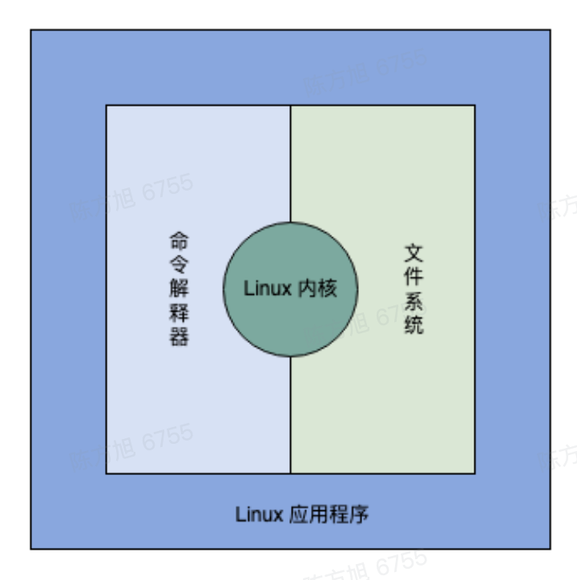
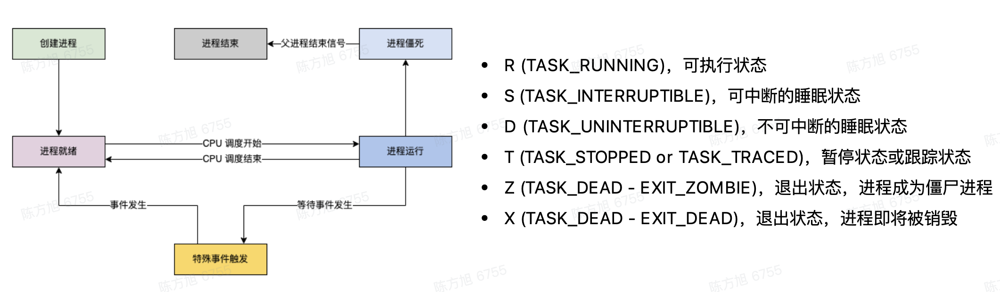
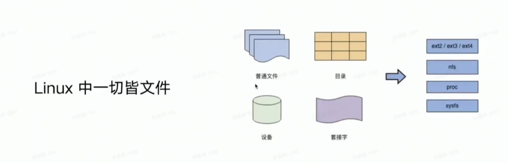
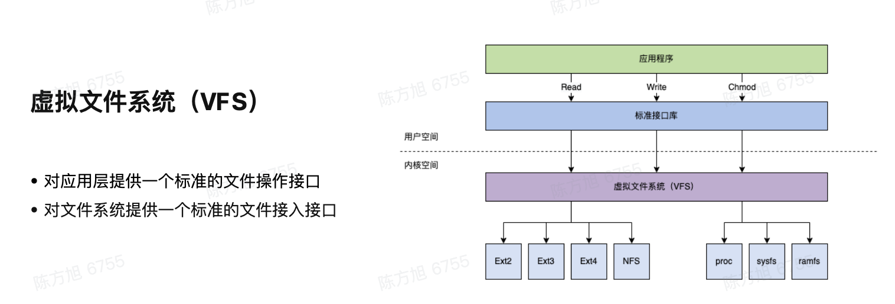
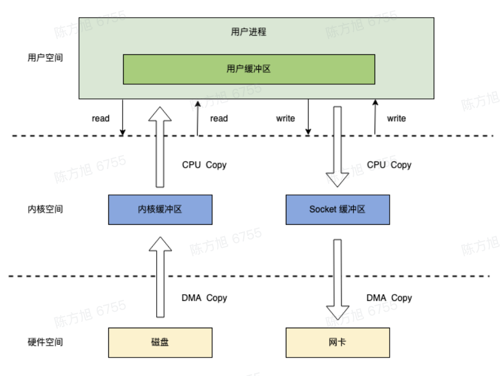

# 计算机基础和 Linux 基础

## 计算机硬件

计算机硬件系统由五大基本单元组成：运算器、控制器、存储器、输入设备和输出设备。


## 操作系统（Operating System，OS）

操作系统是一种控制和管理计算机硬件与软件资源的**程序**，是计算机系统的内核与基石，并且提供给用户接口，用于在用户和计算机之间传递信息。

管理计算机资源例如：处理器管理、存储器管理、文件管理、设备管理

提供用户接口例如：命令行接口、图形用户接口、程序接口

### 操作系统启动流程

程序启动必须由操作系统来完成，但是操作系统本身也是一个程序，那么操作系统在开机时是如何启动的呢？

这里分为两种方式：

- BIOS 启动
- UEFI 启动

#### BIOS 启动

BIOS（Basic Input Output System，基本输入输出系统）是一种固化在计算机主板上的程序，它保存着计算机最重要的基本输入输出的程序、系统设置信息、开机后自检程序和系统自启动程序。BIOS 会检查计算机硬件是否正常，然后将操作系统加载到内存中，最后将控制权交给操作系统，由操作系统来管理计算机硬件。

BIOS 启动的过程如下：

1. Power Up：计算机加电（其实就是通电开机）
2. 加电自检（Power On Self Test，POST）：检查计算机硬件是否正常
3. 加载引导程序（Boot Loader）：将操作系统加载到内存中
4. 加载内核（Kernel）：将内核加载到内存中
5. 初始化系统：初始化系统资源，例如：初始化内存、初始化进程、初始化文件系统、初始化网络等
6. 用户登录：用户登录系统，开始使用计算机

#### UEFI 启动

UEFI（Unified Extensible Firmware Interface，统一可扩展固件接口）是一种固化在计算机主板上的程序，它保存着计算机最重要的基本输入输出的程序、系统设置信息、系统自启动程序。

UEFI 启动的过程如下：

1. Power Up：计算机加电（其实就是通电开机）
2. 没有自检流程，直接加载引导程序（Boot Loader）
3. 加载内核（Kernel）：将内核加载到内存中
4. 初始化系统：初始化系统资源，例如：初始化内存、初始化进程、初始化文件系统、初始化网络等
5. 用户登录：用户登录系统，开始使用计算机

## Linux 基础

### Linux 版本

Linux 版本分为两种：内核版本和发行版本

发行版本 = Linux 内核 + GNU 工具 + 应用程序软件

Linux 的发行版本有很多，例如 Debian 系列的 Debian、Ubuntu、Linux Mint 等，Redhat 系列的 Redhat、Fedora、CentOS 等，国产系列的龙芯、鲲鹏、飞腾等。

Linux 由来和 Linux 各发行版的详细描述，可以参考 [Linux 版本详述](../server/linux/basics.md)

#### 查看 Linux 版本

```shell
# 查看内核版本
uname -a
# 或者
cat /proc/version

# 查看发行版本
cat /etc/os-release
# 或者
cat /etc/redhat-release
```

### Linux 系统应用领域

- IT 服务器（操作系统、虚拟化和云计算）
- 嵌入式和智能设备
- 个人办公桌面
- 学术研究和软件研发

### Linux 基本组成

Linux 系统一般由 4 个主要部分：

- 内核
- Shell
- 文件系统
- 应用程序



#### 内核

- 内核是硬件和软件之间的中间层，Linux 分为两个空间，用户空间和内核空间
- 内核是一个资源管理程序，包括进程管理、内存管理、虚拟文件系统、网络堆栈
- 内核提供一组面向系统的命令，用户可以通过这些命令来管理系统，命令的执行过程可能会从用户空间切换到内核空间，然后再切换回用户空间，

### Linux 进程管理

- 进程是正在执行的一个程序或命令
- 进程有自己的地址空间，占用一定的系统资源
- 一个 CPU 核心同一时间只能执行一个进程，多个进程之间通过 CPU 时间片轮转等方式来实现多个进程之间的切换
- 进程由它的父进程创建，由它的进程 ID（PID）和它的父进程 ID（PPID）唯一标识。简单说就是每一个进程都是 flok 父进程拉起来的。所以进程是一个树形结构。

```sh
# 查看启动的 nginx 进程
ps -ef | grep nginx

# 查看全部进程动态实时视图
top

# 查看某个进程
top -p 8239

# 关闭指定的进程
kill 8239
```

#### 进程调度

系统中运行的程序远远大于 CPU 的核数，每一个程序至少有一个进程，但是一个 CPU 核同一时间只能执行一个进程，那 Linux 系统是如何实现同时运行这么多程序的，那就是靠进程调度，进程调度是指操作系统按某种策略或规则选择进程占用 CPU 的使用权，从而实现多个进程之间的切换。

进程调度的策略有很多，例如：先来先服务、短作业优先、时间片轮转、多级反馈队列等。

进程调度的原则：

- 一个 CPU 核同一时间只能运行一个进程
- 每个进程有近乎相等的执行时间
- 对于逻辑 CPU 而言进程调度使用轮询的方式进行，当轮询完成则回到第一个进程反复
- 进程执行消耗时间跟进程量成正比，进程量越多，进程执行消耗时间越长



#### 进程状态

- 运行态（Running）：进程正在运行，占用 CPU
- 就绪态（Ready）：进程已经准备好，等待 CPU 调度
- 等待态（Waiting）：进程正在等待某个事件的发生，例如：等待 IO 完成、等待信号量、等待子进程结束等
- 僵尸态（Zombie）：进程已经结束，但是父进程还没有回收它的资源，此时进程处于僵尸态，僵尸态的进程不占用 CPU，但是会占用系统资源，僵尸态的进程需要父进程回收它的资源，否则会一直处于僵尸态
- 停止态（Stopped）：进程被暂停，不占用 CPU，也不占用系统资源，可以通过 `kill -CONT` 命令恢复进程

### Linux 进程的系统调用

- 内核空间（Kernal Space）：系统内核运行的空间
- 用户空间（User Space）：应用程序运行的空间


### Linux 文件系统

文件系统是负责管理持久化数据的子系统，负责把用户的文件存放到磁盘硬件中。

Linux 文件系统采用的是树形结构，树的最上层是根目录（/），根目录下面有很多子目录，子目录下面又有子目录，最底层的子目录没有子目录了，这些最底层的子目录就是文件，文件是文件系统的最小单位。


#### Linux 中一切皆文件

这样做最明显的好处是开发者仅需要使用一套 API 和开发工具即可调取 Linux 系统中绝大部分的资源。
举个简单的例子，Linux 中几乎所有读（读文件，读系统状态，读 socket，读 PIPE）的操作都可以用 read 函数来进行；几乎所有更改（更改文件，更改系统参数，写 socket，写 PIPE）的操作都可以用 write 函数来进行。

使用任何硬件设备都必须与根目录下某一目录执行挂载操作



#### Linux 中有那么多的文件系统。如何实现对用户提供统一调用接口的？

那就是虚拟文件系统（Virtual File System，VFS），虚拟文件系统是一个抽象层，它把不同的文件系统抽象成统一的接口，用户只需要调用虚拟文件系统的接口，虚拟文件系统会根据用户的调用，调用相应的文件系统。



```shell
# df 命令可以查看文件系统磁盘空间利用率
df -T
```



### Linux 用户管理

Linux 是一个多用户的操作系统，多用户的操作系统可以同时支持多个用户登录，每个用户都有自己的用户目录，用户之间的文件是隔离的，用户之间的进程也是隔离的。

#### Linux 用户分为两种：

- 系统用户（超级用户）：系统用户是系统内置的用户，系统用户的 UID 从 0 开始，UID 为 0 的用户是 root 用户，root 用户是系统管理员，root 用户可以管理系统的所有资源，root 用户可以创建普通用户
- 普通用户：普通用户是系统管理员创建的用户，普通用户的 UID 从 1 开始，普通用户只能管理自己的资源，普通用户不能创建用户

#### 用户组

用户组是一组用户的集合，用户组可以让用户之间共享资源，用户组可以让用户之间共享文件，用户组可以让用户之间共享进程。

- 标准用户组：可以容纳多个用户
- 私有用户组：只有用户自己

一个用户可以加入多个用户组。

#### 文件权限

Linux 文件操作权限分为三种：

- r：读权限
- w：写权限
- x：执行权限

Linux 文件权限用户维度分为三种（用户权限）：

- 所有者：文件的创建者
- 所在组：文件所有者所在的用户组
- 其他用户：除了文件所有者和所在组的其他用户


#### 查看用户信息和文件权限相关操作

```shell
# 查看当前登录用户信息
whoami
# 或者
w

# 查看当前登录用户所属的用户组
groups

# 查看用户的 UID 和 GID
id xxx

# 修改文件所有者
# chown <用户> <文件>

# 修改文件所属组
# chgrp <用户组> <文件>

# 修改文件权限
# chmod <权限> <文件>
```

#### 用户权限操作

```sh
# 创建一个文件夹，查看当前用户拥有的文件夹权限
mkdir demo && ls -ld demo
# drwxrwxr-x 2 root root 4096 Jan 14 11:48 demo

sudo useradd ceshi # 创建一个新用户
sudo passwd ceshi # 设置用户密码
su ceshi # 切换 ceshi 用户登录
cd demo # 进入 demo 文件夹
touch index.js # 创建 index.js 文件，提示无权限

# chown chmod chgrp
sudo chown -R ceshi:ceshi ./demo # demo 文件夹的所有者改成 ceshi
su ceshi # 切换 ceshi 用户
touch index.js # 创建 index.js 文件成功
```

### Linux 软件包

Linux 软件包是一种软件的分发方式，软件包是一个压缩文件，里面包含了软件的二进制文件、配置文件、依赖文件、安装脚本等。软件包就是一个应用程序，可以是一个 GUI 应用程序、命令行工具等。

软件包管理工具分为两种：

- 底层工具：主要用来处理安装和删除软件包文件等任务：DPKG、RPM
  - DPKG：Debian Package，Debian 系列的软件包管理工具，例如：Debian、Ubuntu、Linux Mint 等
  - RPM：Redhat Package Manager，Redhat 系列的软件包管理工具，例如：Redhat、Fedora、CentOS 等
- 上层工具：主要用来处理数据的搜索任务和软件包的依赖解析：APT、YUM


