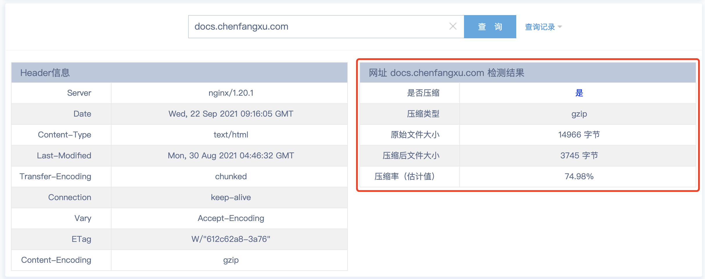

# Nginx 实操-静态资源服务器

## 静态网站

Nginx 可以作为静态资源服务器，当只有静态资源的时候，就可以使用 Nginx 来做服务器，例如，如果一个网站只是静态页面的话，就可以通过类似以下的配置来实现部署一个静态的网站。

```nginx
http {
  log_format  main  '$remote_addr - $remote_user [$time_local] "$request" '
                      '$status $body_bytes_sent "$http_referer" '
                      '"$http_user_agent" "$http_x_forwarded_for"';

  server {
    listen       80;
    server_name  docs.chenfangxu.com;

    access_log logs/docs.chenfangxu.com.access.log main;

    location / {
        root   /usr/local/app;
        index  index.html;
    }
  }
}
```

这样如果访问 [http://docs.chenfangxu.com](http://docs.chenfangxu.com) 就会默认访问到 `usr/local/app` 目录下面的 `index.html`。

## 静态目录服务

```nginx
server {
  listen 80;
  server_name static.chenfangxu.com;
  charset utf-8;  # 防止中文文件名乱码

  location / {
    alias /home/chenfangxu/static/;  # 静态资源目录

    autoindex on; # 允许展示静态资源目录
    autoindex_exact_size off; # off：显示文件大概大小，单位 KB、MB、GB；on：（默认）显示文件的确切大小，单位是 byte
    autoindex_localtime on;  # off：（默认）显示的文件时间为 GMT 时间；on：显示的文件时间为服务器时间
  }
}
```

访问 [http://static.chenfangxu.com](http://static.chenfangxu.com)，就可以看到一个简单的目录。

## gzip 压缩

使用 gzip 不仅需要 Nginx 配置，浏览器端也需要配合，需要在请求消息头中包含 Accept-Encoding: gzip（IE5 之后所有的浏览器都支持了，是现代浏览器的默认设置）。一般在请求 html 和 css 等静态资源的时候，支持的浏览器在 request 请求静态资源的时候，会加上 Accept-Encoding: gzip 这个 header，表示自己支持 gzip 的压缩方式，Nginx 在拿到这个请求的时候，如果有相应配置，就会返回经过 gzip 压缩过的文件给浏览器，并在 response 相应的时候加上 content-encoding: gzip 来告诉浏览器自己采用的压缩方式（因为浏览器在传给服务器的时候一般还告诉服务器自己支持好几种压缩方式），浏览器拿到压缩的文件后，根据自己的解压方式进行解析。

这个配置可以插入到 http 上下文里，也可以插入到需要使用的虚拟主机的 server 或者下面的 location 上下文中。

```nginx
server {
  listen 80;
  server_name docs.chenfangxu.com;

  access_log logs/docs.chenfangxu.com.access.log main;

  gzip on;  #默认 off，是否开启gzip
  gzip_types text/plain text/css application/json application/x-javascript text/xml application/xml application/xml+rss text/javascript;

  gzip_static on;
  gzip_proxied any;
  gzip_vary on;
  gzip_comp_level 6;
  gzip_buffers 16 8k;
  gzip_min_length 1k;
  gzip_http_version 1.1;

  location / {
    root /home/www/docs.chenfangxu.com/dist;
    index index.html;
  }
}

```

- gzip_typs：要采用 gzip 压缩的 MIME 文件类型，其中 `text/html` 被系统强制启用。
- gzip_static：默认为 off，该模块启用后，Nginx 首先检查请求的静态文件是否有 gz 结尾的文件，如果有，直接返回该 `.gz` 文件内容。
- gzip_proxied：默认为 off，Nginx 作为反向代理时启用，用于设置启用或禁用从代理服务器收到相应内容 gzip 压缩。
- gzip_vary：用于在相应消息头中添加 `Vary: Accept-Encoding`，使代理服务器根据请求头中的 `Accept-Encoding`识别是否启用 gzip 压缩。
- gzip_comp_level：gzip 压缩比，压缩级别是 1-9，1 压缩级别最低，9 压缩级别最高，级别越高压缩率越高，压缩时间也越长，建议 4 - 6。
- gzip_buffers：获取多少内存用于缓存压缩结果， 16 8k 表示以 `8k * 16` 为单位获得，以 8k 为单位，按照原始数据大小以 8k 为单位的 16 倍申请内存。
- gzip_min_length：允许压缩的页面最小字节数，页面字节数从 header 头中的 `Content-Length` 中获取。默认值是 0，不管页面多大都压缩。建议设置成大于 1k 的字节数，小于 1k，可能会越压越大。
- gzip_http_version：默认 1.1，启用 gzip 所需的 HTTP 最低版本。

可以通过网页 GZIP 压缩检测，看一下 `docs.chenfangxu.com` 的相关数据。



### 前端项目 gzip 压缩

当前端项目使用 Webpack 等打包工具进行打包时，一般都有配置可以开启 gzip 压缩，打包出来的文件会有经过 `gzip` 压缩之后的 `.gz` 文件。

为什么在 Nginx 已经有了 gzip 压缩，打包工具还需要整个 gzip 呢？

因为如果全都是使用 Nginx 来压缩文件，会耗费服务器的计算资源，如果 `gzip_comp_level` 配置的比较高，就更增加了服务器的开销，相应也会增加客户端的请求时间，得不偿失。

如果压缩在前端打包的时候就做了，把打包之后的高压缩等级文件作为静态资源放在服务器上，Nginx 会优先查找这些压缩之后的文件返回给客户端，相当于把压缩文件的动作从 Nginx 提前到了打包的时候完成， 节约了服务器资源，所以一般推荐在生产环境使用打包工具配置 gizp 压缩。

## 配置 HTTPS

HTTPS 是在应用层 HTTP 之下加入了表示层 SSL(Secure Socket Layer)/TLS(Transport Layer Security)。 Nginx 配置 HTTPS 主要两个步骤：**签署第三方可信任的 SSL 证书**和**配置 HTTPS**。

例如腾讯云申请的免费证书，下载证书压缩文件，解压后把 Nginx 文件夹下的 `xxx.crt` 和 `xxx.key` 文件拷贝到服务器目录 `/usr/local/nginx/conf/ssl`。在编译安装的时候添加了 ssl 和 http2 相关的模块，可以直接如下配置：

```nginx
server {
  listen 443 ssl http2; # ssl 访问端口号为 443，还开启了 http/2.0
  server_name docs.chenfangxu.com;

  # 证书文件地址
  ssl_certificate /usr/local/nginx/conf/ssl/1_docs.chenfangxu.com_bundle.crt;
  # 私钥文件地址
  ssl_certificate_key /usr/local/nginx/conf/ssl/2_docs.chenfangxu.com.key;

  # 服务器优化，减少 CPU 的运算量
  # 配置共享会话缓存大小，1m 大概可以支持 4000 个连接
  ssl_session_cache shared:SSL:10m;
  # 配置会话超时时间
  ssl_session_timeout 10m;

  # 安全相关
  # 优先采取服务器算法
  ssl_prefer_server_ciphers on;
  # 使用 DH 文件
  ssl_dhparam /etc/ssl/certs/dhparam.pem;
  # 协议版本，限制连接只包含 SSL/TLS 的加强版本
  ssl_protocols TLSv1 TLSv1.1 TLSv1.2;
  # 定义算法，选择要使用的安全套件
  ssl_ciphers "EECDH+ECDSA+AESGCM EECDH+aRSA+AESGCM EECDH+ECDSA+SHA384 EECDH+ECDSA+SHA256 EECDH+aRSA+SHA384 EECDH+aRSA+SHA256 EECDH+aRSA+RC4 EECDH EDH+aRSA !aNULL !eNULL !LOW !3DES !MD5 !EXP !PSK !SRP !DSS !RC4";
  # 启用 HSTS。允许 https 网站要求浏览器总是通过 https 来访问
  add_header Strict-Transport-Security "max-age=31536000; includeSubDomains;preload" always;
  # 减少点击劫持
  add_header X-Frame-Options DENY;
  # 禁止服务器自动解析资源类型
  add_header X-Content-Type-Options nosniff;
  # 防 XSS 攻击
  add_header X-Xss-Protection 1;

  access_log logs/ssl.docs.chenfangxu.com.access.log main;

  gzip on;
  gzip_types text/plain text/css application/json application/x-javascript text/xml application/xml application/xml+rss text/javascript;

  gzip_static on;
  gzip_proxied any;
  gzip_vary on;
  gzip_comp_level 6;
  gzip_buffers 16 8k;
  gzip_min_length 1k;
  gzip_http_version 1.1;

  location / {
    root /home/www/docs.chenfangxu.com/dist;
    index index.html;
  }
}
```

`ssl_protocols` 和 `ssl_ciphers` 可以用来限制连接只包含 SSL/TLS 的加强版本和算法，默认值如下：

```nginx
ssl_protocols TLSv1 TLSv1.1 TLSv1.2;
ssl_ciphers HIGH:!aNULL:!MD5;
```

由于这两个命令的默认值已经好几次发生了改变，因此不建议显性定义，除非有需要额外定义的值，如定义 D-H 算法：

首先在目录 `/etc/ssl/certs` 运行 `openssl dhparam -out dhparam.pem 2048` ，生成 `dhparam.pem` 文件，然后增加配置：

```nginx
#使用DH文件
ssl_dhparam /etc/ssl/certs/dhparam.pem;
ssl_protocols TLSv1 TLSv1.1 TLSv1.2;
#定义算法
ssl_ciphers "EECDH+ECDSA+AESGCM EECDH+aRSA+AESGCM EECDH+ECDSA+SHA384 EECDH+ECDSA+SHA256 EECDH+aRSA+SHA384 EECDH+aRSA+SHA256 EECDH+aRSA+RC4 EECDH EDH+aRSA !aNULL !eNULL !LOW !3DES !MD5 !EXP !PSK !SRP !DSS !RC4";
```

#### 创建证书

- 创建根证书
  - 创建 CA 私钥
    - openssl genrsa -out ca.key 2048
  - 制作 CA 公钥
    - openssl req -new -x509 -days 3650 -key ca.key -out ca.crt
- 签发证书
  - 创建私钥
    - openssl genrsa -out a.pem 1024
    - openssl rsa -in a.pem -out a.key
  - 生成签发请求
    - openssl req -new -key a.pem -out a.csr
  - 使用 CA 证书进行签发
    - openssl x509 -req -sha256 -in a.csr -CA ca.crt -CAkey ca.key -CAcreateserial -days 3650 -out a.crt
  - 验证签发证书是否正确
    - openssl verify -CAfile ca.crt a.crt

### HTTP 重定向到 HTTPS

之前配置过 [http://docs.chenfangxu.com](http://docs.chenfangxu.com)，我们可以修改配置，当访问 http 时重定向到 https：

```nginx
server {
  listen 80;
  server_name docs.chenfangxu.com;

  return 301 https://$server_name$request_uri;
}
```

#### 配置文件优化

为了让更多的二级域名支持 https 功能，每个 server 都这么写又太麻烦。可以将 https 相关的 listen、ssl、add_header 相关的单独写在一个文件上，然后使用 `include` 指令引入。

新建 conf.custom 文件夹，编写配置 `vim /usr/local/nginx/conf/conf.custom/https-base.conf`

```nginx
  listen 443 ssl http2;

  ssl_certificate /usr/local/nginx/conf/ssl/1_docs.chenfangxu.com_bundle.crt;
  ssl_certificate_key /usr/local/nginx/conf/ssl/2_docs.chenfangxu.com.key;
  ssl_session_cache shared:SSL:10m;
  ssl_session_timeout 10m;

  ssl_prefer_server_ciphers on;
  ssl_dhparam /etc/ssl/certs/dhparam.pem;
  ssl_protocols TLSv1 TLSv1.1 TLSv1.2;
  ssl_ciphers "EECDH+ECDSA+AESGCM EECDH+aRSA+AESGCM EECDH+ECDSA+SHA384 EECDH+ECDSA+SHA256 EECDH+aRSA+SHA384 EECDH+aRSA+SHA256 EECDH+aRSA+RC4 EECDH EDH+aRSA !aNULL !eNULL !LOW !3DES !MD5 !EXP !PSK !SRP !DSS !RC4";
  add_header Strict-Transport-Security "max-age=31536000; includeSubDomains;preload" always;
  add_header X-Frame-Options DENY;
  add_header X-Content-Type-Options nosniff;
  add_header X-Xss-Protection 1;
```

gzip 也可以同样优化一下

`vim /usr/local/nginx/conf/conf.custom/gzip-base.conf`

```nginx
  gzip on;
  gzip_types text/plain text/css application/json application/x-javascript text/xml application/xml application/xml+rss text/javascript;

  gzip_static on;
  gzip_proxied any;
  gzip_vary on;
  gzip_comp_level 6;
  gzip_buffers 16 8k;
  gzip_min_length 1k;
  gzip_http_version 1.1;
```

之后在 `/usr/local/nginx/conf/nginx.conf` 中新增配置：

```nginx
server {
  server_name docs.chenfangxu.com;

  include /usr/local/nginx/conf/conf.custom/https-base.conf;

  include /usr/local/nginx/conf/conf.custom/gzip-base.conf;

  access_log logs/ssl.docs.chenfangxu.com.access.log main;

  location / {
    root /home/www/docs.chenfangxu.com/dist;
    index index.html;
  }
}
```

## 推荐阅读

[Nginx 配置 HTTPS 服务器](https://jelly.jd.com/article/6006b1045b6c6a01506c87b5)
