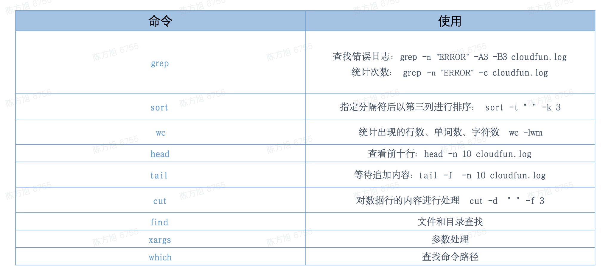

# shell 脚本编程扩展

## shell 中的常用命令



## 脚本解释器在环境变量中指定

除了比较常见的用路径指定脚本解释器的方式，还有一种是指定环境变量中的脚本解释器。

```
指定脚本解释器的路径
#!/bin/bash`

指定环境变量中的脚本解释器
#!/usr/bin/env bash
```

这样做的好处是，系统会自动在 `PATH` 环境变量中查找指定的程序（如例子中的 bash）。因为程序的路径是不确定的，比如安装完新版本的 bash 后，我们有可能会把这个新的路径添加到`PATH`中，来“隐藏”老版本的 bash。所以操作系统的`PATH`变量有可能被配置为指向程序的另一个版本，如果还是直接用 `#!/bin/bash`，那么系统还是会选择老版本的 bash 来执行脚本，如果用`#!/usr/bin/env bash`，就会使用新版本了。

## Shell 命令执行过程

### 1. 字符解析：

- 识别换行符、分号（;）做行的分割
- 识别命令连接符（||、&&、管道）做命令的分割
- 识别空格、tab 符，做命令和参数的分割

### 2. shell 展开

- 大括号展开：一般由三部分构成，前缀，一对大括号，后缀，大括号内可以是逗号分隔的字符串序列，也可以是序列表达式`{x..y[..incr]}`

```sh
# 字符串序列
a{b,c,d}e # =>abc,ace,ade


# 表达式序列，数字可以用 incr 调整增量，字母不行
{1..5} # => 1,2,3,4,5

{1..5..2} # => 1,3,5

{a..e} # => a,b,c,d,e
```

- 波浪号展开

```sh
# 当前用户的主目录
~ => $HOME

# 指定用户的主目录
~tom/foo => 用户 tom 的 $HOME/foo

# 当前工作目录
~+/foo => $PWD/foo

# 上一个工作目录
~-/foo => ${$OLDPWD}/foo
```

- 参数展开

```sh
# 主要说一下 间接参数扩展
parameter="var"
var="hello"
echo ${!parameter} # 输出 hello

# 参数长度 ${#parameter} 等前面有介绍
```

- 命令替换：在子进程中执行命令，并用得到的结果替换包裹的内容，形式上有两种：`$(...)` 和反引号``
- 数学计算：使用 `$(())` 包裹数学运算表达式，得到结果并替换
- 文件名展开：当有单词没有被引号包裹，且其中出现了 `*` 、 `?` 、 `[]` 等字符，则 shell 会去按照正则匹配的方式查找文件名进行替换，如果没有找到则保持不变

### 3. 重定向，将 stdin、stdout、stderr 的文件描述符进行指向变更

### 4. 执行命令

- builtin 命令，直接执行
- 非 builtin 命令，使用 `$PATH` 查找，然后启动子进程执行

### 5. 命令执行完成后，收集状态并返回


## 环境变量

所有的程序，包括 Shell 启动的程序运行时都可以访问的变量就是环境变量。在 shell 脚本中使用 `export` 可以定义环境变量，但是只在当前运行的 shell 进程中有效，结束进程就没了。如果想持久化，需要将环境变量定义在一些列配置文件中。

配置文件的加载顺序和 shell 进程是否运行在 Interactive 和 Login 模式有关。

### 交互和非交互模式（Interactive & Non-Interactive）

- Interactive 模式：通常是指读写数据都是从用户的命令行终端（terminal），用户输入命令，并在回车后立即执行的 shell。
- Non-Interactive 模式：通常是指执行一个 shell 脚本，或 `bash -c` 执行命令

检测当前 shell 运行的环境是不是 Interactive 模式

```
[[ $- == *i* ]] && echo "Interactive" || echo "Non-interactive"
```

### 登录和非登录模式（Login & Non-Login）

- Login 模式：应用在终端登陆时，ssh 连接时，`su --login <username>` 切换用户时，指的是用户成功登录后开启的 Shell 进程，此时会读取 `/etc/passwd` 下用户所属的 shell 执行。
- Non-Login 模式：应用在直接运行 bash 时，su `<username>` 切换用户时（前面没有加 --login）。指的是非登录用户状态下开启的 shell 进程。

检测当前 shell 运行的环境是不是 Login 模式

```
shopt -q login_shell && echo "Login shell" || echo "Not login shell"

#如果是zsh，没有shopt命令
[[ -o login ]] && echo "Login shell" || echo "Not login shell"
```

进入 bash 交互模式时也可以用 `--login` 参数来决定是否是登录模式：

```
$> bash
$> shopt -q login_shell && echo "Login shell" || echo "Not login shell"
Not login shell
$> exit
$> bash --login
$> shopt -q login_shell && echo "Login shell" || echo "Not login shell"
Login shell
$> exit
```

Login 模式模式下可以用 logout 和 exit 退出，Non-Login 模式下只能用 exit 退出。

### 配置文件（启动文件）加载顺序

bash 支持的配置文件有 /etc/profile、~/.bash.rc 等。


如上图加载顺序所示

- Interactive&Login 模式：/etc/profile —>( ~/.bash_profile, ~/.bash_login, ~/.profile)其中之一 （应该还包括 -> ~/.bashrc -> /etc/bashrc）—>~/.bash_loginout(退出 shell 时调用)
- Interactive&Non-Login 模式：/etc/bash.bashrc —>~/.bashrc
- Non-Interactive 模式：通常就是执行脚本（script）的时候，此时配置项是从环境变量中读取和执行的，也就是 `env` 或者 `printenv` 命令输出的配置项。

**现在的系统一般都没有 ~/.bash_profile 文件了，只保留 ~/.bashrc 文件,所有的系统里，~/.bash_profile 都会有这样的逻辑，避免登陆时 ~/.bashrc 被跳过的情况：**

```
# login shell will execute this
if [ -n "$BASH_VERSION" ]; then
	# include .bashrc if it exists
	if [ -f "$HOME/.bashrc" ]; then
		. "$HOME/.bashrc"
	fi
fi
```

在发行版的 Linux 系统中，Interactive&Login 模式下的 ~/.bash_profile, ~/.bash_login， ~/.profile 并不一定是三选一，看一下这三个脚本的内容会发现他们会继续调用下一个它想调用的配置文件，这样就可以避免配置项可能需要在不同的配置文件多次配置。如 centos7.2 中 ~/.bash_profile 文件中实际调用了 ~/.bashrc 文件。

```
# .bash_profile

# Get the aliases and functions
if [ -f ~/.bashrc ]; then
	. ~/.bashrc
fi

# User specific environment and startup programs

PATH=$PATH:$HOME/.local/bin:$HOME/bin

export PATH
```


如上图所示，开启一个 Shell 进程时，有一些参数的值也会影响到配置文件的加载。如`--rcfile`，`--norc` 等。

常用的 shell 环境变量：

| 变量名    | 描述                                     |
| :-------- | :--------------------------------------- |
| \$PATH    | 命令搜索路径，以冒号为分隔符             |
| \$HOME    | 用户主目录的路径名，是 cd 命令的默认参数 |
| \$SHELL   | 当前运行的 Shell 的全路径名              |
| \$TERM    | 终端类型                                 |
| \$LOGNAME | 当前的登录名                             |
| \$PWD     | 当前工作目录                             |

```
#输出个别的环境变量值的两种方式

printenv HOME

echo $HOME
```

全局变量是对所有用户都需要使用的变量，可以将新的变量或修改过的变量设置放在`/etc/profile`文件中，但升级了发行版该文件也会更新，所以这点要注意 （对所有用户）。

最好是在`/etc/profile.d`目录中创建一个以`.sh`结尾的文件，把所有新的变量或修改过的变量全部放在此文件中（对所有用户）。

对于存储个人用户永久性 bash shell 变量的地方是`$HOME/.bashrc`文件。这一点适用于所有类型的 Shell 进程（仅对当前用户）。

## `$*` 和 `$@` 的区别

`$*` 和 `$@` 都表示传递给函数或脚本的所有参数，不被双引号`""`包含时，都是以`"$1" "$2" ... "\$n"`形式把所有参数一个一个单独输出。

但是当他们被双引号包含是，`"$*"` 会将所有的参数作为一个整体，以`"$1 $2 ... $n"`的形式输出所有参数。`"$@"` 还是跟之前一样，把所有参数分开，一个一个的输出。

例如：`./test.sh a b c d`

```

#/bin/bash

echo "打印出没有引号的 $*"
for var in $*
do
echo "$var"
done
#输出：打印出没有引号的 $*
# a
# b
# c
# d

echo "打印出有引号的 \"$*\""
for var in "$*"
do
echo "$var"
done
#输出：打印出有引号的 "$*"
# a b c d


echo "打印出没有引号的 $@"
for var in $@
do
echo "$var"
done
#输出：打印出没有引号的 $@
# a
# b
# c
# d

echo "打印出有引号的 \"$@\""
for var in "$@"
do
echo "$var"
done
#输出：打印出有引号的 "$@"
# a
# b
# c
# d
```

## Shell 中的替换

### 转义字符替换

使用 `echo` 命令时，使用 `-e` 可以对转义字符进行替换。使用 `-E` 可以禁止转义，默认也是不转义的；使用 `-n` 选项可以禁止插入换行符。

| 转义字符 | 含义                               |
| :------- | :--------------------------------- |
| \b       | 退格（删除键）                     |
| \f       | 换页（FF），将当前位置移到下页开头 |
| \n       | 换行                               |
| \c       | 显示不换行                         |
| \r       | 回车                               |
| \t       | 水平制表符（tab 键）               |
| \v       | 垂直制表符                         |

```

#/bin/bash

a=1
b=2

echo -e "${a}\n${b}" #输出：1

# 2

```

### 命令替换

命令替换是指 Shell 可以先执行命令，将输出结果暂时保存，在适当的地方输出。

命令替换的语法是：反引号 ``。

```

#!/bin/bash

DATE=`date`
echo "日期是：\$DATE" #输出：日期是：Sun Oct 18 16:27:42 CST 2020

```

## () 和 (())

### 先说一下 ()

在 bash 中，`$()`与 ``（反引号）都是用来作命令替换的。先完成引号里的命令行，然后将其结果替换出来，再重组成新的命令行。

相同点：`$()` 与 `` 在操作上，这两者都是达到相应的效果

不同点：

`` 很容易与''搞混乱，尤其对初学者来说。

而`$()` 比较直观；不过 `$()` 有兼容性问题，有些类 Unix 系统不支持。

```
echo $(expr 1 + 2)
```

### 再说 (())

1、(()) 可直接用于整数计算

```
echo $((1 + 2))
```

2、(()) 可重新定义变量值，用于判断条件或计算等

```
#!/bin/bash

a=10
b=50

((a++))
echo $a
#输出：11

((a > b)) && echo "a > b"

((a < b)) && echo "a < b"

# 输出：a < b
```

3、(()) 可用于进制转换

\$(())可以将其他进制转成十进制数显示出来。语法：`$((N#xx))`，其中，N 为进制，xx 为该进制下某个数值，命令执行后可以得到该进制数转成十进制后的值。

```
echo $((2#110))
#输出：6
echo $((8#11))
#输出：9
echo $((16#1a))
#输出：26
```

## test 、[] 和 [[]]

type 命令检查

```
type "test" "[" "[["
#输出：
#test is a shell builtin
#[ is a shell builtin
#[[ is a reserved word
```

从上面可以看出，`test`和`[`属于 Shell 的内置命令，`[[`属于 Shell 的保留关键字。

在使用上，`test`和`[`是等价的，因为是命令，所以需要跟它的参数使用空格隔开。

```
test -f /etc/hosts && echo True
#输出：True

[ -f /etc/hosts ] && echo True
#输出：True
```

因为 `]` 作为最后一个参数表示条件结束，而像`<`、`>`符号会被理解为重定向，导致错误

```
[ 1 < 2 ]
#输出：line 13: 2: No such file or directory
```

`[[`是关键字，能够按照常规的语义理解其中的内容，双中括号中的表达式看作一个单独的语句，并返回其状态码。

```
[[ 1 < 2 ]] && echo True || echo False
#输出：True
```

推荐使用`[[` 来进行各种判断，可以避免很多错误。

如下展示单中括号会引发的错误

```
[ $a == 1 && $b == 1 ] && echo True || echo False
#输出：[: missing `]'

#例如$a为空，就会报语法错误，因为 [ 命令拿到的实际上只有 ==、1、] 三个参数
[ $a == 1 ]
#输出：[: ==: unary operator expected
```

#### 中括号中的变量，最好都是用引号括起来

## Here Document

[Here Document](https://tldp.org/LDP/abs/html/here-docs.html) 可以理解为“嵌入文档”。Here Document 是 Shell 中的一种特殊的重定向方式，它的基本形式如下：

```

command <<delimiter
document
delimiter

```

作用是将两个 delimiter 之间的内容(document)作为输入传递给 command。

**注意：**

- 结尾的 delimiter 一定要顶格写，前面不能有任何字符，后面也不能有任何字符，包括空格和 tab 缩进。
- 开始的 delimiter 前后的空格会被忽略掉。

```
#!/bin/bash

wc -l << EOF
line 1
line 2
line 3
EOF #输出：3
```
