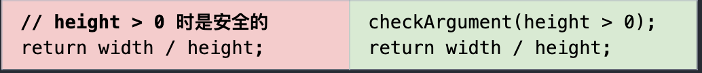
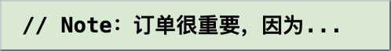

# 良性代码：到底要不要注释？

#### [原文链接](https://testing.googleblog.com/2017/07/code-health-to-comment-or-not-to-comment.html)

读代码时，一个适当的注释往往很有用。不过，也不能随意的瞎注释。而且有时候这段代码需要注释，往往意味着代码应该被重构了。

当你的代码不能不言自明时，要加注释。如果你觉得要加一个注释来说明这段代码是干了点啥，不如先试试下面的几种方法：

> 介绍一个变量

> 抽出一个方法

> 用一个更具有描述性的标识名称

> 给你存在假设的代码添加一个检查

 

下面也列举了一些恰当有用的注释：

> 表明你的用意：解释为什么代码要这么写（而不是它干了什么）

> 防止之后好心的维护者对你的代码进行错误的“修复”

> 说明：code review 的时候发现的问题或者看代码的人碰到的问题

> 解释一下那些看上去不太好的软件工程实践的理由

 

换句话说，要避免那些仅仅是重复说明代码干了点啥的注释。这样的注释没啥用，看着还烦。

